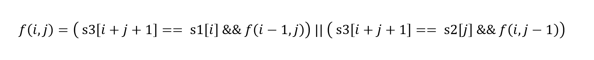
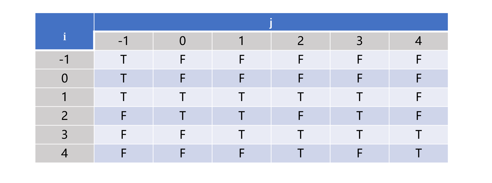
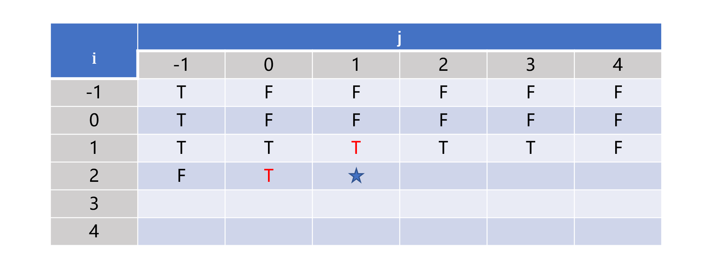

> 原文链接: https://leetcode-cn.com/problems/IY6buf


## 中文题目
<div><p>给定三个字符串&nbsp;<code>s1</code>、<code>s2</code>、<code>s3</code>，请判断&nbsp;<code>s3</code>&nbsp;能不能由&nbsp;<code>s1</code>&nbsp;和&nbsp;<code>s2</code><em>&nbsp;</em><strong>交织（交错）</strong>&nbsp;组成。</p>

<p>两个字符串 <code>s</code> 和 <code>t</code> <strong>交织</strong>&nbsp;的定义与过程如下，其中每个字符串都会被分割成若干 <strong>非空</strong> 子字符串：</p>

<ul>
	<li><code>s = s<sub>1</sub> + s<sub>2</sub> + ... + s<sub>n</sub></code></li>
	<li><code>t = t<sub>1</sub> + t<sub>2</sub> + ... + t<sub>m</sub></code></li>
	<li><code>|n - m| &lt;= 1</code></li>
	<li><b>交织</b> 是 <code>s<sub>1</sub> + t<sub>1</sub> + s<sub>2</sub> + t<sub>2</sub> + s<sub>3</sub> + t<sub>3</sub> + ...</code> 或者 <code>t<sub>1</sub> + s<sub>1</sub> + t<sub>2</sub> + s<sub>2</sub> + t<sub>3</sub> + s<sub>3</sub> + ...</code></li>
</ul>

<p><strong>提示：</strong><code>a + b</code> 意味着字符串 <code>a</code> 和 <code>b</code> 连接。</p>

<p>&nbsp;</p>

<p><strong>示例 1：</strong></p>

<p></p>

<pre>
<strong>输入：</strong>s1 = &quot;aabcc&quot;, s2 = &quot;dbbca&quot;, s3 = &quot;aadbbcbcac&quot;
<strong>输出：</strong>true
</pre>

<p><strong>示例 2：</strong></p>

<pre>
<strong>输入：</strong>s1 = &quot;aabcc&quot;, s2 = &quot;dbbca&quot;, s3 = &quot;aadbbbaccc&quot;
<strong>输出：</strong>false
</pre>

<p><strong>示例 3：</strong></p>

<pre>
<strong>输入：</strong>s1 = &quot;&quot;, s2 = &quot;&quot;, s3 = &quot;&quot;
<strong>输出：</strong>true
</pre>

<p>&nbsp;</p>

<p><strong>提示：</strong></p>

<ul>
	<li><code>0 &lt;= s1.length, s2.length &lt;= 100</code></li>
	<li><code>0 &lt;= s3.length &lt;= 200</code></li>
	<li><code>s1</code>、<code>s2</code>、和 <code>s3</code> 都由小写英文字母组成</li>
</ul>

<p>&nbsp;</p>

<p><meta charset="UTF-8" />注意：本题与主站 97&nbsp;题相同：&nbsp;<a href="https://leetcode-cn.com/problems/interleaving-string/">https://leetcode-cn.com/problems/interleaving-string/</a></p>
</div>

## 通过代码
<RecoDemo>
</RecoDemo>


## 高赞题解
# **动态规划**
题目中的第三四条要求毫无意义，可以选择忽视。因为每步需要从字符串 s1 和 s2 中选择一个字符交织生成字符串 s3 中的一个字符，那么交织成字符串 s3 需要若干步。每一步都面临从字符串 s1 或者字符串 s2 中选择一个字符的两种选择，最终需要判断问题的解是否存在（即符合要求的解的数量大于 0），那么本问题可以使用动态规划解决。

# **二维数组**
因为每一步都需要从两个字符串中的不同位置处选择字符，所以需要使用两个变量来确定状态转移方程。设 f(i, j) 表示字符串 s1 的下标从 0 到 i 的子字符串 s1[0] ~ s1[i] （长度为 i + 1) 和字符串 s2 的下标从 0 到 j 的子字符串 s2[0] ~ s2[j] （长度为 j + 1) 能否交织成字符串 s3 的下标从 0 到 i + j + 1 的子字符串 s3[0] ~ s3[i + j + 1] （长度为 i + j + 2)。

根据交织的规则，字符串 s3 下标为 i + j + 1 的字符 s3[i + j + 1] 既可能来自于字符串 s1 的下标为 i 的字符 s1[i]，也可能来自于字符串 s2 的下标为 j 的字符 s2[j]。如果 s3[i + j + 1] == s1[i] 成立，那么字符 s3[i + j + 1] 可以来自于字符串 s1，那么可以的得到 f(i, j) = f(i - 1, j)，也就是说此时只要 s1[0] ~ s1[i - 1] 和 s2[0] ~ s2[j] 可以交织成 s3[0] ~ s3[i + j]，那么 s1[0] ~ s1[i] 和 s2[0] ~ s2[j] 也可以交织成 s3[0] ~ s3[i + j + 1]。同理可得，若 s3[i + j + 1] == s2[j] 成立，那么 f(i, j) = f(i, j - 1)。以上两个选择只要其中一个能使 f(i, j) 为 true，则 f(i, j) 为 true。所以可得状态转移方程为




因为存在上式中 i, j >= 0，所以会出现 f(i, -1) 的情况，这表示字符串 s2 的子串为空时 s1[0] ~ s1[i] 是否可以交织为 s3[0] ~ s3[i]，即两者是否相等。同理 f(-1, j) 表示字符串 s1 的子串为空时 s2[0] ~ s2[j] 是否可以交织为 s3[0] ~ s3[j]，即两者是否相等。另外 f(-1, -1) 表示两个空的字符串是否可以交织成一个空的字符串，这显然成立，所以 f(-1, -1) = true。

以 s1 = "aabcc", s2 = "dbbca", s3 = "aadbbcbcac" 为例子，二维 DP 矩阵如下

二维矩阵按照从左往右逐行向下遍历填充，推荐使用逐行而不是逐列，虽然不影响算法，但是考虑到二维数组本身是按照一维数组存储以及计算机缓存的运行机制，按照逐行遍历的方式效率更高点。完整的代码如下，若 s1 和 s2 的长度分别为 m 和 n，那么时间复杂度为 O(mn)，空间复杂度为 O(mn)。

```
class Solution {
public:
    bool isInterleave(string s1, string s2, string s3) {
        if(s1.size() + s2.size() != s3.size()) {
            return false;
        }

        vector<vector<bool>> dp(s1.size() + 1, vector<bool>(s2.size() + 1, false));
        dp[0][0] = true;
        for (int j = 0; j < s2.size() && s2[j] == s3[j]; ++j) {
            dp[0][j + 1] = true;
        }
        for (int i = 0; i < s1.size() && s1[i] == s3[i]; ++i) {
            dp[i + 1][0] = true;
        }

        for (int i = 0; i < s1.size(); ++i) {
            for (int j = 0; j < s2.size(); ++j) { 
                char ch1 = s1[i];
                char ch2 = s2[j];
                char ch3 = s3[i + j + 1];
                dp[i + 1][j + 1] = ((ch1 == ch3) && dp[i][j + 1]) || ((ch2 == ch3) && dp[i + 1][j]);
            }
        }


        return dp[s1.size()][s2.size()];
    }
};
```

# **一维数组**
考虑遍历到如图的标星处

可以发现当前的值只与标红处的值有关，所以可以把二维数组优化为只需一行的一维数组。完整的代码如下，时间复杂度为 O(mn)，空间复杂度为 O(min(m, n))。

```
class Solution {
public:
    bool isInterleave(string s1, string s2, string s3) {
        if(s1.size() + s2.size() != s3.size()) {
            return false;
        }
        if (s1.size() < s2.size()) {
            return isInterleave(s2, s1, s3);
        }

        vector<bool> dp(s2.size() + 1);
        dp[0] = true;
        for (int j = 0; j < s2.size() && s2[j] == s3[j]; ++j) {
            dp[j + 1] = true;
        }

        for (int i = 0; i < s1.size(); ++i) {
            dp[0] = dp[0] && (s1[i] == s3[i]);
            for (int j = 0; j < s2.size(); ++j) { 
                char ch1 = s1[i];
                char ch2 = s2[j];
                char ch3 = s3[i + j + 1];
                dp[j + 1] = ((ch1 == ch3) &&  dp[j + 1]) || ((ch2 == ch3) && dp[j]);
            }
        }

        return dp[s2.size()];
    }
};
```


## 统计信息
| 通过次数 | 提交次数 | AC比率 |
| :------: | :------: | :------: |
|    2002    |    4035    |   49.6%   |

## 提交历史
| 提交时间 | 提交结果 | 执行时间 |  内存消耗  | 语言 |
| :------: | :------: | :------: | :--------: | :--------: |
