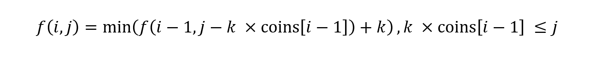

> 原文链接: https://leetcode-cn.com/problems/gaM7Ch


## 中文题目
<div><p>给定不同面额的硬币 <code>coins</code> 和一个总金额 <code>amount</code>。编写一个函数来计算可以凑成总金额所需的最少的硬币个数。如果没有任何一种硬币组合能组成总金额，返回&nbsp;<code>-1</code>。</p>

<p>你可以认为每种硬币的数量是无限的。</p>

<p>&nbsp;</p>

<p><strong>示例&nbsp;1：</strong></p>

<pre>
<strong>输入：</strong>coins = <code>[1, 2, 5]</code>, amount = <code>11</code>
<strong>输出：</strong><code>3</code> 
<strong>解释：</strong>11 = 5 + 5 + 1</pre>

<p><strong>示例 2：</strong></p>

<pre>
<strong>输入：</strong>coins = <code>[2]</code>, amount = <code>3</code>
<strong>输出：</strong>-1</pre>

<p><strong>示例 3：</strong></p>

<pre>
<strong>输入：</strong>coins = [1], amount = 0
<strong>输出：</strong>0
</pre>

<p><strong>示例 4：</strong></p>

<pre>
<strong>输入：</strong>coins = [1], amount = 1
<strong>输出：</strong>1
</pre>

<p><strong>示例 5：</strong></p>

<pre>
<strong>输入：</strong>coins = [1], amount = 2
<strong>输出：</strong>2
</pre>

<p>&nbsp;</p>

<p><strong>提示：</strong></p>

<ul>
	<li><code>1 &lt;= coins.length &lt;= 12</code></li>
	<li><code>1 &lt;= coins[i] &lt;= 2<sup>31</sup> - 1</code></li>
	<li><code>0 &lt;= amount &lt;= 10<sup>4</sup></code></li>
</ul>

<p>&nbsp;</p>

<p><meta charset="UTF-8" />注意：本题与主站 322&nbsp;题相同：&nbsp;<a href="https://leetcode-cn.com/problems/coin-change/">https://leetcode-cn.com/problems/coin-change/</a></p>
</div>

## 通过代码
<RecoDemo>
</RecoDemo>


## 高赞题解
# **完全背包问题**
如果把每种面额的硬币看成一种物品，而将目标总额看作是背包容量，因为硬币可以无限取，所以该问题其本质就是完全背包问题。

用函数 f(i, j) 表示用前 i 种硬币凑成的总额为 j 需要的最少数目。当使用 0 枚标号为 i - 1 的硬币时，f(i, j) 等于 f(i - 1, j) ；当使用 1 枚标号为 i - 1 的硬币时，f(i, j) 等于 f(i - 1, j - coins[i - 1])；当使用 k 枚标号为 i - 1 的硬币时，f(i, j) 等于 f(i - 1, j - k * coins[i - 1])；由于目标是求出硬币数目的最小值，因此条件转移方程为

将基本思路中求解 f(i, j - k * coins[i - 1]) 的状态转移方程显式地写出来，代入原方程中，会发现该方程可以等价地变形成这种形式。可以理解为对于同一种硬币，在当前选择的基础上再进行选择。

完整的代码如下，若硬币的种类为 n，目标额度为 t，那么时间复杂度是 O(nt)，空间复杂度为 O(t)。
```
class Solution {
public:
    int coinChange(vector<int>& coins, int amount) {
        vector<int> dp(amount + 1, amount + 1);
        dp[0] = 0;

        for (auto& coin : coins) {
            for (int j = coin; j <= amount; ++j) {
                dp[j] = min(dp[j], dp[j - coin] + 1);
            }
        }
        return dp[amount] == amount + 1 ? -1 : dp[amount];
    }
};
```
# **另一种思路**
用函数 f(i) 表示凑出总额为 i 的硬币需要的最少数目。为了凑出总额为 i 的硬币，有如下选择：在总额为 i - coins[0] 的硬币中添加 1 枚标号为 0 的硬币，此时 f(i) 等于 f(i - coins[0]) + 1；在总额为 i - coins[1] 的硬币中添加 1 枚标号为 1 的硬币，此时 f(i) 等于 f(i - coins[1]) + 1；依次类推，在总额为 i - coins[n - 1] 的硬币中添加 1 枚标号为 n - 1 的硬币，此时 f(i) 等于 f(i - coins[n - 1]) + 1；由于目标是选择最小值，所以可得转移状态方程为

完整的代码如下，若硬币的种类为 n，目标额度为 t，那么时间复杂度是 O(nt)，空间复杂度为 O(t)。

```
class Solution {
public:
    int coinChange(vector<int>& coins, int amount) {
        vector<int> dp(amount + 1);

        for (int i = 1; i <= amount; ++i) {
            dp[i] = amount + 1;
            for (auto& coin : coins) {
                if (i >= coin) {
                    dp[i] = min(dp[i], dp[i - coin] + 1);
                }
            }
        }
        return dp[amount] == amount + 1 ? -1 : dp[amount];
    }
};
```



## 统计信息
| 通过次数 | 提交次数 | AC比率 |
| :------: | :------: | :------: |
|    4245    |    8612    |   49.3%   |

## 提交历史
| 提交时间 | 提交结果 | 执行时间 |  内存消耗  | 语言 |
| :------: | :------: | :------: | :--------: | :--------: |
