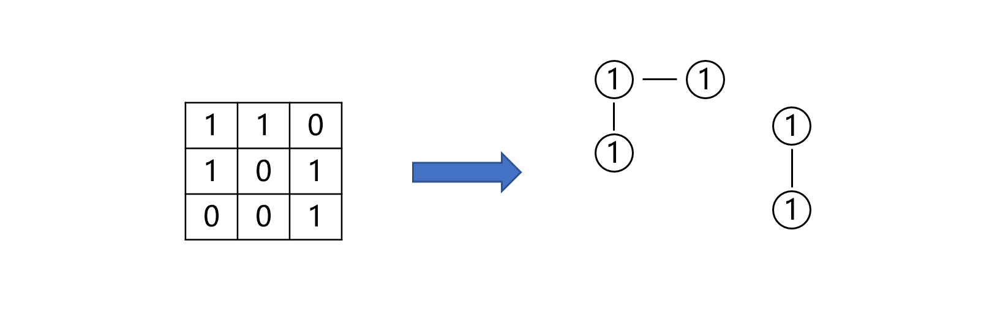

> 原文链接: https://leetcode-cn.com/problems/ZL6zAn


## 中文题目
<div><p>给定一个由&nbsp;<code>0</code> 和 <code>1</code> 组成的非空二维数组&nbsp;<code>grid</code>&nbsp;，用来表示海洋岛屿地图。</p>

<p>一个&nbsp;<strong>岛屿</strong>&nbsp;是由一些相邻的&nbsp;<code>1</code>&nbsp;(代表土地) 构成的组合，这里的「相邻」要求两个 <code>1</code> 必须在水平或者竖直方向上相邻。你可以假设&nbsp;<code>grid</code> 的四个边缘都被 <code>0</code>（代表水）包围着。</p>

<p>找到给定的二维数组中最大的岛屿面积。如果没有岛屿，则返回面积为 <code>0</code> 。</p>

<p>&nbsp;</p>

<p><strong>示例 1:</strong></p>

<p></p>

<pre>
<strong>输入: </strong>grid = [[0,0,1,0,0,0,0,1,0,0,0,0,0],[0,0,0,0,0,0,0,1,1,1,0,0,0],[0,1,1,0,1,0,0,0,0,0,0,0,0],[0,1,0,0,1,1,0,0,1,0,1,0,0],[0,1,0,0,1,1,0,0,1,1,1,0,0],[0,0,0,0,0,0,0,0,0,0,1,0,0],[0,0,0,0,0,0,0,1,1,1,0,0,0],[0,0,0,0,0,0,0,1,1,0,0,0,0]]
<strong>输出: </strong>6
<strong>解释: </strong>对于上面这个给定矩阵应返回&nbsp;<code>6</code>。注意答案不应该是 <code>11</code> ，因为岛屿只能包含水平或垂直的四个方向的 <code>1</code> 。</pre>

<p><strong>示例 2:</strong></p>

<pre>
<strong>输入: </strong>grid = [[0,0,0,0,0,0,0,0]]
<strong>输出: </strong>0</pre>

<p>&nbsp;</p>

<p><strong>提示：</strong></p>

<ul>
	<li><code>m == grid.length</code></li>
	<li><code>n == grid[i].length</code></li>
	<li><code>1 &lt;= m, n &lt;= 50</code></li>
	<li><code>grid[i][j] is either 0 or 1</code></li>
</ul>

<p>&nbsp;</p>

<p>注意：本题与主站 695&nbsp;题相同：&nbsp;<a href="https://leetcode-cn.com/problems/max-area-of-island/">https://leetcode-cn.com/problems/max-area-of-island/</a></p>
</div>

## 通过代码
<RecoDemo>
</RecoDemo>


## 高赞题解
# **图**
如果把矩阵中每一个值为 1 的格子看作图中的一个节点，矩阵中一个格子可能与位于其上下左右四个方向的格子相邻，两个相邻的值都为 1 的格子中间有一条边相连。例如下图

原问题就可以转化为计算子图中的最大节点数，只要遍历每一个子图并计算其节点数即可。图的遍历可以分为广度优先搜索和深度优先搜索两种。
# **广度优先搜索**
为了避免搜索的死循环需要一个与地图等大的数组标记各节点的访问情况，基于队列实现的广度优先搜索算法如下：
```
class Solution {
private:
    // BFS
    int countArea(vector<vector<int>>& grid, vector<vector<int>>& dirs,vector<vector<bool>>& visited, int i, int j) {
        queue<pair<int, int>> que;
        que.push({i, j});
        visited[i][j] = true;
        
        int area = 0;
        while (!que.empty()) {
            auto pos = que.front();
            que.pop();
            area++;
            for (auto& d : dirs) {
                int r = pos.first + d[0];
                int c = pos.second + d[1];
                if (r >= 0 && r < grid.size() &&
                    c >= 0 && c < grid[0].size() &&
                    grid[r][c] == 1 && !visited[r][c]) {
                    que.push({r, c});
                    visited[r][c] = true;
                }
            }
        }
        return area;
    }

public:
    int maxAreaOfIsland(vector<vector<int>>& grid) {
        vector<vector<bool>> visited(grid.size(), vector<bool>(grid[0].size(), false));
        int maxArea = 0;
        vector<vector<int>> dirs{{1, 0}, {-1, 0}, {0, 1}, {0, -1}};
        for (int i = 0; i < grid.size(); ++i) {
            for (int j = 0; j < grid[0].size(); ++j) {
                if (grid[i][j] == 1 && !visited[i][j]) {
                    int area = countArea(grid, dirs, visited, i, j);
                    maxArea = max(area, maxArea);
                }
            }
        }
        return maxArea;
    }
};
```


# **深度优先搜索**
如果把前面代码中的队列替换成栈，由于栈的 “后进先出” 特性，所以可以实现深度优先搜索，代码如下：
```
class Solution {
private:
    // DFS
    int countArea(vector<vector<int>>& grid, vector<vector<int>>& dirs,vector<vector<bool>>& visited, int i, int j) {
        stack<pair<int, int>> sta;
        sta.push({i, j});
        visited[i][j] = true;
        
        int area = 0;
        while (!sta.empty()) {
            auto pos = sta.top();
            sta.pop();
            area++;
            for (auto& d : dirs) {
                int r = pos.first + d[0];
                int c = pos.second + d[1];
                if (r >= 0 && r < grid.size() &&
                    c >= 0 && c < grid[0].size() &&
                    grid[r][c] == 1 && !visited[r][c]) {
                    sta.push({r, c});
                    visited[r][c] = true;
                }
            }
        }
        return area;
    }

public:
    int maxAreaOfIsland(vector<vector<int>>& grid) {
        vector<vector<bool>> visited(grid.size(), vector<bool>(grid[0].size(), false));
        int maxArea = 0;
        vector<vector<int>> dirs{{1, 0}, {-1, 0}, {0, 1}, {0, -1}};
        for (int i = 0; i < grid.size(); ++i) {
            for (int j = 0; j < grid[0].size(); ++j) {
                if (grid[i][j] == 1 && !visited[i][j]) {
                    int area = countArea(grid, dirs, visited, i, j);
                    maxArea = max(area, maxArea);
                }
            }
        }
        return maxArea;
    }
};
```
深度优先搜索同样也可以使用递归实现，代码如下：
```
class Solution {
private:
    // DFS
    int countArea(vector<vector<int>>& grid, vector<vector<int>>& dirs,vector<vector<bool>>& visited, int i, int j) {
        if (i < 0 || i >= grid.size() || j < 0 || j >= grid[0].size() || grid[i][j] == 0 || visited[i][j]) {
            return 0;
        }

        visited[i][j] = true;
        int area = 1;
        for (auto& d : dirs) {
            int r = i + d[0];
            int c = j + d[1];
            area += countArea(grid, dirs, visited, r, c);
        }
        return area;
    }

public:
    int maxAreaOfIsland(vector<vector<int>>& grid) {
        vector<vector<bool>> visited(grid.size(), vector<bool>(grid[0].size(), false));
        int maxArea = 0;
        vector<vector<int>> dirs{{1, 0}, {-1, 0}, {0, 1}, {0, -1}};
        for (int i = 0; i < grid.size(); ++i) {
            for (int j = 0; j < grid[0].size(); ++j) {
                if (grid[i][j] == 1 && !visited[i][j]) {
                    int area = countArea(grid, dirs, visited, i, j);
                    maxArea = max(area, maxArea);
                }
            }
        }
        return maxArea;
    }
};
```
如果一个图的节点数为 v，边的数目为 e，那么进行 BFS 和 DFS 的时间复杂度都为 O(v + e)。若矩阵的维度为 m 和 n，那么矩阵的节点数为 mn，一个节点最多有四个边，所以时间复杂度为 O(mn)，同时因为需要一个记录访问情况的矩阵，所以空间复杂度为 O(mn)。

## 统计信息
| 通过次数 | 提交次数 | AC比率 |
| :------: | :------: | :------: |
|    4794    |    6885    |   69.6%   |

## 提交历史
| 提交时间 | 提交结果 | 执行时间 |  内存消耗  | 语言 |
| :------: | :------: | :------: | :--------: | :--------: |
