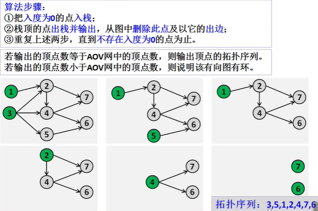
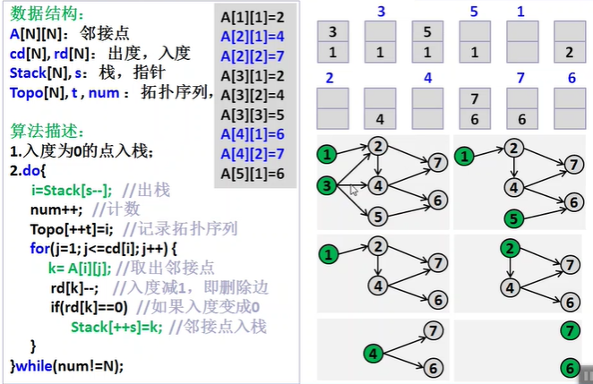
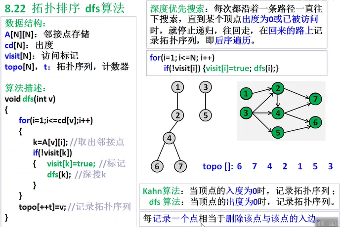

> 原文链接: https://leetcode-cn.com/problems/QA2IGt


## 中文题目
<div><p>现在总共有 <code>numCourses</code>&nbsp;门课需要选，记为&nbsp;<code>0</code>&nbsp;到&nbsp;<code>numCourses-1</code>。</p>

<p>给定一个数组&nbsp;<code>prerequisites</code> ，它的每一个元素&nbsp;<code>prerequisites[i]</code>&nbsp;表示两门课程之间的先修顺序。&nbsp;例如&nbsp;<code>prerequisites[i] = [a<sub>i</sub>, b<sub>i</sub>]</code>&nbsp;表示想要学习课程 <code>a<sub>i</sub></code>&nbsp;，需要先完成课程 <code>b<sub>i</sub></code>&nbsp;。</p>

<p>请根据给出的总课程数 &nbsp;<code>numCourses</code> 和表示先修顺序的&nbsp;<code>prerequisites</code>&nbsp;得出一个可行的修课序列。</p>

<p>可能会有多个正确的顺序，只要任意返回一种就可以了。如果不可能完成所有课程，返回一个空数组。</p>

<p>&nbsp;</p>

<p><strong>示例&nbsp;1:</strong></p>

<pre>
<strong>输入:</strong> numCourses = 2, prerequisites = [[1,0]] 
<strong>输出: </strong><code>[0,1]</code>
<strong>解释:</strong>&nbsp;总共有 2 门课程。要学习课程 1，你需要先完成课程 0。因此，正确的课程顺序为 <code>[0,1] 。</code></pre>

<p><strong>示例&nbsp;2:</strong></p>

<pre>
<strong>输入:</strong> numCourses = 4, prerequisites = [[1,0],[2,0],[3,1],[3,2]]
<strong>输出: </strong><code>[0,1,2,3] or [0,2,1,3]</code>
<strong>解释:</strong>&nbsp;总共有 4 门课程。要学习课程 3，你应该先完成课程 1 和课程 2。并且课程 1 和课程 2 都应该排在课程 0 之后。
&nbsp;因此，一个正确的课程顺序是&nbsp;<code>[0,1,2,3]</code> 。另一个正确的排序是&nbsp;<code>[0,2,1,3]</code> 。
</pre>

<p><strong>示例 3:</strong></p>

<pre>
<strong>输入:</strong> numCourses = 1, prerequisites = [] 
<strong>输出: </strong><code>[0]</code>
<strong>解释:</strong>&nbsp;总共 1 门课，直接修第一门课就可。</pre>

<p>&nbsp;</p>

<p><strong>提示:</strong></p>

<ul>
	<li><code>1 &lt;= numCourses &lt;= 2000</code></li>
	<li><code>0 &lt;= prerequisites.length &lt;= numCourses * (numCourses - 1)</code></li>
	<li><code>prerequisites[i].length == 2</code></li>
	<li><code>0 &lt;= ai, bi &lt; numCourses</code></li>
	<li><code>ai != bi</code></li>
	<li><code>prerequisites</code>&nbsp;中不存在重复元素</li>
</ul>

<p>&nbsp;</p>

<p><meta charset="UTF-8" />注意：本题与主站 210&nbsp;题相同：<a href="https://leetcode-cn.com/problems/course-schedule-ii/">https://leetcode-cn.com/problems/course-schedule-ii/</a></p>
</div>

## 通过代码
<RecoDemo>
</RecoDemo>


## 高赞题解
我总结了剑指Offer专项训练的所有题目类型，并给出了刷题建议和所有题解。

在github上开源了，不来看看吗？顺道一提：还有C++、数据结构与算法、计算机网络、操作系统、数据库的秋招知识总结，求求star了，这对我真的很重要？

$\Rightarrow$[通关剑2](https://github.com/muluoleiguo/interview/tree/master/%E9%9D%A2%E8%AF%95/%E7%AE%97%E6%B3%95%E4%B8%8E%E6%95%B0%E6%8D%AE%E7%BB%93%E6%9E%84/%E5%89%91%E6%8C%87Offer%E4%B8%93%E9%A1%B9%E8%AE%AD%E7%BB%83%EF%BC%88%E5%89%912%EF%BC%89)
### 拓扑排序






### Kahn
```
执行用时：16 ms, 在所有 C++ 提交中击败了93.75%的用户
内存消耗：13 MB, 在所有 C++ 提交中击败了86.25%的用户
```
```cpp
class Solution {
public:
    vector<int> findOrder(int numCourses, vector<vector<int>>& prerequisites) {
        // 存储边集同时统计入度
        vector<vector<int>> edges(numCourses);
        vector<int> inDegree(numCourses);
        for (const vector<int>& prerequisite : prerequisites) {
            edges[prerequisite[1]].push_back(prerequisite[0]);
            inDegree[prerequisite[0]]++;
        }
        queue<int> q;
        // 入度为0的结点入队
        // 如上图所示可以用栈，一回事，没有严格顺序
        for (int i = 0; i < numCourses; ++i) {
            if (inDegree[i] == 0)
                q.push(i);
        }
        vector<int> ans;
        while (!q.empty()) {
            int node = q.front();
            q.pop();
            ans.push_back(node);
            // 某个结点出队后，起指向的所有结点入度-1，减到0立即入队
            for (int i = 0; i < edges[node].size(); ++i) {           
                if (--inDegree[edges[node][i]] == 0) 
                    q.push(edges[node][i]);
            }
        }
        // 结点集合不够数，那就返回空集
        if (ans.size() < numCourses) return {};
        return ans;
    }
};
```

### DFS
TODO

## 统计信息
| 通过次数 | 提交次数 | AC比率 |
| :------: | :------: | :------: |
|    1928    |    3295    |   58.5%   |

## 提交历史
| 提交时间 | 提交结果 | 执行时间 |  内存消耗  | 语言 |
| :------: | :------: | :------: | :--------: | :--------: |
