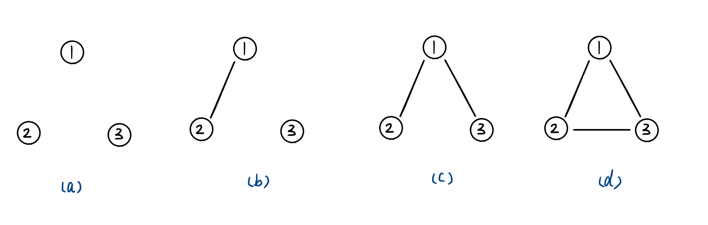

> 原文链接: https://leetcode-cn.com/problems/7LpjUW


## 中文题目
<div><p>树可以看成是一个连通且 <strong>无环&nbsp;</strong>的&nbsp;<strong>无向&nbsp;</strong>图。</p>

<p>给定往一棵&nbsp;<code>n</code> 个节点 (节点值&nbsp;<code>1～n</code>) 的树中添加一条边后的图。添加的边的两个顶点包含在 <code>1</code> 到 <code>n</code>&nbsp;中间，且这条附加的边不属于树中已存在的边。图的信息记录于长度为 <code>n</code> 的二维数组 <code>edges</code>&nbsp;，<code>edges[i] = [a<sub>i</sub>, b<sub>i</sub>]</code>&nbsp;表示图中在 <code>ai</code> 和 <code>bi</code> 之间存在一条边。</p>

<p>请找出一条可以删去的边，删除后可使得剩余部分是一个有着 <code>n</code> 个节点的树。如果有多个答案，则返回数组&nbsp;<code>edges</code>&nbsp;中最后出现的边。</p>

<p>&nbsp;</p>

<p><strong>示例 1：</strong></p>

<p></p>

<pre>
<strong>输入:</strong> edges = [[1,2],[1,3],[2,3]]
<strong>输出:</strong> [2,3]
</pre>

<p><strong>示例 2：</strong></p>

<p></p>

<pre>
<strong>输入:</strong> edges = [[1,2],[2,3],[3,4],[1,4],[1,5]]
<strong>输出:</strong> [1,4]
</pre>

<p>&nbsp;</p>

<p><strong>提示:</strong></p>

<ul>
	<li><code>n == edges.length</code></li>
	<li><code>3 &lt;= n &lt;= 1000</code></li>
	<li><code>edges[i].length == 2</code></li>
	<li><code>1 &lt;= ai&nbsp;&lt; bi&nbsp;&lt;= edges.length</code></li>
	<li><code>ai != bi</code></li>
	<li><code>edges</code> 中无重复元素</li>
	<li>给定的图是连通的&nbsp;</li>
</ul>

<p>&nbsp;</p>

<p><meta charset="UTF-8" />注意：本题与主站 684&nbsp;题相同：&nbsp;<a href="https://leetcode-cn.com/problems/redundant-connection/">https://leetcode-cn.com/problems/redundant-connection/</a></p>
</div>

## 通过代码
<RecoDemo>
</RecoDemo>


## 高赞题解
# **并查集**
如果把树看做图，那么树就是不存在环的图，一棵有 n 个节点的树有 n - 1 条边。在树上添加一条多余的边就会存在环。需要明确形成环的原因，以题中  edges = [[1,2],[1,3],[2,3]] 为例，最开始 3 个节点都是离散的，任何两个节点之间都不存在边连接，也就是说是 3 个子图，如图(a)所示。先在图内添加一条边 [1,2]，于是节点 1 和节点 2 所在子图连在一块形成新的子图，如图(b)所示。接下来添加边 [1,3] ,于是节点 1 和节点 3 所在子图连在一块形成新的子图，如图(c)所示。最后添加边 [2,3]，因为节点 2 和节点 3 原本就属于同一个子图，此时再相连就会形成环。

通过以上分析可以发现，在添加一条边时若两个节点原本就属于同一个子图就会形成环。因此，为了找到多余的边需要解决两个问题，其一是如何判断两个子图是否属于同一个子图，其二是如何合并两个子图。并查集可以很好得解决这两个问题，完整代码如下，若节点数为 n，算法的时间复杂度为 O(n)。
```
class Solution {
private:
    int findFather(vector<int>& fa, int node) {
        if (fa[node] == node) {
            return node;
        }
        fa[node] = findFather(fa, fa[node]);
        return fa[node];
    }

public:
    vector<int> findRedundantConnection(vector<vector<int>>& edges) {
        vector<int> fa(edges.size() + 1);
        for (int i = 1; i < edges.size(); ++i) {
            fa[i] = i;
        }

        int ret = -1;
        for (int i = 0; i < edges.size(); ++i) {
            int father1 = findFather(fa, edges[i][0]);
            int father2 = findFather(fa, edges[i][1]);
            if (father1 != father2) {
                fa[father2] = father1;
            }
            else {
                ret = i;
            }
        }
        
        if (ret == -1) {
            return {};
        }
        return edges[ret];
    }
};
```
进一步分析可以发现，因为 edges 的长度为 n 且不存在重复边，而一棵有 n 个节点的树只会有 n - 1 条边，并且 edges 确定的图肯定由一根树添加一条多余的边组成的，所以在使用并查集查询时，找到的多余的这条边一定就是 “如果有多个答案，则返回数组 edges 中最后出现的边 ”。缩减后的代码如下。
```
class Solution {
private:
    int findFather(vector<int>& fa, int node) {
        if (fa[node] == node) {
            return node;
        }
        fa[node] = findFather(fa, fa[node]);
        return fa[node];
    }

public:
    vector<int> findRedundantConnection(vector<vector<int>>& edges) {
        vector<int> fa(edges.size() + 1);
        for (int i = 1; i < edges.size(); ++i) {
            fa[i] = i;
        }

        for (int i = 0; i < edges.size(); ++i) {
            int father1 = findFather(fa, edges[i][0]);
            int father2 = findFather(fa, edges[i][1]);
            if (father1 != father2) {
                fa[father2] = father1;
            }
            else {
                return edges[i];
            }
        }

        return {};
    }
};
```


## 统计信息
| 通过次数 | 提交次数 | AC比率 |
| :------: | :------: | :------: |
|    1483    |    2092    |   70.9%   |

## 提交历史
| 提交时间 | 提交结果 | 执行时间 |  内存消耗  | 语言 |
| :------: | :------: | :------: | :--------: | :--------: |
