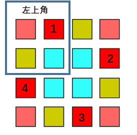
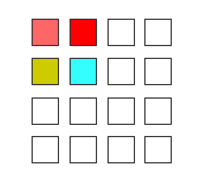
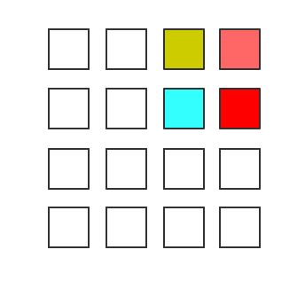
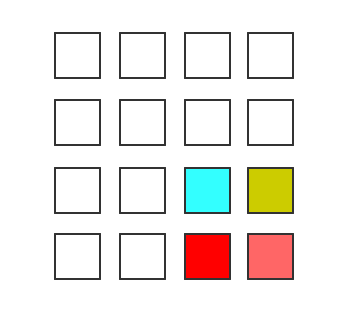
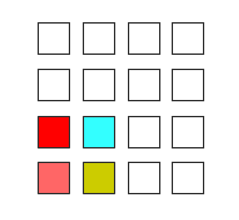
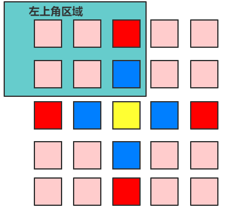
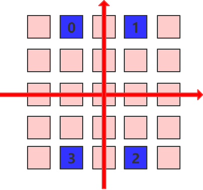

> 原文链接: https://leetcode-cn.com/problems/rotate-matrix-lcci


## 英文原文
<div><p>Given an image represented by an N x N matrix, where each pixel in the image is 4 bytes, write a method to rotate the image by 90 degrees. Can you do this in place?</p>

<p>&nbsp;</p>

<p><strong>Example 1:</strong></p>

<pre>
Given <strong>matrix</strong> = 
[
  [1,2,3],
  [4,5,6],
  [7,8,9]
],

Rotate the matrix <strong>in place. </strong>It becomes:
[
  [7,4,1],
  [8,5,2],
  [9,6,3]
]
</pre>

<p><strong>Example 2:</strong></p>

<pre>
Given <strong>matrix</strong> =
[
  [ 5, 1, 9,11],
  [ 2, 4, 8,10],
  [13, 3, 6, 7],
  [15,14,12,16]
], 

Rotate the matrix <strong>in place. </strong>It becomes:
[
  [15,13, 2, 5],
  [14, 3, 4, 1],
  [12, 6, 8, 9],
  [16, 7,10,11]
]
</pre>
</div>

## 中文题目
<div><p>给你一幅由 <code>N × N</code> 矩阵表示的图像，其中每个像素的大小为 4 字节。请你设计一种算法，将图像旋转 90 度。</p>

<p>不占用额外内存空间能否做到？</p>

<p> </p>

<p><strong>示例 1:</strong></p>

<pre>
给定 <strong>matrix</strong> = 
[
  [1,2,3],
  [4,5,6],
  [7,8,9]
],

<strong>原地</strong>旋转输入矩阵，使其变为:
[
  [7,4,1],
  [8,5,2],
  [9,6,3]
]
</pre>

<p><strong>示例 2:</strong></p>

<pre>
给定 <strong>matrix</strong> =
[
  [ 5, 1, 9,11],
  [ 2, 4, 8,10],
  [13, 3, 6, 7],
  [15,14,12,16]
], 

<strong>原地</strong>旋转输入矩阵，使其变为:
[
  [15,13, 2, 5],
  [14, 3, 4, 1],
  [12, 6, 8, 9],
  [16, 7,10,11]
]
</pre>

<p><strong>注意</strong>：本题与主站 48 题相同：<a href="https://leetcode-cn.com/problems/rotate-image/">https://leetcode-cn.com/problems/rotate-image/</a></p>
</div>

## 通过代码
<RecoDemo>
</RecoDemo>


## 高赞题解
话说刷 LeetCode 还真是有用的，我参见微软校招的时候真的遇见过这个题！一毛一样！

**来观察下正方形矩阵旋转 90 度时究竟发生了什么。**

观察图中颜色相同的四个位置，当旋转 90 度后，对应位置的元素发生了顺时针的交换。

而相隔的两个位置是中心对称的，基于此可以计算出发生交换的四个元素 **位置关系**。
设四个位置中，位于 **左上角区域** 的位置坐标为 (i,j)，
则按顺时针顺序，四个位置分别为(i,j), (j, n-i-1), (n-i-1,n-j-1), (n-j-1,i)。
其中 n 为 matrix.size(), i, j 分别为matrix的行列下标，从 0 开始。

整个矩阵的旋转可以理解为 **起点都在左上角区域，然后依次顺时针移动**，如下图示：

<,,,>

matrix.size() 为奇数时，位置的对应关系相同，但左上角区域并 **不是整个矩阵的四分之一**，如下图示：

其实就是**多了中间列的上半部分**。

那么现在捋一下如何 **原地操作元素**：
枚举左上区域的所有位置，然后通过上面总结的位置关系直接交换元素。
对于一个位置 (i,j)，需要 **交换三次**：
1. swap(matrix[i][j], matrix[j][n-i-1]);
2. swap(matrix[i][j], matrix[n-i-1][n-j-1]);
3. swap(matrix[i][j], matrix[n-j-1][i]);

综上，整个过程的时间复杂度为 O(n^2)；空间复杂度为 (1)。

有小伙伴对坐标推导过程感兴趣，那我尝试讲一下：


**关于纵轴对称两个位置，到纵轴的距离相等，又因为第 0 列和第 n-1 列到纵轴的距离相等**。所以关于纵轴对称的两个位置到 0 列和n-1列的位置相等，所以两点的纵坐标有 $y_0 - 0 = (n-1)-y_1$,即 $y_1 = n-1-y_0$，横坐标相等, 即 $x_1 = y_0$
关于横轴对称有相似的性质，可得 $x_3 = n-1-x_0$，纵坐标相等，即 $x_3 = x_0$。

中心对称，**就是先纵轴对称，然后横轴对称**，所以有
$y_2 = n-1-y_0, x_2 = n-1-x_0$。

这样就得到了其中一对位置的坐标对应关系，另一对和该对是根据 **对角线对称** 的，证明过程类似，不再赘述啦。

```cpp
class Solution {
public:
    void rotate(vector<vector<int>>& matrix) {
        int n = matrix.size();
        if(n == 0) { return; }
        int r = (n>>1)-1; //左上角区域的最大行下标，
        int c = (n-1)>>1; //左上角区域的最大列下标，行列下标从 0 开始。
        for(int i = r; i >= 0; --i) {
            for(int j = c; j >= 0; --j) {
                swap(matrix[i][j], matrix[j][n-i-1]);
                swap(matrix[i][j], matrix[n-i-1][n-j-1]);
                swap(matrix[i][j], matrix[n-j-1][i]);
            }
        }
    }
};
```
### 如果感觉有点意思，可以关注我
* **分享周赛题解**
* **分享计算机专业课知识**
* **分享 C++ 相关岗位面试题**
* **分享专业书籍 PDF**

## 统计信息
| 通过次数 | 提交次数 | AC比率 |
| :------: | :------: | :------: |
|    68789    |    91606    |   75.1%   |

## 提交历史
| 提交时间 | 提交结果 | 执行时间 |  内存消耗  | 语言 |
| :------: | :------: | :------: | :--------: | :--------: |
