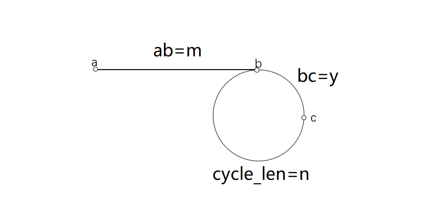

> 原文链接: https://leetcode-cn.com/problems/linked-list-cycle-lcci


## 英文原文
<div><p>Given a circular linked list, implement an algorithm that returns the node at the beginning of the loop.</p>

<p>Circular linked list: A (corrupt) linked list in which a node&#39;s next pointer points to an earlier node, so as to make a loop in the linked list.</p>

<p><strong>Example 1: </strong></p>

<pre>
<strong>Input: </strong>head = [3,2,0,-4], pos = 1
<strong>Output: </strong>tail connects to node index 1</pre>

<p><strong>Example 2: </strong></p>

<pre>
<strong>Input: </strong>head = [1,2], pos = 0
<strong>Output: </strong>tail connects to node index 0</pre>

<p><strong>Example 3: </strong></p>

<pre>
<strong>Input: </strong>head = [1], pos = -1
<strong>Output: </strong>no cycle</pre>

<p><strong>Follow Up: </strong><br />
Can you solve it without using additional space?</p>
</div>

## 中文题目
<div><p>给定一个链表，如果它是有环链表，实现一个算法返回环路的<code>开头节点</code>。若环不存在，请返回 <code>null</code>。</p>

<p>如果链表中有某个节点，可以通过连续跟踪 <code>next</code> 指针再次到达，则链表中存在环。 为了表示给定链表中的环，我们使用整数 <code>pos</code> 来表示链表尾连接到链表中的位置（索引从 0 开始）。 如果 <code>pos</code> 是 <code>-1</code>，则在该链表中没有环。<strong>注意：<code>pos</code> 不作为参数进行传递</strong>，仅仅是为了标识链表的实际情况。</p>

<p>&nbsp;</p>

<p><strong>示例 1：</strong></p>

<p></p>

<pre>
<strong>输入：</strong>head = [3,2,0,-4], pos = 1
<strong>输出：</strong>tail connects to node index 1
<strong>解释：</strong>链表中有一个环，其尾部连接到第二个节点。
</pre>

<p><strong>示例 2：</strong></p>

<p></p>

<pre>
<strong>输入：</strong>head = [1,2], pos = 0
<strong>输出：</strong>tail connects to node index 0
<strong>解释：</strong>链表中有一个环，其尾部连接到第一个节点。
</pre>

<p><strong>示例 3：</strong></p>

<p></p>

<pre>
<strong>输入：</strong>head = [1], pos = -1
<strong>输出：</strong>no cycle
<strong>解释：</strong>链表中没有环。</pre>

<p>&nbsp;</p>

<p><strong>进阶：</strong></p>

<ul>
	<li>你是否可以不用额外空间解决此题？</li>
</ul>

<p>&nbsp;</p>
</div>

## 通过代码
<RecoDemo>
</RecoDemo>


## 高赞题解
### 解题思路


如果链表中有环，那么快慢指针就一定可以相遇（且一定再环上，如图上的c点），此时快指针移动过的距离是慢指针的2倍，根据图中的参数，我们可以写出以下等式：
# (m+y)*2=m+xn+y 
这里的xn是当相遇时快指针已经在环上循环了x次，x>=1且为整数

为什么这里没有假设当相遇时慢指针也在环上循环了若干圈呢？下面来解释一下：
假设当慢指针进入环时（环长为 n ），慢指针在快指针前距离快指针 p 处（顺指针方向）（0<p<n，如果 p=0 or n ，说明此时快慢指针正好在环入口处相遇），此时快慢指针将在移动 p 次后相遇，此时慢指针在环上移动的距离即为 p ，p<n不足一圈，综上，慢指针在一圈内肯定与快指针相遇。
# 由上式得 => m+y=xn => m=n-y+(x-1)*n  
下面解释为什么写成这种形式：

接下来将快指针置于表头(此时快指针在a处，慢指针在c处)，与慢指针以相同速度在链表上移动，当快指针移动到b处时，移动了m的距离，根据上面的等式可知，慢指针移动了n-y+(x-1)*n的距离。

我们来分析一下此时的慢指针在什么位置：
先移动(x-1)*n的距离，相当于在环上循环了(x-1)次，慢指针又回到了c点，然后再移动n-y的距离，如图所示，n-y正好是c点到b点的距离，说明此时慢指针也移动到了b点，即快慢指针在环路的开头节点相遇了。

还有一些细节，已经在评论区回复。
### 代码

```cpp
/**
 * Definition for singly-linked list.
 * struct ListNode {
 *     int val;
 *     ListNode *next;
 *     ListNode(int x) : val(x), next(NULL) {}
 * };
 */
class Solution {
public:
    ListNode *detectCycle(ListNode *head) {
        if(!head||!head->next)
        {
            return NULL;
        }
        ListNode* fast=head;
        ListNode* slow=head;
        while(fast&&fast->next)
        {
            slow=slow->next;
            fast=fast->next->next;
            if(fast==slow)
            {
                break;
            }
        }
        if(fast!=slow)
        {
            return NULL;
        }
        fast=head;
        while(fast!=slow)
        {
            fast=fast->next;
            slow=slow->next;
        }
        return fast;
    }
};
```

## 统计信息
| 通过次数 | 提交次数 | AC比率 |
| :------: | :------: | :------: |
|    28937    |    54180    |   53.4%   |

## 提交历史
| 提交时间 | 提交结果 | 执行时间 |  内存消耗  | 语言 |
| :------: | :------: | :------: | :--------: | :--------: |
