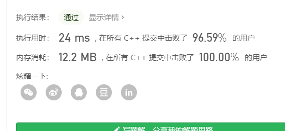

> 原文链接: https://leetcode-cn.com/problems/sort-of-stacks-lcci


## 英文原文
<div><p>Write a program to sort a stack such that the smallest items are on the top. You can use an additional temporary stack, but you may not copy the elements into any other data structure (such as an array). The stack supports the following operations: <code>push</code>, <code>pop</code>, <code>peek</code>, and <code>isEmpty</code>. When the stack is empty, <code>peek</code> should return -1.</p>

<p><strong>Example1:</strong></p>

<pre>
<strong> Input</strong>: 
[&quot;SortedStack&quot;, &quot;push&quot;, &quot;push&quot;, &quot;peek&quot;, &quot;pop&quot;, &quot;peek&quot;]
[[], [1], [2], [], [], []]
<strong> Output</strong>: 
[null,null,null,1,null,2]
</pre>

<p><strong>Example2:</strong></p>

<pre>
<strong> Input</strong>:  
[&quot;SortedStack&quot;, &quot;pop&quot;, &quot;pop&quot;, &quot;push&quot;, &quot;pop&quot;, &quot;isEmpty&quot;]
[[], [], [], [1], [], []]
<strong> Output</strong>: 
[null,null,null,null,null,true]
</pre>

<p><strong>Note:</strong></p>

<ol>
	<li>The total number of elements in the stack is within the range [0, 5000].</li>
</ol>
</div>

## 中文题目
<div><p>栈排序。 编写程序，对栈进行排序使最小元素位于栈顶。最多只能使用一个其他的临时栈存放数据，但不得将元素复制到别的数据结构（如数组）中。该栈支持如下操作：<code>push</code>、<code>pop</code>、<code>peek</code> 和 <code>isEmpty</code>。当栈为空时，<code>peek</code>&nbsp;返回 -1。</p>

<p><strong>示例1:</strong></p>

<pre><strong> 输入</strong>：
[&quot;SortedStack&quot;, &quot;push&quot;, &quot;push&quot;, &quot;peek&quot;, &quot;pop&quot;, &quot;peek&quot;]
[[], [1], [2], [], [], []]
<strong> 输出</strong>：
[null,null,null,1,null,2]
</pre>

<p><strong>示例2:</strong></p>

<pre><strong> 输入</strong>： 
[&quot;SortedStack&quot;, &quot;pop&quot;, &quot;pop&quot;, &quot;push&quot;, &quot;pop&quot;, &quot;isEmpty&quot;]
[[], [], [], [1], [], []]
<strong> 输出</strong>：
[null,null,null,null,null,true]
</pre>

<p><strong>说明:</strong></p>

<ol>
	<li>栈中的元素数目在[0, 5000]范围内。</li>
</ol>
</div>

## 通过代码
<RecoDemo>
</RecoDemo>


## 高赞题解
### 解题思路
利用辅助栈可以保证每次插入新元素的适合s1都是有序的，
比如 s1 = {1,5,6,8,9},插入 7
先把 9和8 插入 s2, s2 = {9,8}
再把 7 插入 s1, s1 = {1,5,6,7}
再把 s2 中数字插入 s1, s1 = {1,5,6,7,8,9}
这样思路最简单但是也比较麻烦

### 代码

```cpp
class SortedStack {
public:
    stack<int> s1, s2;
    SortedStack() {
        
    }
    
    void push(int val) {
        while(!s1.empty() && s1.top() < val){
            s2.push(s1.top());
            s1.pop();
        }
        s1.push(val);
        while(!s2.empty()){
            s1.push(s2.top());
            s2.pop();
        }
    }
    
    void pop() {
        if(!s1.empty())
            s1.pop();
    }
    
    int peek() {
        if(!s1.empty())
            return s1.top();
        return -1;
    }
    
    bool isEmpty() {
        return s1.empty();
    }
};
```
另一种解法，维护两个栈，原栈为降序，辅助栈为升序
比如s1 = {8, 7, 3}  s2 = {}
插入 5，因为比s1.top大，把3插入s2中，然后 5插入 s1 中
s1 = {8,7,5}  s2={3}
这样既能保证 s1 中的元素一定大于 s2 中元素，也可以使得两个栈都是按顺序排列
不必要像第一种解法一样需要在push的时候就把 s2 中元素重新加入到 s1 中去
```c++
class SortedStack {
public:
    stack<int>s1;//原栈为降序
    stack<int>s2;//辅助栈为升序
    SortedStack() {

    }
    
    void push(int val) {
        while(!s2.empty() && s2.top() > val){//辅助栈中存在比val大的值
            s1.push(s2.top());
            s2.pop();
        }
        while(!s1.empty() && s1.top() < val){//原栈中有比val小的值
            s2.push(s1.top());
            s1.pop();
        }
        s1.push(val);
    }
    
    void pop() {
        while(!s2.empty()){//清空辅助栈
            s1.push(s2.top());
            s2.pop();
        }
        if(!s1.empty()) s1.pop();
    }
    
    int peek() {
        while(!s2.empty()){//清空辅助栈
            s1.push(s2.top());
            s2.pop();
        }
        if(!s1.empty()) return s1.top();
        else return -1;
    }
    
    bool isEmpty() {
        return s1.empty() && s2.empty();
    }
};
```



## 统计信息
| 通过次数 | 提交次数 | AC比率 |
| :------: | :------: | :------: |
|    15616    |    28882    |   54.1%   |

## 提交历史
| 提交时间 | 提交结果 | 执行时间 |  内存消耗  | 语言 |
| :------: | :------: | :------: | :--------: | :--------: |
