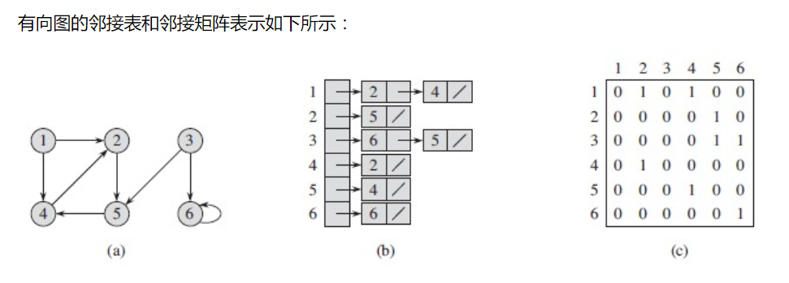

> 原文链接: https://leetcode-cn.com/problems/route-between-nodes-lcci


## 英文原文
<div><p>Given a directed graph, design an algorithm to find out whether there is a route between two nodes.</p>

<p><strong>Example1:</strong></p>

<pre>
<strong> Input</strong>: n = 3, graph = [[0, 1], [0, 2], [1, 2], [1, 2]], start = 0, target = 2
<strong> Output</strong>: true
</pre>

<p><strong>Example2:</strong></p>

<pre>
<strong> Input</strong>: n = 5, graph = [[0, 1], [0, 2], [0, 4], [0, 4], [0, 1], [1, 3], [1, 4], [1, 3], [2, 3], [3, 4]], start = 0, target = 4
<strong> Output</strong> true
</pre>

<p><strong>Note: </strong></p>

<ol>
	<li><code>0 &lt;= n &lt;= 100000</code></li>
	<li>All node numbers are within the range [0, n].</li>
	<li>There might be self cycles and duplicated edges.</li>
</ol>
</div>

## 中文题目
<div><p>节点间通路。给定有向图，设计一个算法，找出两个节点之间是否存在一条路径。</p>

<p><strong>示例1:</strong></p>

<pre><strong> 输入</strong>：n = 3, graph = [[0, 1], [0, 2], [1, 2], [1, 2]], start = 0, target = 2
<strong> 输出</strong>：true
</pre>

<p><strong>示例2:</strong></p>

<pre><strong> 输入</strong>：n = 5, graph = [[0, 1], [0, 2], [0, 4], [0, 4], [0, 1], [1, 3], [1, 4], [1, 3], [2, 3], [3, 4]], start = 0, target = 4
<strong> 输出</strong> true
</pre>

<p><strong>提示：</strong></p>

<ol>
	<li>节点数量n在[0, 1e5]范围内。</li>
	<li>节点编号大于等于 0 小于 n。</li>
	<li>图中可能存在自环和平行边。</li>
</ol>
</div>

## 通过代码
<RecoDemo>
</RecoDemo>


## 高赞题解
主要思路是先转邻接表，然后遍历方法用深度和广度应该都可以。

## 1、数据结构

理论上，首先要理解图，其次理解有向图。

题中graph, [0,1]这种数组表示一条从0到1的有向边，多个有向边连成整个有向图。

数据结构上，有向图使用邻接表存储的。所以这里把有向图转为链表处理。




参考：
https://www.cnblogs.com/xuqiang/archive/2011/03/28/1997680.html



## 2、算法设计

先将graph转为邻接表存储，依次遍历每个链表，对start能到达的节点依次遍历，如果节点是target直接返回true. 

### 2.1 例子：

int[][] graph=new int [][] {{0,1},{1,2},{1,2}};

### 2.2 转为邻接表：

0->1

1->2->2

### 2.3 广度遍历：

1）维护一个队列：从0的链表访问，访问过程中0能到达的节点继续入栈

2）维护一个数组：对已经入列的节点，不再重复处理

3）不断从队列中取节点得到新的可访问链表，对链表上的可访问节点中判断是否有target

4）遍历过程中有target则直接返回true, 否则返回false



## 3、代码

```java
public boolean findWhetherExistsPath(int n, int[][] graph, int start, int target) {
    // 将矩阵转为邻接表
    List<Integer>[] adj= new ArrayList [n];
    for (int[] edge:graph){
        int from=edge[0];
        int to=edge [1];
        if (adj[from]==null)
            adj[from]=new ArrayList<>();
        adj[from].add(to);
    }
    // 建一个函数进行广度遍历
    return hasPath(n,adj,start,target);
}

private boolean hasPath(int n, List<Integer>[] adj, int start, int target){
    // 维护一个队列：从0的链表访问，访问过程中0能到达的节点继续入列
    LinkedList<Integer> queue = new LinkedList<> ();
    queue.offer(start);
    // 维护一个数组：对已经入列的节点，不再重复处理
    boolean[] visited = new boolean [n];
    visited[start]=true;

    while(!queue.isEmpty()){
        int size=queue.size();
        // 不断从队列中取节点得到新的可访问链表，对链表上的可访问节点中判断是否有target
        for(int i = 0; i < size; i++){
            int node = queue.poll();
            List<Integer> nextList = adj [node];
            if (nextList==null){
                continue;
            }
            for (Integer next : nextList){
                // 遍历过程中有target则直接返回true, 否则最终返回false
                if (next==target){
                    return true;
                }
                // 已经入列的节点，不再重复处理
                if (visited[next]){
                    continue;
                }
                // 用数组标记新的节点
                visited [next] =true;
                // 访问过程中0能到达的节点继续入列
                queue.add(next);
            }
        }
    }
    return false;
}
```



## 统计信息
| 通过次数 | 提交次数 | AC比率 |
| :------: | :------: | :------: |
|    18817    |    35448    |   53.1%   |

## 提交历史
| 提交时间 | 提交结果 | 执行时间 |  内存消耗  | 语言 |
| :------: | :------: | :------: | :--------: | :--------: |
