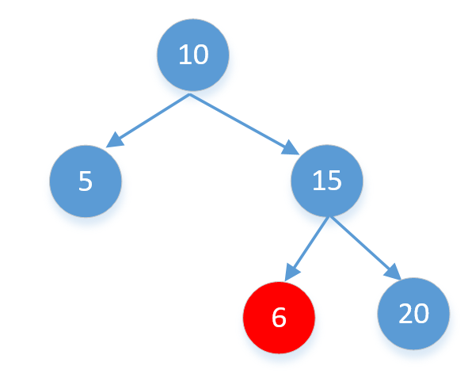
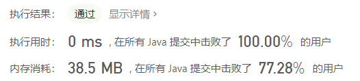
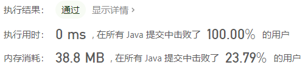
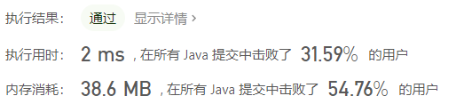

> 原文链接: https://leetcode-cn.com/problems/legal-binary-search-tree-lcci


## 英文原文
<div><p>Implement a function to check if a binary tree is a binary search tree.</p>

<p><strong>Example&nbsp;1:</strong></p>

<pre>
<strong>Input:</strong>
    2
   / \
  1   3
<strong>Output:</strong> true
</pre>

<p><strong>Example&nbsp;2:</strong></p>

<pre>
<strong>Input:</strong>
    5
   / \
  1   4
&nbsp;    / \
&nbsp;   3   6
<strong>Output:</strong> false
<strong>Explanation:</strong> Input: [5,1,4,null,null,3,6].
&nbsp;    the value of root node is 5, but its right child has value 4.</pre>
</div>

## 中文题目
<div><p>实现一个函数，检查一棵二叉树是否为二叉搜索树。</p><strong>示例 1:</strong><pre><strong>输入:</strong><br>    2<br>   / &#92<br>  1   3<br><strong>输出:</strong> true<br></pre><strong>示例 2:</strong><pre><strong>输入:</strong><br>    5<br>   / &#92<br>  1   4<br>     / &#92<br>    3   6<br><strong>输出:</strong> false<br><strong>解释:</strong> 输入为: [5,1,4,null,null,3,6]。<br>     根节点的值为 5 ，但是其右子节点值为 4 。</pre></div>

## 通过代码
<RecoDemo>
</RecoDemo>


## 高赞题解

### 1，递归写法
做这题之前我们首先要明白什么是二叉搜索树，就是每个节点左子树的值都比当前节点小，右子树的值都比当前节点大。所以看到这里我们最先想到的就是递归，我最先想到的是下面这种写法（**注意是错误的**）
```java
public boolean isValidBST(TreeNode root) {
    if (root == null)
        return true;
    if (root.left != null && root.val <= root.left.val || root.right != null && root.val >= root.right.val)
        return false;
    return isValidBST(root.left) && isValidBST(root.right);
}
```
如果一个结点是空的，我们默认他是有效的二叉搜索树，否则如果左节点不为空，我们要判断是否大于左节点的值，如果右节点不为空，我们还要判断小于右节点的值，然后我们再以左右两个子节点用相同的方式判断。看起来好像没什么问题，但我们好像忽略了一个每个节点的上限和下限，比如下面这棵树

注意6这个节点不光要小于15而且还要大于10，所以这里的每一个节点都是有一个范围的，上面的代码我只判断了6比15小，但没有和10进行比较，所以代码是错误的。这里我们来给每个节点添加一个范围，如果不在这个范围之内直接返回false，比如6的范围是(10,15)，很明显他不在这个范围内，所以他不是二叉搜索树。根节点的范围我们从Long.MIN_VALUE到Long.MAX_VALUE，来看下代码
```java
public boolean isValidBST(TreeNode root) {
    return isValidBST(root, Long.MIN_VALUE, Long.MAX_VALUE);
}

public boolean isValidBST(TreeNode root, long minVal, long maxVal) {
    if (root == null)
        return true;
    //每个节点如果超过这个范围，直接返回false
    if (root.val >= maxVal || root.val <= minVal)
        return false;
    //这里再分别以左右两个子节点分别判断，
    //左子树范围的最小值是minVal，最大值是当前节点的值，也就是root的值，因为左子树的值要比当前节点小
    //右子数范围的最大值是maxVal，最小值是当前节点的值，也就是root的值，因为右子树的值要比当前节点大
    return isValidBST(root.left, minVal, root.val) && isValidBST(root.right, root.val, maxVal);
}
```
看下运行结果


<br>

### 2，中序遍历递归
根据二叉搜索树的性质我们知道，中序遍历二叉搜索树，遍历的结果一定是有序的，如果不明白中序遍历的可以看下前面的[373，数据结构-6,树](https://mp.weixin.qq.com/s?__biz=MzU0ODMyNDk0Mw==&mid=2247487028&idx=1&sn=e06a0cd5760e62890e60e43a279a472b&chksm=fb419d14cc36140257eb220aaeac182287b10c3cab5c803ebd54013ee3fc120d693067c2e960&scene=21#wechat_redirect)。中序遍历时，判断当前节点是否大于中序遍历的前一个节点，也就是判断是否有序，如果不大于直接返回 false。
```java
//前一个结点，全局的
TreeNode prev;

public boolean isValidBST(TreeNode root) {
    if (root == null)
        return true;
    //访问左子树
    if (!isValidBST(root.left))
        return false;
    //访问当前节点：如果当前节点小于等于中序遍历的前一个节点直接返回false。
    if (prev != null && prev.val >= root.val)
        return false;
    prev = root;
    //访问右子树
    if (!isValidBST(root.right))
        return false;
    return true;
}
```
看下运行结果


<br>

### 3，中序遍历非递归
如果对树的中序遍历比较熟悉的话，或者看过之前写的《[373，数据结构-6,树](https://mp.weixin.qq.com/s?__biz=MzU0ODMyNDk0Mw==&mid=2247487028&idx=1&sn=e06a0cd5760e62890e60e43a279a472b&chksm=fb419d14cc36140257eb220aaeac182287b10c3cab5c803ebd54013ee3fc120d693067c2e960&scene=21#wechat_redirect)》，这里面也有树的中序遍历的递归和非递归两种写法。我们完全可以把上面中序遍历的递归改为非递归。
```java
public boolean isValidBST(TreeNode root) {
    if (root == null)
        return true;
    Stack<TreeNode> stack = new Stack<>();
    TreeNode pre = null;
    while (root != null || !stack.isEmpty()) {
        while (root != null) {
            stack.push(root);
            root = root.left;
        }
        root = stack.pop();
        if (pre != null && root.val <= pre.val)
            return false;
        //保存前一个访问的结点
        pre = root;
        root = root.right;
    }
    return true;
}
```
看下运行结果



<br>

我把部分**算法题**整理成了PDF文档，截止目前总共有**900多页**，大家可以下载阅读
**链接**：https://pan.baidu.com/s/1hjwK0ZeRxYGB8lIkbKuQgQ 
**提取码**：6666 

#### 如果觉得有用就给个赞吧，还可以关注我的[LeetCode主页](https://leetcode-cn.com/u/sdwwld/)查看更多的详细题解

## 统计信息
| 通过次数 | 提交次数 | AC比率 |
| :------: | :------: | :------: |
|    26823    |    76048    |   35.3%   |

## 提交历史
| 提交时间 | 提交结果 | 执行时间 |  内存消耗  | 语言 |
| :------: | :------: | :------: | :--------: | :--------: |
