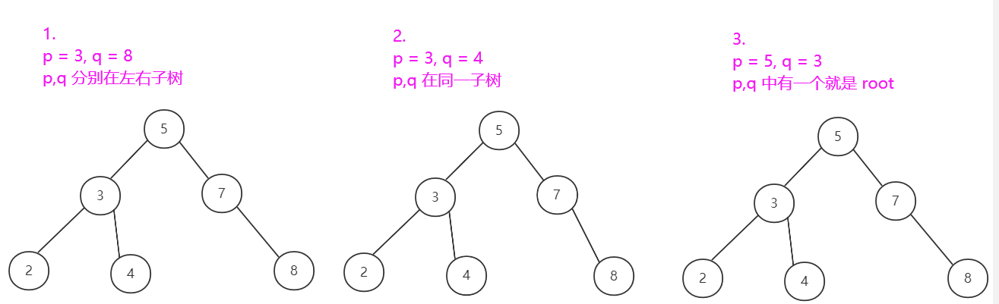

> 原文链接: https://leetcode-cn.com/problems/first-common-ancestor-lcci


## 英文原文
<div><p>Design an algorithm and write code to find the first common ancestor of two nodes in a binary tree. Avoid storing additional nodes in a data structure. NOTE: This is not necessarily a binary search tree.</p>

<p>For example, Given the following tree: root = [3,5,1,6,2,0,8,null,null,7,4]</p>

<pre>
    3
   / \
  5   1
 / \ / \
6  2 0  8
  / \
 7   4
</pre>

<p><strong>Example 1:</strong></p>

<pre>
<strong>Input:</strong> root = [3,5,1,6,2,0,8,null,null,7,4], p = 5, q = 1
<strong>Input:</strong> 3
<strong>Explanation:</strong> The first common ancestor of node 5 and node 1 is node 3.</pre>

<p><strong>Example 2:</strong></p>

<pre>
<strong>Input:</strong> root = [3,5,1,6,2,0,8,null,null,7,4], p = 5, q = 4
<strong>Output:</strong> 5
<strong>Explanation:</strong> The first common ancestor of node 5 and node 4 is node 5.</pre>

<p><strong>Notes:</strong></p>

<ul>
	<li>All node values are pairwise distinct.</li>
	<li>p, q are different node and both can be found in the given tree.</li>
</ul>
</div>

## 中文题目
<div><p>设计并实现一个算法，找出二叉树中某两个节点的第一个共同祖先。不得将其他的节点存储在另外的数据结构中。注意：这不一定是二叉搜索树。</p>

<p>例如，给定如下二叉树: root = [3,5,1,6,2,0,8,null,null,7,4]</p>

<pre>    3
   / \
  5   1
 / \ / \
6  2 0  8
  / \
 7   4
</pre>

<p><strong>示例 1:</strong></p>

<pre><strong>输入:</strong> root = [3,5,1,6,2,0,8,null,null,7,4], p = 5, q = 1
<strong>输出:</strong> 3
<strong>解释:</strong> 节点 5 和节点 1 的最近公共祖先是节点 3。</pre>

<p><strong>示例 2:</strong></p>

<pre><strong>输入:</strong> root = [3,5,1,6,2,0,8,null,null,7,4], p = 5, q = 4
<strong>输出:</strong> 5
<strong>解释:</strong> 节点 5 和节点 4 的最近公共祖先是节点 5。因为根据定义最近公共祖先节点可以为节点本身。</pre>

<p><strong>说明:</strong></p>

<pre>所有节点的值都是唯一的。
p、q 为不同节点且均存在于给定的二叉树中。</pre>
</div>

## 通过代码
<RecoDemo>
</RecoDemo>


## 高赞题解
## 思路

### 1.注意提示

1. 值唯一：说明查找的结果唯一，不会有干扰项。

2. `p,q`不同且都在二叉树中：不会存在没有公共祖先的情况。

### 2. 最近公共祖先的3种情况



### 3. 基于查找来判断最近公共祖先

1. 采用深度优先搜索（先搜索完，再判断）

1. 用`left`记录在左子树中查找`p`或`q`的情况，**找到了其中之一立刻结束查找**！找不到为`null`.

2. 用`right`记录在右子树中查找`p`或`q`的情况，**找到了其中之一立刻结束查找！**！找不到为`null`.

3. 根据这样的查找方法，解释上述3种情况：
    - $case 1$：`left = 3, right = 8`，都不为`null`，因此`root = 5`就是它们的最近公共祖先。
    - $case 2$：`left = 3, right = null`，**特别注意找到了`3`就立刻结束了对整个左子树的查找，所以`right = null`是在右子树中找不到`p`或`q`导致的，故`right`不是`4`**，该情况下，说明剩下一个没找到的也在左子树中，而`3`是先被找到的，所以`3`就是它们的最近公共祖先。
    - $case 3$：`p,q`中有一个就是`root`，它们的最近最近公共祖先就是`root`.


## 代码

```java
/**
 * Definition for a binary tree node.
 * public class TreeNode {
 *     int val;
 *     TreeNode left;
 *     TreeNode right;
 *     TreeNode(int x) { val = x; }
 * }
 */
class Solution {
    public TreeNode lowestCommonAncestor(TreeNode root, TreeNode p, TreeNode q) {
        // 到底了还没找到，返回 null
        if (root == null) {
            return null;
        }
        // 如果找到了 p 或 q，返回它
        if (root == p || root == q) {
            return root;
        }
        TreeNode left = lowestCommonAncestor(root.left, p, q);  // left 记录 p 或 q 是在左子树找到的
        TreeNode right = lowestCommonAncestor(root.right, p, q); // right 记录 p 或 q 是在右子树找到的
        // 如果 left 和 right 都记录了找到的节点，那么肯定是一个记录了 p ，另一个记录了 q
        // 它们分别在以 root 为根的左右子树中，所以 root 就是它们的最近公共祖先
        if (left != null && right != null) {
            return root;
        }
        // 由于节点 p,q 一定在二叉树中，left和right不会同时为null
        // 若 left != null && right == null，说明在左子树中找到 p 或 q，而在右子树找不到 p 或 q，则剩下一个也在左子树
        // 所以 left 就是最近公共祖先
        // 另一种情况同理
        return (left != null) ? left : right;
    }
}
```
## 算法分析
设`n`为二叉树的节点个数。
1. 访问所有节点一次且仅一次，时间复杂度为$O(n)$.

2. 递归使用栈辅助空间，空间复杂度为$O(n)$.

### 如果本文对你有帮助，可以给个大拇指呀！
### 如果你有什么建议或疑问，可以评论留言呀！

## 统计信息
| 通过次数 | 提交次数 | AC比率 |
| :------: | :------: | :------: |
|    17773    |    24791    |   71.7%   |

## 提交历史
| 提交时间 | 提交结果 | 执行时间 |  内存消耗  | 语言 |
| :------: | :------: | :------: | :--------: | :--------: |
