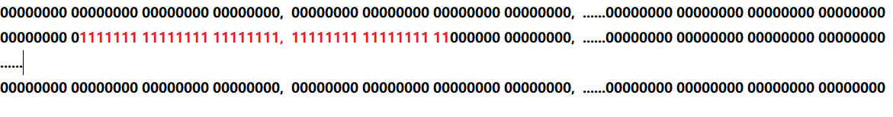
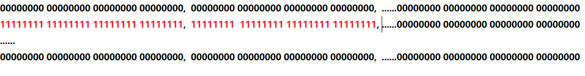
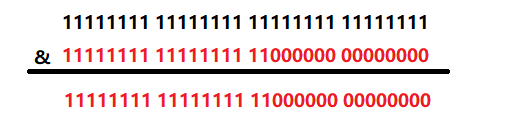

> 原文链接: https://leetcode-cn.com/problems/draw-line-lcci


## 英文原文
<div><p>A monochrome screen is stored as a single array of int, allowing 32 consecutive pixels to be stored in one int. The screen has width <code>w</code>, where <code>w</code> is divisible by 32&nbsp;(that is, no byte will be split across rows). The height of the screen, of course, can be derived from the length of the array and the width. Implement a function that draws a horizontal line from <code>(x1, y)</code> to <code>(x2, y)</code>.</p>

<p>Given the length of the array, the width of the array (in bit), start position <code>x1</code>&nbsp;(in bit) of the line, end position <code>x2</code> (in bit) of the line and the row number&nbsp;<code>y</code> of the line, return the array after drawing.</p>

<p><strong>Example1:</strong></p>

<pre>
<strong> Input</strong>: length = 1, w = 32, x1 = 30, x2 = 31, y = 0
<strong> Output</strong>: [3]
<strong> Explanation</strong>: After drawing a line from (30, 0) to (31, 0), the screen becomes [0b000000000000000000000000000000011].
</pre>

<p><strong>Example2:</strong></p>

<pre>
<strong> Input</strong>: length = 3, w = 96, x1 = 0, x2 = 95, y = 0
<strong> Output</strong>: [-1, -1, -1]
</pre>
</div>

## 中文题目
<div><p>绘制直线。有个单色屏幕存储在一个一维数组中，使得32个连续像素可以存放在一个 int 里。屏幕宽度为<code>w</code>，且<code>w</code>可被32整除（即一个 int 不会分布在两行上），屏幕高度可由数组长度及屏幕宽度推算得出。请实现一个函数，绘制从点<code>(x1, y)</code>到点<code>(x2, y)</code>的水平线。</p>

<p>给出数组的长度 <code>length</code>，宽度 <code>w</code>（以比特为单位）、直线开始位置 <code>x1</code>（比特为单位）、直线结束位置 <code>x2</code>（比特为单位）、直线所在行数&nbsp;<code>y</code>。返回绘制过后的数组。</p>

<p><strong>示例1:</strong></p>

<pre><strong> 输入</strong>：length = 1, w = 32, x1 = 30, x2 = 31, y = 0
<strong> 输出</strong>：[3]
<strong> 说明</strong>：在第0行的第30位到第31为画一条直线，屏幕表示为[0b000000000000000000000000000000011]
</pre>

<p><strong>示例2:</strong></p>

<pre><strong> 输入</strong>：length = 3, w = 96, x1 = 0, x2 = 95, y = 0
<strong> 输出</strong>：[-1, -1, -1]
</pre>
</div>

## 通过代码
<RecoDemo>
</RecoDemo>


## 高赞题解

首先声明，这并不是我个人想出来的解题思路，而是参考的别人的方法。这个方法的确妙不可言，但是我刚开始研究了半天并没有看懂，他也并没有怎么解释是怎么进行位运算的，那我就在这里稍微解释一下。

### 审题
首先要审题，说实话这题目乍一看我并没有看懂，还是画个图容易理解。

length：表示int的总数，一个int32位，换句话说就是总共有length*32位二进制数
w: 表示一行二进制位数，题目说了w能被32整除，也就是一行有w/32个int
y: 表示在哪一行画直线，像我上面的图就是行1（从0开始）
x1：表示从行y开始下标为x1的二进制开始画，上图就是9（也就是第10个）
x2：表示画到行y下标为x2的二进制，上图就是49（也就是第50个）

### 解题思路
每一位二进制表示一个像素，默认都为0，画线也就是从开始位置到结束位置将0变为1。画线的位置可能是跨多个int的，那么我们先将相关的int全部置为-1，为什么是-1，因为-1的补码为32位1，也就是将相关的int由32位全0变为全1，如下图（接上图的那个例子）。

那么首先的问题就是怎么求出哪些int是相关的，由于给出了行数y，x1和x2，行y下标x1对应的二进制从第一行第一个二进制开始数应该为y*w+x1个，除以32就是对应的int，x2也是同理。将相关的int全部置为1后，并不是要求的结果，因为我们将最前面和最后面的也置为1了。那接下来的问题就是将多余的1置为0。
下面就是位运算的关键了。首先回顾一下java位运算，>>表示有符号数的右移，如果为负数（高位为1），高位补1，如果为正数（高位为0），高位补0；<<表示有符号数的左移，直接低位补0；>>>表示不管有符号数还是无符号数的右移，高位直接补0。至于为什么没有<<<，因为左移低位只可能补0，那不就跟<<一样了。
接着看代码，我们现在将前面的0也置为1了，要恢复为0，将对应的int>>>x1%32就行。最后就要将最后面的1变为0，也就是对应int的低32-x2%32置为0，这好像是一个很常见的位运算，我竟然一时间没看出来，只要与一个数作与运算就行，这个数前x2%32全为1，后面全为0，这样与下来低位全为0，高位不变。

那这个要与的数怎么得到呢，只要将Integer.MIN_VALUE，也就是1000...000(31个0)左移x2%32位，这样高x2%32全为1，低位全为0。注意移位运算的优先级高于&运算。


### 代码

```java
class Solution {
    public int[] drawLine(int length, int w, int x1, int x2, int y) {  
        int[] ans=new int[length];
        int low=(y*w+x1)/32;
        int high=(y*w+x2)/32;
        for(int i=low;i<=high;i++){
            ans[i]=-1;
        }
        ans[low]=ans[low]>>>x1%32;
        ans[high]=ans[high]&Integer.MIN_VALUE>> x2 % 32;
        return ans;

    }
}
```

## 统计信息
| 通过次数 | 提交次数 | AC比率 |
| :------: | :------: | :------: |
|    3808    |    6891    |   55.3%   |

## 提交历史
| 提交时间 | 提交结果 | 执行时间 |  内存消耗  | 语言 |
| :------: | :------: | :------: | :--------: | :--------: |
