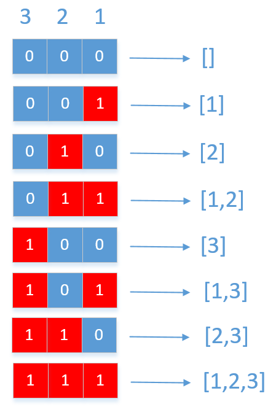
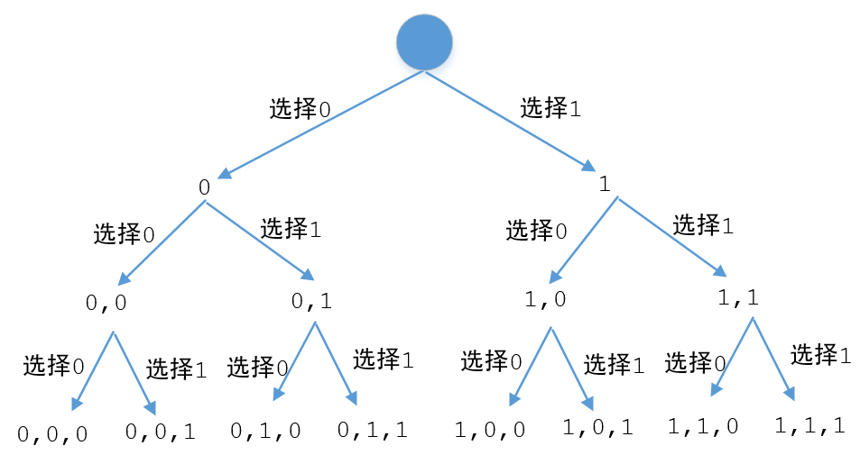

> 原文链接: https://leetcode-cn.com/problems/power-set-lcci


## 英文原文
<div><p>Write a method to return all subsets of a set. The elements in a set are&nbsp;pairwise distinct.</p>

<p>Note: The result set should not contain duplicated subsets.</p>

<p><strong>Example:</strong></p>

<pre>
<strong> Input</strong>:  nums = [1,2,3]
<strong> Output</strong>: 
[
  [3],
&nbsp; [1],
&nbsp; [2],
&nbsp; [1,2,3],
&nbsp; [1,3],
&nbsp; [2,3],
&nbsp; [1,2],
&nbsp; []
]
</pre>
</div>

## 中文题目
<div><p>幂集。编写一种方法，返回某集合的所有子集。集合中<strong>不包含重复的元素</strong>。</p>

<p>说明：解集不能包含重复的子集。</p>

<p><strong>示例:</strong></p>

<pre><strong> 输入</strong>： nums = [1,2,3]
<strong> 输出</strong>：
[
  [3],
&nbsp; [1],
&nbsp; [2],
&nbsp; [1,2,3],
&nbsp; [1,3],
&nbsp; [2,3],
&nbsp; [1,2],
&nbsp; []
]
</pre>
</div>

## 通过代码
<RecoDemo>
</RecoDemo>


## 高赞题解

### 1，非递归解决
首先来看一下非递归的解题思路，比如先加入一个空集让他成为新的子集，然后每遍历一个元素就在原来的子集的后面追加这个值。还以示例来分析下

```
public List<List<Integer>> subsets(int[] nums) {
    List<List<Integer>> res = new ArrayList<>(1 << nums.length);
    //先添加一个空的集合
    res.add(new ArrayList<>());
    for (int num : nums) {
        //每遍历一个元素就在之前子集中的每个集合追加这个元素，让他变成新的子集
        for (int i = 0, j = res.size(); i < j; i++) {
            //遍历之前的子集，重新封装成一个新的子集
            List<Integer> list = new ArrayList<>(res.get(i));
            //然后在新的子集后面追加这个元素
            list.add(num);
            //把这个新的子集添加到集合中
            res.add(list);
        }
    }
    return res;
}
```
运行结果如下

如果非要把它改为递归的也是可以的，仅仅提供了一种思路，有兴趣的也可以看下
```
public List<List<Integer>> subsets(int[] nums) {
    List<List<Integer>> res = new ArrayList<>(1 << nums.length);
    res.add(new ArrayList<>());
    recursion(nums, 0, res);
    return res;
}

public static void recursion(int[] nums, int index, List<List<Integer>> res) {
    //数组中的元素都访问完了，直接return
    if (index >= nums.length)
        return;
    int size = res.size();
    for (int j = 0; j < size; j++) {
        List<Integer> list = new ArrayList<>(res.get(j));
        //然后在新的子集后面追加一个值
        list.add(nums[index]);
        res.add(list);
    }
    //递归下一个元素
    recursion(nums, index + 1, res);
}
```

<br>

### 2，回溯解决解决
之前讲[450，什么叫回溯算法，一看就会，一写就废](https://mp.weixin.qq.com/s?__biz=MzU0ODMyNDk0Mw==&mid=2247488558&idx=1&sn=bb600c06c773960b3f4536c4c6c8d948&chksm=fb41870ecc360e18db1ca13783050d1a2efb19579407587baeea9b258a92e4c90c7ad12cbc1a&scene=21#wechat_redirect)中提到过子集的问题，这里再来看一下。回溯的模板如下，就是先选择，最后再撤销
```
private void backtrack("原始参数") {
    //终止条件(递归必须要有终止条件)
    if ("终止条件") {
        //一些逻辑操作（可有可无，视情况而定）
        return;
    }

    for (int i = "for循环开始的参数"; i < "for循环结束的参数"; i++) {
        //一些逻辑操作（可有可无，视情况而定）

        //做出选择

        //递归
        backtrack("新的参数");
        //一些逻辑操作（可有可无，视情况而定）

        //撤销选择
    }
}
```
这道题也一样，可以把它想象成为一颗n叉树，通过DFS遍历这棵n叉树，他所走过的所有路径都是子集的一部分，看下代码
```
public List<List<Integer>> subsets(int[] nums) {
    List<List<Integer>> list = new ArrayList<>();
    backtrack(list, new ArrayList<>(), nums, 0);
    return list;
}

private void backtrack(List<List<Integer>> list, List<Integer> tempList, int[] nums, int start) {
    //走过的所有路径都是子集的一部分，所以都要加入到集合中
    list.add(new ArrayList<>(tempList));
    for (int i = start; i < nums.length; i++) {
        //做出选择
        tempList.add(nums[i]);
        //递归
        backtrack(list, tempList, nums, i + 1);
        //撤销选择
        tempList.remove(tempList.size() - 1);
    }
}
```
看一下运行结果


<br>

### 3，位运算解决
数组中的每一个数字都有选和不选两种状态，我们可以用0和1表示，```0表示不选，1表示选择```。如果数组的长度是n，那么子集的数量就是2^n。比如数组长度是3，就有8种可能，分别是

[0，0，0]

[0，0，**1**]

[0，**1**，0]

[0，**1**，**1**]

[**1**，0，0]

[**1**，0，**1**]

[**1**，**1**，0]

[**1**，**1**，**1**]

这里参照示例画个图来看下

代码如下
```
public static List<List<Integer>> subsets(int[] nums) {
    //子集的长度是2的nums.length次方，这里通过移位计算
    int length = 1 << nums.length;
    List<List<Integer>> res = new ArrayList<>(length);
    //遍历从0到length中间的所有数字，根据数字中1的位置来找子集
    for (int i = 0; i < length; i++) {
        List<Integer> list = new ArrayList<>();
        for (int j = 0; j < nums.length; j++) {
            //如果数字i的某一个位置是1，就把数组中对
            //应的数字添加到集合
            if (((i >> j) & 1) == 1)
                list.add(nums[j]);
        }
        res.add(list);
    }
    return res;
}
```
看一下运行结果


<br>

### 4，其他解决方式
在[426，什么是递归，通过这篇文章，让你彻底搞懂递归](https://mp.weixin.qq.com/s?__biz=MzU0ODMyNDk0Mw==&mid=2247487910&idx=1&sn=2670aec7139c6b98e83ff66114ac1cf7&chksm=fb418286cc360b90741ed54fecd62fd45571b2caba3e41473a7ea0934f918d4b31537689c664&scene=21#wechat_redirect)中最后讲到分支污染的时候提到过这样一个问题：生成一个2^n长的数组，数组的值从0到(2^n)-1。我们可以把它想象成为一颗二叉树，每个节点的子树都是一个可选一个不可选

所以我们也可以参照这种方式来写，代码如下
```
public List<List<Integer>> subsets(int[] nums) {
    List<List<Integer>> res = new ArrayList<>();
    helper(res, nums, new ArrayList<>(), 0);
    return res;
}

private void helper(List<List<Integer>> res, int[] nums, List<Integer> list, int index) {
    //终止条件判断
    if (index == nums.length) {
        res.add(new ArrayList<>(list));
        return;
    }
    //每一个节点都有两个分支，一个选一个不选
    //走不选这个分支
    helper(res, nums, list, index + 1);
    //走选择这个分支
    list.add(nums[index]);
    helper(res, nums, list, index + 1);
    //撤销选择
    list.remove(list.size() - 1);
}
```

<br>

我把部分算法题整理成了PDF文档，截止目前总共有**900多页**，大家可以下载阅读
**链接**：https://pan.baidu.com/s/1hjwK0ZeRxYGB8lIkbKuQgQ 
**提取码**：6666 

#### 如果觉得有用就给个赞吧，还可以关注我的[LeetCode主页](https://leetcode-cn.com/u/sdwwld/)查看更多的详细题解

## 统计信息
| 通过次数 | 提交次数 | AC比率 |
| :------: | :------: | :------: |
|    22140    |    26965    |   82.1%   |

## 提交历史
| 提交时间 | 提交结果 | 执行时间 |  内存消耗  | 语言 |
| :------: | :------: | :------: | :--------: | :--------: |
