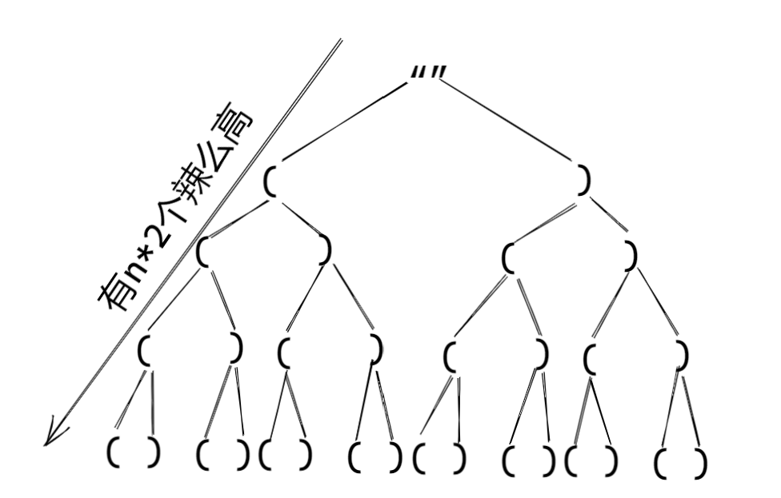

> 原文链接: https://leetcode-cn.com/problems/bracket-lcci


## 英文原文
<div><p>Implement an algorithm to print all valid (e.g., properly opened and closed) combinations of n pairs of parentheses.</p>

<p>Note: The result set should not contain duplicated subsets.</p>

<p>For example, given&nbsp;n = 3, the result should be:</p>

<pre>
[
  &quot;((()))&quot;,
  &quot;(()())&quot;,
  &quot;(())()&quot;,
  &quot;()(())&quot;,
  &quot;()()()&quot;
]
</pre>
</div>

## 中文题目
<div><p>括号。设计一种算法，打印n对括号的所有合法的（例如，开闭一一对应）组合。</p>

<p>说明：解集不能包含重复的子集。</p>

<p>例如，给出 n = 3，生成结果为：</p>

<pre>
[
  "((()))",
  "(()())",
  "(())()",
  "()(())",
  "()()()"
]
</pre>
</div>

## 通过代码
<RecoDemo>
</RecoDemo>


## 高赞题解
### 解题思路
回溯的灵魂就是画出树结构图，画这个图我也是参考了其它题解，因为我一直不知道这种左右括号的树型图应该怎么画，没有任何想法。

出图之后，我发现这其实就是一个满二叉树，我们只需要DFS所有节点即可。
个人的经验是千万别想着一口吃个胖纸，先把最基本的实现，然后再去改进。
所以我先把所有组合给生成出来，即DFS所有节点。如果有帮助，点个【**赞**】再走
```python3
class Solution:
    def generateParenthesis(self, n: int) -> List[str]:
        if n <= 0: return []
        res = []

        def dfs(paths):
            if len(paths) == n * 2:  # 因为括号都是成对出现的
                res.append(paths)
                return

            dfs(paths + '(')
            dfs(paths + ')')

        dfs('')
        return res
```
输出的结果如下
`['((((', '((()', '(()(', '(())', '()((', '()()', '())(', '()))', 
')(((', ')(()', ')()(', ')())', '))((', '))()', ')))(', '))))']`
我们发现有一些结果是我们不需要的，比如`((((`，比如`))))`
观察不需要的括号特点，`((((`实际上已经超过n了，我们生成同一方向的括号只需要n个即可，在生成的时候我们要限制住左括号与右括号生成的数量

这时我增加了left与right参数，分别代表左括号与右括号的数量，每生成一个我就增加一个。

那结束DFS的条件首先就需要把不符合的给过滤掉， `( > n` 或 `) > n` 或 `) > (`  
当然 `) > n` 这个条件也可以没有，因为 `) > (`  条件已经给控制住了。

```python3
def dfs(paths, left, right):
    if left > n or right > left: return
    if len(paths) == n * 2:  # 因为括号都是成对出现的
        res.append(paths)
        return

    dfs(paths + '(', left + 1, right)  # 生成一个就加一个
    dfs(paths + ')', left, right + 1)
```
`['((()))', '(()())', '(())()', '()(())', '()()()']`

### 代码

```python3
class Solution:
    def generateParenthesis(self, n: int) -> List[str]:
        if n <= 0: return []
        res = []

        def dfs(paths, left, right):
            if left > n or right > left: return
            if len(paths) == n * 2:  # 因为括号都是成对出现的
                res.append(paths)
                return

            dfs(paths + '(', left + 1, right)  # 生成一个就加一个
            dfs(paths + ')', left, right + 1)

        dfs('', 0, 0)
        return res
```

## 统计信息
| 通过次数 | 提交次数 | AC比率 |
| :------: | :------: | :------: |
|    22904    |    28111    |   81.5%   |

## 提交历史
| 提交时间 | 提交结果 | 执行时间 |  内存消耗  | 语言 |
| :------: | :------: | :------: | :--------: | :--------: |
