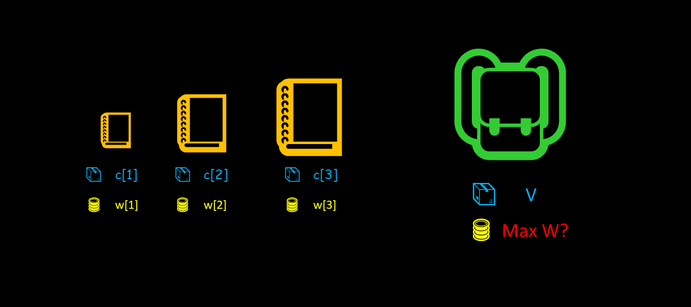
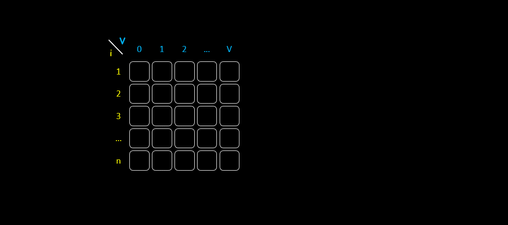
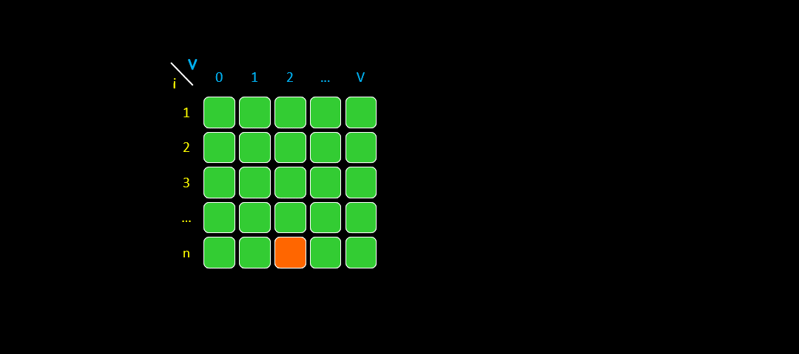
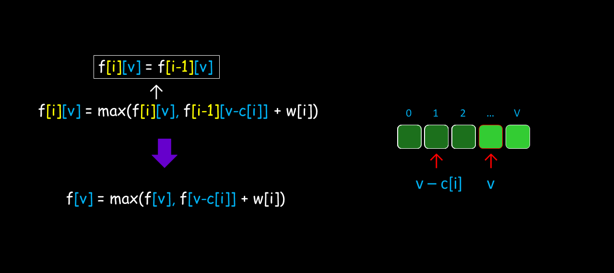
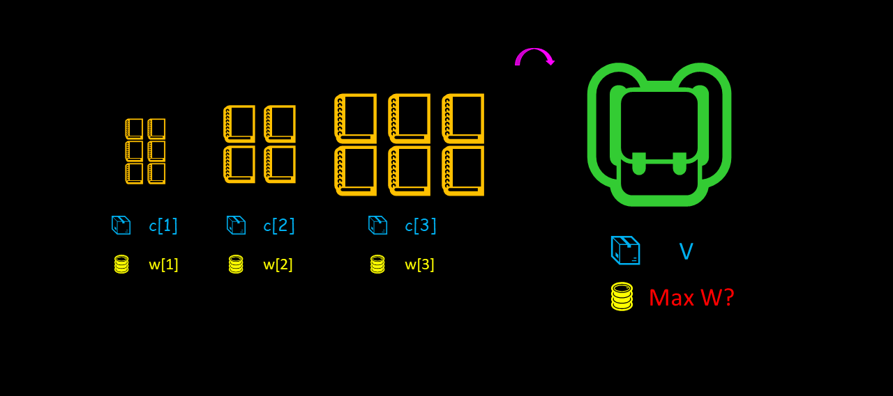

> 原文链接: https://leetcode-cn.com/problems/coin-lcci


## 英文原文
<div><p>Given an infinite number of quarters (25 cents), dimes (10 cents), nickels (5 cents), and pennies (1 cent), write code to calculate the number of ways of representing n cents.&nbsp;(The result may be large, so you should return it modulo 1000000007)</p>

<p><strong>Example1:</strong></p>

<pre>
<strong> Input</strong>: n = 5
<strong> Output</strong>: 2
<strong> Explanation</strong>: There are two ways:
5=5
5=1+1+1+1+1
</pre>

<p><strong>Example2:</strong></p>

<pre>
<strong> Input</strong>: n = 10
<strong> Output</strong>: 4
<strong> Explanation</strong>: There are four ways:
10=10
10=5+5
10=5+1+1+1+1+1
10=1+1+1+1+1+1+1+1+1+1
</pre>

<p><strong>Notes: </strong></p>

<p>You can assume:</p>

<ul>
	<li>0 &lt;= n&nbsp;&lt;= 1000000</li>
</ul>
</div>

## 中文题目
<div><p>硬币。给定数量不限的硬币，币值为25分、10分、5分和1分，编写代码计算n分有几种表示法。(结果可能会很大，你需要将结果模上1000000007)</p>

<p> <strong>示例1:</strong></p>

<pre>
<strong> 输入</strong>: n = 5
<strong> 输出</strong>：2
<strong> 解释</strong>: 有两种方式可以凑成总金额:
5=5
5=1+1+1+1+1
</pre>

<p> <strong>示例2:</strong></p>

<pre>
<strong> 输入</strong>: n = 10
<strong> 输出</strong>：4
<strong> 解释</strong>: 有四种方式可以凑成总金额:
10=10
10=5+5
10=5+1+1+1+1+1
10=1+1+1+1+1+1+1+1+1+1
</pre>

<p> <strong>说明：</strong></p>

<p>注意:</p>

<p>你可以假设：</p>

<ul>
<li>0 &lt;= n (总金额) &lt;= 1000000</li>
</ul>
</div>

## 通过代码
<RecoDemo>
</RecoDemo>


## 高赞题解
> 其实，人生很多东西无所谓最好的，只要是你认为值得就是最好。人生不是靠情绪活着，而是靠心态活着。总有看不懂的措辞，不理解的公式，只要你能有所收获，无论多少，就是极好。

**背包问题** 是经典的动态规划问题，它一共有 9 个分类，建议耐心阅读，理解之后你的动态规划水平一定会有一个质的飞跃。

先来浏览一下这 9 个问题的名称：

1. 01 背包问题
2. 完全背包问题
3. 多重背包问题
4. 混合背包问题
5. 二维费用背包问题
6. 分组背包问题
7. 背包问题求方案数
8. 求背包问题的方案
9. 有依赖的背包问题

首先，这些问题具有一个共同的前提：

有 `n` 个物品和容量为 `V` 的背包，第 `i` 件物品的体积为 `c[i]`，价值为 `w[i]`。现在的目标是确定要将哪些物体放入背包，以保证在体积 **不超过背包容量** 的前提下，背包内的 **总价值最高**？



其次，基于以上前提条件，通过添加不同的约束条件，就形成了不同的背包问题。

#### 1. 01 背包问题

> 约束条件：每种物品数量为 1，可以选择放或不放

##### 状态转移方程

状态定义：`f[i][v]` 为前 `i` **个** 物品中，体积恰好为 `v` 时的最大价值。

`result = max(f[n][0~V])` 即最终答案，它表示前 `n` 个物品的最大价值，假设这时容量为 `k` ，由于 `0 <= k <= V`，因此容量要在 `0~V`求最大值来寻找 `k`。

状态转移方程：

`f[i][v] = max(f[i-1][v], f[i-1][v-c[i]] + w[i])`

以上得到的状态 `i` 和状态 `i-1` 关系是从 **实际意义** 推断出来的。

如果 **不选第 i 个物品**，那么前 `i` 个背包的最大价值就是前 `i-1` 个物品的价值，即 `f[i][v] = f[i-1][v]`；

如果 **选择了第 i 个物品**，前 `i-1` 个物品的体积就是 `v-c[i]`，状态方程为 `f[i-1][v-c[i]]`，注意这时的价值是前 `i-1` 个物品的价值，因此少了 `w[i]` 的价值，所以 `f[i][v] = f[i-1][v-c[i]] + w[i]`。

最后我们要在这两种情况中选择能使物品最大价值更大的那个方案，故取最大值。最终我们就得到了以上的状态转移方程。

#### 代码实现

由于 `f[i][v]` 是二维的，所以我们可以使用 **二维数组** 实现，时间复杂度和空间复杂度均为 `O(nV)`。伪代码如下：

```python []
for i = 1, 2, ..., n: # 枚举前 i 个物品
    for v = 0, 1, ..., V: # 枚举体积
        f[i][v] = f[i-1][v]; # 不选第 i 个物品
        if v >= c[i]:  # 第 i 个物品的体积必须小于 v 才能选
            f[i][v] = max(f[i][v], f[i-1][v-c[i]] + w[i])
return max(f[n][0...V]) # 返回前 n 个物品的最大值
```

#### 优化方法

然而，我们有一种优化方法，只使用一维数组来实现，这样可使空间复杂度降到 `O(V)`。

```python []
for i = 1, 2, ..., n: # 枚举前 i 个物品
    for v = V, V-1, ..., c[i]: # 注意这里是倒序遍历，
            f[v] = max(f[v], f[v-c[i]] + w[i])
return f[V] # 返回前 n 个物品时的最大值，为体积小于等于 V 时的最大价值
```

我们发现以上代码有两处优化：

1. 去掉了状态 `i`，且 `v` 的遍历方式改为 **倒序** 遍历到 `c[i]`。
2. 直接返回 `f[V]`，没有求最大值。

为什么能这样优化呢？这里理解起来比较困难，希望你集中注意力，我们来一起分析一下。

首先，在优化前，根据代码来看，二维数组是这样填满的：




二维数组转换为一维数组大致示意图如下：



对于状态转移方程 `f[i][v] = max(f[i-1][v], f[i-1][v-c[i]] + w[i])`，我们是如何合并 `i` 这个维度的呢？

首先对于 `max` 内的第一项 `f[i][v] -> f[v]`，位置 `v` 上可能已经存了一个值，当我们在原位置进行更新时，表明用状态 `i` 的 `f[v]` 更新掉了状态 `i-1` 时的 `f[v]`；

其次，对于 `max` 内的第二项 `f[i-1][v-c[i]] + w[i] -> f[v-c[i]] + w[i]`，从下图中可以看出，由于 `v` 是倒序遍历，`f[v-c[i]]` 在遍历到 `f[v]` 时其实已经算过了，只是保存的是 `i-1` 时的值，当我们继续倒序遍历到 `f[v-c[i]]` 时，自然就将上一个状态 `i-1` 的值进行了更新。



以上就解决了第一处优化涉及的问题，接下来解释第二处优化。

当我们采用优化后的方法时，为什么最终返回 `f[V]` ，而不是 `max(f[n][0...V])` 呢？

实际上当我们进行优化时，**状态定义** 也同时发生了改变：`f[v]` 表示物品体积之和最大为 `v` 时的最大价值，而非恰好为 `v` 时的最大价值。

所以我们最后返回 `f[V]` 就表示前 `n` 个物品，体积之和最大为 `V` 时的最大价值，无需再求最大值。

为什么会发生这样的变化呢？我们仔细分析数组的维护过程，就能得到答案。



对于 `v=7` 来说，它在每次更新时，总是根据上一个状态中的 `f[7]` 和 `f[7-c[i]]` 的最大值来更新，而 `c[i]` 每次不一定相同，这就意味着 `f[7]` 是由前一个 `i` 的所有小于 `7` 的状态更新而来。

以上就是第二处优化方法的解释。

#### 相关题目

[322. 零钱兑换](https://leetcode-cn.com/problems/coin-change/)

#### 小结

01 背包是背包问题中最基础也是最重要的一类问题，讲了这么多，其实能够理解状态方程、并且知道它是倒序遍历，而完全背包相反，是正序遍历就行了，其他的细节可以在做题过程中慢慢体会。

#### 2. 完全背包问题

> 约束条件：每种物品的数量为无限个，你可以选择任意数量的物品。

##### 状态转移方程

状态定义：`f[i][v]` 为前 `i` **种** 物品中，体积恰好为 `v` 时的最大价值。



`result = max(f[n][0~V])` 即最终答案，它表示前 `n` 种物品的最大价值，假设这时容量为 `j` ，由于 `0 <= j <= V`，因此容量要在 `0~V`求最大值来寻找 `j`。

状态转移方程：

`f[i][v] = max(f[i-1][v-k*c[i]] + k*w[i]), 0 <=k*c[i]<=v`

同样地，以上得到的状态 `i` 和状态 `i-1` 关系是从 **实际意义** 推断出来的。

如果 **第 i 个物品选择了 k 次**，前 `i-1` 种物品的体积就是 `v-k*c[i]`，状态方程为 `f[i-1][v-k*c[i]]`，注意这时的价值是前 `i-1` 种物品的价值，因此少了 `k*w[i]` 的价值，所以 `f[i][v] = max(f[i-1][v-k*c[i]] + k*w[i]), 0 <=k*c[i]<=v`。

最后我们要在所有不同体积的情况中选择能使物品最大价值更大的那个方案，故取最大值。最终我们就得到了以上的状态转移方程。

#### 优化方法

我们仍然可以考虑将二维数组转化为一维数组，与 01 背包优化中“唯一”不同的是，这里 `v` 采用正序遍历。

```python []
for i = 1, 2, ..., n: # 枚举前 i 个物品
    for v = 0, 1, ..., V: # 注意这里是正序遍历，
            f[v] = max(f[v], f[v-c[i]] + w[i])
return f[V] # 返回前 n 个物品时的最大值，为体积小于等于 V 时的最大价值
```
代码中 

`f[v] = max(f[v], f[v-c[i]] + w[i])` 

变为二维其实是 

`f[i][v]= max(f[i-1][v],f[i][v-c[i]]+w[i])`。

这里的 `max` 函数中的第二项发生了改变，原因在于采用了正向遍历 `v`。



我们很容易看到 `f[v-c[i]]` 就是指状态 `i` 时的值，而非 `i-1`。
#### 相关题目

- [面试题 08.11. 硬币](https://leetcode-cn.com/problems/coin-lcci/)

- [322. 零钱兑换](https://leetcode-cn.com/problems/coin-change/)

#### 小结

像本题一样，很多类似可以拿一个或多个硬币的方案数的题目都可以将完全背包作为一种思路。对于完全背包，只需理解二维表示和一维表示中的状态转移方程即可，能够独立写出代码就可以了，不必有很大负担。

未完待续..

## 统计信息
| 通过次数 | 提交次数 | AC比率 |
| :------: | :------: | :------: |
|    34845    |    70442    |   49.5%   |

## 提交历史
| 提交时间 | 提交结果 | 执行时间 |  内存消耗  | 语言 |
| :------: | :------: | :------: | :--------: | :--------: |
