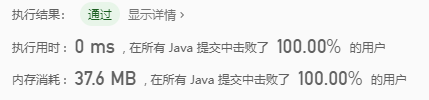

> 原文链接: https://leetcode-cn.com/problems/swap-numbers-lcci


## 英文原文
<div><p>Write a function to swap a number in place (that is, without temporary variables).</p>

<p><strong>Example: </strong></p>

<pre>
<strong>Input:</strong> numbers = [1,2]
<strong>Output:</strong> [2,1]
</pre>

<p><strong>Note: </strong></p>

<ul>
	<li><code>numbers.length == 2</code></li>
	<li><code>-2147483647 &lt;= numbers[i] &lt;=&nbsp;2147483647</code></li>
</ul>
</div>

## 中文题目
<div><p>编写一个函数，不用临时变量，直接交换<code>numbers = [a, b]</code>中<code>a</code>与<code>b</code>的值。</p>

<p><strong>示例：</strong></p>

<pre>
<strong>输入:</strong> numbers = [1,2]
<strong>输出:</strong> [2,1]
</pre>

<p><strong>提示：</strong></p>

<ul>
	<li><code>numbers.length == 2</code></li>
	<li><code>-2147483647 <= numbers[i] <= 2147483647</code></li>
</ul>
</div>

## 通过代码
<RecoDemo>
</RecoDemo>


## 高赞题解



具体详情可以看下[《357，交换两个数字的值》](https://mp.weixin.qq.com/s/2Ll_LyG37qkoRn6A1EMRVQ)，这里就不在过多解析

### 1，使用加法
```java
    public int[] swapNumbers(int[] numbers) {
        numbers[0] = numbers[0] + numbers[1];
        numbers[1] = numbers[0] - numbers[1];
        numbers[0] = numbers[0] - numbers[1];
        return numbers;
    }
```
### 2，使用减法
```java
    public int[] swapNumbers(int[] numbers) {
        numbers[0] = numbers[0] - numbers[1];
        numbers[1] = numbers[0] + numbers[1];
        numbers[0] = numbers[1] - numbers[0];
        return numbers;
    }
```
### 3，使用异或运算
```java
    public int[] swapNumbers(int[] numbers) {
        numbers[0] ^= numbers[1];
        numbers[1] ^= numbers[0];
        numbers[0] ^= numbers[1];
        return numbers;
    }
```

<br>

我把部分**算法题**整理成了PDF文档，截止目前总共有**900多页**，大家可以下载阅读
**链接**：https://pan.baidu.com/s/1hjwK0ZeRxYGB8lIkbKuQgQ 
**提取码**：6666 

#### 如果觉得有用就给个赞吧，还可以关注我的[LeetCode主页](https://leetcode-cn.com/u/sdwwld/)查看更多的详细题解

## 统计信息
| 通过次数 | 提交次数 | AC比率 |
| :------: | :------: | :------: |
|    26652    |    32151    |   82.9%   |

## 提交历史
| 提交时间 | 提交结果 | 执行时间 |  内存消耗  | 语言 |
| :------: | :------: | :------: | :--------: | :--------: |
