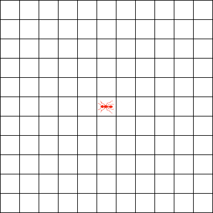

> 原文链接: https://leetcode-cn.com/problems/langtons-ant-lcci


## 英文原文
<div><p>An ant is sitting on an infinite grid of white and black squares. It initially faces right. All squares are white initially.</p>

<p>At each step, it does the following:</p>

<p>(1) At a white square, flip the color of the square, turn 90 degrees right (clockwise), and move forward one unit.</p>

<p>(2) At a black square, flip the color of the square, turn 90 degrees left (counter-clockwise), and move forward one unit.</p>

<p>Write a program to simulate the first K moves that the ant makes and print the final board as a grid.</p>

<p>The grid should be represented as an array of strings, where each element represents one row in the grid. The black square is represented as <code>&#39;X&#39;</code>, and the white square is represented as <code>&#39;_&#39;</code>, the square which is occupied by the ant is represented as <code>&#39;L&#39;</code>, <code>&#39;U&#39;</code>, <code>&#39;R&#39;</code>, <code>&#39;D&#39;</code>, which means the left, up, right and down orientations respectively. You only need to return the minimum matrix that is able to contain all squares that are passed through by the ant.</p>

<p><strong>Example 1:</strong></p>

<pre>
<strong>Input:</strong> 0
<strong>Output: </strong>[&quot;R&quot;]
</pre>

<p><strong>Example 2:</strong></p>

<pre>
<strong>Input:</strong> 2
<strong>Output:
</strong>[
&nbsp; &quot;_X&quot;,
&nbsp; &quot;LX&quot;
]
</pre>

<p><strong>Example 3:</strong></p>

<pre>
<strong>Input:</strong> 5
<strong>Output:
</strong>[
&nbsp; &quot;_U&quot;,
&nbsp; &quot;X_&quot;,
&nbsp; &quot;XX&quot;
]
</pre>

<p><strong>Note: </strong></p>

<ul>
	<li><code>K &lt;= 100000</code></li>
</ul>
</div>

## 中文题目
<div><p>一只蚂蚁坐在由白色和黑色方格构成的无限网格上。开始时，网格全白，蚂蚁面向右侧。每行走一步，蚂蚁执行以下操作。</p>

<p>(1) 如果在白色方格上，则翻转方格的颜色，向右(顺时针)转 90 度，并向前移动一个单位。<br>
(2) 如果在黑色方格上，则翻转方格的颜色，向左(逆时针方向)转 90 度，并向前移动一个单位。</p>

<p>编写程序来模拟蚂蚁执行的前 K 个动作，并返回最终的网格。</p>

<p>网格由数组表示，每个元素是一个字符串，代表网格中的一行，黑色方格由&nbsp;<code>&#39;X&#39;</code>&nbsp;表示，白色方格由&nbsp;<code>&#39;_&#39;</code>&nbsp;表示，蚂蚁所在的位置由&nbsp;<code>&#39;L&#39;</code>, <code>&#39;U&#39;</code>, <code>&#39;R&#39;</code>, <code>&#39;D&#39;</code>&nbsp;表示，分别表示蚂蚁&nbsp;左、上、右、下 的朝向。只需要返回能够包含蚂蚁走过的所有方格的最小矩形。</p>

<p><strong>示例 1:</strong></p>

<pre><strong>输入:</strong> 0
<strong>输出: </strong>[&quot;R&quot;]
</pre>

<p><strong>示例 2:</strong></p>

<pre><strong>输入:</strong> 2
<strong>输出:
</strong>[
&nbsp; &quot;_X&quot;,
&nbsp; &quot;LX&quot;
]
</pre>

<p><strong>示例 3:</strong></p>

<pre><strong>输入:</strong> 5
<strong>输出:
</strong>[
&nbsp; &quot;_U&quot;,
&nbsp; &quot;X_&quot;,
&nbsp; &quot;XX&quot;
]
</pre>

<p><strong>说明：</strong></p>

<ul>
	<li><code>K &lt;= 100000</code></li>
</ul>
</div>

## 通过代码
<RecoDemo>
</RecoDemo>


## 高赞题解


### 解题思路
目前比执行用时分布图表里最快的还快。
多看题目下方的提示，“并不真的需要一个网格”，蚂蚁的下一步坐标可以由当前状态计算出，所以保存并时刻更新蚂蚁的状态，用集合保存块的位置，最后再通过集合生成字符串列表。详细思路全在注释中了。

盗了一张维基的动图

### 代码

```java
class Solution {
    private class Position {
        
        // 横坐标 x 纵坐标 y
        int x, y;
        
        public Position(int x, int y) {
            this.x = x;
            this.y = y;
        }

        @Override
        public boolean equals(Object obj) {
            if (obj == this) return true;
            if (!(obj instanceof Position)) return false;
            Position o = (Position) obj;
            return x == o.x && y == o.y;
        }
        
        // 改写哈希算法，使两个 Position 对象可以比较坐标而不是内存地址
        @Override
        public int hashCode() {
            int result = x;
            result = 31 * result + y;
            return result;
        }
    }
    
    public List<String> printKMoves(int K) {
        char[] direction = {'L', 'U', 'R', 'D'};
        // 用“向量”记录方向，顺序与上一行方向的字符顺序保持一致，每个元素的后一个元素都是可以90°向右变换得到的
        int[][] offset = {{-1, 0}, {0, -1}, {1, 0}, {0, 1}};
        // 蚂蚁的位置
        Position antPos = new Position(0, 0);
        // 蚂蚁方向的向量序号
        int antDir = 2;
        // 用集合存储所有黑块的坐标，一开始想再定义一个路径的坐标集合，发现可以直接用黑块+蚂蚁位置也能过
        Set<Position> blackSet = new HashSet<>();
        while (K > 0) {
            // 新的坐标对象用于放入集合
            Position t = new Position(antPos.x, antPos.y);
            // 如果黑块集合能存入，说明脚下的块不在集合中，也就意味着是白色，方向序号循环自增1
            if (blackSet.add(t)) antDir = (antDir + 1) % 4;
            else {
                // 否则说明脚下的块已经在集合中，也就意味着是黑色，方向序号循环自增3，相当于自减1，但是Math.floorMod取模可能消耗大？用+3替代
                antDir = (antDir + 3) % 4;
                // 别忘了删除，即将黑块变白
                blackSet.remove(t);
            }
            // 蚂蚁移动位置
            antPos.x += offset[antDir][0];
            antPos.y += offset[antDir][1];
            K--;
        }
        // 计算边界，即输出网格的行数和列数
        int left = antPos.x, top = antPos.y, right = antPos.x, bottom = antPos.y;
        for (Position pos : blackSet) {
            left = pos.x < left ? pos.x : left;
            top = pos.y < top ? pos.y : top;
            right = pos.x > right ? pos.x : right;
            bottom = pos.y > bottom ? pos.y : bottom;
        }
        char[][] grid = new char[bottom - top + 1][right - left + 1];
        // 填充白块
        for (char[] row : grid)
            Arrays.fill(row, '_');
        // 替换黑块
        for (Position pos : blackSet)
            grid[pos.y - top][pos.x - left] = 'X';
        // 替换蚂蚁
        grid[antPos.y - top][antPos.x - left] = direction[antDir];
        // 利用网格生成字符串列表
        List<String> result = new ArrayList<>();
        for (char[] row : grid)
            result.add(String.valueOf(row));
        return result;
    }
}
```

## 统计信息
| 通过次数 | 提交次数 | AC比率 |
| :------: | :------: | :------: |
|    2926    |    4969    |   58.9%   |

## 提交历史
| 提交时间 | 提交结果 | 执行时间 |  内存消耗  | 语言 |
| :------: | :------: | :------: | :--------: | :--------: |
