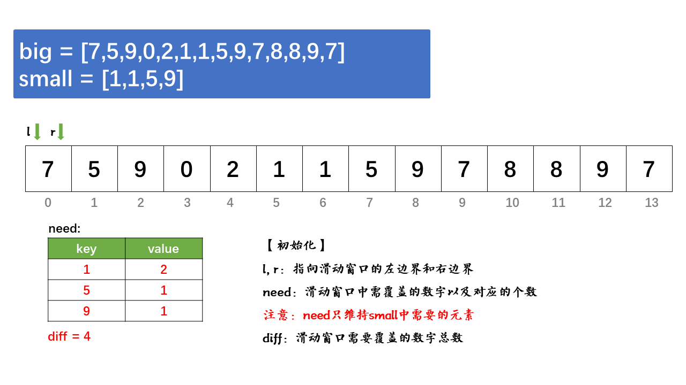

> 原文链接: https://leetcode-cn.com/problems/shortest-supersequence-lcci


## 英文原文
<div><p>You are given two arrays, one shorter (with all distinct elements) and one longer. Find the shortest subarray in the longer array that contains all the elements in the shorter array. The items can appear in any order.</p>

<p>Return the indexes of the leftmost and the rightmost elements of the array. If there are more than one answer, return the one that has the smallest left index. If there is no answer, return an empty array.</p>

<p><strong>Example 1:</strong></p>

<pre>
<strong>Input:</strong>
big = <code>[7,5,9,0,2,1,3,<strong>5,7,9,1</strong>,1,5,8,8,9,7]
small = [1,5,9]</code>
<strong>Output: </strong>[7,10]</pre>

<p><strong>Example 2:</strong></p>

<pre>
<strong>Input:</strong>
big = <code>[1,2,3]
small = [4]</code>
<strong>Output: </strong>[]</pre>

<p><strong>Note: </strong></p>

<ul>
	<li><code>big.length&nbsp;&lt;= 100000</code></li>
	<li><code>1 &lt;= small.length&nbsp;&lt;= 100000</code></li>
</ul>
</div>

## 中文题目
<div><p>假设你有两个数组，一个长一个短，短的元素均不相同。找到长数组中包含短数组所有的元素的最短子数组，其出现顺序无关紧要。</p>

<p>返回最短子数组的左端点和右端点，如有多个满足条件的子数组，返回左端点最小的一个。若不存在，返回空数组。</p>

<p><strong>示例 1:</strong></p>

<pre><strong>输入:</strong>
big = <code>[7,5,9,0,2,1,3,<strong>5,7,9,1</strong>,1,5,8,8,9,7]
small = [1,5,9]</code>
<strong>输出: </strong>[7,10]</pre>

<p><strong>示例 2:</strong></p>

<pre><strong>输入:</strong>
big = <code>[1,2,3]
small = [4]</code>
<strong>输出: </strong>[]</pre>

<p><strong>提示：</strong></p>

<ul>
	<li><code>big.length&nbsp;&lt;= 100000</code></li>
	<li><code>1 &lt;= small.length&nbsp;&lt;= 100000</code></li>
</ul>
</div>

## 通过代码
<RecoDemo>
</RecoDemo>


## 高赞题解
### 1. 前言

**1）关于什么是滑动窗口:**
> 滑动窗口，可以用来解决一些查找满足一定条件的连续区间的性质（长度等）的问题。由于区间连续，因此当区间发生变化时，可以通过旧有的计算结果对搜索空间进行剪枝，这样便减少了重复计算，降低了时间复杂度。往往类似于“请找到满足xx的最x的区间（子串、子数组）的xx”这类问题都可以使用该方法进行解决。

> 一般滑动窗口维护两个指针，左指针和右指针。
> 1. 当窗口内的元素未达到题目条件时，右指针右移，探索未知的区间来满足条件
> 2. 当窗口内的元素达到题目条件时，左指针右移，压缩区间，使窗口尽可能短得满足题目条件


**2）滑动窗口常规模板：**
```c++
int slidingWindow(vector<int> nums) {
    int n = nums.size();
    int ans = 0;
    // 记录窗口内的元素及其个数，非必要
    map<int, int> um;
    // l：窗口左边界； r：窗口右边界
    int l = 0, r = 0;
    // r 指针负责探索新的区间，直到搜索到nums的某末尾
    while (r < n) {
        um[r]++;
        // 如果区间不满足条件，l指针右移，窗口收缩
        while(区间 [l, r] is Invalid) {
            um[l]--;
            l++;
        }
        // 此处处理结果, deal with(ans, 区间[l, r])
        res = max(ans, r - l + 1); // 或者res = min(ans, r - l + 1);
        // 右指针右移，继续搜索
        r++;
    }
    return ans;
}
```
### 2. 变量定义

言归正传，回到本题。这里定义了几个变量：
- `map<int, int> need`：记录要完全覆盖`small`数组，滑动窗口内需要覆盖的数字及其对应的个数
- `int diff`：记录要完全覆盖`small`数组，滑动窗口内需要覆盖的数字总个数
- `int l`：指向窗口的左边界
- `int r`：指向窗口的右边界
- `int minLen`：表示满足条件的最短子数组长度


### 3. 例子

废话不多说，直接看动画！

<,,,,,,,,,,,,,,>

### 4. 解题步骤


**1）思路：**
`need`是一个字典，用来存储要包含`small`数组中的所有元素还需要覆盖的各个数字的数量。`diff`记录需要覆盖的所有数字的总数，`diff`的增大与减小与`need`是同步的，但是`diff`必须大于等于`0`。

那么，当我们遍历`big`中的数字`a`时，如果数字`a`在`small`中出现，那么我们将`need[a]`减一，说明窗口内增加了一个`a`，需要`a`的数量减一；
**注意：`need[a]`是可能为负数的，为负数说明当前窗口内的元素`a`超过了数组`small`中的元素`a`的数量**

如果，数字`a`在`small`中未出现，说明该数字对**是否包含small**是完全没有影响的，不用执行任何操作；

然后，当访问数组`big`中的数字一直到某个位置时，`need`中的所有键对应的值都为`0`，`diff`也等于`0`，此时当前窗口已经包含了`small`数组里的所有元素，甚至多余。记录当前窗口的长度`len`，并将左指针`l`右移，寻找包含small数组的最大下标`l`（即最短区间）

**我们只需要找到完整包含small数组的最短区间`[l, r]`即可。**


**2）步骤：**
1. 使用`small`数组初始化`need`，`need`存储`small`中的所有元素
2. 使用左、右指针`l`和`r`遍历`big`数组
3. 如果区间`[l, r]`内的元素未完全覆盖`small`(即`diff != 0`)，`r`右移
4. 如果区间`[l, r]`内的元素完全覆盖`small`(即`diff == 0`)，`l`左移，压缩区间，直到区间`[l, r]`不完全覆盖`small`数组
5. 重复步骤3-4，直到找到完全覆盖`small`数组的最短区间`[l, r]`


### 5. 代码

- **无注释版本：**

```c++
class Solution {
public:
    vector<int> shortestSeq(vector<int>& big, vector<int>& small) {
        int n = big.size();
        vector<int> res;
        unordered_map<int, int> need;
        int minLen = n, diff = 0;
        for (auto& e : small) {
            need[e]++;
            diff++;
        }

        int l = 0, r = 0;
        for (; r < n; ++r) {
            if (need.find(big[r]) != need.end() && --need[big[r]] >= 0) --diff;
            while (diff == 0) {
                if (r - l < minLen) {
                    minLen = r - l;
                    res = {l, r};
                }
                if (need.find(big[l]) != need.end() && ++need[big[l]] > 0) ++diff;
                ++l;
            }
        }

        return res;
    }
};
```

- **带注释版本：**
```c++
class Solution {
public:
    vector<int> shortestSeq(vector<int>& big, vector<int>& small) {
        int n = big.size();
        vector<int> res;
        // need：记录滑动窗口内需要覆盖的数字，及其对应的个数
        unordered_map<int, int> need;
        // diff：记录滑动窗口一共需要覆盖的数字个数
        int minLen = n, diff = 0;
        // 数据预处理：统计需要覆盖的字符有多少个
        for (auto& e : small) {
            need[e]++;
            diff++;
        }

        // 滑动窗口：l指向窗口左边界，r指向窗口右边界
        int l = 0, r = 0;
        for (; r < n; ++r) {
            // need中存在，diff减一
            if (need.find(big[r]) != need.end() && --need[big[r]] >= 0) --diff;
            // 如果diff = 0，收缩窗口，左指针右移
            while (diff == 0) {
                if (r - l < minLen) {
                    minLen = r - l;
                    res = {l, r};
                }
                if (need.find(big[l]) != need.end() && ++need[big[l]] > 0) ++diff;
                ++l;
            }
        }

        return res;
    }
};
```

类似的题：
[76.最小覆盖子串](https://leetcode-cn.com/problems/minimum-window-substring/)
> 感谢您的观看，希望对您有所帮助！
> 如有任何问题，欢迎留言交流！

## 统计信息
| 通过次数 | 提交次数 | AC比率 |
| :------: | :------: | :------: |
|    7648    |    17212    |   44.4%   |

## 提交历史
| 提交时间 | 提交结果 | 执行时间 |  内存消耗  | 语言 |
| :------: | :------: | :------: | :--------: | :--------: |
