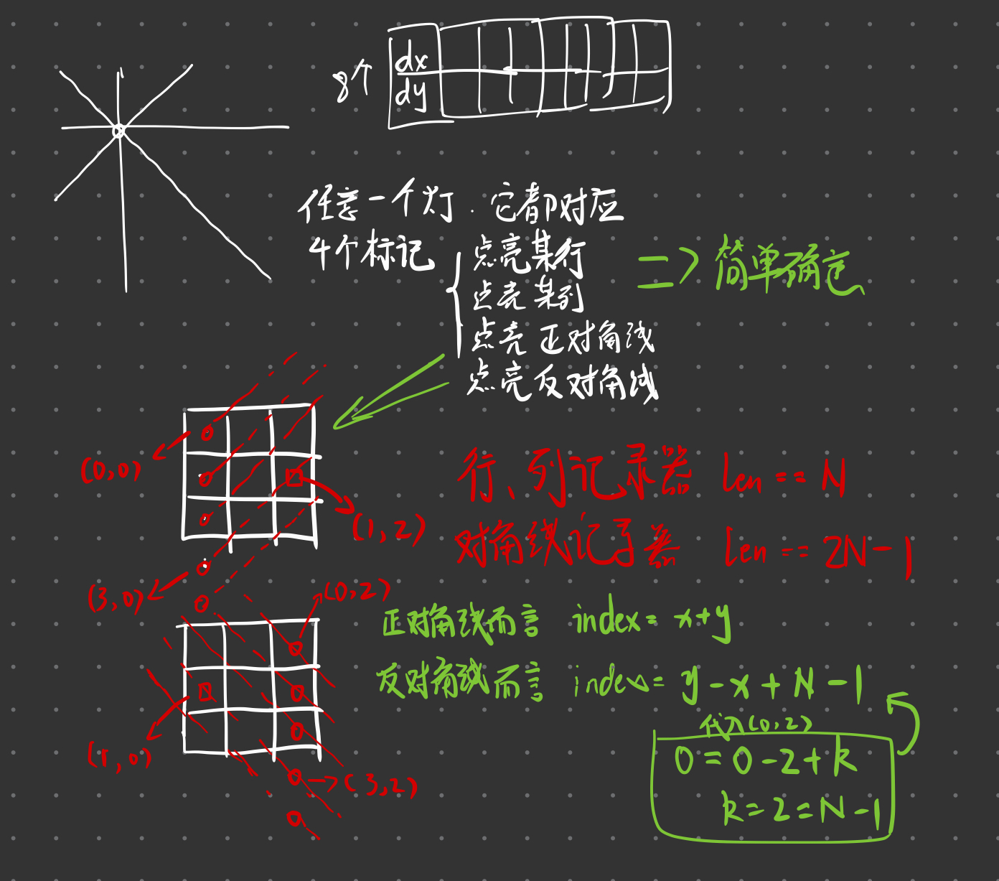

> 原文链接: https://leetcode-cn.com/problems/grid-illumination


## 英文原文
<div><p>There is a 2D <code>grid</code> of size <code>n x n</code> where each cell of this grid has a lamp that is initially <strong>turned off</strong>.</p>

<p>You are given a 2D array of lamp positions <code>lamps</code>, where <code>lamps[i] = [row<sub>i</sub>, col<sub>i</sub>]</code> indicates that the lamp at <code>grid[row<sub>i</sub>][col<sub>i</sub>]</code> is <strong>turned on</strong>. Even if the same lamp is listed more than once, it is turned on.</p>

<p>When a lamp is turned on, it <strong>illuminates its cell</strong> and <strong>all other cells</strong> in the same <strong>row, column, or diagonal</strong>.</p>

<p>You are also given another 2D array <code>queries</code>, where <code>queries[j] = [row<sub>j</sub>, col<sub>j</sub>]</code>. For the <code>j<sup>th</sup></code> query, determine whether <code>grid[row<sub>j</sub>][col<sub>j</sub>]</code> is illuminated or not. After answering the <code>j<sup>th</sup></code> query, <strong>turn off</strong> the lamp at <code>grid[row<sub>j</sub>][col<sub>j</sub>]</code> and its <strong>8 adjacent lamps</strong> if they exist. A lamp is adjacent if its cell shares either a side or corner with <code>grid[row<sub>j</sub>][col<sub>j</sub>]</code>.</p>

<p>Return <em>an array of integers </em><code>ans</code><em>,</em><em> where </em><code>ans[j]</code><em> should be </em><code>1</code><em> if the cell in the </em><code>j<sup>th</sup></code><em> query was illuminated, or </em><code>0</code><em> if the lamp was not.</em></p>

<p>&nbsp;</p>
<p><strong>Example 1:</strong></p>

<pre>
<strong>Input:</strong> n = 5, lamps = [[0,0],[4,4]], queries = [[1,1],[1,0]]
<strong>Output:</strong> [1,0]
<strong>Explanation:</strong> We have the initial grid with all lamps turned off. In the above picture we see the grid after turning on the lamp at grid[0][0] then turning on the lamp at grid[4][4].
The 0<sup>th</sup>&nbsp;query asks if the lamp at grid[1][1] is illuminated or not (the blue square). It is illuminated, so set ans[0] = 1. Then, we turn off all lamps in the red square.

The 1<sup>st</sup>&nbsp;query asks if the lamp at grid[1][0] is illuminated or not (the blue square). It is not illuminated, so set ans[1] = 0. Then, we turn off all lamps in the red rectangle.

</pre>

<p><strong>Example 2:</strong></p>

<pre>
<strong>Input:</strong> n = 5, lamps = [[0,0],[4,4]], queries = [[1,1],[1,1]]
<strong>Output:</strong> [1,1]
</pre>

<p><strong>Example 3:</strong></p>

<pre>
<strong>Input:</strong> n = 5, lamps = [[0,0],[0,4]], queries = [[0,4],[0,1],[1,4]]
<strong>Output:</strong> [1,1,0]
</pre>

<p>&nbsp;</p>
<p><strong>Constraints:</strong></p>

<ul>
	<li><code>1 &lt;= n &lt;= 10<sup>9</sup></code></li>
	<li><code>0 &lt;= lamps.length &lt;= 20000</code></li>
	<li><code>0 &lt;= queries.length &lt;= 20000</code></li>
	<li><code>lamps[i].length == 2</code></li>
	<li><code>0 &lt;= row<sub>i</sub>, col<sub>i</sub> &lt; n</code></li>
	<li><code>queries[j].length == 2</code></li>
	<li><code>0 &lt;= row<sub>j</sub>, col<sub>j</sub> &lt; n</code></li>
</ul>
</div>

## 中文题目
<div><p>在 <code>N x N</code> 的网格 <code>grid</code> 上，每个单元格都有一盏灯，最初灯都处于 <strong>关闭</strong> 状态。</p>

<p>数组 <code>lamps</code> 表示打开的灯的位置。<code>lamps[i] = [row<sub>i</sub>, col<sub>i</sub>]</code> 表示 <strong>打开</strong> 位于 <code>grid[row<sub>i</sub>][col<sub>i</sub>]</code> 的第 <code>i</code> 盏灯 。每盏灯都照亮自身单元格以及同一行、同一列和两条对角线上的所有其他单元格。</p>

<p>查询数组 <code>queries</code> 中，第 <code>i</code> 次查询 <code>queries[i] = [row<sub>i</sub>, col<sub>i</sub>]</code>，如果单元格 <code>[row<sub>i</sub>, col<sub>i</sub>]</code> 是被照亮的，则查询结果为 <code>1</code> ，否则为 <code>0</code> 。在第 <code>i</code> 次查询之后 [按照查询的顺序] ，<strong>关闭</strong> 位于单元格 <code>grid[row<sub>i</sub>][col<sub>i</sub>]</code> 上或其相邻 8 个方向上（与单元格 <code>grid[row<sub>i</sub>][col<sub>i</sub>]</code> 共享角或边）的任何灯。</p>

<p>返回答案数组 <code>ans</code> ， <code>answer[i]</code> 应等于第 <code>i</code> 次查询 <code>queries[i]</code> 的结果，<code>1</code> 表示照亮，<code>0</code> 表示未照亮。</p>

<p> </p>

<p><strong>示例 1：</strong></p>

<pre>
<strong>输入：</strong>N = 5, lamps = [[0,0],[4,4]], queries = [[1,1],[1,0]]
<strong>输出：</strong>[1,0]
<strong>解释：</strong>最初所有灯都是关闭的。在执行查询之前，打开位于 [0, 0] 和 [4, 4] 的灯。第 0 次查询检查 grid[1][1] 是否被照亮（蓝色方框）。该单元格被照亮，所以 ans[0] = 1 。然后，关闭红色方框中的所有灯。

第 1 次查询检查 grid[1][0] 是否被照亮（蓝色方框）。该单元格没有被照亮，所以 ans[1] = 0 。然后，关闭红色矩形中的所有灯。

</pre>

<p><strong>示例 2：</strong></p>

<pre>
<strong>输入：</strong>N = 5, lamps = [[0,0],[4,4]], queries = [[1,1],[1,1]]
<strong>输出：</strong>[1,1]
</pre>

<p><strong>示例 3：</strong></p>

<pre>
<strong>输入：</strong>N = 5, lamps = [[0,0],[0,4]], queries = [[0,4],[0,1],[1,4]]
<strong>输出：</strong>[1,1,0]
</pre>

<p> </p>

<p><strong>提示：</strong></p>

<ul>
	<li><code>1 <= N <= 10<sup>9</sup></code></li>
	<li><code>0 <= lamps.length <= 20000</code></li>
	<li><code>lamps[i].length == 2</code></li>
	<li><code>0 <= lamps[i][j] < N</code></li>
	<li><code>0 <= queries.length <= 20000</code></li>
	<li><code>queries[i].length == 2</code></li>
	<li><code>0 <= queries[i][j] < N</code></li>
</ul>
</div>

## 通过代码
<RecoDemo>
</RecoDemo>


## 高赞题解
## 草稿



## 思路

就如草稿中打的那样，我觉得每一个灯点亮的时候，它都会影响“整行”，“整列”，“正对角线”，“反对角线”。


如果两个灯在一行，我们显而易见可以得知这一行一定会被点亮。同时我们知道，如果我们熄灭其中一盏灯，这一行依旧充满光明！因为还有另一盏灯依然坚挺！只有当两盏灯同时熄灭，这一行才会重新回归黑暗。但是被熄灭的灯所处的列以及对角线波及到的区域，都会在它熄灭的同时，也陷入黑暗。


这让我们可以进行第一次抽象，看成每一盏灯的点亮都会对波及到的格子进行“计数+1”。而每一盏灯的熄灭都会对波及到的格子进行“计数-1”。


这样，如图，两盏同一行的灯，所处的行的计数就会变成2。这意味着，只有当两盏灯同时熄灭，才能让这一行的计数变成0（也就是变黑）。


但是问题来了，题目中给出的N的大小最大是10的九次方。显然，不可能开辟一个足够大的数组空间可供挥霍（时间也不允许）。


接下来，于是就如开头草稿中写的，我们可以设计四个记录器。之所以设计记录器是因为，每点亮一个灯，就必然会点亮“一行”，“一列”，“一个正对角线”，“一个反对角线”。我们不再需要去记录每一个格子的“光源亮度”。


我们查看一个格子的光源亮度，也只需要去看“这一行是否被点亮”，“这一列是否被点亮”，“这一个正对角线是否被点亮”...只要这些条件中，任一一个满足，就说明这个格子是被点亮的。


行记录器的索引和列记录器的索引是非常好确定的，可以直接等于所处格子的横纵坐标。


而正反对角线记录器的索引确定方式，我写在了草稿中。


至于最终记录器的实现方式，最开始想当然的使用了数组（草稿中也列出了数组的大小）...但忽略了题目N的给定范围，最终使用HashMap实现了记录器。


```

class Solution {

    //四个记录器

    HashMap<Integer, Integer> colRecorder;

    HashMap<Integer, Integer> rowRecorder;

    HashMap<Integer, Integer> positiveRecorder;

    HashMap<Integer, Integer> negetiveRecorder;


    //一个灯光记录器

    HashMap<Integer, Integer> lampsRecorder;


    //初始化方向向量

    private int[] dy = {-1, -1, -1, 0, 0, 0, 1, 1, 1};

    private int[] dx = {-1, 0, 1, -1, 0, 1, -1, 0, 1};

    private int directionLen = 9;


    private int N;


    public int[] gridIllumination(int N, int[][] lamps, int[][] queries) {

        //...

    }


    private int getPositiveIndex(int y, int x) {

        return x + y;

    }


    private int getNegetiveIndex(int y, int x) {

        return y - x + N - 1;

    }

}

```

## 统计信息
| 通过次数 | 提交次数 | AC比率 |
| :------: | :------: | :------: |
|    2221    |    7475    |   29.7%   |

## 提交历史
| 提交时间 | 提交结果 | 执行时间 |  内存消耗  | 语言 |
| :------: | :------: | :------: | :--------: | :--------: |


## 相似题目
|                             题目                             | 难度 |
| :----------------------------------------------------------: | :---------: |
| [N 皇后](https://leetcode-cn.com/problems/n-queens/) | 困难|
