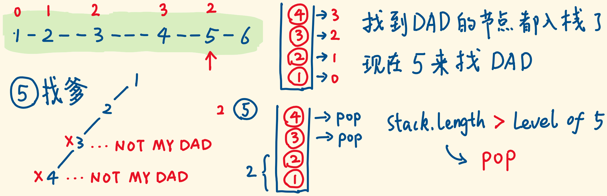

> 原文链接: https://leetcode-cn.com/problems/recover-a-tree-from-preorder-traversal


## 英文原文
<div><p>We run a&nbsp;preorder&nbsp;depth-first search (DFS) on the <code>root</code> of a binary tree.</p>

<p>At each node in this traversal, we output <code>D</code> dashes (where <code>D</code> is the depth of this node), then we output the value of this node.&nbsp; If the depth of a node is <code>D</code>, the depth of its immediate child is <code>D + 1</code>.&nbsp; The depth of the <code>root</code> node is <code>0</code>.</p>

<p>If a node has only one child, that child is guaranteed to be <strong>the left child</strong>.</p>

<p>Given the output <code>traversal</code> of this traversal, recover the tree and return <em>its</em> <code>root</code>.</p>

<p>&nbsp;</p>
<p><strong>Example 1:</strong></p>

<pre>
<strong>Input:</strong> traversal = &quot;1-2--3--4-5--6--7&quot;
<strong>Output:</strong> [1,2,5,3,4,6,7]
</pre>

<p><strong>Example 2:</strong></p>

<pre>
<strong>Input:</strong> traversal = &quot;1-2--3---4-5--6---7&quot;
<strong>Output:</strong> [1,2,5,3,null,6,null,4,null,7]
</pre>

<p><strong>Example 3:</strong></p>

<pre>
<strong>Input:</strong> traversal = &quot;1-401--349---90--88&quot;
<strong>Output:</strong> [1,401,null,349,88,90]
</pre>

<p>&nbsp;</p>
<p><strong>Constraints:</strong></p>

<ul>
	<li>The number of nodes in the original tree is in the range <code>[1, 1000]</code>.</li>
	<li><code>1 &lt;= Node.val &lt;= 10<sup>9</sup></code></li>
</ul>
</div>

## 中文题目
<div><p>我们从二叉树的根节点 <code>root</code>&nbsp;开始进行深度优先搜索。</p>

<p>在遍历中的每个节点处，我们输出&nbsp;<code>D</code>&nbsp;条短划线（其中&nbsp;<code>D</code>&nbsp;是该节点的深度），然后输出该节点的值。（<em>如果节点的深度为 <code>D</code>，则其直接子节点的深度为 <code>D + 1</code>。根节点的深度为 <code>0</code>）。</em></p>

<p>如果节点只有一个子节点，那么保证该子节点为左子节点。</p>

<p>给出遍历输出&nbsp;<code>S</code>，还原树并返回其根节点&nbsp;<code>root</code>。</p>

<p>&nbsp;</p>

<p><strong>示例 1：</strong></p>

<p><strong></strong></p>

<pre><strong>输入：</strong>&quot;1-2--3--4-5--6--7&quot;
<strong>输出：</strong>[1,2,5,3,4,6,7]
</pre>

<p><strong>示例 2：</strong></p>

<p><strong></strong></p>

<pre><strong>输入：</strong>&quot;1-2--3---4-5--6---7&quot;
<strong>输出：</strong>[1,2,5,3,null,6,null,4,null,7]
</pre>

<p><strong>示例 3：</strong></p>

<p></p>

<pre><strong>输入：</strong>&quot;1-401--349---90--88&quot;
<strong>输出：</strong>[1,401,null,349,88,90]
</pre>

<p>&nbsp;</p>

<p><strong>提示：</strong></p>

<ul>
	<li>原始树中的节点数介于 <code>1</code> 和 <code>1000</code> 之间。</li>
	<li>每个节点的值介于 <code>1</code> 和 <code>10 ^ 9</code> 之间。</li>
</ul>
</div>

## 通过代码
<RecoDemo>
</RecoDemo>


## 高赞题解
#### 初步的思路
- 连字符的个数代表节点的 level（深度）
- 因为前序遍历 $根|左|右$，字符串开头的节点是根节点，后面的节点可以通过 level 找父亲：儿子的 level 要比父亲大 1，不满足就不是父亲
- 当前节点的父亲，肯定在它的左边，从左往右扫描，儿子的父亲在左边，需要栈去记忆。
#### 当前考察的节点，对应有 level 
- 节点有对应的 level，你可以用两个栈管理它们，其实也不用。
- 扫描字符串时，每次考察一个节点，并算出它的 level，维护两个变量就行。 


#### 用栈去存储等待构建子树的节点
- 当前节点的父亲不一定是它上一个节点，如下图。
- 需要用一个栈，记忆左侧的节点，或者说，等待构建子树的节点
- 节点入栈，等待自己子树的构建。构建完成的子树，出栈。


#### 
- 当栈为空时，level 为 0 的根节点入栈，此时栈的 size 是 1 
- 入栈的节点的 level 如果是 1 ，等于栈的 size，则栈顶节点是它的父亲，就做它的儿子，而且尽量安排做左儿子
- 它自己也要入栈，因为它自己也是父亲，等待自己的儿子，构建自己的子树


#### 
- 如下图，如果栈的 size $>$ 当前节点的 level
- 说明栈顶节点不是当前节点的父亲，栈顶的儿子已经找齐了（子树构建完毕），该出栈了。
- 出栈，直到栈的 size 等于当前节点的 level，此时栈顶的节点就是当前节点的父亲。



#### 栈顶的父亲，总有位子留给儿子
- 子树构建完毕的节点会出栈，留在栈中的都是缺儿子的
- 找到栈顶爸爸的节点，一定可以当儿子，当不了左儿子，就当右儿子


#### 迭代版 代码
```js 
const recoverFromPreorder = (s) => {
  const stack = []; // 维护一个栈
  for (let i = 0; i < s.length; ) {
    let curLevel = 0; // 当前构建的节点所属的level
    while (i < s.length && s[i] == '-') { // 数数有几个连字符
      curLevel++;     // 统计它的level
      i++;            // 扫描的指针+1
    }
    let start = i;    // 记录下节点值字符串的开始位置
    while (i < s.length && s[i] != '-') { // 扫描节点值字符串
      i++;            // 扫描的指针+1
    }
    const val = s.substring(start, i); // 截取出节点值
    const curNode = new TreeNode(val); // 创建节点
    if (stack.length == 0) { // 此时栈为空，curNode为根节点
      stack.push(curNode);   // 入栈，成为栈底
      continue;              // 它没有父亲，不用找父亲，continue
    }
    while (stack.length > curLevel) {// 只要栈高>当前节点的level，就栈顶出栈
      stack.pop();
    }
    if (stack[stack.length - 1].left) { // 栈顶是父亲了，但左儿子已经存在
      stack[stack.length - 1].right = curNode; // curNode成为右儿子
    } else {
      stack[stack.length - 1].left = curNode; // 否则，成为左儿子
    }
    stack.push(curNode); // curNode自己也是父亲，入栈，等儿子
  }

  return stack[0]; // 栈底节点肯定是根节点
};
```

#### 总结一下
- 用栈+迭代模拟递归的过程蛮有意思的，可以体会一下
- 我的理解是，从栈底到栈顶是父调用到子调用，栈顶solve了就是子调用solve了，把结果返回给父调用，新的栈顶拿到出栈的栈顶的结果，自己计算完了，又出栈，直到栈底solve了，就是整个递归问题solve了

### 递归版
- 在迭代版的基础上修改的，感觉这个不好写，找 bug 找了半天
- 问题卡在了少了这行 `index -= curLevel `
- 第level层子树构建完毕，结束递归，return null，此时 index 多进了curLevel的长度，要退回来


```js
const recoverFromPreorder = (S) => {
  let index = 0   // 遍历字符串的指针

  const buildTree = (S, level) => { // 构建当前子树，它属于第level层
    let curLevel = 0                // 当前遇到的节点的level
    while (index < S.length && S[index] == '-') {
      curLevel++  // 计算curNode的level
      index++     // 指针步进，+1
    }
    if (curLevel < level) { // 我们想要构建第level层的一个子树，但遇到的当前节点的curLevel
                           // 却不等于level(比level小)，说明该子树已经构建完毕，要出递归栈（结束递归）
      index -= curLevel // 刚刚的while循环，index已经前进了curLevel长度，要退回来
      return null       // 递归的出口，返回null节点
    }
    let start = index   // 记录节点值开头的位置
    while (index < S.length && S[index] != '-') {
      index++           // 指针随着节点值推进
    }
    let val = S.slice(start, index) // 截取出节点值
    let curNode = new TreeNode(val) // 创建当前节点
    curNode.left = buildTree(S, level + 1)  // 构建当前节点的左子树
    curNode.right = buildTree(S, level + 1) // 构建当前节点的右子树
    return curNode // 返回子树
  }

  return buildTree(S, 0) // 构建第0层的子树，即整个树
};
```
#### 感谢阅读，如有帮助不妨留赞鼓励~ 欢迎关注，会继续产出好的题解

## 统计信息
| 通过次数 | 提交次数 | AC比率 |
| :------: | :------: | :------: |
|    20816    |    28411    |   73.3%   |

## 提交历史
| 提交时间 | 提交结果 | 执行时间 |  内存消耗  | 语言 |
| :------: | :------: | :------: | :--------: | :--------: |
