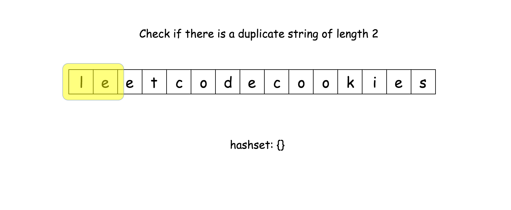
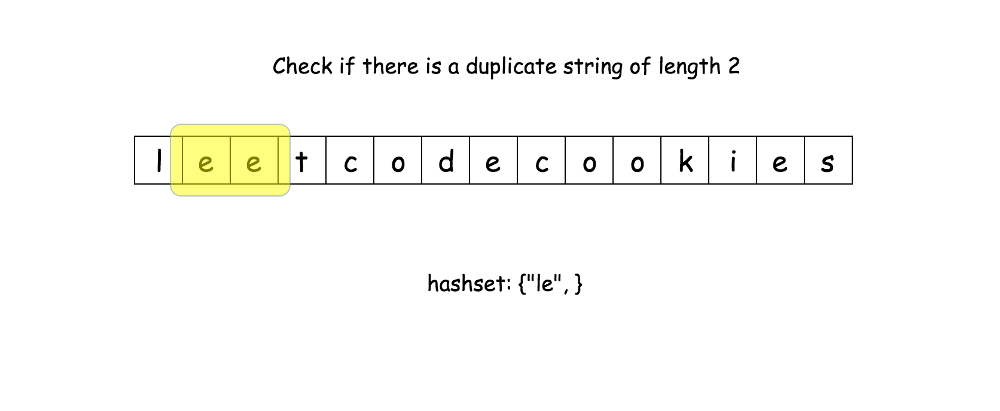
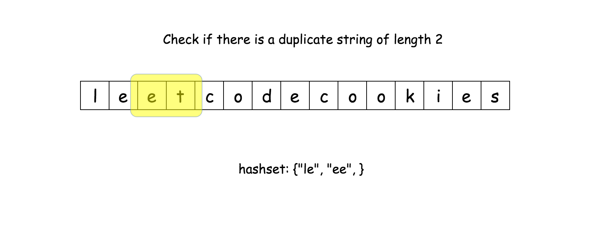
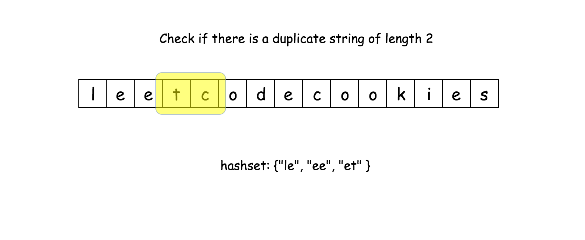
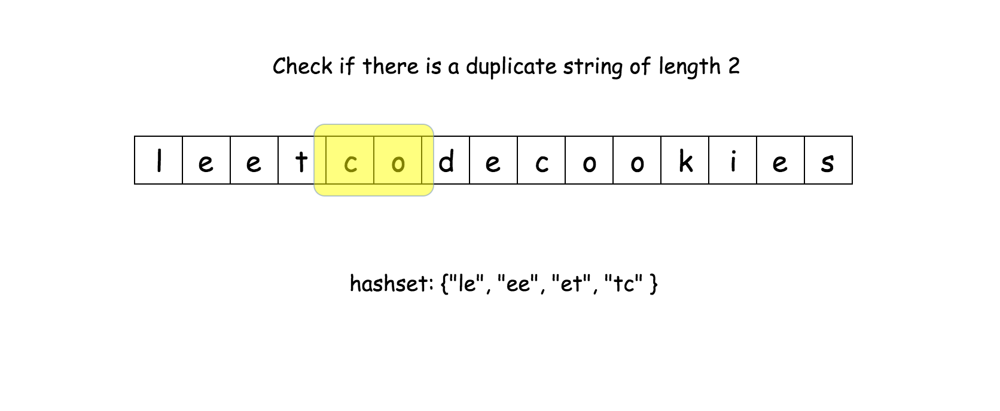
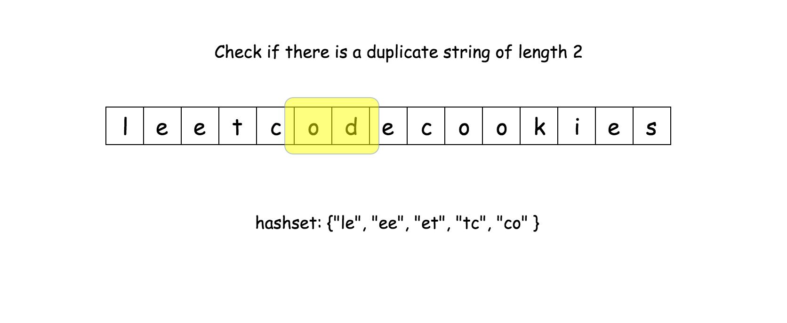
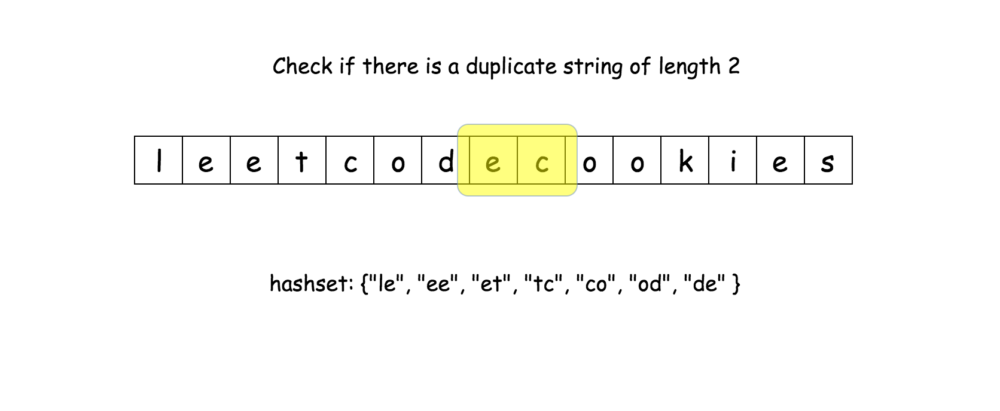
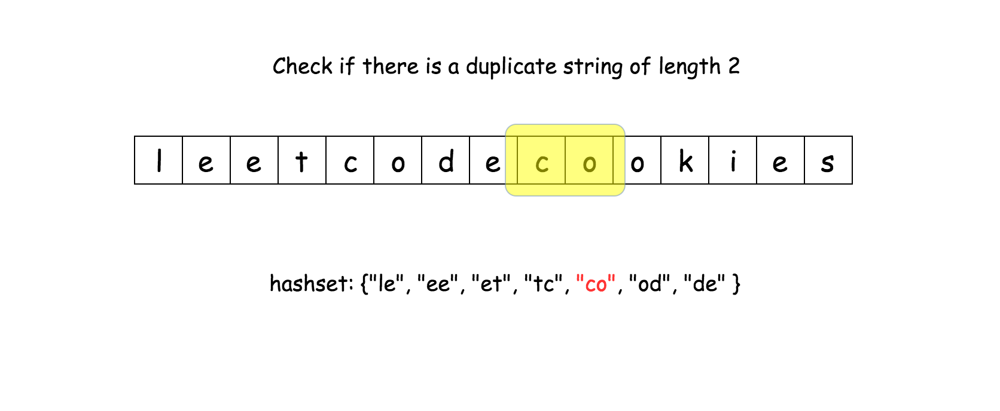
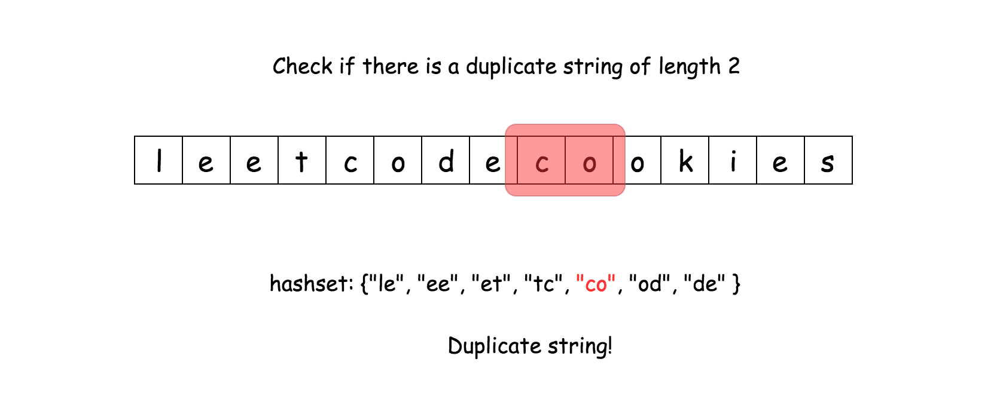

> 原文链接: https://leetcode-cn.com/problems/longest-duplicate-substring


## 英文原文
<div><p>Given a string <code>s</code>, consider all <em>duplicated substrings</em>: (contiguous) substrings of s that occur 2 or more times.&nbsp;The occurrences&nbsp;may overlap.</p>

<p>Return <strong>any</strong> duplicated&nbsp;substring that has the longest possible length.&nbsp;If <code>s</code> does not have a duplicated substring, the answer is <code>&quot;&quot;</code>.</p>

<p>&nbsp;</p>
<p><strong>Example 1:</strong></p>
<pre><strong>Input:</strong> s = "banana"
<strong>Output:</strong> "ana"
</pre><p><strong>Example 2:</strong></p>
<pre><strong>Input:</strong> s = "abcd"
<strong>Output:</strong> ""
</pre>
<p>&nbsp;</p>
<p><strong>Constraints:</strong></p>

<ul>
	<li><code>2 &lt;= s.length &lt;= 3 * 10<sup>4</sup></code></li>
	<li><code>s</code> consists of lowercase English letters.</li>
</ul>
</div>

## 中文题目
<div><p>给出一个字符串&nbsp;<code>S</code>，考虑其所有<strong>重复子串</strong>（<code>S</code> 的连续子串，出现两次或多次，可能会有重叠）。</p>

<p>返回<strong>任何</strong>具有最长可能长度的重复子串。（如果 <code>S</code>&nbsp;不含重复子串，那么答案为&nbsp;<code>&quot;&quot;</code>。）</p>

<p>&nbsp;</p>

<p><strong>示例 1：</strong></p>

<pre><strong>输入：</strong>&quot;banana&quot;
<strong>输出：</strong>&quot;ana&quot;
</pre>

<p><strong>示例 2：</strong></p>

<pre><strong>输入：</strong>&quot;abcd&quot;
<strong>输出：</strong>&quot;&quot;
</pre>

<p>&nbsp;</p>

<p><strong>提示：</strong></p>

<ol>
	<li><code>2 &lt;= S.length &lt;= 10^5</code></li>
	<li><code>S</code> 由小写英文字母组成。</li>
</ol>
</div>

## 通过代码
<RecoDemo>
</RecoDemo>


## 官方题解
#### 方法一：二分查找 + Rabin-Karp 字符串编码

**分析**

我们可以把这个问题分解成两个子问题：

1. 从 `1` 到 `N` 中选取子串的长度 `L`；

2. 检查字符串中是否存在长度为 `L` 的重复子串。

**子任务一：二分查找**

解决子问题一的最简单的方法是，我们从 `L = N - 1` 开始，依次递减选取子串的长度，并进行判断。如果发现存在长度为 `L` 的重复子串，就表示 `L` 是最长的可能长度。

但我们发现，如果字符串中存在长度为 `L` 的重复子串，那么一定存在长度为 `L0 < L` 的重复子串（选取长度为 `L` 的重复子串的某个长度为 `L0` 的子串即可），因此我们可以使用二分查找的方法，找到最大的 `L`。

{:width=600}
{:align=center}

**子任务二：Rabin-Karp 字符串编码**

我们可以使用 `Rabin-Karp` 算法将字符串进行编码，这样只要有两个编码相同，就说明存在重复子串。对于选取的长度 `L`：

- 使用长度为 `L` 的滑动窗口在长度为 `N` 的字符串上从左向右滑动；

- 检查当前处于滑动窗口中的子串的编码是否已经出现过（用一个集合存储已经出现过的编码）；

    - 若已经出现过，就说明找到了长度为 `L` 的重复子串；

    - 若没有出现过，就把当前子串的编码加入到集合中。

<,,,,,,,,,>{:width=600}
{:align=center}


可以看出，`Rabin-Karp` 字符串编码的本质是对字符串进行哈希，将字符串之间的比较转化为编码之间的比较。接下来的问题是，在滑动窗口从左向右滑动时，如何快速计算出当前子串的编码呢？如果需要在 $O(L)$ 的时间内算出编码，这种方法就没有意义了，因为这个直接进行字符串比较需要的时间相同。

为了能够快速计算出字符串编码，我们可以将字符串看成一个 26 进制的数（因为字符串中仅包含小写字母），它对应的 10 进制的值就是字符串的编码值。首先将字符转换为 26 进制中的 0-25，即通过 `arr[i] = (int)S.charAt(i) - (int)'a'`，可以将字符串 `abcd` 转换为 `[0, 1, 2, 3]`，它对应的 10 进制值为：

$$
h_0 = 0 \times 26^3 + 1 \times 26^2 + 2 \times 26^1 + 3 \times 26^0
$$

我们将这个表达式写得更通用一些，设 $c_i$ 为字符串中第 `i` 个字符对应的数字，$a = 26$ 为字符串的进制，那么有：

$$
\begin{aligned}
h_0 &= c_0 a^{L - 1} + c_1 a^{L - 2} + ... + c_i a^{L - 1 - i} + ... + c_{L - 1} a^1 + c_L a^0\\
&= \sum_{i = 0}^{L - 1}{c_i a^{L - 1 - i}}
\end{aligned}
$$

当我们向右移动滑动窗口时，例如从 `abcd` 变成 `bcde`，此时字符串对应的值从 `[0, 1, 2, 3]` 变成 `[1, 2, 3, 4]`，移除了最高位的 `0`，并且在最低位添加了 `4`，那么我们可以快速地计算出新的字符串的编码：

$$
h_1 = (h_0 - 0 \times 26^3) \times 26 + 4 \times 26^0
$$

更加通用的写法是：

$$
h_1 = (h_0 a - c_0 a^L) + c_{L + 1}
$$

这样，我们只需要 $O(L)$ 的时间复杂度计算出最左侧子串的编码，这个 $O(L)$ 和滑动窗口的循环是独立的。在滑动窗口向右滑动时，计算新的子串的编码的时间复杂度仅为 $O(1)$。

最后一个需要解决的问题是，在实际的编码计算中，$a^L$ 的值可能会非常大，在 C++ 和 Java 语言中，会导致整数的上溢出。一般的解决方法时，对编码值进行取模，将编码控制在一定的范围内，防止溢出，即`h = h % modulus`。根据 [生日悖论](https://baike.baidu.com/item/%E7%94%9F%E6%97%A5%E6%82%96%E8%AE%BA)，模数一般需要和被编码的信息数量的平方根的数量级相同，在本题中，相同长度的子串的数量不会超过 $N$ 个，因此选取模数是 $2^{32}$（无符号整型数的最大值）是足够的。在 Java 中可以用如下的代码实现取模：

```Java
h = (h * a - nums[start - 1] * aL % modulus + modulus) % modulus;
h = (h + nums[start + L - 1]) % modulus;
```

而在 Python 中，整型数没有最大值，因此可以在运算的最后再取模：

```Python
h = (h * a - nums[start - 1] * aL + nums[start + L - 1]) % modulus
```

在解决算法题时，我们只要判断两个编码是否相同，就表示它们对应的字符串是否相同。但在实际的应用场景中，会出现字符串不同但编码相同的情况，因此在实际场景中使用 `Rabin-Karp` 字符串编码时，推荐在编码相同时再对字符串进行比较，防止出现错误。

```Python [sol1]
class Solution:
    def search(self, L: int, a: int, modulus: int, n: int, nums: List[int]) -> str:
        """
        Rabin-Karp with polynomial rolling hash.
        Search a substring of given length
        that occurs at least 2 times.
        @return start position if the substring exits and -1 otherwise.
        """
        # compute the hash of string S[:L]
        h = 0
        for i in range(L):
            h = (h * a + nums[i]) % modulus
              
        # already seen hashes of strings of length L
        seen = {h} 
        # const value to be used often : a**L % modulus
        aL = pow(a, L, modulus) 
        for start in range(1, n - L + 1):
            # compute rolling hash in O(1) time
            h = (h * a - nums[start - 1] * aL + nums[start + L - 1]) % modulus
            if h in seen:
                return start
            seen.add(h)
        return -1
        
    def longestDupSubstring(self, S: str) -> str:
        n = len(S)
        # convert string to array of integers
        # to implement constant time slice
        nums = [ord(S[i]) - ord('a') for i in range(n)]
        # base value for the rolling hash function
        a = 26
        # modulus value for the rolling hash function to avoid overflow
        modulus = 2**32
        
        # binary search, L = repeating string length
        left, right = 1, n
        while left != right:
            L = left + (right - left) // 2
            if self.search(L, a, modulus, n, nums) != -1:
                left = L + 1
            else:
                right = L 
               
        start = self.search(left - 1, a, modulus, n, nums)
        return S[start: start + left - 1] if start != -1 else ""
```

```Java [sol1]
class Solution {
    /*
    Rabin-Karp with polynomial rolling hash.
        Search a substring of given length
        that occurs at least 2 times.
        Return start position if the substring exits and -1 otherwise.
        */
    public int search(int L, int a, long modulus, int n, int[] nums) {
        // compute the hash of string S[:L]
        long h = 0;
        for (int i = 0; i < L; ++i) h = (h * a + nums[i]) % modulus;

        // already seen hashes of strings of length L
        HashSet<Long> seen = new HashSet();
        seen.add(h);
        // const value to be used often : a**L % modulus
        long aL = 1;
        for (int i = 1; i <= L; ++i) aL = (aL * a) % modulus;

        for (int start = 1; start < n - L + 1; ++start) {
            // compute rolling hash in O(1) time
            h = (h * a - nums[start - 1] * aL % modulus + modulus) % modulus;
            h = (h + nums[start + L - 1]) % modulus;
            if (seen.contains(h)) return start;
            seen.add(h);
        }
        return -1;
    }

    public String longestDupSubstring(String S) {
        int n = S.length();
        // convert string to array of integers
        // to implement constant time slice
        int[] nums = new int[n];
        for (int i = 0; i < n; ++i) nums[i] = (int)S.charAt(i) - (int)'a';
        // base value for the rolling hash function
        int a = 26;
        // modulus value for the rolling hash function to avoid overflow
        long modulus = (long)Math.pow(2, 32);

        // binary search, L = repeating string length
        int left = 1, right = n;
        int L;
        while (left != right) {
            L = left + (right - left) / 2;
            if (search(L, a, modulus, n, nums) != -1) left = L + 1;
            else right = L;
        }

        int start = search(left - 1, a, modulus, n, nums);
        return start != -1 ? S.substring(start, start + left - 1) : "";
    }
}
```

**复杂度分析**

* 时间复杂度：$O(N \log N)$，二分查找的时间复杂度为 $O(\log N)$，Rabin-Karp 字符串编码的时间复杂度为 $O(N)$。

* 空间复杂度：$O(N)$，用来存储字符串编码的集合。

## 统计信息
| 通过次数 | 提交次数 | AC比率 |
| :------: | :------: | :------: |
|    6156    |    29454    |   20.9%   |

## 提交历史
| 提交时间 | 提交结果 | 执行时间 |  内存消耗  | 语言 |
| :------: | :------: | :------: | :--------: | :--------: |
