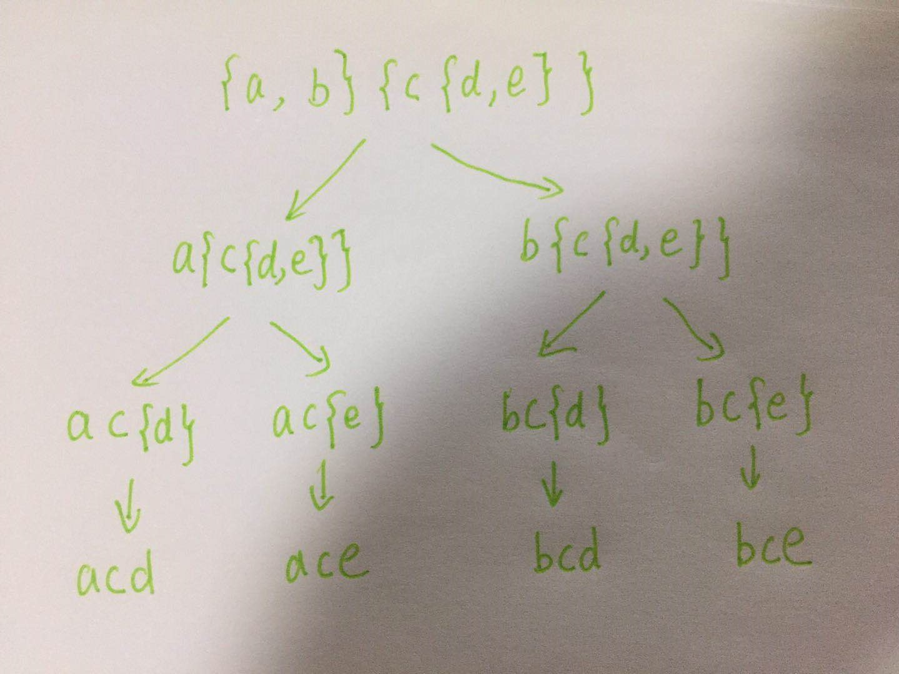

> 原文链接: https://leetcode-cn.com/problems/brace-expansion-ii


## 英文原文
<div><p>Under the grammar given below, strings can represent a set of lowercase words. Let&nbsp;<code>R(expr)</code>&nbsp;denote the set of words the expression represents.</p>

<p>The grammar can best be understood through simple examples:</p>

<ul>
	<li>Single letters represent a singleton set containing that word.
	<ul>
		<li><code>R(&quot;a&quot;) = {&quot;a&quot;}</code></li>
		<li><code>R(&quot;w&quot;) = {&quot;w&quot;}</code></li>
	</ul>
	</li>
	<li>When we take a comma-delimited list of two or more expressions, we take the union of possibilities.
	<ul>
		<li><code>R(&quot;{a,b,c}&quot;) = {&quot;a&quot;,&quot;b&quot;,&quot;c&quot;}</code></li>
		<li><code>R(&quot;{{a,b},{b,c}}&quot;) = {&quot;a&quot;,&quot;b&quot;,&quot;c&quot;}</code> (notice the final set only contains each word at most once)</li>
	</ul>
	</li>
	<li>When we concatenate two expressions, we take the set of possible concatenations between two words where the first word comes from the first expression and the second word comes from the second expression.
	<ul>
		<li><code>R(&quot;{a,b}{c,d}&quot;) = {&quot;ac&quot;,&quot;ad&quot;,&quot;bc&quot;,&quot;bd&quot;}</code></li>
		<li><code>R(&quot;a{b,c}{d,e}f{g,h}&quot;) = {&quot;abdfg&quot;, &quot;abdfh&quot;, &quot;abefg&quot;, &quot;abefh&quot;, &quot;acdfg&quot;, &quot;acdfh&quot;, &quot;acefg&quot;, &quot;acefh&quot;}</code></li>
	</ul>
	</li>
</ul>

<p>Formally, the three rules for our grammar:</p>

<ul>
	<li>For every lowercase letter <code>x</code>, we have <code>R(x) = {x}</code>.</li>
	<li>For expressions <code>e<sub>1</sub>, e<sub>2</sub>, ... , e<sub>k</sub></code> with <code>k &gt;= 2</code>, we have <code>R({e<sub>1</sub>, e<sub>2</sub>, ...}) = R(e<sub>1</sub>) &cup; R(e<sub>2</sub>) &cup; ...</code></li>
	<li>For expressions <code>e<sub>1</sub></code> and <code>e<sub>2</sub></code>, we have <code>R(e<sub>1</sub> + e<sub>2</sub>) = {a + b for (a, b) in R(e<sub>1</sub>) &times; R(e<sub>2</sub>)}</code>, where <code>+</code> denotes concatenation, and <code>&times;</code> denotes the cartesian product.</li>
</ul>

<p>Given an expression representing a set of words under the given grammar, return <em>the sorted list of words that the expression represents</em>.</p>

<p>&nbsp;</p>
<p><strong>Example 1:</strong></p>

<pre>
<strong>Input:</strong> expression = &quot;{a,b}{c,{d,e}}&quot;
<strong>Output:</strong> [&quot;ac&quot;,&quot;ad&quot;,&quot;ae&quot;,&quot;bc&quot;,&quot;bd&quot;,&quot;be&quot;]
</pre>

<p><strong>Example 2:</strong></p>

<pre>
<strong>Input:</strong> expression = &quot;{{a,z},a{b,c},{ab,z}}&quot;
<strong>Output:</strong> [&quot;a&quot;,&quot;ab&quot;,&quot;ac&quot;,&quot;z&quot;]
<strong>Explanation:</strong> Each distinct word is written only once in the final answer.
</pre>

<p>&nbsp;</p>
<p><strong>Constraints:</strong></p>

<ul>
	<li><code>1 &lt;= expression.length &lt;= 60</code></li>
	<li><code>expression[i]</code> consists of <code>&#39;{&#39;</code>, <code>&#39;}&#39;</code>, <code>&#39;,&#39;</code>or lowercase English letters.</li>
	<li>The given&nbsp;<code>expression</code>&nbsp;represents a set of words based on the grammar given in the description.</li>
</ul>
</div>

## 中文题目
<div><p>如果你熟悉 Shell 编程，那么一定了解过花括号展开，它可以用来生成任意字符串。</p>

<p>花括号展开的表达式可以看作一个由 <strong>花括号</strong>、<strong>逗号</strong> 和 <strong>小写英文字母</strong> 组成的字符串，定义下面几条语法规则：</p>

<ul>
	<li>如果只给出单一的元素&nbsp;<code>x</code>，那么表达式表示的字符串就只有&nbsp;<code>"x"</code>。<code>R(x) = {x}</code>

	<ul>
		<li>例如，表达式 <code>"a"</code> 表示字符串 <code>"a"</code>。</li>
		<li>而表达式 <code>"w"</code> 就表示字符串 <code>"w"</code>。</li>
	</ul>
	</li>
	<li>当两个或多个表达式并列，以逗号分隔，我们取这些表达式中元素的并集。<code>R({e_1,e_2,...}) = R(e_1)&nbsp;∪ R(e_2)&nbsp;∪ ...</code>
	<ul>
		<li>例如，表达式 <code>"{a,b,c}"</code> 表示字符串&nbsp;<code>"a","b","c"</code>。</li>
		<li>而表达式 <code>"{{a,b},{b,c}}"</code> 也可以表示字符串&nbsp;<code>"a","b","c"</code>。</li>
	</ul>
	</li>
	<li>要是两个或多个表达式相接，中间没有隔开时，我们从这些表达式中各取一个元素依次连接形成字符串。<code>R(e_1 + e_2) = {a + b for (a, b) in&nbsp;R(e_1)&nbsp;× R(e_2)}</code>
	<ul>
		<li>例如，表达式 <code>"{a,b}{c,d}"</code> 表示字符串&nbsp;<code>"ac","ad","bc","bd"</code>。</li>
	</ul>
	</li>
	<li>表达式之间允许嵌套，单一元素与表达式的连接也是允许的。
	<ul>
		<li>例如，表达式 <code>"a{b,c,d}"</code> 表示字符串&nbsp;<code>"ab","ac","ad"​​​​​​</code>。</li>
		<li>例如，表达式 <code>"a{b,c}{d,e}f{g,h}"</code> 可以表示字符串&nbsp;<code>"abdfg", "abdfh", "abefg", "abefh", "acdfg", "acdfh", "acefg", "acefh"</code>。</li>
	</ul>
	</li>
</ul>

<p>给出表示基于给定语法规则的表达式&nbsp;<code>expression</code>，返回它所表示的所有字符串组成的有序列表。</p>

<p>假如你希望以「集合」的概念了解此题，也可以通过点击 “<strong>显示英文描述</strong>” 获取详情。</p>

<p>&nbsp;</p>

<p><strong>示例 1：</strong></p>

<pre>
<strong>输入：</strong>expression = "{a,b}{c,{d,e}}"
<strong>输出：</strong>["ac","ad","ae","bc","bd","be"]</pre>

<p><strong>示例 2：</strong></p>

<pre>
<strong>输入：</strong>expression = "{{a,z},a{b,c},{ab,z}}"
<strong>输出：</strong>["a","ab","ac","z"]
<strong>解释：</strong>输出中 <strong>不应 </strong>出现重复的组合结果。
</pre>

<p>&nbsp;</p>

<p><strong>提示：</strong></p>

<ul>
	<li><code>1 &lt;= expression.length &lt;= 60</code></li>
	<li><code>expression[i]</code> 由 <code>'{'</code>，<code>'}'</code>，<code>','</code>&nbsp;或小写英文字母组成</li>
	<li>给出的表达式&nbsp;<code>expression</code>&nbsp;用以表示一组基于题目描述中语法构造的字符串</li>
</ul>
</div>

## 通过代码
<RecoDemo>
</RecoDemo>


## 高赞题解
### 解题思路
本题可以抽象为广度优先遍历下面的树：




### 代码

```java
class Solution {
    public List<String> braceExpansionII(String expression) {
        Queue<String> queue = new LinkedList<>();
        queue.add(expression);

        Set<String> res = new HashSet<>();
        StringBuilder sb = new StringBuilder();
        while (!queue.isEmpty()) {
            // 拿到需要处理的表达式
            String exp = queue.poll();

            // 如果表达式中没有 {，则将这个表达式加入结果中
            if (exp.indexOf("{") == -1) {
                res.add(exp);
                continue;
            }

            // 找到表达式中第一对 {}
            int i = 0;
            int left = 0;
            int right = 0;
            while (exp.charAt(i) != '}') {
                if (exp.charAt(i) == '{') left = i;
                i++;
            }
            right = i;

            // 拿到第一对括号中的前面部分 (不包括 {)
            String before = exp.substring(0, left);
            // 拿到第一对括号中的后面部分 (不包括 })
            String after = exp.substring(right + 1);
            // 按照 , 分割第一对括号中的元素 (不包括 {})
            String[] strs = exp.substring(left + 1, right).split(",");

            // 将 before 、 strs 中的每个元素以及 after 拼接成字符串放入到队列中，方便后面处理
            for (String str : strs) {
                sb.setLength(0);
                queue.add(sb.append(before).append(str).append(after).toString());
            }
        }
        // 结果处理
        List<String> ans = new ArrayList<>(res);
        Collections.sort(ans);
        return ans;
    }
}
```

在刷题的时候：
1. 如果你觉得自己数据结构与算法**基础不够扎实**，那么[请点这里](http://www.tangweiqun.com/api/31104/1096?av=1&cv=1)，这里包含了**一个程序员 5 年内需要的所有算法知识**。

2. 如果你感觉刷题**太慢**，或者感觉**很困难**，或者**赶时间**，那么[请点这里](http://www.tangweiqun.com/api/35548/1096?av=1&cv=1)。这里**用 365 道高频算法题，带你融会贯通算法知识，做到以不变应万变**。

3. **回溯、贪心和动态规划，是算法面试中的三大难点内容**，如果你只是想搞懂这三大难点内容 [请点这里](http://www.tangweiqun.com/api/38100/1096?av=1&cv=1)。

**以上三个链接中的内容，都支持 Java/C++/Python/js/go 五种语言** 

## 统计信息
| 通过次数 | 提交次数 | AC比率 |
| :------: | :------: | :------: |
|    1735    |    3182    |   54.5%   |

## 提交历史
| 提交时间 | 提交结果 | 执行时间 |  内存消耗  | 语言 |
| :------: | :------: | :------: | :--------: | :--------: |


## 相似题目
|                             题目                             | 难度 |
| :----------------------------------------------------------: | :---------: |
| [花括号展开](https://leetcode-cn.com/problems/brace-expansion/) | 中等|
