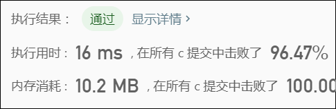

> 原文链接: https://leetcode-cn.com/problems/last-substring-in-lexicographical-order


## 英文原文
<div><p>Given a string <code>s</code>, return <em>the last substring of</em> <code>s</code> <em>in lexicographical order</em>.</p>

<p>&nbsp;</p>
<p><strong>Example 1:</strong></p>

<pre>
<strong>Input:</strong> s = &quot;abab&quot;
<strong>Output:</strong> &quot;bab&quot;
<strong>Explanation:</strong> The substrings are [&quot;a&quot;, &quot;ab&quot;, &quot;aba&quot;, &quot;abab&quot;, &quot;b&quot;, &quot;ba&quot;, &quot;bab&quot;]. The lexicographically maximum substring is &quot;bab&quot;.
</pre>

<p><strong>Example 2:</strong></p>

<pre>
<strong>Input:</strong> s = &quot;leetcode&quot;
<strong>Output:</strong> &quot;tcode&quot;
</pre>

<p>&nbsp;</p>
<p><strong>Constraints:</strong></p>

<ul>
	<li><code>1 &lt;= s.length &lt;= 4 * 10<sup>5</sup></code></li>
	<li><code>s</code> contains only lowercase English letters.</li>
</ul>
</div>

## 中文题目
<div><p>给你一个字符串&nbsp;<code>s</code>，找出它的所有子串并按字典序排列，返回排在最后的那个子串。</p>

<p>&nbsp;</p>

<p><strong>示例 1：</strong></p>

<pre><strong>输入：</strong>&quot;abab&quot;
<strong>输出：</strong>&quot;bab&quot;
<strong>解释：</strong>我们可以找出 7 个子串 [&quot;a&quot;, &quot;ab&quot;, &quot;aba&quot;, &quot;abab&quot;, &quot;b&quot;, &quot;ba&quot;, &quot;bab&quot;]。按字典序排在最后的子串是 &quot;bab&quot;。
</pre>

<p><strong>示例&nbsp;2：</strong></p>

<pre><strong>输入：</strong>&quot;leetcode&quot;
<strong>输出：</strong>&quot;tcode&quot;
</pre>

<p>&nbsp;</p>

<p><strong>提示：</strong></p>

<ol>
	<li><code>1 &lt;= s.length &lt;= 4 * 10^5</code></li>
	<li>s 仅含有小写英文字符。</li>
</ol>
</div>

## 通过代码
<RecoDemo>
</RecoDemo>


## 高赞题解
```
char * lastSubstring(char * s){
    int len = strlen(s);
    int ans = 0;
    for (int i = 1; i < len; i++) {
        if (s[i] <= s[i - 1]) {
            continue;
        }
        if (strcmp(&s[i], &s[ans]) > 0) {
            ans = i;
        }
    }
    return &s[ans];
}
```




## 统计信息
| 通过次数 | 提交次数 | AC比率 |
| :------: | :------: | :------: |
|    6124    |    22888    |   26.8%   |

## 提交历史
| 提交时间 | 提交结果 | 执行时间 |  内存消耗  | 语言 |
| :------: | :------: | :------: | :--------: | :--------: |
