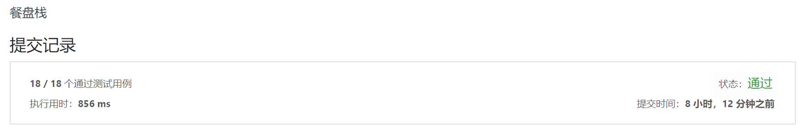

> 原文链接: https://leetcode-cn.com/problems/dinner-plate-stacks


## 英文原文
<div><p>You have an infinite number of stacks arranged in a row and numbered (left to right) from <code>0</code>, each of the stacks has the same maximum capacity.</p>

<p>Implement the <code>DinnerPlates</code> class:</p>

<ul>
	<li><code>DinnerPlates(int capacity)</code> Initializes the object with the maximum capacity of the stacks <code>capacity</code>.</li>
	<li><code>void push(int val)</code> Pushes the given integer <code>val</code> into the leftmost stack with a size less than <code>capacity</code>.</li>
	<li><code>int pop()</code> Returns the value at the top of the rightmost non-empty stack and removes it from that stack, and returns <code>-1</code> if all the stacks are empty.</li>
	<li><code>int popAtStack(int index)</code> Returns the value at the top of the stack with the given index <code>index</code> and removes it from that stack or returns <code>-1</code> if the stack with that given index is empty.</li>
</ul>

<p>&nbsp;</p>
<p><strong>Example 1:</strong></p>

<pre>
<strong>Input</strong>
[&quot;DinnerPlates&quot;, &quot;push&quot;, &quot;push&quot;, &quot;push&quot;, &quot;push&quot;, &quot;push&quot;, &quot;popAtStack&quot;, &quot;push&quot;, &quot;push&quot;, &quot;popAtStack&quot;, &quot;popAtStack&quot;, &quot;pop&quot;, &quot;pop&quot;, &quot;pop&quot;, &quot;pop&quot;, &quot;pop&quot;]
[[2], [1], [2], [3], [4], [5], [0], [20], [21], [0], [2], [], [], [], [], []]
<strong>Output</strong>
[null, null, null, null, null, null, 2, null, null, 20, 21, 5, 4, 3, 1, -1]

<strong>Explanation:</strong> 
DinnerPlates D = DinnerPlates(2);  // Initialize with capacity = 2
D.push(1);
D.push(2);
D.push(3);
D.push(4);
D.push(5);         // The stacks are now:  2  4
                                           1  3  5
                                           ﹈ ﹈ ﹈
D.popAtStack(0);   // Returns 2.  The stacks are now:     4
                                                       1  3  5
                                                       ﹈ ﹈ ﹈
D.push(20);        // The stacks are now: 20  4
                                           1  3  5
                                           ﹈ ﹈ ﹈
D.push(21);        // The stacks are now: 20  4 21
                                           1  3  5
                                           ﹈ ﹈ ﹈
D.popAtStack(0);   // Returns 20.  The stacks are now:     4 21
                                                        1  3  5
                                                        ﹈ ﹈ ﹈
D.popAtStack(2);   // Returns 21.  The stacks are now:     4
                                                        1  3  5
                                                        ﹈ ﹈ ﹈ 
D.pop()            // Returns 5.  The stacks are now:      4
                                                        1  3 
                                                        ﹈ ﹈  
D.pop()            // Returns 4.  The stacks are now:   1  3 
                                                        ﹈ ﹈   
D.pop()            // Returns 3.  The stacks are now:   1 
                                                        ﹈   
D.pop()            // Returns 1.  There are no stacks.
D.pop()            // Returns -1.  There are still no stacks.
</pre>

<p>&nbsp;</p>
<p><strong>Constraints:</strong></p>

<ul>
	<li><code>1 &lt;= capacity &lt;= 2 * 10<sup>4</sup></code></li>
	<li><code>1 &lt;= val &lt;= 2 * 10<sup>4</sup></code></li>
	<li><code>0 &lt;= index &lt;= 10<sup>5</sup></code></li>
	<li>At most <code>2 * 10<sup>5</sup></code> calls will be made to <code>push</code>, <code>pop</code>, and <code>popAtStack</code>.</li>
</ul>
</div>

## 中文题目
<div><p>我们把无限数量 &infin; 的栈排成一行，按从左到右的次序从 0 开始编号。每个栈的的最大容量&nbsp;<code>capacity</code> 都相同。</p>

<p>实现一个叫「餐盘」的类&nbsp;<code>DinnerPlates</code>：</p>

<ul>
	<li><code>DinnerPlates(int capacity)</code>&nbsp;- 给出栈的最大容量&nbsp;<code>capacity</code>。</li>
	<li><code>void push(int val)</code>&nbsp;- 将给出的正整数&nbsp;<code>val</code>&nbsp;推入&nbsp;<strong>从左往右第一个&nbsp;</strong>没有满的栈。</li>
	<li><code>int pop()</code>&nbsp;- 返回&nbsp;<strong>从右往左第一个&nbsp;</strong>非空栈顶部的值，并将其从栈中删除；如果所有的栈都是空的，请返回&nbsp;<code>-1</code>。</li>
	<li><code>int popAtStack(int index)</code>&nbsp;- 返回编号&nbsp;<code>index</code>&nbsp;的栈顶部的值，并将其从栈中删除；如果编号&nbsp;<code>index</code>&nbsp;的栈是空的，请返回 <code>-1</code>。</li>
</ul>

<p>&nbsp;</p>

<p><strong>示例：</strong></p>

<pre><strong>输入： </strong>
[&quot;DinnerPlates&quot;,&quot;push&quot;,&quot;push&quot;,&quot;push&quot;,&quot;push&quot;,&quot;push&quot;,&quot;popAtStack&quot;,&quot;push&quot;,&quot;push&quot;,&quot;popAtStack&quot;,&quot;popAtStack&quot;,&quot;pop&quot;,&quot;pop&quot;,&quot;pop&quot;,&quot;pop&quot;,&quot;pop&quot;]
[[2],[1],[2],[3],[4],[5],[0],[20],[21],[0],[2],[],[],[],[],[]]
<strong>输出：</strong>
[null,null,null,null,null,null,2,null,null,20,21,5,4,3,1,-1]

<strong>解释：</strong>
DinnerPlates D = DinnerPlates(2);  // 初始化，栈最大容量 capacity = 2
D.push(1);
D.push(2);
D.push(3);
D.push(4);
D.push(5);         // 栈的现状为：    2 &nbsp;4
&nbsp;                                   1 &nbsp;3 &nbsp;5
                                    ﹈ ﹈ ﹈
D.popAtStack(0);   // 返回 2。栈的现状为：     &nbsp;4
            &nbsp;                             1 &nbsp;3 &nbsp;5
                                          ﹈ ﹈ ﹈
D.push(20);        // 栈的现状为：  20  4
&nbsp;                                  1 &nbsp;3 &nbsp;5
                                   ﹈ ﹈ ﹈
D.push(21);        // 栈的现状为：  20  4 21
&nbsp;                                  1 &nbsp;3 &nbsp;5
                                   ﹈ ﹈ ﹈
D.popAtStack(0);   // 返回 20。栈的现状为：       4 21
             &nbsp;                              1 &nbsp;3 &nbsp;5
                                            ﹈ ﹈ ﹈
D.popAtStack(2);   // 返回 21。栈的现状为：       4
             &nbsp;                              1 &nbsp;3 &nbsp;5
                                            ﹈ ﹈ ﹈ 
D.pop()            // 返回 5。栈的现状为：        4
             &nbsp;                              1 &nbsp;3 
                                            ﹈ ﹈  
D.pop()            // 返回 4。栈的现状为：    1  3 
                                           ﹈ ﹈   
D.pop()            // 返回 3。栈的现状为：    1 
                                           ﹈   
D.pop()            // 返回 1。现在没有栈。
D.pop()            // 返回 -1。仍然没有栈。
</pre>

<p>&nbsp;</p>

<p><strong>提示：</strong></p>

<ul>
	<li><code>1 &lt;= capacity&nbsp;&lt;= 20000</code></li>
	<li><code>1 &lt;= val&nbsp;&lt;= 20000</code></li>
	<li><code>0 &lt;= index&nbsp;&lt;= 100000</code></li>
	<li>最多会对&nbsp;<code>push</code>，<code>pop</code>，和&nbsp;<code>popAtStack</code>&nbsp;进行 <code>200000</code> 次调用。</li>
</ul>
</div>

## 通过代码
<RecoDemo>
</RecoDemo>


## 高赞题解
由题目大意可知，题目的本质就是让我们快速找到 `从右往左第一个不是空的栈` 与 `从左往右第一个非满栈` 。

如果我们用树状数组 $tree$ 维护一个序列 $num$（支持Log复杂度单点修改/区间查询），第 $i$ 个位置维护的是第 $i$ 个栈中的元素个数，那么这两个问题我们都可以快速得到。（为了方便树状数组中的操作，将栈编号变为 1-Based）

1. 从右往左第一个不是空的栈
我们可以很容易的使用一个变量跟踪餐盘栈中当前元素个数 $siz$，那么原问题等于我们要找到一个最小的 k，满足 $\sum_{i=1}^k num[i] = siz$。那么这个 $k$ 就是从右往左第一个非空的栈。
找最小的 $k$ 这个问题可以使用倍增解决，因为如果有一个 $k^1>k$ ，那么一定有 $\sum_{i=1}^{k^1} num[i] = siz$。所以，我们可以从高到低枚举 $k-1$ 的二进制位(因为 $k$ 是最小的，所以 $k-1$ 一定不满足上述条件)，看看这一位上 $1$ 之后，是否能让 $k-1$ 满足条件，若满足就不上否则上。求出来 $k-1$ 之后，再加一就是 $k$ 了。

2. 从左往右第一个非满栈
这个问题与之前的相似，我们的目标是找到一个最大的 $k$，使其满足 $k*capacity = \sum_{i=1}^k num[i]$。那么，$k+1$ 就是从左往右第一个没有满的栈。类似的也可以使用倍增解决。

说到这里，这个问题已经被解决了，我们的总时间复杂度就是 $O(n log^2 n)$ 的。

但是还有进一步优化的空间，我们知道树状数组 $tree[k]=\sum_{i=k-lowbit(k)+1}^k num[i]$，也就是说如果我们知道了 $\sum_{i=1}^k num[i] = A$ 且 $(1<<j)<lowbit(k)$，那么 $\sum_{i=1}^{k+(1<<j)} = A + tree[k+(1<<j)]$。
倍增的时候枚举二进制位的时候，恰巧我们也是从大到小枚举的，满足 j 与 k 的限制。
如此一来，在倍增的时候，我们就可以将一次树状数组上 $Log$ 复杂的的查询，替换成一次简单的加法。

至此，问题的时间复杂度就降低为 $O(n log n)$。




```
namespace BitTree{
    const int MAXN=200000;
    int sum[MAXN+5];
    
    inline void init(){ memset(sum, 0, sizeof(sum)); }
    
    inline int lowbit(int x){ return x&-x; }

    inline void add(int x, int v){ 
        for (int i=x; i<=MAXN; i+=lowbit(i)) sum[i]+=v; 
    }

    inline int get(int x){
        int ret=0;
        for (int i=x; i; i-=lowbit(i)) ret+=sum[i];
        return ret;
    }
}

const int MAXN=200000;
static stack<int> stk[MAXN+5];

class DinnerPlates {
public:
    int cap, siz;
    
    DinnerPlates(int capacity) {
        BitTree::init();
        cap=capacity, siz=0;
        for (int i=0; i<=MAXN; i++) while(!stk[i].empty()) stk[i].pop();
    }
    
    int getFree(){
        int rate=0, ans=0;
        for (int i=14; i>=0; i--){
            if (ans+(1<<i) > MAXN) continue;
            if (rate+BitTree::sum[ans+(1<<i)] == 1LL*cap*(ans+(1<<i))) rate+=BitTree::sum[ans+=(1<<i)];
        }
        return ans+1;
    }
    
    int getRight(int c){
        int rate=0, ans=0;
        for (int i=14; i>=0; i--){
            if (ans+(1<<i) > MAXN) continue;
            if (rate+BitTree::sum[ans+(1<<i)] < c) rate+=BitTree::sum[ans+=(1<<i)];
        }
        return ans+1;
    }
    
    
    void push(int val) {
        int p=getFree();
        
        stk[p].push(val);
        ++siz;
        BitTree::add(p, 1);
    }
    
    int pop() {
        if (siz==0) return -1;
        
        int p=getRight(siz);
        int r=stk[p].top(); 
        
        stk[p].pop();
        --siz;
        BitTree::add(p, -1);
        
        return r;
    }
    
    int popAtStack(int index) {
        if (stk[index+1].empty()) return -1;
        
        int r=stk[index+1].top(); 
        
        stk[index+1].pop();
        --siz;
        BitTree::add(index+1, -1);
        
        return r;
    }
};
```


## 统计信息
| 通过次数 | 提交次数 | AC比率 |
| :------: | :------: | :------: |
|    2565    |    9685    |   26.5%   |

## 提交历史
| 提交时间 | 提交结果 | 执行时间 |  内存消耗  | 语言 |
| :------: | :------: | :------: | :--------: | :--------: |
