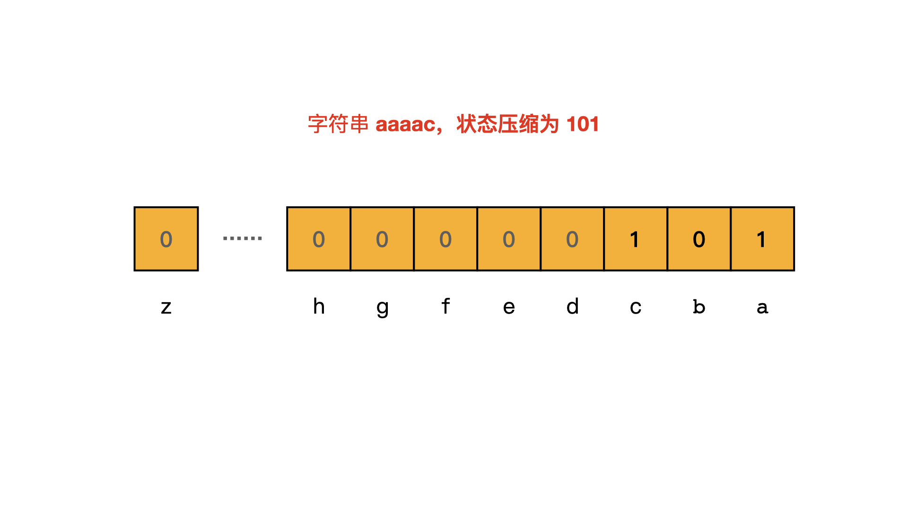

> 原文链接: https://leetcode-cn.com/problems/number-of-valid-words-for-each-puzzle


## 英文原文
<div>With respect to a given <code>puzzle</code> string, a <code>word</code> is <em>valid</em> if both the following conditions are satisfied:
<ul>
	<li><code>word</code> contains the first letter of <code>puzzle</code>.</li>
	<li>For each letter in <code>word</code>, that letter is in <code>puzzle</code>.
	<ul>
		<li>For example, if the puzzle is <code>&quot;abcdefg&quot;</code>, then valid words are <code>&quot;faced&quot;</code>, <code>&quot;cabbage&quot;</code>, and <code>&quot;baggage&quot;</code>, while</li>
		<li>invalid words are <code>&quot;beefed&quot;</code> (does not include <code>&#39;a&#39;</code>) and <code>&quot;based&quot;</code> (includes <code>&#39;s&#39;</code> which is not in the puzzle).</li>
	</ul>
	</li>
</ul>
Return <em>an array </em><code>answer</code><em>, where </em><code>answer[i]</code><em> is the number of words in the given word list </em><code>words</code><em> that is valid with respect to the puzzle </em><code>puzzles[i]</code>.
<p>&nbsp;</p>
<p><strong>Example 1:</strong></p>

<pre>
<strong>Input:</strong> words = [&quot;aaaa&quot;,&quot;asas&quot;,&quot;able&quot;,&quot;ability&quot;,&quot;actt&quot;,&quot;actor&quot;,&quot;access&quot;], puzzles = [&quot;aboveyz&quot;,&quot;abrodyz&quot;,&quot;abslute&quot;,&quot;absoryz&quot;,&quot;actresz&quot;,&quot;gaswxyz&quot;]
<strong>Output:</strong> [1,1,3,2,4,0]
<strong>Explanation:</strong> 
1 valid word for &quot;aboveyz&quot; : &quot;aaaa&quot; 
1 valid word for &quot;abrodyz&quot; : &quot;aaaa&quot;
3 valid words for &quot;abslute&quot; : &quot;aaaa&quot;, &quot;asas&quot;, &quot;able&quot;
2 valid words for &quot;absoryz&quot; : &quot;aaaa&quot;, &quot;asas&quot;
4 valid words for &quot;actresz&quot; : &quot;aaaa&quot;, &quot;asas&quot;, &quot;actt&quot;, &quot;access&quot;
There are no valid words for &quot;gaswxyz&quot; cause none of the words in the list contains letter &#39;g&#39;.
</pre>

<p><strong>Example 2:</strong></p>

<pre>
<strong>Input:</strong> words = [&quot;apple&quot;,&quot;pleas&quot;,&quot;please&quot;], puzzles = [&quot;aelwxyz&quot;,&quot;aelpxyz&quot;,&quot;aelpsxy&quot;,&quot;saelpxy&quot;,&quot;xaelpsy&quot;]
<strong>Output:</strong> [0,1,3,2,0]
</pre>

<p>&nbsp;</p>
<p><strong>Constraints:</strong></p>

<ul>
	<li><code>1 &lt;= words.length &lt;= 10<sup>5</sup></code></li>
	<li><code>4 &lt;= words[i].length &lt;= 50</code></li>
	<li><code>1 &lt;= puzzles.length &lt;= 10<sup>4</sup></code></li>
	<li><code>puzzles[i].length == 7</code></li>
	<li><code>words[i]</code> and <code>puzzles[i]</code> consist of lowercase English letters.</li>
	<li>Each <code>puzzles[i] </code>does not contain repeated characters.</li>
</ul>
</div>

## 中文题目
<div><p>外国友人仿照中国字谜设计了一个英文版猜字谜小游戏，请你来猜猜看吧。</p>

<p>字谜的迷面 <code>puzzle</code> 按字符串形式给出，如果一个单词 <code>word</code> 符合下面两个条件，那么它就可以算作谜底：</p>

<ul>
	<li>单词 <code>word</code> 中包含谜面 <code>puzzle</code> 的第一个字母。</li>
	<li>单词 <code>word</code> 中的每一个字母都可以在谜面 <code>puzzle</code> 中找到。<br />
	例如，如果字谜的谜面是 "abcdefg"，那么可以作为谜底的单词有 "faced", "cabbage", 和 "baggage"；而 "beefed"（不含字母 "a"）以及 "based"（其中的 "s" 没有出现在谜面中）都不能作为谜底。</li>
</ul>

<p>返回一个答案数组 <code>answer</code>，数组中的每个元素 <code>answer[i]</code> 是在给出的单词列表 <code>words</code> 中可以作为字谜迷面 <code>puzzles[i]</code> 所对应的谜底的单词数目。</p>

<p> </p>

<p><strong>示例：</strong></p>

<pre>
<strong>输入：</strong>
words = ["aaaa","asas","able","ability","actt","actor","access"], 
puzzles = ["aboveyz","abrodyz","abslute","absoryz","actresz","gaswxyz"]
<strong>输出：</strong>[1,1,3,2,4,0]
<strong>解释：</strong>
1 个单词可以作为 "aboveyz" 的谜底 : "aaaa" 
1 个单词可以作为 "abrodyz" 的谜底 : "aaaa"
3 个单词可以作为 "abslute" 的谜底 : "aaaa", "asas", "able"
2 个单词可以作为 "absoryz" 的谜底 : "aaaa", "asas"
4 个单词可以作为 "actresz" 的谜底 : "aaaa", "asas", "actt", "access"
没有单词可以作为 "gaswxyz" 的谜底，因为列表中的单词都不含字母 'g'。
</pre>

<p> </p>

<p><strong>提示：</strong></p>

<ul>
	<li><code>1 <= words.length <= 10^5</code></li>
	<li><code>4 <= words[i].length <= 50</code></li>
	<li><code>1 <= puzzles.length <= 10^4</code></li>
	<li><code>puzzles[i].length == 7</code></li>
	<li><code>words[i][j]</code>, <code>puzzles[i][j]</code> 都是小写英文字母。</li>
	<li>每个 <code>puzzles[i]</code> 所包含的字符都不重复。</li>
</ul>
</div>

## 通过代码
<RecoDemo>
</RecoDemo>


## 高赞题解
各位题友大家好！ 今天是 **[@负雪明烛](/u/fuxuemingzhu/)** 坚持日更的第 **33** 天。今天力扣上的每日一题是「[1178. 猜字谜](https://leetcode-cn.com/problems/number-of-valid-words-for-each-puzzle/)」。

# 解题思路


本文的两个重点：

- **把每个字符串用二进制数字表示（状态压缩）**
- **寻找所有子集（subset）**


大家好，今天的题虽然是 Hard，但是大家不要怕，本题解把难度降为了 Medium，肯定让你看懂。


首先让所有 `words` 和 `puzzle` 两两匹配肯定是不行的，时间复杂度到了 $O(M * N) = 10 ^ 9$，会超时。


一个简单的思路是，对于每个 `puzzle` 没有必要遍历所以 `words`，只用找符合条件的 `words` 出现了多少次就行了。这就是很多题解的思路：状态压缩。


题目给出了两个条件：


- 单词 `word` 中包含谜面 `puzzle` 的第一个字母。
- 单词 `word` 中的每一个字母都可以在谜面 `puzzle` 中找到。


## 第一步：状态压缩

注意题目的第二个条件只要求能找到（出现一次即可），对出现次数没要求。为了解决这个问题，我们可以使用二进制数字来表每个 `word` 和 `puzzle`，该二进制数字就是 `word` 和 `puzzle` 的特征。这道题只包含 26 个小写字母，可以压缩到一个 int 中。int 中的每一位取`0`和`1`表示字符是否出现过。比如 "aabb" 可以用 11 表示，"accc" 可以用 101 表示。


可以看出不同的单词可能映射成同一个数字，比如 "aabbb" 和 "ab" 都映射成了 11。这就是状态压缩。




把每个 word 都做状态压缩，并用 hashmap 保存每个二进制数字出现的次数。


## 第二步：匹配

根据题目的两个条件，`puzzle` 的第一个字符必须跟 `word` 的第一个字符相同；`word` 中每一个字符都要在 `puzzle` 中找到，**所以要找的是 `word` 状态压缩后的数字 和  `puzzle[0] + subset(puzzle[1:N - 1])` 状态压缩后的数字相等。**


很多题解都在讨论二进制表示下的 subset 怎么求，我觉得都不好理解，直接做一下「[78. 子集](https://leetcode-cn.com/problems/subsets/)」不就得了？暴力求出`puzzle[1:N - 1]`的所有子集，然后计算 `puzzle[0] + subset(puzzle[1:N - 1])` 对应的状态。

题目说了 puzzle 的长度为 7 位，`subset(puzzle[1:N - 1])` 的是时间复杂度为 $O(2 ^ N)$ = $2 ^ 6 = 64$ 次计算，比较快。 

求出`puzzle[0] + subset(puzzle[1:N - 1])` 对应的二进制数字之后，累加 hashmap 中该二进制数字出现的次数，就是该 puzzle 对应的 word 有多少。

# 代码


Python 代码如下，直接用了 78 题的求 subset 代码。


```python
class Solution:
    def findNumOfValidWords(self, words: List[str], puzzles: List[str]) -> List[int]:
        freq = collections.Counter()
        for word in words:
            mask = 0
            for c in word:
                mask |= 1 << (ord(c) - ord('a'))
            freq[mask] += 1
        res = []
        for puzzle in puzzles:
            total = 0
            for perm in self.subsets(puzzle[1:]):
                mask = 1 << (ord(puzzle[0]) - ord('a'))
                for c in perm:
                    mask |= 1 << (ord(c) - ord('a'))
                total += freq[mask]
            res.append(total)
        return res
    
    def subsets(self, words: List[int]) -> List[List[int]]:
        res = [""]
        for i in words:
            res = res + [i + word for word in res]
        return res
```


- 时间复杂度：$O(M + N)$。
- 空间复杂度：$O(M)$。

# 刷题心得


不畏浮云遮望眼，透过现象看本质。


-----


OK，以上就是 [@负雪明烛](https://leetcode-cn.com/u/fuxuemingzhu/) 写的今天题解的全部内容了，如果你觉得有帮助的话，**求赞、求关注、求收藏**。如果有疑问的话，请在下面评论，我会及时解答。


**关注我**，你将不会错过我的精彩动画题解、面试题分享、组队刷题活动，进入主页 [@负雪明烛](https://leetcode-cn.com/u/fuxuemingzhu/) 右侧有刷题组织，从此刷题不再孤单。

欢迎关注我的公众号：[每日算法题](https://img-blog.csdnimg.cn/20210220185516778.png?x-oss-process=image/watermark,type_ZmFuZ3poZW5naGVpdGk,shadow_10,text_aHR0cHM6Ly9ibG9nLmNzZG4ubmV0L2Z1eHVlbWluZ3podQ==,size_16,color_FFFFFF,t_70)

祝大家牛年大吉！AC 多多，Offer 多多！我们明天再见！

## 统计信息
| 通过次数 | 提交次数 | AC比率 |
| :------: | :------: | :------: |
|    18800    |    40655    |   46.2%   |

## 提交历史
| 提交时间 | 提交结果 | 执行时间 |  内存消耗  | 语言 |
| :------: | :------: | :------: | :--------: | :--------: |
