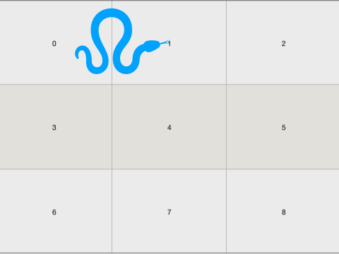
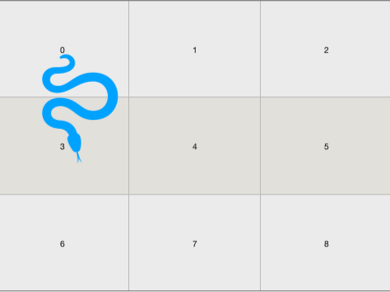

> 原文链接: https://leetcode-cn.com/problems/minimum-moves-to-reach-target-with-rotations


## 英文原文
<div><p>In an&nbsp;<code>n*n</code>&nbsp;grid, there is a snake that spans 2 cells and starts moving from the top left corner at <code>(0, 0)</code> and <code>(0, 1)</code>. The grid has empty cells represented by zeros and blocked cells represented by ones. The snake wants to reach the lower right corner at&nbsp;<code>(n-1, n-2)</code>&nbsp;and&nbsp;<code>(n-1, n-1)</code>.</p>

<p>In one move the snake can:</p>

<ul>
	<li>Move one cell to the right&nbsp;if there are no blocked cells there. This move keeps the horizontal/vertical position of the snake as it is.</li>
	<li>Move down one cell&nbsp;if there are no blocked cells there. This move keeps the horizontal/vertical position of the snake as it is.</li>
	<li>Rotate clockwise if it&#39;s in a horizontal position and the two cells under it are both empty. In that case the snake moves from&nbsp;<code>(r, c)</code>&nbsp;and&nbsp;<code>(r, c+1)</code>&nbsp;to&nbsp;<code>(r, c)</code>&nbsp;and&nbsp;<code>(r+1, c)</code>.<br />
	</li>
	<li>Rotate counterclockwise&nbsp;if it&#39;s in a vertical position and the two cells to its right are both empty. In that case the snake moves from&nbsp;<code>(r, c)</code>&nbsp;and&nbsp;<code>(r+1, c)</code>&nbsp;to&nbsp;<code>(r, c)</code>&nbsp;and&nbsp;<code>(r, c+1)</code>.<br />
	</li>
</ul>

<p>Return the minimum number of moves to reach the target.</p>

<p>If there is no way to reach the target, return&nbsp;<code>-1</code>.</p>

<p>&nbsp;</p>
<p><strong>Example 1:</strong></p>

<p><strong></strong></p>

<pre>
<strong>Input:</strong> grid = [[0,0,0,0,0,1],
               [1,1,0,0,1,0],
&nbsp;              [0,0,0,0,1,1],
&nbsp;              [0,0,1,0,1,0],
&nbsp;              [0,1,1,0,0,0],
&nbsp;              [0,1,1,0,0,0]]
<strong>Output:</strong> 11
<strong>Explanation:
</strong>One possible solution is [right, right, rotate clockwise, right, down, down, down, down, rotate counterclockwise, right, down].
</pre>

<p><strong>Example 2:</strong></p>

<pre>
<strong>Input:</strong> grid = [[0,0,1,1,1,1],
&nbsp;              [0,0,0,0,1,1],
&nbsp;              [1,1,0,0,0,1],
&nbsp;              [1,1,1,0,0,1],
&nbsp;              [1,1,1,0,0,1],
&nbsp;              [1,1,1,0,0,0]]
<strong>Output:</strong> 9
</pre>

<p>&nbsp;</p>
<p><strong>Constraints:</strong></p>

<ul>
	<li><code>2 &lt;= n &lt;= 100</code></li>
	<li><code>0 &lt;= grid[i][j] &lt;= 1</code></li>
	<li>It is guaranteed that the snake starts at empty cells.</li>
</ul>
</div>

## 中文题目
<div><p>你还记得那条风靡全球的贪吃蛇吗？</p>

<p>我们在一个&nbsp;<code>n*n</code>&nbsp;的网格上构建了新的迷宫地图，蛇的长度为 2，也就是说它会占去两个单元格。蛇会从左上角（<code>(0, 0)</code>&nbsp;和&nbsp;<code>(0, 1)</code>）开始移动。我们用 <code>0</code> 表示空单元格，用 1 表示障碍物。蛇需要移动到迷宫的右下角（<code>(n-1, n-2)</code>&nbsp;和&nbsp;<code>(n-1, n-1)</code>）。</p>

<p>每次移动，蛇可以这样走：</p>

<ul>
	<li>如果没有障碍，则向右移动一个单元格。并仍然保持身体的水平／竖直状态。</li>
	<li>如果没有障碍，则向下移动一个单元格。并仍然保持身体的水平／竖直状态。</li>
	<li>如果它处于水平状态并且其下面的两个单元都是空的，就顺时针旋转 90 度。蛇从（<code>(r, c)</code>、<code>(r, c+1)</code>）移动到 （<code>(r, c)</code>、<code>(r+1, c)</code>）。<br>
	</li>
	<li>如果它处于竖直状态并且其右面的两个单元都是空的，就逆时针旋转 90 度。蛇从（<code>(r, c)</code>、<code>(r+1, c)</code>）移动到（<code>(r, c)</code>、<code>(r, c+1)</code>）。<br>
	</li>
</ul>

<p>返回蛇抵达目的地所需的最少移动次数。</p>

<p>如果无法到达目的地，请返回&nbsp;<code>-1</code>。</p>

<p>&nbsp;</p>

<p><strong>示例 1：</strong></p>

<p><strong></strong></p>

<pre><strong>输入：</strong>grid = [[0,0,0,0,0,1],
               [1,1,0,0,1,0],
&nbsp;              [0,0,0,0,1,1],
&nbsp;              [0,0,1,0,1,0],
&nbsp;              [0,1,1,0,0,0],
&nbsp;              [0,1,1,0,0,0]]
<strong>输出：</strong>11
<strong>解释：
</strong>一种可能的解决方案是 [右, 右, 顺时针旋转, 右, 下, 下, 下, 下, 逆时针旋转, 右, 下]。
</pre>

<p><strong>示例 2：</strong></p>

<pre><strong>输入：</strong>grid = [[0,0,1,1,1,1],
&nbsp;              [0,0,0,0,1,1],
&nbsp;              [1,1,0,0,0,1],
&nbsp;              [1,1,1,0,0,1],
&nbsp;              [1,1,1,0,0,1],
&nbsp;              [1,1,1,0,0,0]]
<strong>输出：</strong>9
</pre>

<p>&nbsp;</p>

<p><strong>提示：</strong></p>

<ul>
	<li><code>2 &lt;= n &lt;= 100</code></li>
	<li><code>0 &lt;= grid[i][j] &lt;= 1</code></li>
	<li>蛇保证从空单元格开始出发。</li>
</ul>
</div>

## 通过代码
<RecoDemo>
</RecoDemo>


## 高赞题解
#### 解题思路：
看到最短路径，首先想到的就是 BFS，BFS 不行再考虑 DP。

那么我们先考虑 BFS，很显然，我们只要把蛇每次走位的坐标存到队列中，先进先出（FIFO），只要和目标坐标相等，即可返回。
我在这里没有存每个点的横坐标和纵坐标。通过一个值去计算两个坐标 比如当前值为 8（表的大小为 `m*n`）， 横坐标 = `8%n`, 纵坐标 = `8/n`，假设当前位置是 `(x1, x2)`

那么蛇都有哪几种走位呢：
1. **如果没有障碍，则向右移动一个单元格。并仍然保持身体的水平／竖直状态**
因为题目说了仍然保持身体的水平/竖直状态，所以蛇在竖直状态也是可以向右平移
{:width=300}  {:width=300}
我们不用刻意去考虑这两种状态 只需要检查`(x1 + 1)`和`(x2 + 1)`是否有障碍物
2. **如果没有障碍，则向下移动一个单元格。并仍然保持身体的水平／竖直状态**
水平和竖直状态都是可以向下移动
{:width=300} {:width=300}
这里也不用刻意去考虑这两种状态 只需要检查`（x1 + n)`和`（x2 + n）`是否有障碍物
3. **如果它处于水平状态并且其下面的两个单元都是空的，就顺时针旋转 90 度**
这里只有水平状态才可以移动
{:width=300}
通过图可以发现这种状态是检查`（x1 + n）`和`（x2 + n）`是否有障碍物，可以归到第 2 种状态中

4. **如果它处于竖直状态并且其右面的两个单元都是空的，就逆时针旋转 90 度**
{:width=300}
通过图可以发现这种状态是检查`（x1 + 1）`和`（x2 + 1）`是否有障碍物，可以归到第1种状态中


通过分析，我们只需要检查两种状态
1. 如果`（x1 + 1)` 和 `（x2 + 1)` 没有障碍物，向右平移，如果是竖直状态，还可以旋转
2. 如果`（x1 + n)` 和 `（x2 + n)` 没有障碍物，向下平移，如果是水平状态，还可以旋转

然后就是基本的 BFS 了，符合条件且没有访问过，加入到队列中，步数 +1，一直循环直到到达目的地或者队列为空。
#### 代码：
```go [-Go]
func minimumMoves(grid [][]int) int {
	m, n := len(grid), len(grid[0])
	visited := map[[2]int]bool{}
	targetX, targetY := m*n-2, m*n-1
	stack := [100000][3]int{}
	start, end := 0, 0
	stack[start] = [3]int{0, 1, 0}

	check := func(x, y, step int) bool {
		if x == targetX && y == targetY {
			return true
		}
		if visited[[2]int{x, y}] {
			return false
		}
		visited[[2]int{x, y}] = true
		end++
		stack[end] = [3]int{x, y, step + 1}
		return false
	}

	for start <= end {
		a, b, step := stack[start][0], stack[start][1], stack[start][2]
		start++
		x0, y0 := a/n, a%n
		x1, y1 := b/n, b%n
		// 向右
		if y0+1 < n && grid[x0][y0+1] == 0 && y1+1 < n && grid[x1][y1+1] == 0 {
			if check(n*x0+y0+1, n*x1+y1+1, step) {
				return step + 1
			}

			if y0 == y1 { // 竖直状态
				if check(a, n*x0+y0+1, step) {
					return step + 1
				}
			}
		}

		// 向下
		if x0+1 < m && grid[x0+1][y0] == 0 && x1+1 < m && grid[x1+1][y1] == 0 {
			if check(n*x0+y0+n, n*x1+y1+n, step) {
				return step + 1
			}

			if x0 == x1 { // 水平状态
				if check(a, n*x0+y0+n, step) {
					return step + 1
				}
			}
		}
	}
	return -1
}

```


## 统计信息
| 通过次数 | 提交次数 | AC比率 |
| :------: | :------: | :------: |
|    2721    |    6027    |   45.1%   |

## 提交历史
| 提交时间 | 提交结果 | 执行时间 |  内存消耗  | 语言 |
| :------: | :------: | :------: | :--------: | :--------: |
