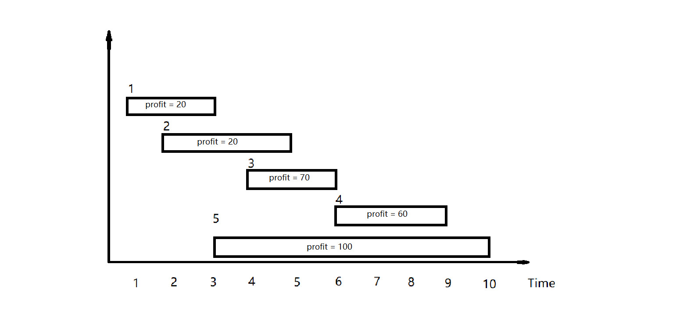

> 原文链接: https://leetcode-cn.com/problems/maximum-profit-in-job-scheduling


## 英文原文
<div><p>We have <code>n</code> jobs, where every job is scheduled to be done from <code>startTime[i]</code> to <code>endTime[i]</code>, obtaining a profit of <code>profit[i]</code>.</p>

<p>You&#39;re given the <code>startTime</code>, <code>endTime</code> and <code>profit</code> arrays, return the maximum profit you can take such that there are no two jobs in the subset with overlapping time range.</p>

<p>If you choose a job that ends at time <code>X</code> you will be able to start another job that starts at time <code>X</code>.</p>

<p>&nbsp;</p>
<p><strong>Example 1:</strong></p>

<p><strong></strong></p>

<pre>
<strong>Input:</strong> startTime = [1,2,3,3], endTime = [3,4,5,6], profit = [50,10,40,70]
<strong>Output:</strong> 120
<strong>Explanation:</strong> The subset chosen is the first and fourth job. 
Time range [1-3]+[3-6] , we get profit of 120 = 50 + 70.
</pre>

<p><strong>Example 2:</strong></p>

<p><strong> </strong></p>

<pre>
<strong>Input:</strong> startTime = [1,2,3,4,6], endTime = [3,5,10,6,9], profit = [20,20,100,70,60]
<strong>Output:</strong> 150
<strong>Explanation:</strong> The subset chosen is the first, fourth and fifth job. 
Profit obtained 150 = 20 + 70 + 60.
</pre>

<p><strong>Example 3:</strong></p>

<p><strong></strong></p>

<pre>
<strong>Input:</strong> startTime = [1,1,1], endTime = [2,3,4], profit = [5,6,4]
<strong>Output:</strong> 6
</pre>

<p>&nbsp;</p>
<p><strong>Constraints:</strong></p>

<ul>
	<li><code>1 &lt;= startTime.length == endTime.length == profit.length &lt;= 5 * 10<sup>4</sup></code></li>
	<li><code>1 &lt;= startTime[i] &lt; endTime[i] &lt;= 10<sup>9</sup></code></li>
	<li><code>1 &lt;= profit[i] &lt;= 10<sup>4</sup></code></li>
</ul>
</div>

## 中文题目
<div><p>你打算利用空闲时间来做兼职工作赚些零花钱。</p>

<p>这里有&nbsp;<code>n</code>&nbsp;份兼职工作，每份工作预计从&nbsp;<code>startTime[i]</code>&nbsp;开始到&nbsp;<code>endTime[i]</code>&nbsp;结束，报酬为&nbsp;<code>profit[i]</code>。</p>

<p>给你一份兼职工作表，包含开始时间&nbsp;<code>startTime</code>，结束时间&nbsp;<code>endTime</code>&nbsp;和预计报酬&nbsp;<code>profit</code>&nbsp;三个数组，请你计算并返回可以获得的最大报酬。</p>

<p>注意，时间上出现重叠的 2 份工作不能同时进行。</p>

<p>如果你选择的工作在时间&nbsp;<code>X</code>&nbsp;结束，那么你可以立刻进行在时间&nbsp;<code>X</code>&nbsp;开始的下一份工作。</p>

<p>&nbsp;</p>

<p><strong>示例 1：</strong></p>

<p><strong></strong></p>

<pre><strong>输入：</strong>startTime = [1,2,3,3], endTime = [3,4,5,6], profit = [50,10,40,70]
<strong>输出：</strong>120
<strong>解释：
</strong>我们选出第 1 份和第 4 份工作， 
时间范围是 [1-3]+[3-6]，共获得报酬 120 = 50 + 70。
</pre>

<p><strong>示例 2：</strong></p>

<p><strong> </strong></p>

<pre><strong>输入：</strong>startTime = [1,2,3,4,6], endTime = [3,5,10,6,9], profit = [20,20,100,70,60]
<strong>输出：</strong>150
<strong>解释：
</strong>我们选择第 1，4，5 份工作。 
共获得报酬 150 = 20 + 70 + 60。
</pre>

<p><strong>示例 3：</strong></p>

<p><strong></strong></p>

<pre><strong>输入：</strong>startTime = [1,1,1], endTime = [2,3,4], profit = [5,6,4]
<strong>输出：</strong>6
</pre>

<p>&nbsp;</p>

<p><strong>提示：</strong></p>

<ul>
	<li><code>1 &lt;= startTime.length == endTime.length ==&nbsp;profit.length&nbsp;&lt;= 5 * 10^4</code></li>
	<li><code>1 &lt;=&nbsp;startTime[i] &lt;&nbsp;endTime[i] &lt;= 10^9</code></li>
	<li><code>1 &lt;=&nbsp;profit[i] &lt;= 10^4</code></li>
</ul>
</div>

## 通过代码
<RecoDemo>
</RecoDemo>


## 高赞题解
我们把示例2拿出来重新按工作的结束时间排序，如图所示：
具体来说：
我们使用一个`dp`数组，`dp[i]`表示做包括`i`号工作之前的所有工作能取得的最大收益
　再使用一个`prev`数组，`prev[i`]表示`i`号工作之前最近能做的工作
0号工作之前没有能做的工作了，所以`prev[0]=0;`
1号工作之前没有能做的工作了，所以`prev[1]=0;`
2号工作之前没有能做的工作了，所以`prev[2]=0;`
3号工作之前最近能做的工作是1，所以`prev[3]=1;`
4号工作之前最近能做的工作是3，所以`prev[4]=3;`
5号工作之前最近能做的工作是1，所以`prev[5]=1;`

对于每个兼职工作，都有做与不做两种状态：
一.假如我们做`1`号工作，能够获得`20`元，加上在`1`号工作之前最近能做的`0`号工作(虚拟的工作，收益也是`0`)的最大收益`0`元；如果不做`1`号工作，能够获得收益是`0`，于是做包括`1`号工作之前的所有工作能取的最大收益就是两中情况的最大值`20`。
二.假如我们做`5`号工作，能够获得收益是`100`，加上在`5`号工作之前最近能做的`prev[5]=1`号工作的最大收益`dp[1]`；如果不做`5`号工作，能够获得收益就是做剩余`4`个工作最大收益`dp[4]`，于是做包括`5`号工作之前的所有工作能取的最大收益就是两中情况的最大值=`max(dp[1]+profit[5],dp[4])`。

所以状态转移方程就是
```
dp[i]=max(dp[i-1],dp[prev[i]]+profit[i])
```
具体到题目中来说，由于题目的输入导致一些不同，我们可以开一个二维数组`vector<vector<int>>job;`把开始时间、结束时间和收益拷贝过来，再把这个二维数组排成如图所示的顺序，但是这样效率不高，因为拷贝也是要花时间的，一个比较好的办法直接对下标排序获得如图所示的顺序。

prev数组的获得是直接向前遍历，找第一个结束时间小于等于当前工作开始时间的工作，感觉这里应该还是有优化的空间的。

由于加入了一个虚拟的0号工作，所以下标还有些变化，具体看代码。这个工作到底有没么必要加呢，如果你有解决方案请告诉我。
```
class Solution {
public:
    int jobScheduling(vector<int>& startTime, vector<int>& endTime, vector<int>& profit) {
        int n = startTime.size();
        vector<int>job(n+1);
        iota(job.begin(), job.end(), 0);
        sort(job.begin()+1, job.end(), [&](int& a, int& b) {return endTime[a-1]< endTime[b-1]; });
        vector<int>prev(n + 1);
        for (int i = 1; i <= n; i++)
            for (int j = i - 1; j >= 1; j--)
                if (endTime[job[j]-1] <=startTime[ job[i]-1])
                {
                    prev[i] = j;
                    break;
                }
        vector<int>dp(n + 1);
        dp[1] = profit[job[1]-1];
        for (int i = 1; i <= n; i++)
            dp[i] = max(dp[i - 1], profit[job[i]-1] + dp[prev[i]]);
        return dp[n];
    }
};
```


## 统计信息
| 通过次数 | 提交次数 | AC比率 |
| :------: | :------: | :------: |
|    6933    |    14816    |   46.8%   |

## 提交历史
| 提交时间 | 提交结果 | 执行时间 |  内存消耗  | 语言 |
| :------: | :------: | :------: | :--------: | :--------: |
