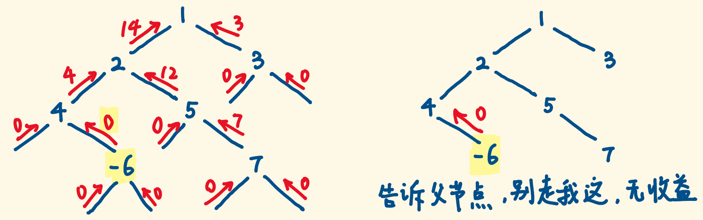
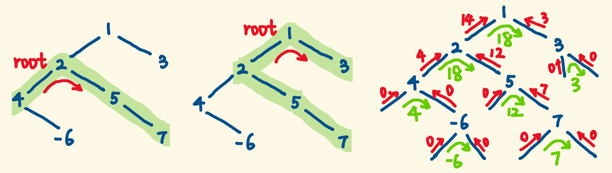

> 原文链接: https://leetcode-cn.com/problems/binary-tree-maximum-path-sum


## 英文原文
<div><p>A <strong>path</strong> in a binary tree is a sequence of nodes where each pair of adjacent nodes in the sequence has an edge connecting them. A node can only appear in the sequence <strong>at most once</strong>. Note that the path does not need to pass through the root.</p>

<p>The <strong>path sum</strong> of a path is the sum of the node&#39;s values in the path.</p>

<p>Given the <code>root</code> of a binary tree, return <em>the maximum <strong>path sum</strong> of any <strong>non-empty</strong> path</em>.</p>

<p>&nbsp;</p>
<p><strong>Example 1:</strong></p>

<pre>
<strong>Input:</strong> root = [1,2,3]
<strong>Output:</strong> 6
<strong>Explanation:</strong> The optimal path is 2 -&gt; 1 -&gt; 3 with a path sum of 2 + 1 + 3 = 6.
</pre>

<p><strong>Example 2:</strong></p>

<pre>
<strong>Input:</strong> root = [-10,9,20,null,null,15,7]
<strong>Output:</strong> 42
<strong>Explanation:</strong> The optimal path is 15 -&gt; 20 -&gt; 7 with a path sum of 15 + 20 + 7 = 42.
</pre>

<p>&nbsp;</p>
<p><strong>Constraints:</strong></p>

<ul>
	<li>The number of nodes in the tree is in the range <code>[1, 3 * 10<sup>4</sup>]</code>.</li>
	<li><code>-1000 &lt;= Node.val &lt;= 1000</code></li>
</ul>
</div>

## 中文题目
<div><p><strong>路径</strong> 被定义为一条从树中任意节点出发，沿父节点-子节点连接，达到任意节点的序列。同一个节点在一条路径序列中 <strong>至多出现一次</strong> 。该路径<strong> 至少包含一个 </strong>节点，且不一定经过根节点。</p>

<p><strong>路径和</strong> 是路径中各节点值的总和。</p>

<p>给你一个二叉树的根节点 <code>root</code> ，返回其 <strong>最大路径和</strong> 。</p>

<p> </p>

<p><strong>示例 1：</strong></p>

<pre>
<strong>输入：</strong>root = [1,2,3]
<strong>输出：</strong>6
<strong>解释：</strong>最优路径是 2 -> 1 -> 3 ，路径和为 2 + 1 + 3 = 6</pre>

<p><strong>示例 2：</strong></p>

<pre>
<strong>输入：</strong>root = [-10,9,20,null,null,15,7]
<strong>输出：</strong>42
<strong>解释：</strong>最优路径是 15 -> 20 -> 7 ，路径和为 15 + 20 + 7 = 42
</pre>

<p> </p>

<p><strong>提示：</strong></p>

<ul>
	<li>树中节点数目范围是 <code>[1, 3 * 10<sup>4</sup>]</code></li>
	<li><code>-1000 <= Node.val <= 1000</code></li>
</ul>
</div>

## 通过代码
<RecoDemo>
</RecoDemo>


## 高赞题解
最后修改于：2021-11-01


#### 思路

- 路径每到一个节点，有 3 种选择：1. 停在当前节点。2. 走到左子节点。3. 走到右子节点。

- 走到子节点，又面临这 3 种选择，**递归适合处理这种规模不同的同一问题**。

- **注意**，不能走进一个分支又掉头回来走另一个分支，路径会重叠，不符合题目要求。


#### 定义递归函数

- 对于一个父节点，它关心自己走入一个子树，从中捞取的最大收益，不关心具体怎么走。


- 定义dfs函数：返回当前子树能向父节点“**提供**”的最大路径和。即，一条**从父节点延伸下来的路径**，能在当前子树中捞取的最大收益。分为三种情况：

  1. 路径停在当前子树的根节点，在当前子树的最大收益：`root.val`

  2. 走入左子树，在当前子树的最大收益：`root.val + dfs(root.left)`

  3. 走入右子树，在当前子树的最大收益：`root.val + dfs(root.right)`


- 这对应了前面所说的三种选择，最大收益取三者最大：`root.val+max(0, dfs(root.left), dfs(root.right))`


- **再次提醒**: 一条从父节点延伸下来的路径，不能走入左子树又掉头走右子树，**不能两头收益**。


- 当遍历到`null`节点时，null 子树提供不了收益，返回 0。


- **如果某个子树 dfs 结果为负**，走入它，收益不增反减，该子树应该被忽略，杜绝走入，像对待 null 一样让它返回 0（壮士断腕）。





#### 子树中的内部路径要包含根节点

- 题意可知，最大路径和，是可能产生于其中一个子树中的，就好比下图左一。

- 所以每递归一个子树，都求一下当前子树内部的最大路径和，见下图右一的绿字，从中比较出最大的。


- **注意**: 一个子树内部的路径，要包含当前子树的根节点。如果不包含，那还算什么属于当前子树的路径，那就是当前子树的子树的内部路径了。


- 所以，**一个子树内部的最大路径和** = 左子树**提供**的最大路径和 + 根节点值 + 右子树**提供**的最大路径和。即`dfs(root.left)+root.val+dfs(root.right)`





#### 代码

时间复杂度 $O(N)$，每个节点都要遍历，空间复杂度是 $O(H)$，递归树的深度。

```js []

const maxPathSum = (root) => {

    let maxSum = Number.MIN_SAFE_INTEGER; // 最大路径和


    const dfs = (root) => {

        if (root == null) { // 遍历到null节点，收益0

           return 0;

        }

        const left = dfs(root.left);   // 左子树提供的最大路径和

        const right = dfs(root.right); // 右子树提供的最大路径和


        const innerMaxSum = left + root.val + right; // 当前子树内部的最大路径和

        maxSum = Math.max(maxSum, innerMaxSum);      // 挑战最大纪录


        const outputMaxSum = root.val + Math.max(0, left, right); // 当前子树对外提供的最大和


        // 如果对外提供的路径和为负，直接返回0。否则正常返回

        return outputMaxSum < 0 ? 0 : outputMaxSum;

    };


    dfs(root);  // 递归的入口


    return maxSum; 

};

```

```go []

func maxPathSum(root *TreeNode) int {

	maxSum := math.MinInt32


	var dfs func(root *TreeNode) int

	dfs = func(root *TreeNode) int {

		if root == nil {

			return 0

		}

		left := dfs(root.Left)

		right := dfs(root.Right)


		innerMaxSum := left + root.Val + right

		maxSum = max(maxSum, innerMaxSum)

		outputMaxSum := root.Val + max(left, right) // left,right都是非负的，就不用和0比较了

		return max(outputMaxSum, 0)

	}


	dfs(root)

	return maxSum

}


func max(a, b int) int {

	if a > b { return a }

	return b

}

```


#### 复盘总结

1. 递归一个树，会对每个子树做同样的事（你写的处理逻辑），所以你需要思考要对每个子树做什么事，即思考子问题是什么，大问题怎么拆解成子问题。

2. 通过求出每个子树对外提供的最大路径和（return出来给父节点），从递归树底部向上，不断求出了每个子树内部的最大路径和，后者是求解的目标，它的求解需要子树提供的值，搞清楚二者的关系。

3. 每个子树的内部最大路径和，都挑战一下最大纪录，递归结束时，最大纪录就有了。

3. 思考递归问题，**不要纠结细节实现**，内部细节是子递归帮你去做的，应结合求解的目标，自顶而下、屏蔽细节地思考，思考递归子问题的定义。随着递归出栈，子问题自下而上地解决，最后解决了整个问题。

4. 所以要做的只是写好递归的处理逻辑，怎么处理当前子树？需要返回什么吗？怎么设置递归的出口？

4. 没有思路的时候，试着画画递归树找思路。就算做对了，画图也能加深对递归算法的理解。

#### 我时不时读改本文，常读常新，力求准确清晰，毫无保留，你也应该感受到这份真诚。

**谢谢收看。**


## 统计信息
| 通过次数 | 提交次数 | AC比率 |
| :------: | :------: | :------: |
|    173109    |    388462    |   44.6%   |

## 提交历史
| 提交时间 | 提交结果 | 执行时间 |  内存消耗  | 语言 |
| :------: | :------: | :------: | :--------: | :--------: |


## 相似题目
|                             题目                             | 难度 |
| :----------------------------------------------------------: | :---------: |
| [路径总和](https://leetcode-cn.com/problems/path-sum/) | 简单|
| [求根节点到叶节点数字之和](https://leetcode-cn.com/problems/sum-root-to-leaf-numbers/) | 中等|
| [路径总和 IV](https://leetcode-cn.com/problems/path-sum-iv/) | 中等|
| [最长同值路径](https://leetcode-cn.com/problems/longest-univalue-path/) | 中等|
