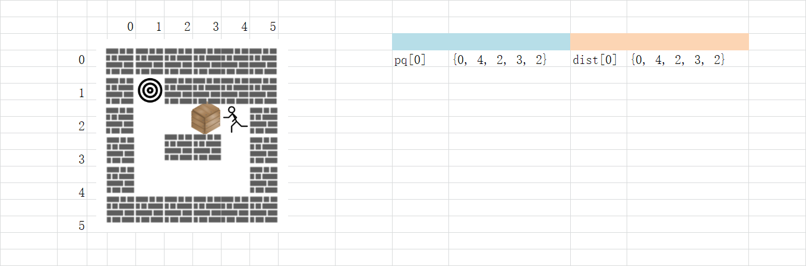
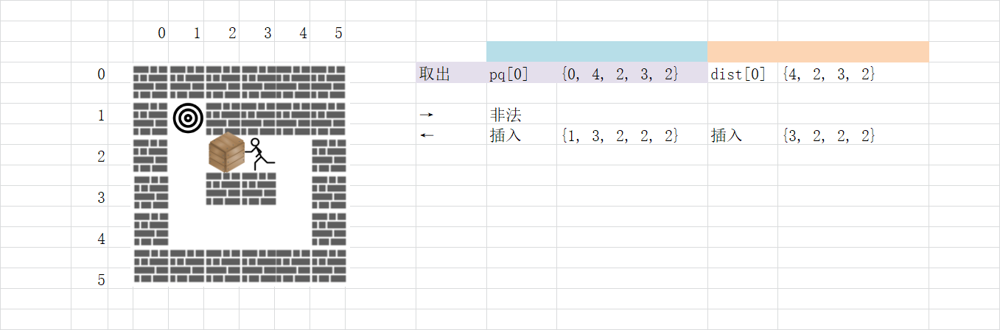
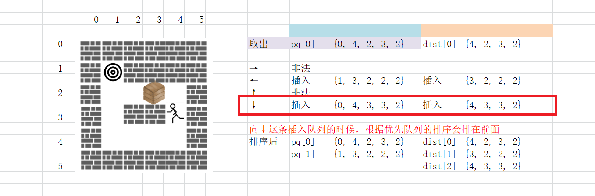
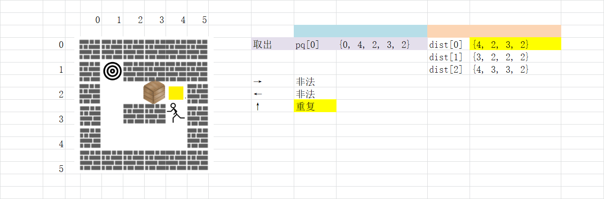
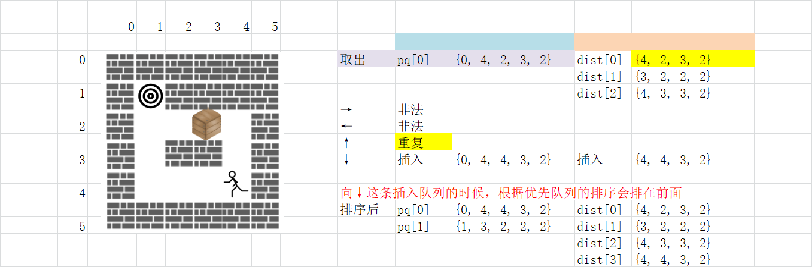

> 原文链接: https://leetcode-cn.com/problems/minimum-moves-to-move-a-box-to-their-target-location


## 英文原文
<div><p>A storekeeper is a game in which the player pushes boxes around in a warehouse trying to get them to target locations.</p>

<p>The game is represented by an <code>m x n</code> grid of characters <code>grid</code> where each element is a wall, floor, or box.</p>

<p>Your task is to move the box <code>&#39;B&#39;</code> to the target position <code>&#39;T&#39;</code> under the following rules:</p>

<ul>
	<li>The character <code>&#39;S&#39;</code> represents the player. The player can move up, down, left, right in <code>grid</code> if it is a floor (empty cell).</li>
	<li>The character <code>&#39;.&#39;</code> represents the floor which means a free cell to walk.</li>
	<li>The character <code>&#39;#&#39; </code>represents the wall which means an obstacle (impossible to walk there).</li>
	<li>There is only one box <code>&#39;B&#39;</code> and one target cell <code>&#39;T&#39;</code> in the <code>grid</code>.</li>
	<li>The box can be moved to an adjacent free cell by standing next to the box and then moving in the direction of the box. This is a <strong>push</strong>.</li>
	<li>The player cannot walk through the box.</li>
</ul>

<p>Return <em>the minimum number of <strong>pushes</strong> to move the box to the target</em>. If there is no way to reach the target, return <code>-1</code>.</p>

<p>&nbsp;</p>
<p><strong>Example 1:</strong></p>

<pre>
<strong>Input:</strong> grid = [[&quot;#&quot;,&quot;#&quot;,&quot;#&quot;,&quot;#&quot;,&quot;#&quot;,&quot;#&quot;],
               [&quot;#&quot;,&quot;T&quot;,&quot;#&quot;,&quot;#&quot;,&quot;#&quot;,&quot;#&quot;],
&nbsp;              [&quot;#&quot;,&quot;.&quot;,&quot;.&quot;,&quot;B&quot;,&quot;.&quot;,&quot;#&quot;],
&nbsp;              [&quot;#&quot;,&quot;.&quot;,&quot;#&quot;,&quot;#&quot;,&quot;.&quot;,&quot;#&quot;],
&nbsp;              [&quot;#&quot;,&quot;.&quot;,&quot;.&quot;,&quot;.&quot;,&quot;S&quot;,&quot;#&quot;],
&nbsp;              [&quot;#&quot;,&quot;#&quot;,&quot;#&quot;,&quot;#&quot;,&quot;#&quot;,&quot;#&quot;]]
<strong>Output:</strong> 3
<strong>Explanation: </strong>We return only the number of times the box is pushed.</pre>

<p><strong>Example 2:</strong></p>

<pre>
<strong>Input:</strong> grid = [[&quot;#&quot;,&quot;#&quot;,&quot;#&quot;,&quot;#&quot;,&quot;#&quot;,&quot;#&quot;],
               [&quot;#&quot;,&quot;T&quot;,&quot;#&quot;,&quot;#&quot;,&quot;#&quot;,&quot;#&quot;],
&nbsp;              [&quot;#&quot;,&quot;.&quot;,&quot;.&quot;,&quot;B&quot;,&quot;.&quot;,&quot;#&quot;],
&nbsp;              [&quot;#&quot;,&quot;#&quot;,&quot;#&quot;,&quot;#&quot;,&quot;.&quot;,&quot;#&quot;],
&nbsp;              [&quot;#&quot;,&quot;.&quot;,&quot;.&quot;,&quot;.&quot;,&quot;S&quot;,&quot;#&quot;],
&nbsp;              [&quot;#&quot;,&quot;#&quot;,&quot;#&quot;,&quot;#&quot;,&quot;#&quot;,&quot;#&quot;]]
<strong>Output:</strong> -1
</pre>

<p><strong>Example 3:</strong></p>

<pre>
<strong>Input:</strong> grid = [[&quot;#&quot;,&quot;#&quot;,&quot;#&quot;,&quot;#&quot;,&quot;#&quot;,&quot;#&quot;],
&nbsp;              [&quot;#&quot;,&quot;T&quot;,&quot;.&quot;,&quot;.&quot;,&quot;#&quot;,&quot;#&quot;],
&nbsp;              [&quot;#&quot;,&quot;.&quot;,&quot;#&quot;,&quot;B&quot;,&quot;.&quot;,&quot;#&quot;],
&nbsp;              [&quot;#&quot;,&quot;.&quot;,&quot;.&quot;,&quot;.&quot;,&quot;.&quot;,&quot;#&quot;],
&nbsp;              [&quot;#&quot;,&quot;.&quot;,&quot;.&quot;,&quot;.&quot;,&quot;S&quot;,&quot;#&quot;],
&nbsp;              [&quot;#&quot;,&quot;#&quot;,&quot;#&quot;,&quot;#&quot;,&quot;#&quot;,&quot;#&quot;]]
<strong>Output:</strong> 5
<strong>Explanation:</strong>  push the box down, left, left, up and up.
</pre>

<p><strong>Example 4:</strong></p>

<pre>
<strong>Input:</strong> grid = [[&quot;#&quot;,&quot;#&quot;,&quot;#&quot;,&quot;#&quot;,&quot;#&quot;,&quot;#&quot;,&quot;#&quot;],
&nbsp;              [&quot;#&quot;,&quot;S&quot;,&quot;#&quot;,&quot;.&quot;,&quot;B&quot;,&quot;T&quot;,&quot;#&quot;],
&nbsp;              [&quot;#&quot;,&quot;#&quot;,&quot;#&quot;,&quot;#&quot;,&quot;#&quot;,&quot;#&quot;,&quot;#&quot;]]
<strong>Output:</strong> -1
</pre>

<p>&nbsp;</p>
<p><strong>Constraints:</strong></p>

<ul>
	<li><code>m == grid.length</code></li>
	<li><code>n == grid[i].length</code></li>
	<li><code>1 &lt;= m, n &lt;= 20</code></li>
	<li><code>grid</code> contains only characters <code>&#39;.&#39;</code>, <code>&#39;#&#39;</code>, <code>&#39;S&#39;</code>, <code>&#39;T&#39;</code>, or <code>&#39;B&#39;</code>.</li>
	<li>There is only one character <code>&#39;S&#39;</code>, <code>&#39;B&#39;</code>, and <code>&#39;T&#39;</code> in the <code>grid</code>.</li>
</ul>
</div>

## 中文题目
<div><p>「推箱子」是一款风靡全球的益智小游戏，玩家需要将箱子推到仓库中的目标位置。</p>

<p>游戏地图用大小为 <code>n * m</code> 的网格 <code>grid</code> 表示，其中每个元素可以是墙、地板或者是箱子。</p>

<p>现在你将作为玩家参与游戏，按规则将箱子&nbsp;<code>&#39;B&#39;</code>&nbsp;移动到目标位置&nbsp;<code>&#39;T&#39;</code> ：</p>

<ul>
	<li>玩家用字符&nbsp;<code>&#39;S&#39;</code>&nbsp;表示，只要他在地板上，就可以在网格中向上、下、左、右四个方向移动。</li>
	<li>地板用字符&nbsp;<code>&#39;.&#39;</code>&nbsp;表示，意味着可以自由行走。</li>
	<li>墙用字符&nbsp;<code>&#39;#&#39;</code>&nbsp;表示，意味着障碍物，不能通行。&nbsp;</li>
	<li>箱子仅有一个，用字符&nbsp;<code>&#39;B&#39;</code>&nbsp;表示。相应地，网格上有一个目标位置&nbsp;<code>&#39;T&#39;</code>。</li>
	<li>玩家需要站在箱子旁边，然后沿着箱子的方向进行移动，此时箱子会被移动到相邻的地板单元格。记作一次「推动」。</li>
	<li>玩家无法越过箱子。</li>
</ul>

<p>返回将箱子推到目标位置的最小 <strong>推动</strong> 次数，如果无法做到，请返回&nbsp;<code>-1</code>。</p>

<p>&nbsp;</p>

<p><strong>示例 1：</strong></p>

<p><strong></strong></p>

<pre><strong>输入：</strong>grid = [[&quot;#&quot;,&quot;#&quot;,&quot;#&quot;,&quot;#&quot;,&quot;#&quot;,&quot;#&quot;],
             [&quot;#&quot;,&quot;T&quot;,&quot;#&quot;,&quot;#&quot;,&quot;#&quot;,&quot;#&quot;],
&nbsp;            [&quot;#&quot;,&quot;.&quot;,&quot;.&quot;,&quot;B&quot;,&quot;.&quot;,&quot;#&quot;],
&nbsp;            [&quot;#&quot;,&quot;.&quot;,&quot;#&quot;,&quot;#&quot;,&quot;.&quot;,&quot;#&quot;],
&nbsp;            [&quot;#&quot;,&quot;.&quot;,&quot;.&quot;,&quot;.&quot;,&quot;S&quot;,&quot;#&quot;],
&nbsp;            [&quot;#&quot;,&quot;#&quot;,&quot;#&quot;,&quot;#&quot;,&quot;#&quot;,&quot;#&quot;]]
<strong>输出：</strong>3
<strong>解释：</strong>我们只需要返回推箱子的次数。</pre>

<p><strong>示例 2：</strong></p>

<pre><strong>输入：</strong>grid = [[&quot;#&quot;,&quot;#&quot;,&quot;#&quot;,&quot;#&quot;,&quot;#&quot;,&quot;#&quot;],
             [&quot;#&quot;,&quot;T&quot;,&quot;#&quot;,&quot;#&quot;,&quot;#&quot;,&quot;#&quot;],
&nbsp;            [&quot;#&quot;,&quot;.&quot;,&quot;.&quot;,&quot;B&quot;,&quot;.&quot;,&quot;#&quot;],
&nbsp;            [&quot;#&quot;,&quot;#&quot;,&quot;#&quot;,&quot;#&quot;,&quot;.&quot;,&quot;#&quot;],
&nbsp;            [&quot;#&quot;,&quot;.&quot;,&quot;.&quot;,&quot;.&quot;,&quot;S&quot;,&quot;#&quot;],
&nbsp;            [&quot;#&quot;,&quot;#&quot;,&quot;#&quot;,&quot;#&quot;,&quot;#&quot;,&quot;#&quot;]]
<strong>输出：</strong>-1
</pre>

<p><strong>示例 3：</strong></p>

<pre><strong>输入：</strong>grid = [[&quot;#&quot;,&quot;#&quot;,&quot;#&quot;,&quot;#&quot;,&quot;#&quot;,&quot;#&quot;],
&nbsp;            [&quot;#&quot;,&quot;T&quot;,&quot;.&quot;,&quot;.&quot;,&quot;#&quot;,&quot;#&quot;],
&nbsp;            [&quot;#&quot;,&quot;.&quot;,&quot;#&quot;,&quot;B&quot;,&quot;.&quot;,&quot;#&quot;],
&nbsp;            [&quot;#&quot;,&quot;.&quot;,&quot;.&quot;,&quot;.&quot;,&quot;.&quot;,&quot;#&quot;],
&nbsp;            [&quot;#&quot;,&quot;.&quot;,&quot;.&quot;,&quot;.&quot;,&quot;S&quot;,&quot;#&quot;],
&nbsp;            [&quot;#&quot;,&quot;#&quot;,&quot;#&quot;,&quot;#&quot;,&quot;#&quot;,&quot;#&quot;]]
<strong>输出：</strong>5
<strong>解释：</strong>向下、向左、向左、向上再向上。
</pre>

<p><strong>示例 4：</strong></p>

<pre><strong>输入：</strong>grid = [[&quot;#&quot;,&quot;#&quot;,&quot;#&quot;,&quot;#&quot;,&quot;#&quot;,&quot;#&quot;,&quot;#&quot;],
&nbsp;            [&quot;#&quot;,&quot;S&quot;,&quot;#&quot;,&quot;.&quot;,&quot;B&quot;,&quot;T&quot;,&quot;#&quot;],
&nbsp;            [&quot;#&quot;,&quot;#&quot;,&quot;#&quot;,&quot;#&quot;,&quot;#&quot;,&quot;#&quot;,&quot;#&quot;]]
<strong>输出：</strong>-1
</pre>

<p>&nbsp;</p>

<p><strong>提示：</strong></p>

<ul>
	<li><code>1 &lt;= grid.length &lt;= 20</code></li>
	<li><code>1 &lt;= grid[i].length &lt;= 20</code></li>
	<li><code>grid</code> 仅包含字符&nbsp;<code>&#39;.&#39;</code>, <code>&#39;#&#39;</code>,&nbsp; <code>&#39;S&#39;</code> , <code>&#39;T&#39;</code>, 以及&nbsp;<code>&#39;B&#39;</code>。</li>
	<li><code>grid</code>&nbsp;中&nbsp;<code>&#39;S&#39;</code>, <code>&#39;B&#39;</code>&nbsp;和&nbsp;<code>&#39;T&#39;</code>&nbsp;各只能出现一个。</li>
</ul>
</div>

## 通过代码
<RecoDemo>
</RecoDemo>


## 高赞题解
#### BFS：
1. BFS 每走一步，会把下一步能走的格子加入队列
2. 按顺序走完这一步所有的可能，队列里就剩下下一步所有的可能
3. 当走到终点时，就是最少步骤
4. 每走一步，还会使用 set 来记录已经走到过的格子的坐标
5. 把下一步加入队列前，检查，重复的就不用进队列了

#### 分析：
1. 如果这道题没有人，箱子自己走，那么只需要了解BFS，就可以解决了
2. 如果有人存在，把人的状态同时记录下来
3. 当人走到箱子的格子上，把箱子沿同一方向移动，如果箱子位置合法，那就是推动箱子了

#### 问题和解决：
同时记录人和箱子的状态，会有一些问题要解决
1. 因为人也动，箱子也动，但是只有箱子动才算步数，所以加入队列的顺序，并不是步数顺序了
   所以需要一个记录步数，同时记录人和箱子的坐标，还可以排序的队列
   使用 priority_queue（优先队列）解决。
   ```C++ []
	priority_queue<vector<size_t>, vector<vector<size_t>>, greater<vector<size_t>>> pq;
   ```
   队列中的数据是 `vector<size_t>`
   优先队列会使用 `vector<vector<size_t>>` 来保存 `vector<size_t>`
   设置为升序存储 `greater<vector<size_t>>`
   > 其中 `vector<size_t>` 保存的内容是：
   > [0] 当前状态最小推箱子次数
   > [1] 人的坐标 x
   > [2] 人的坐标 y
   > [3] 箱子的坐标 x
   > [4] 箱子的坐标 y
2. set 怎么调整
   `set<vector<size_t>>` 用人和箱子的坐标来做记录
   > [0] 人的坐标 x
   > [1] 人的坐标 y
   > [2] 箱子的坐标 x
   > [3] 箱子的坐标 y
   
#### 解题思路：
1. 定义优先队列
2. 将原始数据中的人和箱子坐标提取出来，地图还原成通路
3. 将起始状态存入队列
4. 定义 set
5. 将起始状态存入 set
6. 定义方向数组
7. 开始 bfs 吧，`while (!pq.empty())`
8. 对人移动，检查合法性
9. 检查人是否走到箱子上
   91. 移动箱子，检查合法性
   92. 步数 +1
10. 判断箱子是否到终点，返回步数
11. 检查 set，移动后是否重复，记录 set
12. 如果 bfs 没结果，无法到达终点，返回 -1

#### 模拟：
<,,,,>

做了几张图帮助理解一下，虽然只有开始的几步，但是如果理解了，后面脑补就可以了。  

> 可以看到，当从队列中取出一个状态，4 种情况有一种情况是推动箱子，另一种是箱子没动人动。
> 当 4 种情况中合理的都加入队列后，根据优先队列的排序，下一个状态是优先箱子没动人动的情况。
> 因为题目的最终目的是求最少的箱子移动步数，所以只要箱子没动，步数都不增加，那么优先级就会高
> 所以 bfs 才能按照步数作为参考


#### 答题
```C++ []
int minPushBox(vector<vector<char>>& grid) 
{
	// pq，[0]当前状态最小推箱子次数 [1]人的坐标x [2]人的坐标y [3]箱子的坐标x [4]箱子的坐标y
	priority_queue<vector<size_t>, vector<vector<size_t>>, greater<vector<size_t>>> pq;
	size_t m = grid.size();
	size_t n = grid[0].size();

	vector<size_t> a(5, 0);
	for (size_t x = 0; x < m; x++)
	{
		for (size_t y = 0; y < n; y++)
		{
			if (grid[x][y] == 'S')
			{
				a[1] = x;
				a[2] = y;
				grid[x][y] = '.';
			}
			else if (grid[x][y] == 'B')
			{
				a[3] = x;
				a[4] = y;
				grid[x][y] = '.';
			}
		}
	}
	pq.push(a);

	set<vector<size_t>> dist;
	dist.insert({ a[1], a[2], a[3], a[4] });
	int dx[4] = { 0,0,1,-1 };
	int dy[4] = { 1,-1,0,0 };

	while (!pq.empty())
	{
		auto v = pq.top();
		pq.pop();

		for (int i = 0; i < 4; i++)
		{
			vector<size_t> next_s = { v[1] + dx[i], v[2] + dy[i] };
			if (next_s[0] >= m || next_s[1] >= n || grid[next_s[0]][next_s[1]] == '#')
			{
				continue;
			}
			vector<size_t> next_b = { v[3], v[4] };
			size_t d = v[0];
			if (next_s == next_b)
			{
				next_b[0] += dx[i];
				next_b[1] += dy[i];
				if (next_b[0] >= m || next_b[1] >= n || grid[next_b[0]][next_b[1]] == '#')
				{
					continue;
				}
				d++;
			}
			if (grid[next_b[0]][next_b[1]] == 'T')
			{
				return (int)d;
			}

			if (dist.find({next_s[0], next_s[1], next_b[0], next_b[1]}) != dist.end())
			{
				continue;
			}
			dist.insert({ next_s[0], next_s[1], next_b[0], next_b[1] });
			pq.push({ d, next_s[0], next_s[1], next_b[0], next_b[1] });
		}
	}
	return -1;
}
```



#### 致谢：

感谢 `小白二号` [@scut_dell](/u/scut_dell/) 的竞赛题解，让我学到了这种解法。  
我学会之后，再详细的讲解，分享给他人。

感谢您的观看，希望对您有帮助，欢迎热烈的交流！  




## 统计信息
| 通过次数 | 提交次数 | AC比率 |
| :------: | :------: | :------: |
|    3453    |    8047    |   42.9%   |

## 提交历史
| 提交时间 | 提交结果 | 执行时间 |  内存消耗  | 语言 |
| :------: | :------: | :------: | :--------: | :--------: |
