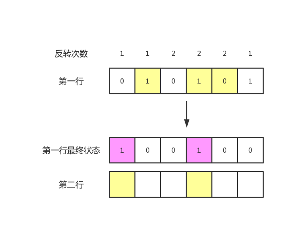

> 原文链接: https://leetcode-cn.com/problems/minimum-number-of-flips-to-convert-binary-matrix-to-zero-matrix


## 英文原文
<div><p>Given a <code>m x n</code> binary matrix <code>mat</code>. In one step, you can choose one cell and flip it and all the four neighbors of it if they exist (Flip is changing <code>1</code> to <code>0</code> and <code>0</code> to <code>1</code>). A pair of cells are called neighbors if they share one edge.</p>

<p>Return the <em>minimum number of steps</em> required to convert <code>mat</code> to a zero matrix or <code>-1</code> if you cannot.</p>

<p>A <strong>binary matrix</strong> is a matrix with all cells equal to <code>0</code> or <code>1</code> only.</p>

<p>A <strong>zero matrix</strong> is a matrix with all cells equal to <code>0</code>.</p>

<p>&nbsp;</p>
<p><strong>Example 1:</strong></p>

<pre>
<strong>Input:</strong> mat = [[0,0],[0,1]]
<strong>Output:</strong> 3
<strong>Explanation:</strong> One possible solution is to flip (1, 0) then (0, 1) and finally (1, 1) as shown.
</pre>

<p><strong>Example 2:</strong></p>

<pre>
<strong>Input:</strong> mat = [[0]]
<strong>Output:</strong> 0
<strong>Explanation:</strong> Given matrix is a zero matrix. We don&#39;t need to change it.
</pre>

<p><strong>Example 3:</strong></p>

<pre>
<strong>Input:</strong> mat = [[1,1,1],[1,0,1],[0,0,0]]
<strong>Output:</strong> 6
</pre>

<p><strong>Example 4:</strong></p>

<pre>
<strong>Input:</strong> mat = [[1,0,0],[1,0,0]]
<strong>Output:</strong> -1
<strong>Explanation:</strong> Given matrix can&#39;t be a zero matrix
</pre>

<p>&nbsp;</p>
<p><strong>Constraints:</strong></p>

<ul>
	<li><code>m == mat.length</code></li>
	<li><code>n == mat[i].length</code></li>
	<li><code>1 &lt;= m, n &lt;= 3</code></li>
	<li><code>mat[i][j]</code> is either <code>0</code> or <code>1</code>.</li>
</ul>
</div>

## 中文题目
<div><p>给你一个&nbsp;<code>m x n</code>&nbsp;的二进制矩阵&nbsp;<code>mat</code>。</p>

<p>每一步，你可以选择一个单元格并将它反转（反转表示 0 变 1 ，1 变 0 ）。如果存在和它相邻的单元格，那么这些相邻的单元格也会被反转。（注：相邻的两个单元格共享同一条边。）</p>

<p>请你返回将矩阵&nbsp;<code>mat</code> 转化为全零矩阵的<em>最少反转次数</em>，如果无法转化为全零矩阵，请返回&nbsp;<strong>-1</strong>&nbsp;。</p>

<p>二进制矩阵的每一个格子要么是 0 要么是 1 。</p>

<p>全零矩阵是所有格子都为 0 的矩阵。</p>

<p>&nbsp;</p>

<p><strong>示例&nbsp;1：</strong></p>

<p></p>

<pre><strong>输入：</strong>mat = [[0,0],[0,1]]
<strong>输出：</strong>3
<strong>解释：</strong>一个可能的解是反转 (1, 0)，然后 (0, 1) ，最后是 (1, 1) 。
</pre>

<p><strong>示例 2：</strong></p>

<pre><strong>输入：</strong>mat = [[0]]
<strong>输出：</strong>0
<strong>解释：</strong>给出的矩阵是全零矩阵，所以你不需要改变它。
</pre>

<p><strong>示例 3：</strong></p>

<pre><strong>输入：</strong>mat = [[1,1,1],[1,0,1],[0,0,0]]
<strong>输出：</strong>6
</pre>

<p><strong>示例 4：</strong></p>

<pre><strong>输入：</strong>mat = [[1,0,0],[1,0,0]]
<strong>输出：</strong>-1
<strong>解释：</strong>该矩阵无法转变成全零矩阵
</pre>

<p>&nbsp;</p>

<p><strong>提示：</strong></p>

<ul>
	<li><code>m ==&nbsp;mat.length</code></li>
	<li><code>n ==&nbsp;mat[0].length</code></li>
	<li><code>1 &lt;= m&nbsp;&lt;= 3</code></li>
	<li><code>1 &lt;= n&nbsp;&lt;= 3</code></li>
	<li><code>mat[i][j]</code>&nbsp;是 0 或 1 。</li>
</ul>
</div>

## 通过代码
<RecoDemo>
</RecoDemo>


## 高赞题解
## 解法一 暴力搜索

### 思路

由于两次异或操作带来的效果将会**抵消**，相当于没有进行反转，单元格最多**只需被反转 1 次**。

那么，对于每个单元格来说，它只有两种状态：**被反转** or **不被反转**。

遍历 N 个单元格，计算出所有的情况只需要 $O(2^N)$ 时间复杂度，而题目中 N 最大为 **m * n = 9**，因此直接暴力搜索是没有问题的。（**小提示**：在$O(2^N)$ 情况下，N 最多可达 **20** 左右）

下面让我们来看下**具体**的实现方案，当然也可以跳过直接看后面的代码。

1.全零矩阵的**验证**

设置一个变量 `diff`，代表矩阵中 **1** 的**个数**，当 `diff` 等于 **0** 时，即矩阵转化为**全零矩阵**。那什么情况下需要进行更新？显然，我们进行一个单元格反转时，需要记录这个单元格及其相邻单元格的变化，如果这些范围内的 **1** 个数增多，`diff` 也需要进行相应地增加。

2.**深度优先搜索**矩阵

`dfs(int[][] mat, int i, int j, int diff, int cnt)`，递归的过程中主要包括三种状态，当前单元格坐标`(i，j)`，1 的个数 `diff` 以及反转的次数 `cnt`。

- `j + 1` 进入下一个递归，如果 `j` 变为矩阵的**列数**代表到达**边界**，此时更新 `i = i + 1` 以及 `j =  0`并**重新**进行递归。
- 两个递归结束条件：1. **遍历完**所有单元格，当前单元格坐标的行数 `i` 等于矩阵行数 `m`。2. `diff` **等于 0**，当前矩阵转化为**全零矩阵**，没必要继续递归。

### 代码

```java
class Solution {
    int m, n;
    int ans = 10;
    int[][] dir = new int[][]{{0, 1}, {0, -1}, {1, 0}, {-1, 0}};
    public int minFlips(int[][] mat) {
        m = mat.length;
        n = mat[0].length;
        int diff = 0;
        for (int i = 0; i < m; i++) {
            for (int j = 0; j < n; j++) {
                if (mat[i][j] == 1) {
                    diff++;
                }
            }
        }
        dfs(mat, 0, 0, diff, 0);
        if (ans == 10) {
            return -1;
        } else {
            return ans;
        }
    }
    public void dfs(int[][] mat, int i, int j, int diff, int cnt) {
        // j = n 代表进入列数的边界，转换坐标并重新进入递归
        // i 变为下一行，j 变为第一列
        if (j == n) {
            j = 0;
            i = i + 1;
            dfs(mat, i, j, diff, cnt);
            return;
        }
        // 找到全零矩阵，更新答案，结束递归
        if (diff == 0) {
            ans = Math.min(ans, cnt);
            return;
        }
        // i = m 代表遍历完单元格，结束递归
        if (i == m) {
            return;
        }
        // newDiff 为反转某个单元格及其相邻单元格产生的影响，即 1 的个数变化
        int newDiff = help(mat, i, j);
        dfs(mat, i, j + 1, diff + newDiff, cnt + 1);
        // 再次反转，消除影响
        help(mat, i, j);
        dfs(mat, i, j + 1, diff, cnt);
    }
    
    // 反转 (i,j) 以及相邻单元格，并获取 1 的个数变化
    public int help(int[][] mat, int i, int j) {
        // cnt 为 1 的个数变化
        int cnt = 0;
        if (mat[i][j] == 0) {
            cnt++;
        } else {
            cnt--;
        }
        mat[i][j] = 1 - mat[i][j];
        // 遍历相邻单元格
        for (int[] d : dir) {
            int nx = i + d[0], ny = j + d[1];
            if (nx < 0 || nx >= m || ny < 0 || ny >= n) {
                continue;
            }
            if (mat[nx][ny] == 0) {
                cnt++;
            } else {
                cnt--;
            }
            mat[nx][ny] = 1 - mat[nx][ny];
        }
        return cnt;
    }
}
```

### 复杂度分析

- 时间复杂度：$O(2^{N*M})$，其中 N 为矩阵行数，M 为矩阵列数。


## 解法二 暴力搜索 + 递推

如果题目中的行数和列数再扩大个一倍呢？这也是本题争议较多的地方，数据规模太小了，并没有达到真正的 Hard 难度。下面将会**优化**暴力算法，从而解决数据规模更大的问题。

#### 思路

每个单元格最终的状态由**自身**，以及**相邻**的单元格决定。我们将**每一行**的单元格看成一个阶段，当枚举好第一行单元格的**一种状态**，并进行相对应的反转后，第一行的单元格的**最终状态**还会改变吗？显然，它还可以被**下一行**的单元格所改变。

关键部分来了，现在第一行的最终状态**只能**通过**下一行**的状态所改变。为了能够产生**全零矩阵**，第二行必须为第一行**服务**。例如第一行某个单元格为 1，则第二行对应下面的单元格需要进行反转，第二行的状态也就能够确定下来。综上，当第一个阶段的状态**确定**后，后面每一个阶段的状态都可以通过**上一个**阶段进行**确定**，最后我们只需要检查最后一个阶段是否全零即可。

相关图示
* 注：**黄色**代表该单元格**主动反转**（增加自身以及相邻格子的反转次数）





下面是一些具体实现的细节，可结合代码一起看。

- 通过**位压缩**来代表一行单元格的状态，将每个单元格拼接起来形成一个位压缩数字，例如一行有三个单元格，则所有状态的范围为：0 0 0 ~ 1 1 1
- 使用二维数组 `cnt` 来表示所有单元格的反转次数，包括主动反转和被动反转（相邻单元格主动反转产生的影响）的**总次数**。

#### 代码

```java
class Solution {
    public int minFlips(int[][] mat) {
        int m = mat.length, n = mat[0].length;
        // 存储每个位置需要被反转的次数，包括主动反转以及被动反转
        int[][] cnt = new int[m][n];
        // bit 为一行单元格的位压缩，limit 为 bit 的最大值
        int bit = 0, limit = (1 << n) - 1;
        int ans = 10;
        // 遍历每种状态
        while (bit <= limit) {
            
            // 初始化中间答案以及反转次数数组
            int tmp = 0;
            for (int i = 0; i < m; i++) {
                Arrays.fill(cnt[i], 0);
            }
            
            // 计算第一行
            for (int i = 0; i < n; i++) {
                if ((bit & (1 << i)) != 0) {
                    tmp++;
                    cnt[0][i]++;
                    if (m > 1) {
                        cnt[1][i]++;
                    }
                }
                // 考虑左右相邻格子对自身的影响
                if (i - 1 >= 0 && (bit & (1 << (i - 1))) != 0) {
                    cnt[0][i]++;
                }
                if (i + 1 < n && (bit & (1 << (i + 1))) != 0) {
                    cnt[0][i]++;
                }
            }
            
            // 递推后面的每一行
            for (int i = 1; i < m; i++) {
                for (int j = 0; j < n; j++) {
                    // 上一个单元格需要再次被反转的情况
                    if (mat[i - 1][j] == 0 && cnt[i - 1][j] % 2 == 1 || mat[i - 1][j] == 1 && cnt[i - 1][j] % 2 == 0) {
                        cnt[i][j]++;
                        if (i + 1 < m) {
                            cnt[i + 1][j]++;
                        }
                        tmp++;
                        if (j - 1 >= 0) {
                            cnt[i][j - 1]++;
                        }
                        if (j + 1 < n) {
                            cnt[i][j + 1]++;
                        }
                    }
                }
            }
            
            // 检测最后一行是否全为 0
            boolean flag = true;
            for (int i = 0; i < n; i++) {
                if (mat[m - 1][i] == 0 && cnt[m - 1][i] % 2 == 1 || mat[m - 1][i] == 1 && cnt[m - 1][i] % 2 == 0) {
                    flag = false;
                    break;
                }
            }
            if (flag) {
                ans = Math.min(ans, tmp);
            }
            bit++;
        }
    
        if (ans == 10) {
            return -1;
        } else {
            return ans;
        }
    }
}
```

#### 复杂度分析

- 时间复杂度：$O(2^N * N * M)$，其中 N 为矩阵的列数，M 为矩阵的行数。



&nbsp;

---


如果该题解对你有帮助，点个**赞**再走呗~


## 统计信息
| 通过次数 | 提交次数 | AC比率 |
| :------: | :------: | :------: |
|    2707    |    4063    |   66.6%   |

## 提交历史
| 提交时间 | 提交结果 | 执行时间 |  内存消耗  | 语言 |
| :------: | :------: | :------: | :--------: | :--------: |
