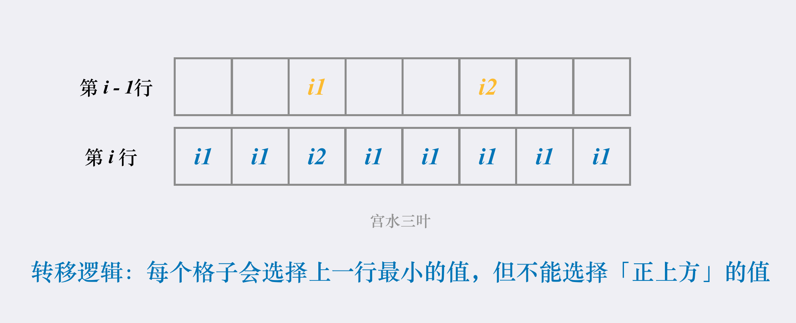

> 原文链接: https://leetcode-cn.com/problems/minimum-falling-path-sum-ii


## 英文原文
<div><p>Given an <code>n x n</code> integer matrix <code>grid</code>, return <em>the minimum sum of a <strong>falling path with non-zero shifts</strong></em>.</p>

<p>A <strong>falling path with non-zero shifts</strong> is a choice of exactly one element from each row of <code>grid</code> such that no two elements chosen in adjacent rows are in the same column.</p>

<p>&nbsp;</p>
<p><strong>Example 1:</strong></p>

<pre>
<strong>Input:</strong> arr = [[1,2,3],[4,5,6],[7,8,9]]
<strong>Output:</strong> 13
<strong>Explanation:</strong> 
The possible falling paths are:
[1,5,9], [1,5,7], [1,6,7], [1,6,8],
[2,4,8], [2,4,9], [2,6,7], [2,6,8],
[3,4,8], [3,4,9], [3,5,7], [3,5,9]
The falling path with the smallest sum is&nbsp;[1,5,7], so the answer is&nbsp;13.
</pre>

<p><strong>Example 2:</strong></p>

<pre>
<strong>Input:</strong> grid = [[7]]
<strong>Output:</strong> 7
</pre>

<p>&nbsp;</p>
<p><strong>Constraints:</strong></p>

<ul>
	<li><code>n == grid.length == grid[i].length</code></li>
	<li><code>1 &lt;= n &lt;= 200</code></li>
	<li><code>-99 &lt;= grid[i][j] &lt;= 99</code></li>
</ul>
</div>

## 中文题目
<div><p>给你一个整数方阵&nbsp;<code>arr</code>&nbsp;，定义「非零偏移下降路径」为：从&nbsp;<code>arr</code> 数组中的每一行选择一个数字，且按顺序选出来的数字中，相邻数字不在原数组的同一列。</p>

<p>请你返回非零偏移下降路径数字和的最小值。</p>

<p>&nbsp;</p>

<p><strong>示例 1：</strong></p>

<pre>
<strong>输入：</strong>arr = [[1,2,3],[4,5,6],[7,8,9]]
<strong>输出：</strong>13
<strong>解释：</strong>
所有非零偏移下降路径包括：
[1,5,9], [1,5,7], [1,6,7], [1,6,8],
[2,4,8], [2,4,9], [2,6,7], [2,6,8],
[3,4,8], [3,4,9], [3,5,7], [3,5,9]
下降路径中数字和最小的是&nbsp;[1,5,7] ，所以答案是&nbsp;13 。
</pre>

<p>&nbsp;</p>

<p><strong>提示：</strong></p>

<ul>
	<li><code>1 &lt;= arr.length == arr[i].length &lt;= 200</code></li>
	<li><code>-99 &lt;= arr[i][j] &lt;= 99</code></li>
</ul>
</div>

## 通过代码
<RecoDemo>
</RecoDemo>


## 高赞题解
## 前言

今天是我们讲解**动态规划专题**中的 *[路径问题](https://mp.weixin.qq.com/mp/appmsgalbum?__biz=MzU4NDE3MTEyMA==&action=getalbum&album_id=1773144264147812354&scene=173&from_msgid=2247485319&from_itemidx=1&count=3#wechat_redirect) 的第六天*。

我在文章结尾处列举了我所整理的关于 **路径问题** 的相关题目。

**路径问题** 我会按照编排好的顺序进行讲解（一天一道）。

你也先可以尝试做做，也欢迎你向我留言补充，你觉得与路径相关的 DP 类型题目 ~ 

***

## 动态规划

我们已经做过好几道「路径问题」了。

凭借我们的经验，一个直观的做法是定义 $f[i][j]$ 为到达位置 $(i,j)$ 的最小路径和。

那么答案必然是所有的 $f[n - 1][i]$ 中的最小值，i 的取值范围为 [0, n)。

代表最优路径的最后一个数可能取自最后一行的任意下标。

由于题目要求每一行的取数，不能与上一行的取数列下标相同。

也就是规定了我们为每行进行取数时不能取「正上方」的值。

因此我们在进行状态转移的时候，需要枚举上一行的所有列下标。

这样的做法复杂度是 $O(n^3)$，题目范围为 $10^2$，因此计算量为 $10^6$，可以过。

代码：
```Java []
class Solution {
    public int minFallingPathSum(int[][] arr) {
        int n = arr.length;
        int[][] f = new int[n][n];
        // 初始化首行的路径和
        for (int i = 0; i < n; i++) f[0][i] = arr[0][i];
        // 从第一行进行转移
        for (int i = 1; i < n; i++) {
            for (int j = 0; j < n; j++) {
                f[i][j] = Integer.MAX_VALUE;
                int val = arr[i][j];
                // 枚举上一行的每个列下标
                for (int p = 0; p < n; p++) {
                    // 只有列下标不同时，才能更新状态
                    if (j != p) {
                        f[i][j] = Math.min(f[i][j], f[i-1][p] + val);
                    }
                }
            }
        }
        // 在所有的 f[n - 1][i] 中取最小值
        int ans = Integer.MAX_VALUE;
        for (int i = 0; i < n; i++) {
            ans = Math.min(ans, f[n-1][i]);
        }
        return ans;
    }
}
```
* 时间复杂度：$O(n^3)$
* 空间复杂度：$O(n^2)$

***

## 动态规划（进阶）

那么是否有比 $O(n^3)$ 更好的做法呢？

要知道我们上述的解法，当数据范围出到 $10^3$ 就会超时了。

我们来分析一下上述解法有哪些可优化的点：

**1. DP 状态转移部分，共有 $n * n$ 个状态需要转移**

**2. 每次转移的时候，枚举上一行的所有列**

我们要确保所有的方案都枚举到，得到的才是全局最优解。

因此 DP 部分，我们是无法优化的。

那就只剩下**枚举上一行的所有列**这个部分可以优化了。

其实细想就可以发现，当我们在计算某行的状态值的时候，只会用到「上一行」的两个值:**最小值**和**次小值**。

举个🌰，当我们已经处理完第 $i-1$ 行的状态值。

假设第 $i-1$ 行状态中的最小值对应的列下标是 $i1$，次小值对应的列下标是 $i2$。

那么当我们处理第 $i$ 行时，显然有：

* 处理第 $i$ 行中列下标为 $i1$ 的状态值时，由于不能选择「正上方」的数字，用到的是*次小值*。转移方程为：$f[i][j]=f[i-1][i2]+arr[i][j]$
* 处理第 $i$ 行其他列下标的状态值时，这时候用到的是*最小值*。转移方程为：$f[i][j]=f[i-1][i1]+arr[i][j]$



因此我们可以使用 `i1` 保存上一行的*最小值*对应的列下标，用 `i2` 保存*次小值*对应的列下标。

而无需每次转移都枚举上一行的所有列。

代码：
```Java []
class Solution {
    int MAX = Integer.MAX_VALUE;
    public int minFallingPathSum(int[][] arr) {
        int n = arr.length;
        int[][] f = new int[n][n];
        
        // i1 代表最小值列下标，i2 代表次小值列下标
        int i1 = -1, i2 = -1;
        
        // 先转移第一行
        for (int i = 0; i < n; i++) {
        
            // 更新动规值
            int val = arr[0][i];
            f[0][i] = val;
            
            // 更新 i1 和 i2
            if (val < (i1 == -1 ? MAX : f[0][i1])) {
                i2 = i1;
                i1 = i;
            } else if (val < (i2 == -1 ? MAX : f[0][i2])) {
                i2 = i;
            }
        }
        
        // 再转移剩余行
        for (int i = 1; i < n; i++) {
        
            // 当前转移第 i 行，使用临时变量保存转移过程中的「最小值列下标」&「次小值列下标」
            int ti1 = -1, ti2 = -1;
            
            for (int j = 0; j < n; j++) {
                f[i][j] = MAX;
                int val = arr[i][j];
                
                // 更新动规值
                // 可以选择「最小值」的列选择「最小值」
                if (j != i1) {
                    f[i][j] = f[i - 1][i1] + val;
                    
                // 不能选择「最小值」的列选择「次小值」
                } else {
                    f[i][j] = f[i - 1][i2] + val;
                }
                
                // 更新 ti1 和 ti2
                if (f[i][j] < (ti1 == -1 ? MAX : f[i][ti1])) {
                    ti2 = ti1;
                    ti1 = j;
                } else if (f[i][j] < (ti2 == -1 ? MAX : f[i][ti2])) {
                    ti2 = j;
                }
            }
            
            // 使用临时变量更新 i1 和 i2
            i1 = ti1; i2 = ti2;
        }
        int ans = Integer.MAX_VALUE;
        for (int i = 0; i < n; i++) {
            ans = Math.min(ans, f[n-1][i]);
        }
        return ans;
    }
}
```
* 时间复杂度：$O(n^2)$
* 空间复杂度：$O(n^2)$

***

## 路径问题（目录）

62.不同路径（中等）：[路径问题第一讲](https://mp.weixin.qq.com/s/G_KYdjrhQQO43-t0Jw8iBA)

63.不同路径 II（中等）：[路径问题第二讲](https://mp.weixin.qq.com/s/YsBmrdeOXlsjOJGyNnDg4A)

64.最小路径和（中等）：[路径问题第三讲](https://mp.weixin.qq.com/s/ud-eVofLnYAwNrWwyhEFhA)

120.三角形最小路径和（中等）：[路径问题第四讲](https://mp.weixin.qq.com/s/o0e7EbMyDUle1DXgHLsG8A)

931.下降路径最小和（中等）：[路径问题第五讲](https://mp.weixin.qq.com/s?__biz=MzU4NDE3MTEyMA==&mid=2247485163&idx=1&sn=ffe456777bcda52c036e6eb2181d1932&chksm=fd9cadf4caeb24e21a57ce47295a54ee9d591dfbb857549a57c145cdeeabf8c4324b007fc18b&token=1459317048&lang=zh_CN#rd)

1289.下降路径最小和 II（困难）：[路径问题第六讲](https://mp.weixin.qq.com/s?__biz=MzU4NDE3MTEyMA==&mid=2247485187&idx=1&sn=a07f67501aa696a79b1e85bb2860c0b2&chksm=fd9cac1ccaeb250a777f9334c0cd3bb0135dafa0007d6d0bbb5cf38e484773d3539fd776b2ea&token=1459317048&lang=zh_CN#rd)

1575.统计所有可行路径（困难）：[路径问题第七讲](https://mp.weixin.qq.com/s?__biz=MzU4NDE3MTEyMA==&mid=2247485297&idx=1&sn=5ee4ce31c42d368af0653f60aa263c82&chksm=fd9cac6ecaeb25787e6da90423c5467e1679da0a8aaf1a3445475199a8f148d8629e851fea57&token=1459317048&lang=zh_CN#rd)（记忆化搜索）

1575.统计所有可行路径（困难）：[路径问题第八讲](https://mp.weixin.qq.com/s?__biz=MzU4NDE3MTEyMA==&mid=2247485319&idx=1&sn=95a3dc9c97ca57185de792ca70924afe&chksm=fd9cac98caeb258ebea466f59378670a90af1cb3015ae70922e1d04ac711a5b8d8d853ac5e7d&token=677741617&lang=zh_CN#rd)（动态规划）

576.出界的路径数（中等）：[路径问题第九讲](https://mp.weixin.qq.com/s?__biz=MzU4NDE3MTEyMA==&mid=2247485426&idx=1&sn=071aec0bf5bc2e20c58f4cbb3dcb0fbc&chksm=fd9cacedcaeb25fb895cb99963dcfcde6b10268893a085eed4000b48bf070cecbdf7c81bf991&token=1934509949&lang=zh_CN#rd)

1301.最大得分的路径数目（困难）：[路径问题第十讲](https://mp.weixin.qq.com/s/GpjnngbLVO-mdQjz53Wy9w)

欢迎补充 ~ 

***

## 最后

如果有帮助到你，请给个点赞关注，让更多的人看到 ~ ("▔□▔)/

也欢迎你 [关注我](https://oscimg.oschina.net/oscnet/up-19688dc1af05cf8bdea43b2a863038ab9e5.png) 和 加入我们的[「组队打卡」](https://leetcode-cn.com/u/ac_oier/)小群 ，提供写「证明」&「思路」的高质量题解

## 统计信息
| 通过次数 | 提交次数 | AC比率 |
| :------: | :------: | :------: |
|    7266    |    11655    |   62.3%   |

## 提交历史
| 提交时间 | 提交结果 | 执行时间 |  内存消耗  | 语言 |
| :------: | :------: | :------: | :--------: | :--------: |
