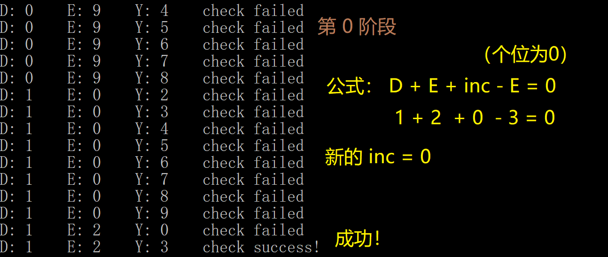
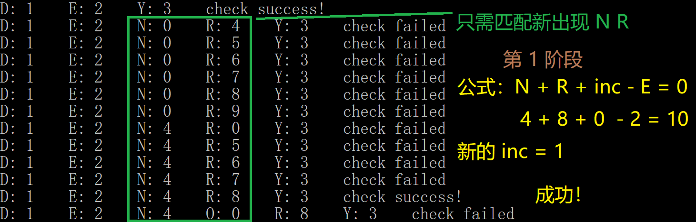
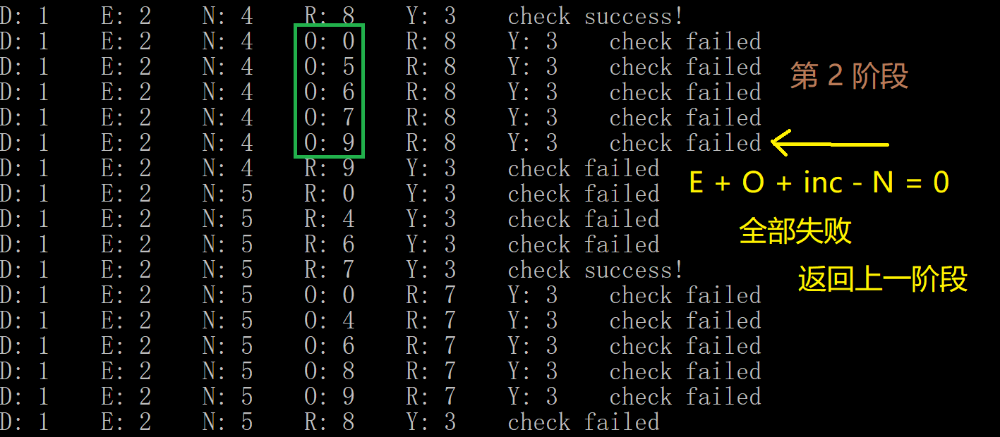
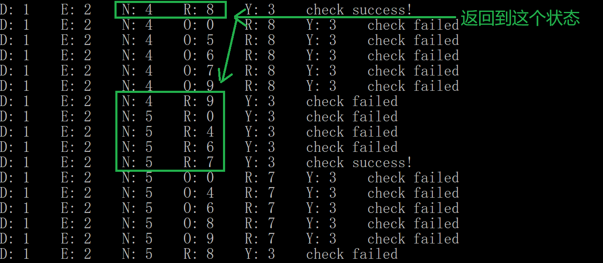
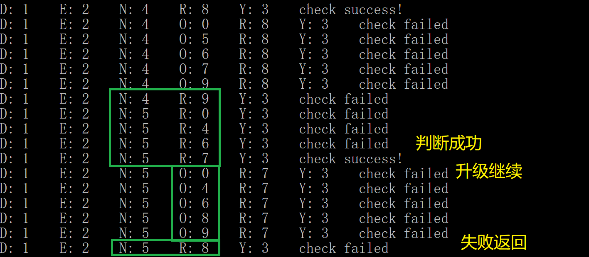
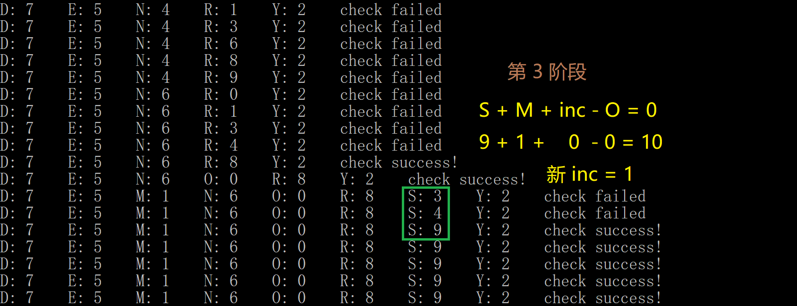
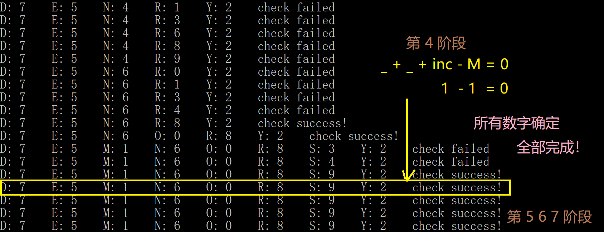

> 原文链接: https://leetcode-cn.com/problems/verbal-arithmetic-puzzle


## 英文原文
<div><p>Given an equation, represented by <code>words</code> on left side and the <code>result</code> on right side.</p>

<p>You need to check if the equation is solvable&nbsp;under the following rules:</p>

<ul>
	<li>Each character is decoded as one digit (0 - 9).</li>
	<li>Every pair of different characters they must map to different digits.</li>
	<li>Each <code>words[i]</code> and <code>result</code>&nbsp;are decoded as one number <strong>without</strong> leading zeros.</li>
	<li>Sum of numbers on left side (<code>words</code>) will equal to the number on right side (<code>result</code>).&nbsp;</li>
</ul>

<p>Return <code>True</code>&nbsp;if the equation is solvable otherwise&nbsp;return&nbsp;<code>False</code>.</p>

<p>&nbsp;</p>
<p><strong>Example 1:</strong></p>

<pre>
<strong>Input:</strong> words = [&quot;SEND&quot;,&quot;MORE&quot;], result = &quot;MONEY&quot;
<strong>Output:</strong> true
<strong>Explanation:</strong> Map &#39;S&#39;-&gt; 9, &#39;E&#39;-&gt;5, &#39;N&#39;-&gt;6, &#39;D&#39;-&gt;7, &#39;M&#39;-&gt;1, &#39;O&#39;-&gt;0, &#39;R&#39;-&gt;8, &#39;Y&#39;-&gt;&#39;2&#39;
Such that: &quot;SEND&quot; + &quot;MORE&quot; = &quot;MONEY&quot; ,  9567 + 1085 = 10652</pre>

<p><strong>Example 2:</strong></p>

<pre>
<strong>Input:</strong> words = [&quot;SIX&quot;,&quot;SEVEN&quot;,&quot;SEVEN&quot;], result = &quot;TWENTY&quot;
<strong>Output:</strong> true
<strong>Explanation:</strong> Map &#39;S&#39;-&gt; 6, &#39;I&#39;-&gt;5, &#39;X&#39;-&gt;0, &#39;E&#39;-&gt;8, &#39;V&#39;-&gt;7, &#39;N&#39;-&gt;2, &#39;T&#39;-&gt;1, &#39;W&#39;-&gt;&#39;3&#39;, &#39;Y&#39;-&gt;4
Such that: &quot;SIX&quot; + &quot;SEVEN&quot; + &quot;SEVEN&quot; = &quot;TWENTY&quot; ,  650 + 68782 + 68782 = 138214</pre>

<p><strong>Example 3:</strong></p>

<pre>
<strong>Input:</strong> words = [&quot;THIS&quot;,&quot;IS&quot;,&quot;TOO&quot;], result = &quot;FUNNY&quot;
<strong>Output:</strong> true
</pre>

<p><strong>Example 4:</strong></p>

<pre>
<strong>Input:</strong> words = [&quot;LEET&quot;,&quot;CODE&quot;], result = &quot;POINT&quot;
<strong>Output:</strong> false
</pre>

<p>&nbsp;</p>
<p><strong>Constraints:</strong></p>

<ul>
	<li><code>2 &lt;= words.length &lt;= 5</code></li>
	<li><code>1 &lt;= words[i].length, result.length &lt;= 7</code></li>
	<li><code>words[i], result</code> contain only uppercase English letters.</li>
	<li>The number of different characters used in the expression is at most <code>10</code>.</li>
</ul>
</div>

## 中文题目
<div><p>给你一个方程，左边用&nbsp;<code>words</code>&nbsp;表示，右边用&nbsp;<code>result</code> 表示。</p>

<p>你需要根据以下规则检查方程是否可解：</p>

<ul>
	<li>每个字符都会被解码成一位数字（0 - 9）。</li>
	<li>每对不同的字符必须映射到不同的数字。</li>
	<li>每个 <code>words[i]</code> 和 <code>result</code>&nbsp;都会被解码成一个没有前导零的数字。</li>
	<li>左侧数字之和（<code>words</code>）等于右侧数字（<code>result</code>）。&nbsp;</li>
</ul>

<p>如果方程可解，返回&nbsp;<code>True</code>，否则返回&nbsp;<code>False</code>。</p>

<p>&nbsp;</p>

<p><strong>示例 1：</strong></p>

<pre><strong>输入：</strong>words = [&quot;SEND&quot;,&quot;MORE&quot;], result = &quot;MONEY&quot;
<strong>输出：</strong>true
<strong>解释：</strong>映射 &#39;S&#39;-&gt; 9, &#39;E&#39;-&gt;5, &#39;N&#39;-&gt;6, &#39;D&#39;-&gt;7, &#39;M&#39;-&gt;1, &#39;O&#39;-&gt;0, &#39;R&#39;-&gt;8, &#39;Y&#39;-&gt;&#39;2&#39;
所以 &quot;SEND&quot; + &quot;MORE&quot; = &quot;MONEY&quot; ,  9567 + 1085 = 10652</pre>

<p><strong>示例 2：</strong></p>

<pre><strong>输入：</strong>words = [&quot;SIX&quot;,&quot;SEVEN&quot;,&quot;SEVEN&quot;], result = &quot;TWENTY&quot;
<strong>输出：</strong>true
<strong>解释：</strong>映射 &#39;S&#39;-&gt; 6, &#39;I&#39;-&gt;5, &#39;X&#39;-&gt;0, &#39;E&#39;-&gt;8, &#39;V&#39;-&gt;7, &#39;N&#39;-&gt;2, &#39;T&#39;-&gt;1, &#39;W&#39;-&gt;&#39;3&#39;, &#39;Y&#39;-&gt;4
所以 &quot;SIX&quot; + &quot;SEVEN&quot; + &quot;SEVEN&quot; = &quot;TWENTY&quot; ,  650 + 68782 + 68782 = 138214</pre>

<p><strong>示例 3：</strong></p>

<pre><strong>输入：</strong>words = [&quot;THIS&quot;,&quot;IS&quot;,&quot;TOO&quot;], result = &quot;FUNNY&quot;
<strong>输出：</strong>true
</pre>

<p><strong>示例 4：</strong></p>

<pre><strong>输入：</strong>words = [&quot;LEET&quot;,&quot;CODE&quot;], result = &quot;POINT&quot;
<strong>输出：</strong>false
</pre>

<p>&nbsp;</p>

<p><strong>提示：</strong></p>

<ul>
	<li><code>2 &lt;= words.length &lt;= 5</code></li>
	<li><code>1 &lt;= words[i].length,&nbsp;results.length&nbsp;&lt;= 7</code></li>
	<li><code>words[i], result</code>&nbsp;只含有大写英文字母</li>
	<li>表达式中使用的不同字符数最大为&nbsp;10</li>
</ul>
</div>

## 通过代码
<RecoDemo>
</RecoDemo>


## 高赞题解


### 解题思路：
1. 模拟合并同类项
> 比如 SIX + SEVEN + SEVEN = TWENTY ，第 0 阶段的方程式为：X + 2N + inc - Y = 0
2. 根据数位列出各个方程，有几位数字，就能列出几个方程
> 因为题目的单词长度最多 8 个字母，所以最多可以列 8 个方程
3. 回溯时根据每个方程阶段性判断剪枝
   31. 进入个位的方程时，只对涉及的几个字母进行判断，这样就避免了很多无用计算，达到剪枝效果
   32. 升入十位后，只对新出现的字母判断，依旧是剪枝状态
   33. 如果通过就进入下一阶段，如果全部失败，就退回到上一阶段

### 举例说明：
比如：
SEND + MORE == MONEY
0位：D + E + inc - Y = 0
1位：N + R + inc - (E) = 0
2位：(E) + O + inc - (N) = 0
3位：S + M + inc - (O) = 0
4位：inc - (M) = 0

> inc 为进位，初始为 0
> 等于 0 的意思为，个位为 0 即可通过。十位作为进位进入下一阶段

1. 第 0 阶段，先枚举 DEY 三个字母，方程为 `D+E-Y` 的结果，个位为 0 就好，十位就进位到下一阶段
2. 然后第 1 阶段，因为 E 再上一个阶段确定了，这个阶段确定 NR ，判断的方程用 `N + R + 进位 - E`。
3. 如果不符合了，就原路回溯回去。
4. 一路到底就返回结果。
> 执行流程如果想不明白，可以打开输出的注释，在 vs 里打断点看看

<,,,,,,>


### 实际操作
1. 首先要把初始数据转换成分阶段的数据，因为单词最多 8 个字母，所以分成 8 个阶段，使用`vector<vector<int>> equation(8, vector<int>(26, 0));`来保存每个阶段有哪些字母，用了几个，是加还是减。
2. 然后根据上面的数据，再找出每个阶段需要确定的字母，前个阶段确定过的字母，这个阶段不用改，只确定新增的。使用`vector<vector<char>> chars(8, vector<char>());`来保存。
3. 还需要一些变量来保存查询中的状态。比如 0-9 这 10 个数字哪些使用过了 `ne`，字母被确定了要当做哪个数字 `en`，还有第一位不能为 0 的`zeroFlag`。
4. dfs中，`ne` 和 `en` 回溯。然后 `lv` 是记录现在哪个阶段，`idx` 是当前阶段确定第几个字母。

### 代码：
```C++ []
// 检查当前阶段方程是否成立，以及更新进位inc
bool check(vector<vector<int>>& eq, int lv, vector<int>& en, int& inc)
{
	auto& cur_eq = eq[lv];
	int sum = inc;
	for (int i = 0; i < cur_eq.size(); i++)
	{
		sum += cur_eq[i] * en[i];
	}
	inc = sum / 10;
	return (sum % 10 == 0);
}

void dfs(vector<vector<int>>& eq, vector<vector<char>>& chars, int lv, int idx, int inc, vector<char>& ne, vector<int>& en, vector<bool>& zeroFlag, bool& ans)
{
	if (ans) return;
	if (idx == chars[lv].size())
	{
		//{	// 输出 log
		//	for (size_t i = 0; i < 26; i++)
		//	{
		//		if (en[i] == -1) continue;
		//		char c = i + 'A';
		//		cout << c << ": " << en[i] << "\t";
		//	}
		//	int temp = inc;
		//	string str = (check(eq, lv, en, temp)) ? "check success!" : "check failed";
		//	cout << str << endl;
		//}

		if (!check(eq, lv, en, inc)) return; // 检查方程
		ans = (lv == 7);
		if (ans) return;

		dfs(eq, chars, lv + 1, 0, inc, ne, en, zeroFlag, ans); // 检查成功，升阶段
	}

	if (idx < 0 || idx >= chars[lv].size()) return;
	char c = chars[lv][idx];
	for (int n = 0; n < 10; n++)
	{
		if (ne[n] != 'a') continue;
		if (n == 0 && zeroFlag[c - 'A']) continue;

		en[c - 'A'] = n; // 字母对应的数字
		ne[n] = c; // 数字对应的字母（作用相当于数字是否used）
		int tempInc = inc;

		dfs(eq, chars, lv, idx + 1, inc, ne, en, zeroFlag, ans);

		en[c - 'A'] = -1; // 回溯，把状态改回来
		ne[n] = 'a';
		inc = tempInc;
	}
}

bool isSolvable(vector<string>& words, string result)
{
	vector<char> ne(10, 'a');
	vector<int> en(26, -1);
	vector<bool> zeroFlag(26, false);
	vector<vector<int>> equation(8, vector<int>(26, 0));
	vector<vector<char>> chars(8, vector<char>());

	words.push_back(result);
	for (size_t j = 0; j < words.size(); j++)
	{
		auto w = words[j];
		zeroFlag[w[0] - 'A'] = true;
		size_t d = 0;
		for (size_t i = w.size() - 1; i < w.size(); i--)
		{
			equation[d++][w[i] - 'A'] += (j == words.size() - 1) ? -1 : 1;
		}
	}
	unordered_set<char> us;
	for (size_t d = 0; d < 8; d++)
	{
		for (int i = 0; i < equation[d].size(); i++)
		{
			if (equation[d][i] == 0) continue;
			char c = i + 'A';
			if (us.count(c) != 0) continue;
			chars[d].push_back(c);
			us.insert(c);
		}
	}

	bool ans = false;
	dfs(equation, chars, 0, 0, 0, ne, en, zeroFlag, ans);
	return ans;
}
```

****

### 致谢
感谢您的观看，希望对您有帮助，欢迎热烈的交流！  


## 统计信息
| 通过次数 | 提交次数 | AC比率 |
| :------: | :------: | :------: |
|    1887    |    5709    |   33.1%   |

## 提交历史
| 提交时间 | 提交结果 | 执行时间 |  内存消耗  | 语言 |
| :------: | :------: | :------: | :--------: | :--------: |
