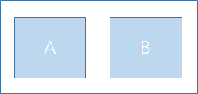
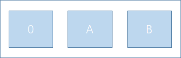
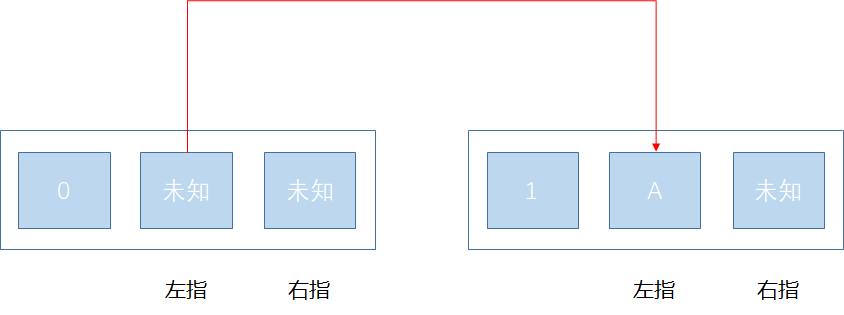
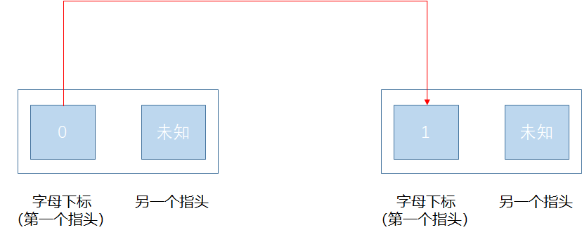
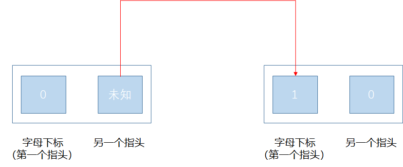

> 原文链接: https://leetcode-cn.com/problems/minimum-distance-to-type-a-word-using-two-fingers


## 英文原文
<div>
<p>You have a keyboard layout as shown above in the <strong>X-Y</strong> plane, where each English uppercase letter is located at some coordinate.</p>

<ul>
	<li>For example, the letter <code>&#39;A&#39;</code> is located at coordinate <code>(0, 0)</code>, the letter <code>&#39;B&#39;</code> is located at coordinate <code>(0, 1)</code>, the letter <code>&#39;P&#39;</code> is located at coordinate <code>(2, 3)</code> and the letter <code>&#39;Z&#39;</code> is located at coordinate <code>(4, 1)</code>.</li>
</ul>

<p>Given the string <code>word</code>, return <em>the minimum total <strong>distance</strong> to type such string using only two fingers</em>.</p>

<p>The <strong>distance</strong> between coordinates <code>(x<sub>1</sub>, y<sub>1</sub>)</code> and <code>(x<sub>2</sub>, y<sub>2</sub>)</code> is <code>|x<sub>1</sub> - x<sub>2</sub>| + |y<sub>1</sub> - y<sub>2</sub>|</code>.</p>

<p><strong>Note</strong> that the initial positions of your two fingers are considered free so do not count towards your total distance, also your two fingers do not have to start at the first letter or the first two letters.</p>

<p>&nbsp;</p>
<p><strong>Example 1:</strong></p>

<pre>
<strong>Input:</strong> word = &quot;CAKE&quot;
<strong>Output:</strong> 3
<strong>Explanation: 
</strong>Using two fingers, one optimal way to type &quot;CAKE&quot; is: 
Finger 1 on letter &#39;C&#39; -&gt; cost = 0 
Finger 1 on letter &#39;A&#39; -&gt; cost = Distance from letter &#39;C&#39; to letter &#39;A&#39; = 2 
Finger 2 on letter &#39;K&#39; -&gt; cost = 0 
Finger 2 on letter &#39;E&#39; -&gt; cost = Distance from letter &#39;K&#39; to letter &#39;E&#39; = 1 
Total distance = 3
</pre>

<p><strong>Example 2:</strong></p>

<pre>
<strong>Input:</strong> word = &quot;HAPPY&quot;
<strong>Output:</strong> 6
<strong>Explanation: </strong>
Using two fingers, one optimal way to type &quot;HAPPY&quot; is:
Finger 1 on letter &#39;H&#39; -&gt; cost = 0
Finger 1 on letter &#39;A&#39; -&gt; cost = Distance from letter &#39;H&#39; to letter &#39;A&#39; = 2
Finger 2 on letter &#39;P&#39; -&gt; cost = 0
Finger 2 on letter &#39;P&#39; -&gt; cost = Distance from letter &#39;P&#39; to letter &#39;P&#39; = 0
Finger 1 on letter &#39;Y&#39; -&gt; cost = Distance from letter &#39;A&#39; to letter &#39;Y&#39; = 4
Total distance = 6
</pre>

<p><strong>Example 3:</strong></p>

<pre>
<strong>Input:</strong> word = &quot;NEW&quot;
<strong>Output:</strong> 3
</pre>

<p><strong>Example 4:</strong></p>

<pre>
<strong>Input:</strong> word = &quot;YEAR&quot;
<strong>Output:</strong> 7
</pre>

<p>&nbsp;</p>
<p><strong>Constraints:</strong></p>

<ul>
	<li><code>2 &lt;= word.length &lt;= 300</code></li>
	<li><code>word</code> consists of uppercase English letters.</li>
</ul>
</div>

## 中文题目
<div><p></p>

<p>二指输入法定制键盘在 XY 平面上的布局如上图所示，其中每个大写英文字母都位于某个坐标处，例如字母&nbsp;<strong>A</strong>&nbsp;位于坐标&nbsp;<strong>(0,0)</strong>，字母&nbsp;<strong>B</strong>&nbsp;位于坐标&nbsp;<strong>(0,1)</strong>，字母&nbsp;<strong>P</strong>&nbsp;位于坐标&nbsp;<strong>(2,3)</strong>&nbsp;且字母 <strong>Z</strong>&nbsp;位于坐标&nbsp;<strong>(4,1)</strong>。</p>

<p>给你一个待输入字符串&nbsp;<code>word</code>，请你计算并返回在仅使用两根手指的情况下，键入该字符串需要的最小移动总距离。坐标&nbsp;<strong>(x<sub>1</sub>,y<sub>1</sub>)</strong> 和 <strong>(x<sub>2</sub>,y<sub>2</sub>)</strong> 之间的距离是&nbsp;<strong>|x<sub>1</sub> - x<sub>2</sub>| + |y<sub>1</sub> - y<sub>2</sub>|</strong>。&nbsp;</p>

<p>注意，两根手指的起始位置是零代价的，不计入移动总距离。你的两根手指的起始位置也不必从首字母或者前两个字母开始。</p>

<p>&nbsp;</p>

<p><strong>示例 1：</strong></p>

<pre><strong>输入：</strong>word = &quot;CAKE&quot;
<strong>输出：</strong>3
<strong>解释： 
</strong>使用两根手指输入 &quot;CAKE&quot; 的最佳方案之一是： 
手指 1 在字母 &#39;C&#39; 上 -&gt; 移动距离 = 0 
手指 1 在字母 &#39;A&#39; 上 -&gt; 移动距离 = 从字母 &#39;C&#39; 到字母 &#39;A&#39; 的距离 = 2 
手指 2 在字母 &#39;K&#39; 上 -&gt; 移动距离 = 0 
手指 2 在字母 &#39;E&#39; 上 -&gt; 移动距离 = 从字母 &#39;K&#39; 到字母 &#39;E&#39; 的距离  = 1 
总距离 = 3
</pre>

<p><strong>示例 2：</strong></p>

<pre><strong>输入：</strong>word = &quot;HAPPY&quot;
<strong>输出：</strong>6
<strong>解释： </strong>
使用两根手指输入 &quot;HAPPY&quot; 的最佳方案之一是：
手指 1 在字母 &#39;H&#39; 上 -&gt; 移动距离 = 0
手指 1 在字母 &#39;A&#39; 上 -&gt; 移动距离 = 从字母 &#39;H&#39; 到字母 &#39;A&#39; 的距离 = 2
手指 2 在字母 &#39;P&#39; 上 -&gt; 移动距离 = 0
手指 2 在字母 &#39;P&#39; 上 -&gt; 移动距离 = 从字母 &#39;P&#39; 到字母 &#39;P&#39; 的距离 = 0
手指 1 在字母 &#39;Y&#39; 上 -&gt; 移动距离 = 从字母 &#39;A&#39; 到字母 &#39;Y&#39; 的距离 = 4
总距离 = 6
</pre>

<p><strong>示例 3：</strong></p>

<pre><strong>输入：</strong>word = &quot;NEW&quot;
<strong>输出：</strong>3
</pre>

<p><strong>示例 4：</strong></p>

<pre><strong>输入：</strong>word = &quot;YEAR&quot;
<strong>输出：</strong>7
</pre>

<p>&nbsp;</p>

<p><strong>提示：</strong></p>

<ul>
	<li><code>2 &lt;= word.length &lt;= 300</code></li>
	<li>每个 <code>word[i]</code>&nbsp;都是一个大写英文字母。</li>
</ul>
</div>

## 通过代码
<RecoDemo>
</RecoDemo>


## 高赞题解
### 常规做法

#### 思路

我们将左指和右指所在的键位组成，看成一个状态。每次输入一个字母时，则其中一个手指会进行移动，**移动**的过程即是**状态转移**的过程。并且由于字母输入的顺序是固定的，每一个字母都可以看成一个阶段，字母不断输入的过程即是**阶段**的递增，例如第一个字母为第一个阶段，第二个字母为第二个阶段，后面以此类推。

因此，我们需要一个三维的状态来表示整个动态规划的过程，包括当前考虑的**字母下标**，**左指的键位**，**右指的键位**。

二指组成形成的状态：



三维状态：





接下来，让我们思考状态如何进行转移。假设字符串为 `CAKE`，并且此时阶段为 1，即当前考虑字母是 `A`。在这个阶段下，左右指会存在一种现象，要么左指为 `A` ，要么右指为 `A`，此时才能输入字母 `A`。

对于左指为 `A`，表示我们通过**移动左指**来到达这个阶段，而右指是**没有移动**的。总结来说，这个阶段下，左指会**变**成 `A`，右指**不变**。因此，我们需要遍历上一个阶段左指和右指的所有情况，并且转移到下一个阶段时，只移动左指（`dp[1][A][R] = Math.min(dp[1][A][R], dp[0][L][R] + move(L, A))`）。

注意观察，如果上一个阶段右指为 `R`，此时这个阶段右指也必须保持不变，同样为 `R`。





- 阶段 1 的右指和阶段 0 的右指键位相同。
- 阶段 1 的左指键位为 A。

对于右指为 `A` 的情况同理。

#### 代码

```java
class Solution {
    public int minimumDistance(String word) {
        // 初始化
        int[][][] dp = new int[301][26][26];
        for (int i = 1; i <= 300; i++) {
            for (int j = 0; j < 26; j++) {
                Arrays.fill(dp[i][j], Integer.MAX_VALUE);
            }
        }
        int ans = Integer.MAX_VALUE;
        char[] ca = word.toCharArray();
        // 遍历每个字母
        for (int i = 1; i <= word.length(); i++) {
            int v = ca[i - 1] - 'A';
            // 遍历上一个阶段左指键位
            for (int l = 0; l < 26; l++) {
                // 遍历上一个阶段右指键位
                for (int r = 0; r < 26; r++) {
                    // 判断上一个阶段的状态是否存在
                    if (dp[i - 1][l][r] != Integer.MAX_VALUE) {
                        // 移动左指
                        dp[i][v][r] = Math.min(dp[i][v][r], dp[i - 1][l][r] + help(l, v));
                        // 移动右指
                        dp[i][l][v] = Math.min(dp[i][l][v], dp[i - 1][l][r] + help(r, v));
                    }
                    if (i == word.length()) {
                        ans = Math.min(ans, dp[i][v][r]);
                        ans = Math.min(ans, dp[i][l][v]);
                    }
                }
            }
        }
        return ans;
    }
    // 计算距离
    public int help(int a, int b) {
        int x = a / 6, y = a % 6;
        int x2 = b / 6, y2 = b % 6;
        return (int)(Math.abs(x - x2)) + (int)(Math.abs(y - y2));
    }
}
```

#### 复杂度分析

- 时间复杂度：$O(26 * 26 * N)$，其中 N 为字符串 `word` 的长度。
- 空间复杂度：$O(26 * 26 * N)$，其中 N 为字符串 `word` 的长度。

### 空间优化

#### 思路

由于每个阶段只和上个阶段相关，我们可以使用滚动数组思想，循环利用数组，例如 `i % 2` 代表当前阶段，`(i - 1) % 2 代表上一个阶段`。

值得注意的是，每次我们计算出新数组后`dp[i % 2]`，需要重新初始化另外一个数组`dp[(i - 1) % 2]`，读者可尝试注释相关代码， 观察结果。

#### 代码

```java
class Solution {
    public int minimumDistance(String word) {
        // 初始化
        int[][][] dp = new int[2][26][26];
        for (int i = 0; i < 26; i++) {
            Arrays.fill(dp[1][i], Integer.MAX_VALUE);
        }
        int ans = Integer.MAX_VALUE;
        char[] ca = word.toCharArray();
        // 遍历每个字母
        for (int i = 1; i <= word.length(); i++) {
            int v = ca[i - 1] - 'A';
            // 遍历上一个阶段左指键位
            for (int l = 0; l < 26; l++) {
                // 遍历上一个阶段右指键位
                for (int r = 0; r < 26; r++) {
                    // 判断上一个阶段的状态是否存在
                    if (dp[(i - 1) % 2][l][r] == Integer.MAX_VALUE) {
                        continue;
                    }
                    if (dp[(i - 1) % 2][l][r] != Integer.MAX_VALUE) {
                        // 移动左指
                        dp[i % 2][v][r] = Math.min(dp[i % 2][v][r], dp[(i - 1) % 2][l][r] + help(l, v));
                        // 移动右指
                        dp[i % 2][l][v] = Math.min(dp[i % 2][l][v], dp[(i - 1) % 2][l][r] + help(r, v));
                    }
                    if (i == word.length()) {
                        ans = Math.min(ans, dp[i % 2][v][r]);
                        ans = Math.min(ans, dp[i % 2][l][v]);
                    }
                }
            }
            // 重新初始化另外一个数组
            for (int l = 0; l < 26; l++) {
                for (int r = 0; r < 26; r++) {
                    dp[(i - 1) % 2][l][r] = Integer.MAX_VALUE;
                }
            }

        }
        return ans;
    }
    // 计算距离
    public int help(int a, int b) {
        int x = a / 6, y = a % 6;
        int x2 = b / 6, y2 = b % 6;
        return (int)(Math.abs(x - x2)) + (int)(Math.abs(y - y2));
    }
}
```

#### 复杂度分析

- 时间复杂度：$O(26 * 26 * N)$，其中 N 为字符串 `word` 的长度。
- 空间复杂度：$O(26 * 26 * 2)$

### 时间优化

#### 思路

我们再重新观察一下这三个维度信息，分别是：**字母下标**，**左指的键位**，**右指的键位**。由于每次需要按下**一个字母**，左指键位或者右指键位必然有一个是这个**字母的键位**，因此字母下标也**隐含**着一个指头的**键位信息**，使用三个维度显然会有**冗余**，我们可以重新设计一种新的状态：**字母下标**（可以代表**第一个**指头键位），**另外一个指头的键位**。

每次按下一个字母时，要么是字母下标所在的指头（**第一个指头**）移动，要么是**另外一个指头**移动。

第一个指头移动的状态转移图如下：



- 状态 1 的另外一个指头键位等于状态 0 另外一个指头键位
- `dp[1][r] = Math.min(dp[1][r], dp[0][r] + move(word[0], word[1]))`

另外一个指头移动的状态转移图如下：




- 注意两个指头顺序交换，第一个指头变成另外一个指头，另外一个指头变成第一个指头。
- 状态 1 的另外一个指头键位等于状态 0 第一个指头键位
- `dp[1][word[0]] = Math.min(dp[1][word[0]], dp[0][r] + move(r, word[1]))`

#### 代码

```java
class Solution {
    public int minimumDistance(String word) {
        // 初始化
        int len = word.length();
        int ans = Integer.MAX_VALUE;
        char[] ca = word.toCharArray();
        // 第一个字母的初始值为 0，从第二个字母开始考虑。
        int[][] dp = new int[2][26];
        Arrays.fill(dp[1], Integer.MAX_VALUE);
        
        // 遍历每个字母
        for (int i = 2; i <= word.length(); i++) {
            int v = ca[i - 1] - 'A';
            // 遍历上一个阶段键位
            for (int j = 0; j < 26; j++) {
                if (dp[i % 2][j] == Integer.MAX_VALUE) {
                    continue;
                }
                int preV = ca[i - 2] - 'A';
                dp[(i + 1) % 2][j] = Math.min(dp[(i + 1) % 2][j], dp[i % 2][j] + help(preV, v));
                dp[(i + 1) % 2][preV] = Math.min(dp[(i + 1) % 2][preV], dp[i % 2][j] + help(j, v));
                if (i == word.length()) {
                    ans = Math.min(ans, dp[(i + 1) % 2][j]);
                    ans = Math.min(ans, dp[(i + 1) % 2][preV]);
                }
            }
            Arrays.fill(dp[i % 2], Integer.MAX_VALUE);
        }
        return ans;
    }
    // 计算距离
    public int help(int a, int b) {
        int x = a / 6, y = a % 6;
        int x2 = b / 6, y2 = b % 6;
        return (int)(Math.abs(x - x2)) + (int)(Math.abs(y - y2));
    }
}
```

#### 复杂度分析

- 时间复杂度：$O(26 * N)$，其中 N 为字符串 `word` 的长度。
- 空间复杂度：$O(26 * 2)$

&nbsp;

---

如果该题解对你有帮助，点个赞再走呗~

## 统计信息
| 通过次数 | 提交次数 | AC比率 |
| :------: | :------: | :------: |
|    2567    |    4347    |   59.1%   |

## 提交历史
| 提交时间 | 提交结果 | 执行时间 |  内存消耗  | 语言 |
| :------: | :------: | :------: | :--------: | :--------: |
