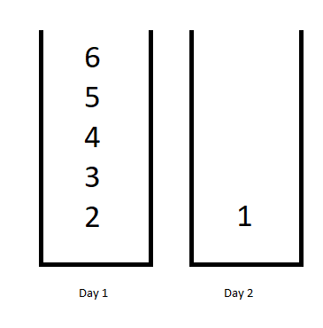
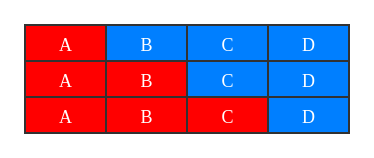
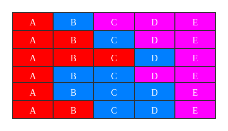

> 原文链接: https://leetcode-cn.com/problems/minimum-difficulty-of-a-job-schedule


## 英文原文
<div><p>You want to schedule a list of jobs in <code>d</code> days. Jobs are dependent (i.e To work on the <code>i-th</code> job, you have to finish all the jobs <code>j</code> where <code>0 &lt;= j &lt; i</code>).</p>

<p>You have to finish <strong>at least</strong> one task every day. The difficulty of a job schedule is the sum of difficulties of each day of the <code>d</code> days. The difficulty of a day is the maximum difficulty of a job done in that day.</p>

<p>Given an array of integers <code>jobDifficulty</code> and an integer <code>d</code>. The difficulty of the <code>i-th</code>&nbsp;job is&nbsp;<code>jobDifficulty[i]</code>.</p>

<p>Return <em>the minimum difficulty</em> of a job schedule. If you cannot find a schedule for the jobs return <strong>-1</strong>.</p>

<p>&nbsp;</p>
<p><strong>Example 1:</strong></p>

<pre>
<strong>Input:</strong> jobDifficulty = [6,5,4,3,2,1], d = 2
<strong>Output:</strong> 7
<strong>Explanation:</strong> First day you can finish the first 5 jobs, total difficulty = 6.
Second day you can finish the last job, total difficulty = 1.
The difficulty of the schedule = 6 + 1 = 7 
</pre>

<p><strong>Example 2:</strong></p>

<pre>
<strong>Input:</strong> jobDifficulty = [9,9,9], d = 4
<strong>Output:</strong> -1
<strong>Explanation:</strong> If you finish a job per day you will still have a free day. you cannot find a schedule for the given jobs.
</pre>

<p><strong>Example 3:</strong></p>

<pre>
<strong>Input:</strong> jobDifficulty = [1,1,1], d = 3
<strong>Output:</strong> 3
<strong>Explanation:</strong> The schedule is one job per day. total difficulty will be 3.
</pre>

<p><strong>Example 4:</strong></p>

<pre>
<strong>Input:</strong> jobDifficulty = [7,1,7,1,7,1], d = 3
<strong>Output:</strong> 15
</pre>

<p><strong>Example 5:</strong></p>

<pre>
<strong>Input:</strong> jobDifficulty = [11,111,22,222,33,333,44,444], d = 6
<strong>Output:</strong> 843
</pre>

<p>&nbsp;</p>
<p><strong>Constraints:</strong></p>

<ul>
	<li><code>1 &lt;= jobDifficulty.length &lt;= 300</code></li>
	<li><code>0 &lt;= jobDifficulty[i] &lt;= 1000</code></li>
	<li><code>1 &lt;= d &lt;= 10</code></li>
</ul>
</div>

## 中文题目
<div><p>你需要制定一份&nbsp;<code>d</code>&nbsp;天的工作计划表。工作之间存在依赖，要想执行第&nbsp;<code>i</code>&nbsp;项工作，你必须完成全部&nbsp;<code>j</code>&nbsp;项工作（&nbsp;<code>0 &lt;= j &lt; i</code>）。</p>

<p>你每天 <strong>至少</strong>&nbsp;需要完成一项任务。工作计划的总难度是这&nbsp;<code>d</code>&nbsp;天每一天的难度之和，而一天的工作难度是当天应该完成工作的最大难度。</p>

<p>给你一个整数数组&nbsp;<code>jobDifficulty</code>&nbsp;和一个整数&nbsp;<code>d</code>，分别代表工作难度和需要计划的天数。第&nbsp;<code>i</code>&nbsp;项工作的难度是&nbsp;<code>jobDifficulty[i]</code>。</p>

<p>返回整个工作计划的 <strong>最小难度</strong> 。如果无法制定工作计划，则返回&nbsp;<strong>-1&nbsp;</strong>。</p>

<p>&nbsp;</p>

<p><strong>示例 1：</strong></p>

<p></p>

<pre><strong>输入：</strong>jobDifficulty = [6,5,4,3,2,1], d = 2
<strong>输出：</strong>7
<strong>解释：</strong>第一天，您可以完成前 5 项工作，总难度 = 6.
第二天，您可以完成最后一项工作，总难度 = 1.
计划表的难度 = 6 + 1 = 7 
</pre>

<p><strong>示例 2：</strong></p>

<pre><strong>输入：</strong>jobDifficulty = [9,9,9], d = 4
<strong>输出：</strong>-1
<strong>解释：</strong>就算你每天完成一项工作，仍然有一天是空闲的，你无法制定一份能够满足既定工作时间的计划表。
</pre>

<p><strong>示例 3：</strong></p>

<pre><strong>输入：</strong>jobDifficulty = [1,1,1], d = 3
<strong>输出：</strong>3
<strong>解释：</strong>工作计划为每天一项工作，总难度为 3 。
</pre>

<p><strong>示例 4：</strong></p>

<pre><strong>输入：</strong>jobDifficulty = [7,1,7,1,7,1], d = 3
<strong>输出：</strong>15
</pre>

<p><strong>示例 5：</strong></p>

<pre><strong>输入：</strong>jobDifficulty = [11,111,22,222,33,333,44,444], d = 6
<strong>输出：</strong>843
</pre>

<p>&nbsp;</p>

<p><strong>提示：</strong></p>

<ul>
	<li><code>1 &lt;= jobDifficulty.length &lt;= 300</code></li>
	<li><code>0 &lt;=&nbsp;jobDifficulty[i] &lt;= 1000</code></li>
	<li><code>1 &lt;= d &lt;= 10</code></li>
</ul>
</div>

## 通过代码
<RecoDemo>
</RecoDemo>


## 高赞题解
# 1335. 工作计划的最低难度

Hi 大家好，我是张小猪。欢迎来到『宝宝也能看懂』系列之 leetcode 周赛题解。

这里是第 173 期的第 4 题，也是题目列表中的第 1335 题 -- 『工作计划的最低难度』

## 题目描述

你需要制定一份 `d` 天的工作计划表。工作之间存在依赖，要想执行第 `i` 项工作，你必须完成全部 `j` 项工作（`0 <= j < i`）。

你每天 **至少** 需要完成一项任务。工作计划的总难度是这 `d` 天每一天的难度之和，而一天的工作难度是当天应该完成工作的最大难度。

给你一个整数数组 `jobDifficulty` 和一个整数 `d`，分别代表工作难度和需要计划的天数。第 `i` 项工作的难度是 `jobDifficulty[i]`。

返回整个工作计划的 **最小难度**。如果无法制定工作计划，则返回 **-1**。

示例 1：



```shell
输入：jobDifficulty = [6,5,4,3,2,1], d = 2
输出：7
解释：第一天，您可以完成前 5 项工作，总难度 = 6.
第二天，您可以完成最后一项工作，总难度 = 1.
计划表的难度 = 6 + 1 = 7
```

示例 2：

```shell
输入：jobDifficulty = [9,9,9], d = 4
输出：-1
解释：就算你每天完成一项工作，仍然有一天是空闲的，你无法制定一份能够满足既定工作时间的计划表。
```

示例 3：

```shell
输入：jobDifficulty = [1,1,1], d = 3
输出：3
解释：工作计划为每天一项工作，总难度为 3 。
```

示例 4：

```shell
输入：jobDifficulty = [7,1,7,1,7,1], d = 3
输出：15
```

示例 5：

```shell
输入：jobDifficulty = [11,111,22,222,33,333,44,444], d = 6
输出：843
```

提示：

- `1 <= jobDifficulty.length <= 300`
- `0 <= jobDifficulty[i] <= 1000`
- `1 <= d <= 10`

## 官方难度

HARD

## 解决思路

题目内容看起来似乎有一点绕，我们把它剥去包装的外衣之后看看。其实就是一个由正整数组成的数组，需要把它分成 `d` 段，每一段至少有 1 个数字，并且每一段的值为这一段数字中最大的那个数。完成分段后便可以计算出所有分段的值的总和，需要返回这个总和的最小值。如果不能被拆分成 `d` 段则返回 `-1`。

看完题目之后，小猪的第一反应是，先把特殊情况处理掉吧。由于每一段至少需要一个数字，所以如果当数字的总数不够 `d` 的时候，也就无法完成拆分。这时候提前返回 `-1` 即可。另外，其实如果数字的总数就是 `d` 的话，那么拆分情况只有一种。这时候也可以提前返回了。不过这个看小伙伴们的个人爱好吧，毕竟也是可以和其他情况一起被计算的。

然后就到了核心的问题，我们应该如何拆分呢？

乍看起来我们是不是应该尽量把比较大的数划分到一段里？又或者和平均数、中位数什么的有关系？如果从这个角度去思考的话，可能会发现这样想起来会陷入泥潭。例如假设现在有 5 个数 `[a, b, c, d, e]`，需要被分成 3 段，那么可能的分发会有多种。假设我们现在拿到了平均数或者中位数，又该怎么判断呢？

小猪脑子苯苯的，数学又超烂，想不到这里应该如何用数学的方式去处理。所以，那就换个思路吧，我们试试用计算机的方式来处理。因为没有想到什么可用的区分条件，所以就发挥计算机的特长，枚举出所有可能，然后就能知道总和的最小值啦。摸摸猪鼻子，小猪真机智 >.<

为了得到所有的可能情况，我们可以想一些这些情况是如何产生的。下图是把 4 个数拆分成 2 段的情况：



然后我们再来看看把 5 个数拆分成 3 段的情况：



不知道小伙伴们有没有从上面的两个图中看出点什么，其实小猪这里不同拆分情况的排列顺序已经能体现这里的思路啦。我们从上往下看，会发现每一次我们都是把当前段落取到了极值。拆分为 2 段的时候，第一段就是当前段落，我们逐渐把它取到极值就得到了所有的可能性。拆分为 3 段的时候，我们先把第 1 段作为当前段落，取到极值；然后再针对第 1 段的不同情况，把第 2 段作为当前段落，取到极值。这样我们逐渐也就得到了所有可能情况。

那么，其实拆分成 `d` 段也是同一个道理。我们把当前段落不断的取到极值，并且作为下一段的开始条件，直到我们拆分到了最后一段。我们可以把它想象成是一颗分叉很多的树，不断的走完所有路径，我们也就得到了所有的可能情况。

### 深度优先遍历

既然说到了对于树的遍历，那我们就先尝试着用深度优先遍历来实现一下吧，并且递归写起来也比较简单嘛。这里稍微说一下递归函数的设计过程吧。

首先，我们明确一下这个递归函数的功能。我们希望它能返回把一段数据拆分成 n 段的最小总和。那么基于这个目的，我们的返回值就明确啦。

接下来，基于上面的思路，我们来看看函数的参数。由于终止条件是我们的拆分达到了最后一段，所以参数中一定需要还剩余待拆分的段数。另外，在拆分的过程中，我们也需要知道上一段的拆分的状况，也就是这一段拆分所开始的位置。所以参数中也一定需要当前所处的位置。

最后，有了思路，也想好了如何实现递归，接下来淦就完事啦。具体流程如下：

1. 特殊情况判断。
2. 初始化缓存并开始递归。
3. 根据分析实现结束条件和处理。
4. 逐渐取到当前段落的极值，并继续递归。

根据上面的流程，我们可以得到类似下面的代码：

```js
const minDifficulty = (jobDifficulty, d) => {
  const LEN = jobDifficulty.length;
  if (LEN < d) return -1;
  const cache = new Map();
  return helper(0, d);

  function helper(idx, count) {
    const key = idx * 100 + count;
    if (!cache.has(key)) {
      if (count === 1) {
        let max = 0;
        for (let i = idx; i < LEN; ++i) {
          jobDifficulty[i] > max && (max = jobDifficulty[i]);
        }
        return max;
      }
      let min = 10000;
      let curMax = 0;
      for (let i = idx; i <= LEN - count; ++i) {
        if (jobDifficulty[i] > curMax) curMax = jobDifficulty[i];
        min = Math.min(min, curMax + helper(i + 1, count - 1));
      }
      cache.set(key, min);
    }
    return cache.get(key);
  }
};
```

### 动态规划

接下来我们来换个思路。先来定义两个符号吧：

- 我们假设当前的位置是 `i`，然后从 `i` 开始我们还差 `j` 次拆分没有做。我们把当前状态下的这个最小值记作 `dp[i][j]`。
- 我们从原始数组中截取下标从 `i` 开始到 `j` 的一段，这一段里的最大值我们记作 `max(i, j)`。

基于上面的定义，首先可以得到的就是我们的目标，即算出 `dp[0][d]`。那么我们可以先看看我们目前有什么数据：

- 由于只拆分一次的话相当于就是求最大值，是可以直接算出结果的。所以，我们目前可以直接得到 `dp[n - 1][1]`、`dp[n - 2][1]` ... `dp[0][1]` 这些值。
- 如果剩余的数量和我们要拆分的数量一样，那么拆分也值有一种可能，即每一段都是一个值。所以，对于我们来说也是一个可以直接算出来的值。例如 `dp[n - 2][2]`、`dp[n - 3][3]` ... `dp[n - d][d]`。
- 由于有原始数组，所以 `max(i, j)` 也是可以直接计算出来的值。

那么接下来，基于我们已经有的数据，再来看看还可以得到那些其他的值。首先，我们来看看之前图里的那个栗子吧 -- `dp[n - 4][2]`，它可能会有哪些情况：

- `dp[n - 3][1] + max(n - 4, n - 4)`
- `dp[n - 2][1] + max(n - 4, n - 3)`
- `dp[n - 1][1] + max(n - 4, n - 2)`

不知道有没有小伙伴发现，其实这里的几个值都是在我们上面当前可以直接计算出的数据里的。再来看个更复杂一点的，之前图里的栗子 -- `dp[n - 5][3]`，它可能的情况会有这些：

- `dp[n - 3][1] + max(n - 5, n - 5) + max(n - 4, n - 4)`
- `dp[n - 2][1] + max(n - 5, n - 5) + max(n - 4, n - 3)`
- `dp[n - 1][1] + max(n - 5, n - 5) + max(n - 4, n - 2)`
- `dp[n - 2][1] + max(n - 5, n - 4) + max(n - 3, n - 3)`
- `dp[n - 1][1] + max(n - 5, n - 4) + max(n - 3, n - 2)`
- `dp[n - 1][1] + max(n - 5, n - 3) + max(n - 2, n - 2)`

阿勒？是不是觉得我们已经发现了什么？不过如果我们一直这样展开下去，项数便会越来越多。那么是否可以减少一些项数呢？我们可以详细的看一下 `dp[n - 5][3]` 里面的内容，再对比 `dp[n - 4][2]` 的内容。如果还不够清晰，我们再补充一下下面两条内容：

- `dp[n - 3][2]` 展开后：
  - `dp[n - 2][1] + max(n - 3, n - 3)`
  - `dp[n - 1][1] + max(n - 3, n - 2)`
- `dp[n - 2][2]` 展开后：
  - `dp[n - 1][1] + max(n - 2, n - 2)`

嘿嘿，这下是不是就和 `dp[n - 5][3]` 的内容都一一对应上了呀。小猪开心的扭了扭尾巴 >.<

最后，我们把它抽象成 `dp[i][j]` 吧：

```js
dp[i][j] = Math.min(
  dp[i + 1][j - 1] + max(i, i),
  dp[i + 2][j - 1] + max(i, i + 1),
  ...
  dp[n - j + 1][j - 1] + max(i, n - j)
);
```

有了这个递推公式以后，剩下的就是实现即可。具体流程如下：

1. 特殊情况判断。
2. 初始化 `dp` 数组和为段为 1 的值。
3. 根据递推公式推导多个分段的结果。
4. 返回结果。

```js
const minDifficulty = (jobDifficulty, d) => {
  const LEN = jobDifficulty.length;
  if (LEN < d) return -1;
  const dp = Array.from({ length: LEN }, () => new Uint16Array(d + 1).fill(10000));

  for (let i = LEN - 1, curMax = 0; i >= 0; --i) {
    jobDifficulty[i] > curMax && (curMax = jobDifficulty[i]);
    dp[i][1] = curMax;
  }

  for (let i = 2; i <= d; ++i) {
    for (let j = 0; j <= LEN - i; ++j) {
      let max = 0;
      for (let k = j; k <= LEN - i; ++k) {
        jobDifficulty[k] > max && (max = jobDifficulty[k]);
        dp[j][i] = Math.min(dp[j][i], dp[k + 1][i - 1] + max);
      }
    }
  }

  return dp[0][d];
};
```

### 优化

按照惯例，我们把这个二维 `dp` 优化成一维的吧。改动其实并不大，主要就是迭代过程中不断的覆盖之前的值，以达到缩减成一维数组的目的。具体代码如下：

```js
const minDifficulty = (jobDifficulty, d) => {
  const LEN = jobDifficulty.length;
  if (LEN < d) return -1;
  const dp = new Uint16Array(LEN + 1);

  for (let i = LEN - 1; i >= 0; --i) {
    dp[i] = jobDifficulty[i] > dp[i + 1] ? jobDifficulty[i] : dp[i + 1];
  }

  for (let i = 2; i <= d; ++i) {
    for (let j = 0; j <= LEN - i; ++j) {
      let max = 0;
      dp[j] = 10000;
      for (let k = j; k <= LEN - i; ++k) {
        jobDifficulty[k] > max && (max = jobDifficulty[k]);
        dp[j] > dp[k + 1] + max && (dp[j] = dp[k + 1] + max);
      }
    }
  }

  return dp[0];
};
```

这段代码目前跑出了 52ms，暂时 beats 100%。

### 再优化

这里在最内层循环中，我们可以尝试不去遍历所有内容，而是通过一个内容有序的栈来做判断和记录，以尽量减少这里的计算次数。具体代码如下：

```js
const minDifficulty = (jobDifficulty, d) => {
  const LEN = jobDifficulty.length;
  if (LEN < d) return -1;

  const dp = new Uint16Array(LEN);
  dp[0] = jobDifficulty[0];
  for (let i = 1; i < LEN; ++i) {
    dp[i] = jobDifficulty[i] > dp[i - 1] ? jobDifficulty[i] : dp[i - 1];
  }

  for (let i = 1; i < d; ++i) {
    const stack = [];
    let old = dp[i - 1];
    for (let j = i; j < LEN; ++j) {
      let min = old;
      while (stack.length && jobDifficulty[stack[stack.length - 1]] <= jobDifficulty[j]) {
        const top = stack.pop();
        min = Math.min(min, dp[top] - jobDifficulty[top]);
      }
      old = dp[j];
      dp[j] = min + jobDifficulty[j];
      if (stack.length) {
        const top = dp[stack[stack.length - 1]];
        top < dp[j] && (dp[j] = top);
      }
      stack.push(j);
    }
  }

  return dp[LEN - 1];
};
```

这段代码目前跑出了 48ms，代替了之前的代码暂时 beats 100%。

## 总结

这道题的核心内容又是在 HARD 难度中很常见的动态规划问题。小猪这里通过栗子和罗列数据，一步一步的推导出动态规划的递推公式，希望能够帮到对这一部分还不太清晰的小伙伴们。至于后续的两次优化，小猪觉得只是锦上添花而以。可有可无，看看就好啦。

发现我们似乎已经说过好几次动态规划的问题了，小伙伴们有没有找到一点其中的小技巧呢？小猪也想知道呢，哼唧 >.<

**加油武汉，天佑中华**

## 相关链接

- [Weekly Contest 173 题目列表](https://github.com/poppinlp/leetcode#weekly-contest-173)
- [系列题解 repo](https://github.com/poppinlp/leetcode)
- [我的 segmentfault 专栏](https://segmentfault.com/blog/zxzfbz)
- [我的知乎专栏](https://zhuanlan.zhihu.com/zxzfbz)


## 统计信息
| 通过次数 | 提交次数 | AC比率 |
| :------: | :------: | :------: |
|    3694    |    6251    |   59.1%   |

## 提交历史
| 提交时间 | 提交结果 | 执行时间 |  内存消耗  | 语言 |
| :------: | :------: | :------: | :--------: | :--------: |
