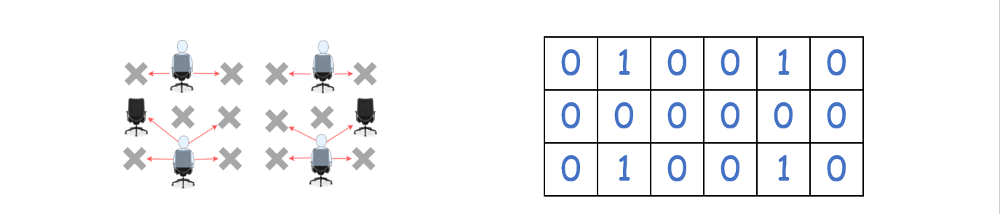
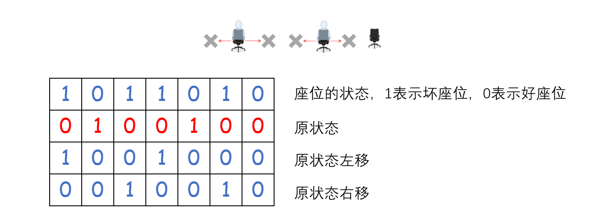

> 原文链接: https://leetcode-cn.com/problems/maximum-students-taking-exam


## 英文原文
<div><p>Given a <code>m&nbsp;* n</code>&nbsp;matrix <code>seats</code>&nbsp;&nbsp;that represent seats distributions&nbsp;in a classroom.&nbsp;If a seat&nbsp;is&nbsp;broken, it is denoted by <code>&#39;#&#39;</code> character otherwise it is denoted by a <code>&#39;.&#39;</code> character.</p>

<p>Students can see the answers of those sitting next to the left, right, upper left and upper right, but he cannot see the answers of the student sitting&nbsp;directly in front or behind him. Return the <strong>maximum </strong>number of students that can take the exam together&nbsp;without any cheating being possible..</p>

<p>Students must be placed in seats in good condition.</p>

<p>&nbsp;</p>
<p><strong>Example 1:</strong></p>

<pre>
<strong>Input:</strong> seats = [[&quot;#&quot;,&quot;.&quot;,&quot;#&quot;,&quot;#&quot;,&quot;.&quot;,&quot;#&quot;],
&nbsp;               [&quot;.&quot;,&quot;#&quot;,&quot;#&quot;,&quot;#&quot;,&quot;#&quot;,&quot;.&quot;],
&nbsp;               [&quot;#&quot;,&quot;.&quot;,&quot;#&quot;,&quot;#&quot;,&quot;.&quot;,&quot;#&quot;]]
<strong>Output:</strong> 4
<strong>Explanation:</strong> Teacher can place 4 students in available seats so they don&#39;t cheat on the exam. 
</pre>

<p><strong>Example 2:</strong></p>

<pre>
<strong>Input:</strong> seats = [[&quot;.&quot;,&quot;#&quot;],
&nbsp;               [&quot;#&quot;,&quot;#&quot;],
&nbsp;               [&quot;#&quot;,&quot;.&quot;],
&nbsp;               [&quot;#&quot;,&quot;#&quot;],
&nbsp;               [&quot;.&quot;,&quot;#&quot;]]
<strong>Output:</strong> 3
<strong>Explanation:</strong> Place all students in available seats. 

</pre>

<p><strong>Example 3:</strong></p>

<pre>
<strong>Input:</strong> seats = [[&quot;#&quot;,&quot;.&quot;,&quot;<strong>.</strong>&quot;,&quot;.&quot;,&quot;#&quot;],
&nbsp;               [&quot;<strong>.</strong>&quot;,&quot;#&quot;,&quot;<strong>.</strong>&quot;,&quot;#&quot;,&quot;<strong>.</strong>&quot;],
&nbsp;               [&quot;<strong>.</strong>&quot;,&quot;.&quot;,&quot;#&quot;,&quot;.&quot;,&quot;<strong>.</strong>&quot;],
&nbsp;               [&quot;<strong>.</strong>&quot;,&quot;#&quot;,&quot;<strong>.</strong>&quot;,&quot;#&quot;,&quot;<strong>.</strong>&quot;],
&nbsp;               [&quot;#&quot;,&quot;.&quot;,&quot;<strong>.</strong>&quot;,&quot;.&quot;,&quot;#&quot;]]
<strong>Output:</strong> 10
<strong>Explanation:</strong> Place students in available seats in column 1, 3 and 5.
</pre>

<p>&nbsp;</p>
<p><strong>Constraints:</strong></p>

<ul>
	<li><code>seats</code>&nbsp;contains only characters&nbsp;<code>&#39;.&#39;<font face="sans-serif, Arial, Verdana, Trebuchet MS">&nbsp;and</font></code><code>&#39;#&#39;.</code></li>
	<li><code>m ==&nbsp;seats.length</code></li>
	<li><code>n ==&nbsp;seats[i].length</code></li>
	<li><code>1 &lt;= m &lt;= 8</code></li>
	<li><code>1 &lt;= n &lt;= 8</code></li>
</ul>
</div>

## 中文题目
<div><p>给你一个&nbsp;<code>m&nbsp;* n</code>&nbsp;的矩阵 <code>seats</code>&nbsp;表示教室中的座位分布。如果座位是坏的（不可用），就用&nbsp;<code>&#39;#&#39;</code>&nbsp;表示；否则，用&nbsp;<code>&#39;.&#39;</code>&nbsp;表示。</p>

<p>学生可以看到左侧、右侧、左上、右上这四个方向上紧邻他的学生的答卷，但是看不到直接坐在他前面或者后面的学生的答卷。请你计算并返回该考场可以容纳的一起参加考试且无法作弊的最大学生人数。</p>

<p>学生必须坐在状况良好的座位上。</p>

<p>&nbsp;</p>

<p><strong>示例 1：</strong></p>

<p></p>

<pre><strong>输入：</strong>seats = [[&quot;#&quot;,&quot;.&quot;,&quot;#&quot;,&quot;#&quot;,&quot;.&quot;,&quot;#&quot;],
&nbsp;             [&quot;.&quot;,&quot;#&quot;,&quot;#&quot;,&quot;#&quot;,&quot;#&quot;,&quot;.&quot;],
&nbsp;             [&quot;#&quot;,&quot;.&quot;,&quot;#&quot;,&quot;#&quot;,&quot;.&quot;,&quot;#&quot;]]
<strong>输出：</strong>4
<strong>解释：</strong>教师可以让 4 个学生坐在可用的座位上，这样他们就无法在考试中作弊。 
</pre>

<p><strong>示例 2：</strong></p>

<pre><strong>输入：</strong>seats = [[&quot;.&quot;,&quot;#&quot;],
&nbsp;             [&quot;#&quot;,&quot;#&quot;],
&nbsp;             [&quot;#&quot;,&quot;.&quot;],
&nbsp;             [&quot;#&quot;,&quot;#&quot;],
&nbsp;             [&quot;.&quot;,&quot;#&quot;]]
<strong>输出：</strong>3
<strong>解释：</strong>让所有学生坐在可用的座位上。
</pre>

<p><strong>示例 3：</strong></p>

<pre><strong>输入：</strong>seats = [[&quot;#&quot;,&quot;.&quot;,&quot;<strong>.</strong>&quot;,&quot;.&quot;,&quot;#&quot;],
&nbsp;             [&quot;<strong>.</strong>&quot;,&quot;#&quot;,&quot;<strong>.</strong>&quot;,&quot;#&quot;,&quot;<strong>.</strong>&quot;],
&nbsp;             [&quot;<strong>.</strong>&quot;,&quot;.&quot;,&quot;#&quot;,&quot;.&quot;,&quot;<strong>.</strong>&quot;],
&nbsp;             [&quot;<strong>.</strong>&quot;,&quot;#&quot;,&quot;<strong>.</strong>&quot;,&quot;#&quot;,&quot;<strong>.</strong>&quot;],
&nbsp;             [&quot;#&quot;,&quot;.&quot;,&quot;<strong>.</strong>&quot;,&quot;.&quot;,&quot;#&quot;]]
<strong>输出：</strong>10
<strong>解释：</strong>让学生坐在第 1、3 和 5 列的可用座位上。
</pre>

<p>&nbsp;</p>

<p><strong>提示：</strong></p>

<ul>
	<li><code>seats</code>&nbsp;只包含字符&nbsp;<code>&#39;.&#39;&nbsp;和</code><code>&#39;#&#39;</code></li>
	<li><code>m ==&nbsp;seats.length</code></li>
	<li><code>n ==&nbsp;seats[i].length</code></li>
	<li><code>1 &lt;= m &lt;= 8</code></li>
	<li><code>1 &lt;= n &lt;= 8</code></li>
</ul>
</div>

## 通过代码
<RecoDemo>
</RecoDemo>


## 高赞题解
### 1. 什么是动态规划（dynamic programming，DP）
很多情况下我们都把动态规划想得太复杂了，我也是其中一个。quora 上有一个回答是这么说的：
- 首先在一张纸上写下 $1+1+1+1+1+1+1+1=？$
- “它等于多少呢？”
- 我们会立即脱口而出，“等于8！”
- 如果我们在左边添一个 $1 +$
- “会等于多少呢？”
- 当然，不用想，“等于9！”
- “为什么你会计算得这么快呢？”
- “因为 $8+1=9$”

所以，我们没有重新计算 $1+1+1+1+1+1+1+1+1$ 的值因为我们记住了前面的和等于 8，所以再次计算时只需再加 1 就可以了。

**我们通过记住一些事情来节省时间，这就是动态规划的精髓。** 具体来说，如果一个问题的子问题会被我们重复利用，我们则可以考虑使用动态规划。

### 2. 什么是状态压缩 DP

一般来说，动态规划使用一个一维数组或者二维数组来保存状态。

比如 [42.接雨水](https://leetcode-cn.com/problems/trapping-rain-water/) 中，我们使用**一维数组** `dp[i]` 表示下标 `i`左边最高柱子的高度。`dp[i]` 包含了两个信息：
- 下标 `i` 左边的柱子
- 最高的高度值

比如 [10.正则表达式匹配](https://leetcode-cn.com/problems/regular-expression-matching/) 中，我们使用**二维数组** `dp[i][j]` 表示 字符串 `s` 的前 `i` 项和 `t` 的前 `j` 项是否匹配。`dp[i][j]` 包含了三个信息：
- `s` 的前 `i` 项
- `t` 的前 `j` 项
- 是否匹配

对于本题来讲，通过分析，我们也可以表示类似的状态，`dp[i][j]` 表示当第 `i` 行的座位分布为 `j` 时，前 `i` 行可容纳的最大学生人数。但如果我们还想知道第 `i` 行有多少个座位呢？这无疑多了一个维度，这时我们不能用类似 ` dp[i][j][k]` 来表示了，因为计算机中没有类似三维的数据结构。

这时候状态中所包含的信息过多，该怎么办呢？我们可以**利用二进制以及位运算来实现对于本来应该很大的数组的操作，这就是状态压缩**，而使用状态压缩来保存状态的 DP 就叫做状态压缩 DP。

### 3. 解题思路
*1. 用位编码表示状态*

题目中提到 m，n 不超过 8，图我们可以使用位编码记录每一行的状态，即当椅子上坐了一个人时，我们将该位置设为 1，如下图所示：

{:width=500}


*2. 判断此状态是否有效*
对于如下图的座位中，我们看到坐了两个人，如何判断这个状态是不是有效的呢？首先将原状态左移，右移，如果它们的与运算结果为 0，则表明学生左侧和右侧没有人坐。此外，类似地，我们还要保证学生坐在良好的座位上。

{:width=500}


*3. 判断此状态 i 与下一个状态 i+1 的关系*
与步骤 2 类似，将下一行的状态 i+1 分别左移，右移，再与状态 i 作与运算，来判断状态 i 的左上和右上是否有人，从而判断是否可以传递状态。

如果与运算结果为 0，表示左上或者右上没有人，满足传递状态，这时状态转移方程为 `dp[i+1][j] = max(dp[i+1][j], dp[i][k] + count(j))`，`count(j)` 表示 `i+1` 状态中 1 的数量。


### 代码

```python []
from functools import reduce
class Solution:
    def maxStudents(self, seats: List[List[str]]) -> int:
        m, n = len(seats), len(seats[0]),
        dp = [[0]*(1 << n) for _ in range(m+1)]  # 状态数组 dp
        a = [reduce(lambda x,y:x|1<<y,[0]+[j for j in range(n) if seats[i][j]=='#'])  for i in range(m)] # 将 # 设为 1，当遇到 . 时与运算结果为 0，表示可以坐人
        # print(a)
        for row in range(m)[::-1]: # 倒着遍历
            for j in range(1 << n):
                if not j & j<<1 and not j&j>>1 and not j & a[row]: # j & a[row]代表该位置可以坐人，j & j<<1 and not j&j>>1 表示该位置左右没人可以坐的
                    for k in range(1 << n):
                        if not j&k<<1 and not j&k>>1: # j状态的左上和右上没有人
                            dp[row][j] = max(dp[row][j], dp[row+1][k] + bin(j).count('1'))
        # print(dp)
        return max(dp[0])

```

```C++ []
class Solution {
public:
    int maxStudents(vector<vector<char>>& seats) {
        int m=seats.size();
    int n=seats[0].size();
    vector<vector<int>> dp(m+1,vector<int>(1<<n));  //初始化

    for(int row=1;row<=m;row++){
        for(int s=0;s<(1<<n);s++){//遍历 2^n 个状态
            bitset<8> bs(s);//记录对应状态的bit位
            bool ok=true;
            for(int j=0;j<n;j++){
                if((bs[j] && seats[row-1][j]=='#') || (j<n-1 && bs[j] && bs[j+1])){//不能坐在坏椅子上也不能在同一行相邻坐
                    ok=false;
                    break;
                }
            }
            if(!ok){
                dp[row][s]=-1;//说明坐在坏椅子上或相邻坐了，该状态舍弃
                continue;
            }
            for(int last=0;last<(1<<n);last++){//找到一种当前行的可行状态后，遍历上一行的所有状态
                if(dp[row-1][last]==-1)//上一行的状态被舍弃了，那就直接下一个状态
                    continue;
                bitset<8> lbs(last);
                bool flag=true;
                for(int j=0;j<n;j++){
                    if(lbs[j] && ((j>0 && bs[j-1]) || (j<n-1 && bs[j+1]))){//如果找到的这个上一行状态的j位置坐了人，
                        flag=false;                                    //下一行的j+1位置或j-1位置也坐了人，那么该状态不合法，舍弃
                        break;
                    }
                }
                if(flag){//flag为真说明这个last状态的每个位置都合法
                    dp[row][s]=max(dp[row][s],dp[row-1][last]+(int)bs.count());//转移方程
                }
            }

        }
    }
    int res=0;
    for(int i=0;i<(1<<n);i++){//在最后一行的所有状态中找出最大的
        if(dp[m][i]>res){
            res=dp[m][i];
        }
    }
    return res;
    }
};
```

### 复杂度分析
- 时间复杂度：$O(M\times2^{2N})$。$M$，$N$ 分别为输入数组的行数和列数。
- 空间复杂度：$O(M\times2^{N})$。使用了二维数组。

如有问题，欢迎讨论~

## 统计信息
| 通过次数 | 提交次数 | AC比率 |
| :------: | :------: | :------: |
|    3332    |    6596    |   50.5%   |

## 提交历史
| 提交时间 | 提交结果 | 执行时间 |  内存消耗  | 语言 |
| :------: | :------: | :------: | :--------: | :--------: |
