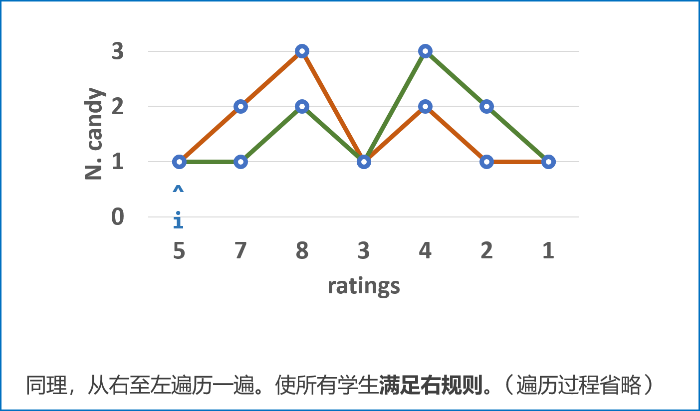

> 原文链接: https://leetcode-cn.com/problems/candy


## 英文原文
<div><p>There are <code>n</code> children standing in a line. Each child is assigned a rating value given in the integer array <code>ratings</code>.</p>

<p>You are giving candies to these children subjected to the following requirements:</p>

<ul>
	<li>Each child must have at least one candy.</li>
	<li>Children with a higher rating get more candies than their neighbors.</li>
</ul>

<p>Return <em>the minimum number of candies you need to have to distribute the candies to the children</em>.</p>

<p>&nbsp;</p>
<p><strong>Example 1:</strong></p>

<pre>
<strong>Input:</strong> ratings = [1,0,2]
<strong>Output:</strong> 5
<strong>Explanation:</strong> You can allocate to the first, second and third child with 2, 1, 2 candies respectively.
</pre>

<p><strong>Example 2:</strong></p>

<pre>
<strong>Input:</strong> ratings = [1,2,2]
<strong>Output:</strong> 4
<strong>Explanation:</strong> You can allocate to the first, second and third child with 1, 2, 1 candies respectively.
The third child gets 1 candy because it satisfies the above two conditions.
</pre>

<p>&nbsp;</p>
<p><strong>Constraints:</strong></p>

<ul>
	<li><code>n == ratings.length</code></li>
	<li><code>1 &lt;= n &lt;= 2 * 10<sup>4</sup></code></li>
	<li><code>0 &lt;= ratings[i] &lt;= 2 * 10<sup>4</sup></code></li>
</ul>
</div>

## 中文题目
<div><p>老师想给孩子们分发糖果，有 <em>N</em> 个孩子站成了一条直线，老师会根据每个孩子的表现，预先给他们评分。</p>

<p>你需要按照以下要求，帮助老师给这些孩子分发糖果：</p>

<ul>
	<li>每个孩子至少分配到 1 个糖果。</li>
	<li>评分更高的孩子必须比他两侧的邻位孩子获得更多的糖果。</li>
</ul>

<p>那么这样下来，老师至少需要准备多少颗糖果呢？</p>

<p> </p>

<p><strong>示例 1：</strong></p>

<pre>
<strong>输入：</strong>[1,0,2]
<strong>输出：</strong>5
<strong>解释：</strong>你可以分别给这三个孩子分发 2、1、2 颗糖果。
</pre>

<p><strong>示例 2：</strong></p>

<pre>
<strong>输入：</strong>[1,2,2]
<strong>输出：</strong>4
<strong>解释：</strong>你可以分别给这三个孩子分发 1、2、1 颗糖果。
     第三个孩子只得到 1 颗糖果，这已满足上述两个条件。</pre>
</div>

## 通过代码
<RecoDemo>
</RecoDemo>


## 高赞题解
### 解题思路：

- **规则定义：** 设学生 $A$ 和学生 $B$ 左右相邻，$A$ 在 $B$ 左边；
  - **左规则：** 当 $ratings_B>ratings_A$时，$B$ 的糖比 $A$ 的糖数量多。
  - **右规则：** 当 $ratings_A>ratings_B$时，$A$ 的糖比 $B$ 的糖数量多。

> 相邻的学生中，评分高的学生必须获得更多的糖果 **等价于** 所有学生满足左规则且满足右规则。

- **算法流程：**

  1. 先从左至右遍历学生成绩 `ratings`，按照以下规则给糖，并记录在 `left` 中：

     1. 先给所有学生 $1$ 颗糖；
     2. 若 $ratings_i>ratings_{i-1}$，则第 $i$ 名学生糖比第 $i - 1$ 名学生多 $1$ 个。
     3. 若 $ratings_i<=ratings_{i-1}$，则第 $i$ 名学生糖数量不变。（交由从右向左遍历时处理。）

     - 经过此规则分配后，可以保证所有学生糖数量 **满足左规则** 。

  2. 同理，在此规则下从右至左遍历学生成绩并记录在 `right` 中，可以保证所有学生糖数量 **满足右规则** 。
  3. 最终，取以上 $2$ 轮遍历 `left` 和 `right` 对应学生糖果数的 **最大值** ，这样则 **同时满足左规则和右规则** ，即得到每个同学的最少糖果数量。

- **复杂度分析：**
  - **时间复杂度 $O(N)$ ：** 遍历两遍数组即可得到结果；
  - **空间复杂度 $O(N)$ ：**  需要借用`left`，`right`的线性额外空间。

<,,,,,,,,,,>

#### 代码：

```Python []
class Solution:
    def candy(self, ratings: List[int]) -> int:
        left = [1 for _ in range(len(ratings))]
        right = left[:]
        for i in range(1, len(ratings)):
            if ratings[i] > ratings[i - 1]: left[i] = left[i - 1] + 1
        count = left[-1]
        for i in range(len(ratings) - 2, -1, -1):
            if ratings[i] > ratings[i + 1]: right[i] = right[i + 1] + 1
            count += max(left[i], right[i])
        return count
```

```Java []
class Solution {
    public int candy(int[] ratings) {
        int[] left = new int[ratings.length];
        int[] right = new int[ratings.length];
        Arrays.fill(left, 1);
        Arrays.fill(right, 1);
        for(int i = 1; i < ratings.length; i++)
            if(ratings[i] > ratings[i - 1]) left[i] = left[i - 1] + 1;
        int count = left[ratings.length - 1];
        for(int i = ratings.length - 2; i >= 0; i--) {
            if(ratings[i] > ratings[i + 1]) right[i] = right[i + 1] + 1;
            count += Math.max(left[i], right[i]);
        }
        return count;
    }
}
```

## 统计信息
| 通过次数 | 提交次数 | AC比率 |
| :------: | :------: | :------: |
|    107964    |    222082    |   48.6%   |

## 提交历史
| 提交时间 | 提交结果 | 执行时间 |  内存消耗  | 语言 |
| :------: | :------: | :------: | :--------: | :--------: |
