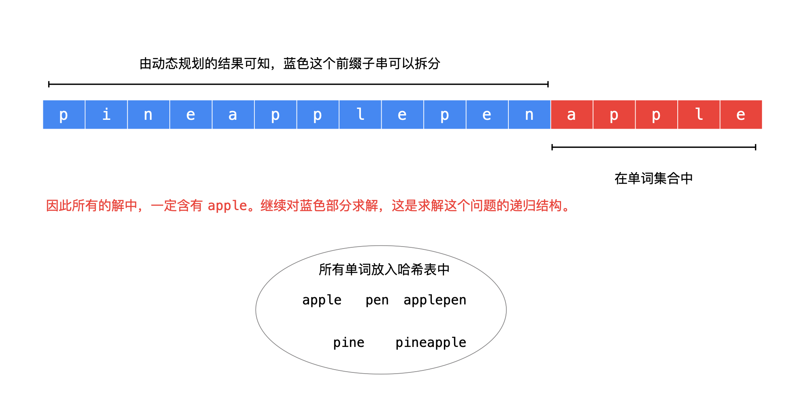
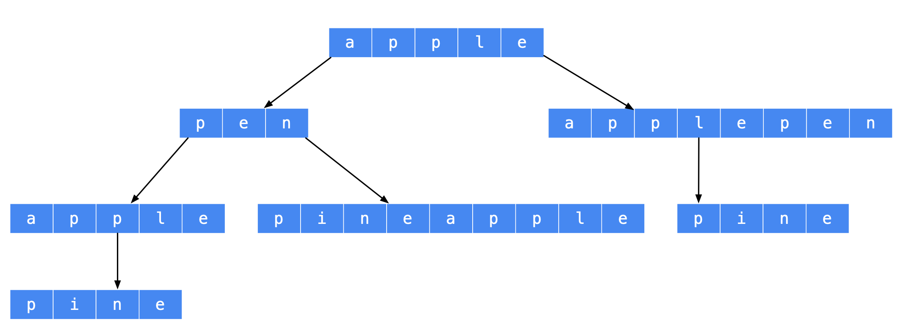

> 原文链接: https://leetcode-cn.com/problems/word-break-ii


## 英文原文
<div><p>Given a string <code>s</code> and a dictionary of strings <code>wordDict</code>, add spaces in <code>s</code> to construct a sentence where each word is a valid dictionary word. Return all such possible sentences in <strong>any order</strong>.</p>

<p><strong>Note</strong> that the same word in the dictionary may be reused multiple times in the segmentation.</p>

<p>&nbsp;</p>
<p><strong>Example 1:</strong></p>

<pre>
<strong>Input:</strong> s = &quot;catsanddog&quot;, wordDict = [&quot;cat&quot;,&quot;cats&quot;,&quot;and&quot;,&quot;sand&quot;,&quot;dog&quot;]
<strong>Output:</strong> [&quot;cats and dog&quot;,&quot;cat sand dog&quot;]
</pre>

<p><strong>Example 2:</strong></p>

<pre>
<strong>Input:</strong> s = &quot;pineapplepenapple&quot;, wordDict = [&quot;apple&quot;,&quot;pen&quot;,&quot;applepen&quot;,&quot;pine&quot;,&quot;pineapple&quot;]
<strong>Output:</strong> [&quot;pine apple pen apple&quot;,&quot;pineapple pen apple&quot;,&quot;pine applepen apple&quot;]
<strong>Explanation:</strong> Note that you are allowed to reuse a dictionary word.
</pre>

<p><strong>Example 3:</strong></p>

<pre>
<strong>Input:</strong> s = &quot;catsandog&quot;, wordDict = [&quot;cats&quot;,&quot;dog&quot;,&quot;sand&quot;,&quot;and&quot;,&quot;cat&quot;]
<strong>Output:</strong> []
</pre>

<p>&nbsp;</p>
<p><strong>Constraints:</strong></p>

<ul>
	<li><code>1 &lt;= s.length &lt;= 20</code></li>
	<li><code>1 &lt;= wordDict.length &lt;= 1000</code></li>
	<li><code>1 &lt;= wordDict[i].length &lt;= 10</code></li>
	<li><code>s</code> and <code>wordDict[i]</code> consist of only lowercase English letters.</li>
	<li>All the strings of <code>wordDict</code> are <strong>unique</strong>.</li>
</ul>
</div>

## 中文题目
<div><p>给定一个<strong>非空</strong>字符串 <em>s</em> 和一个包含<strong>非空</strong>单词列表的字典 <em>wordDict</em>，在字符串中增加空格来构建一个句子，使得句子中所有的单词都在词典中。返回所有这些可能的句子。</p>

<p><strong>说明：</strong></p>

<ul>
	<li>分隔时可以重复使用字典中的单词。</li>
	<li>你可以假设字典中没有重复的单词。</li>
</ul>

<p><strong>示例 1：</strong></p>

<pre><strong>输入:
</strong>s = &quot;<code>catsanddog</code>&quot;
wordDict = <code>[&quot;cat&quot;, &quot;cats&quot;, &quot;and&quot;, &quot;sand&quot;, &quot;dog&quot;]</code>
<strong>输出:
</strong><code>[
&nbsp; &quot;cats and dog&quot;,
&nbsp; &quot;cat sand dog&quot;
]</code>
</pre>

<p><strong>示例 2：</strong></p>

<pre><strong>输入:
</strong>s = &quot;pineapplepenapple&quot;
wordDict = [&quot;apple&quot;, &quot;pen&quot;, &quot;applepen&quot;, &quot;pine&quot;, &quot;pineapple&quot;]
<strong>输出:
</strong>[
&nbsp; &quot;pine apple pen apple&quot;,
&nbsp; &quot;pineapple pen apple&quot;,
&nbsp; &quot;pine applepen apple&quot;
]
<strong>解释:</strong> 注意你可以重复使用字典中的单词。
</pre>

<p><strong>示例&nbsp;3：</strong></p>

<pre><strong>输入:
</strong>s = &quot;catsandog&quot;
wordDict = [&quot;cats&quot;, &quot;dog&quot;, &quot;sand&quot;, &quot;and&quot;, &quot;cat&quot;]
<strong>输出:
</strong>[]
</pre>
</div>

## 通过代码
<RecoDemo>
</RecoDemo>


## 高赞题解
**概述**：

+ 本题是「力扣」第 139 题 [单词拆分](https://leetcode-cn.com/problems/word-break/) 的追问，本题解基于该问题的题解 [动态规划（Java）](https://leetcode-cn.com/problems/word-break/solution/dong-tai-gui-hua-python-dai-ma-by-liweiwei1419-2/) 编写而成；
+ 题目如果问「一个问题的所有的具体解」，一般而言使用回溯算法完成。

---

**思路**：

+ 动态规划得到了原始输入字符串的任意长度的 **前缀子串** 是否可以拆分为单词集合中的单词；
+ 我们以示例 2：`s = "pineapplepenapple"`、`wordDict = ["apple", "pen", "applepen", "pine", "pineapple"]` 为例，分析如何得到所有具体解。

所有任意长度的前缀是否可拆分是知道的，那么如果 **后缀子串在单词集合中**，这个后缀子串就是解的一部分，例如：




根据这个思路，可以画出树形结构如下。



再对比这个问题的输出：

```
[
  "pine apple pen apple",
  "pineapple pen apple",
  "pine applepen apple"
]
```
可以发现，树形结构中，**从叶子结点到根结点的路径是符合要求的一个解**，与以前做过的回溯算法的问题不一样，这个时候路径变量我们需要在依次在列表的开始位置插入元素，可以使用队列（`LinkedList`）实现，或者是双端队列（`ArrayDeque`）。

**参考代码**：

```Java []
import java.util.ArrayDeque;
import java.util.ArrayList;
import java.util.Deque;
import java.util.HashSet;
import java.util.List;
import java.util.Set;

public class Solution {

    public List<String> wordBreak(String s, List<String> wordDict) {
        // 为了快速判断一个单词是否在单词集合中，需要将它们加入哈希表
        Set<String> wordSet = new HashSet<>(wordDict);
        int len = s.length();

        // 第 1 步：动态规划计算是否有解
        // dp[i] 表示「长度」为 i 的 s 前缀子串可以拆分成 wordDict 中的单词
        // 长度包括 0 ，因此状态数组的长度为 len + 1
        boolean[] dp = new boolean[len + 1];
        // 0 这个值需要被后面的状态值参考，如果一个单词正好在 wordDict 中，dp[0] 设置成 true 是合理的
        dp[0] = true;

        for (int right = 1; right <= len; right++) {
            // 如果单词集合中的单词长度都不长，从后向前遍历是更快的
            for (int left = right - 1; left >= 0; left--) {
                // substring 不截取 s[right]，dp[left] 的结果不包含 s[left]
                if (wordSet.contains(s.substring(left, right)) && dp[left]) {
                    dp[right] = true;
                    // 这个 break 很重要，一旦得到 dp[right] = True ，不必再计算下去
                    break;
                }
            }
        }

        // 第 2 步：回溯算法搜索所有符合条件的解
        List<String> res = new ArrayList<>();
        if (dp[len]) {
            Deque<String> path = new ArrayDeque<>();
            dfs(s, len, wordSet, dp, path, res);
            return res;
        }
        return res;
    }

    /**
     * s[0:len) 如果可以拆分成 wordSet 中的单词，把递归求解的结果加入 res 中
     *
     * @param s
     * @param len     长度为 len 的 s 的前缀子串
     * @param wordSet 单词集合，已经加入哈希表
     * @param dp      预处理得到的 dp 数组
     * @param path    从叶子结点到根结点的路径
     * @param res     保存所有结果的变量
     */
    private void dfs(String s, int len, Set<String> wordSet, boolean[] dp, Deque<String> path, List<String> res) {
        if (len == 0) {
            res.add(String.join(" ",path));
            return;
        }

        // 可以拆分的左边界从 len - 1 依次枚举到 0
        for (int i = len - 1; i >= 0; i--) {
            String suffix = s.substring(i, len);
            if (wordSet.contains(suffix) && dp[i]) {
                path.addFirst(suffix);
                dfs(s, i, wordSet, dp, path, res);
                path.removeFirst();
            }
        }
    }
}
```


## 统计信息
| 通过次数 | 提交次数 | AC比率 |
| :------: | :------: | :------: |
|    56704    |    113586    |   49.9%   |

## 提交历史
| 提交时间 | 提交结果 | 执行时间 |  内存消耗  | 语言 |
| :------: | :------: | :------: | :--------: | :--------: |


## 相似题目
|                             题目                             | 难度 |
| :----------------------------------------------------------: | :---------: |
| [单词拆分](https://leetcode-cn.com/problems/word-break/) | 中等|
| [连接词](https://leetcode-cn.com/problems/concatenated-words/) | 困难|
