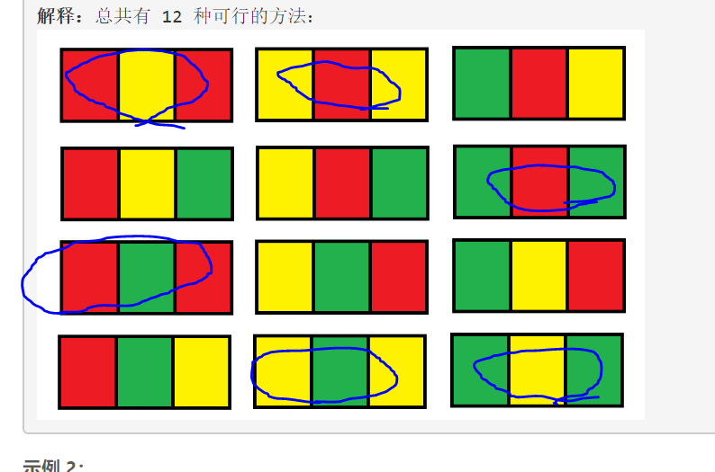
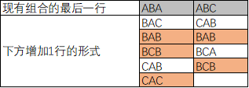
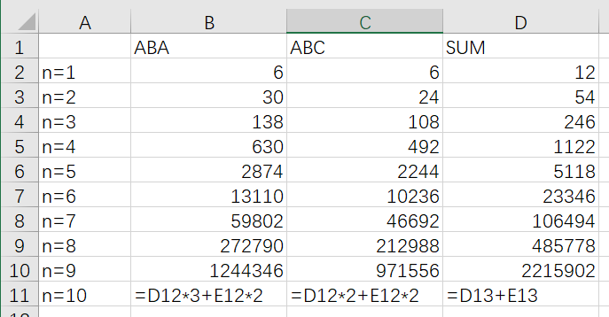

> 原文链接: https://leetcode-cn.com/problems/number-of-ways-to-paint-n-3-grid


## 英文原文
<div><p>You have a <code>grid</code> of size <code>n x 3</code> and you want to paint each cell of the grid with exactly one of the three colors: <strong>Red</strong>, <strong>Yellow,</strong> or <strong>Green</strong> while making sure that no two adjacent cells have the same color (i.e., no two cells that share vertical or horizontal sides have the same color).</p>

<p>Given <code>n</code> the number of rows of the grid, return <em>the number of ways</em> you can paint this <code>grid</code>. As the answer may grow large, the answer <strong>must be</strong> computed modulo <code>10<sup>9</sup> + 7</code>.</p>

<p>&nbsp;</p>
<p><strong>Example 1:</strong></p>

<pre>
<strong>Input:</strong> n = 1
<strong>Output:</strong> 12
<strong>Explanation:</strong> There are 12 possible way to paint the grid as shown.
</pre>

<p><strong>Example 2:</strong></p>

<pre>
<strong>Input:</strong> n = 2
<strong>Output:</strong> 54
</pre>

<p><strong>Example 3:</strong></p>

<pre>
<strong>Input:</strong> n = 3
<strong>Output:</strong> 246
</pre>

<p><strong>Example 4:</strong></p>

<pre>
<strong>Input:</strong> n = 7
<strong>Output:</strong> 106494
</pre>

<p><strong>Example 5:</strong></p>

<pre>
<strong>Input:</strong> n = 5000
<strong>Output:</strong> 30228214
</pre>

<p>&nbsp;</p>
<p><strong>Constraints:</strong></p>

<ul>
	<li><code>n == grid.length</code></li>
	<li><code>grid[i].length == 3</code></li>
	<li><code>1 &lt;= n &lt;= 5000</code></li>
</ul>
</div>

## 中文题目
<div><p>你有一个 <code>n x 3</code>&nbsp;的网格图 <code>grid</code>&nbsp;，你需要用 <strong>红，黄，绿</strong>&nbsp;三种颜色之一给每一个格子上色，且确保相邻格子颜色不同（也就是有相同水平边或者垂直边的格子颜色不同）。</p>

<p>给你网格图的行数 <code>n</code>&nbsp;。</p>

<p>请你返回给&nbsp;<code>grid</code>&nbsp;涂色的方案数。由于答案可能会非常大，请你返回答案对&nbsp;<code>10^9 + 7</code>&nbsp;取余的结果。</p>

<p>&nbsp;</p>

<p><strong>示例 1：</strong></p>

<pre><strong>输入：</strong>n = 1
<strong>输出：</strong>12
<strong>解释：</strong>总共有 12 种可行的方法：

</pre>

<p><strong>示例 2：</strong></p>

<pre><strong>输入：</strong>n = 2
<strong>输出：</strong>54
</pre>

<p><strong>示例 3：</strong></p>

<pre><strong>输入：</strong>n = 3
<strong>输出：</strong>246
</pre>

<p><strong>示例 4：</strong></p>

<pre><strong>输入：</strong>n = 7
<strong>输出：</strong>106494
</pre>

<p><strong>示例 5：</strong></p>

<pre><strong>输入：</strong>n = 5000
<strong>输出：</strong>30228214
</pre>

<p>&nbsp;</p>

<p><strong>提示：</strong></p>

<ul>
	<li><code>n == grid.length</code></li>
	<li><code>grid[i].length == 3</code></li>
	<li><code>1 &lt;= n &lt;= 5000</code></li>
</ul>
</div>

## 通过代码
<RecoDemo>
</RecoDemo>


## 高赞题解
1.观察LEETCODE给的官方N=1示例，可以抽象区分为2种类型，ABA和ABC


2.分情况讨论，可知，在下方增加1行时，有9种情况，又可以分为ABA和ABC两个大类


本层的结果 = ABA类的个数m + ABC类的个数n

本层的每个ABA类 => 下层演化 3个ABA + 2个ABC
本层的每个ABC类 => 下层演化 2个ABA + 2个ABC

下层的结果 = ABA类的个数 + ABC类的个数 = (3m+2n) + (2m+2n) 


3.数学计算


4.最后给出代码
```csharp
public class Solution {
    public int NumOfWays(int n) {
            if (n == 0)
                return 0;
            else if (n == 1)
                return 12;
            var temp = 1000000007;
            long  repeat = 6;
            long  unrepeat = 6;
            for(int i = 2; i <=n; i++)
            {
                long  newrep = (repeat * 3) % temp + unrepeat * 2 % temp;
                long  newunrep = repeat * 2 % temp + unrepeat * 2 % temp;
                repeat = newrep;
                unrepeat = newunrep;
            }
            return (int)((repeat + unrepeat)%temp);
    }
}
```


## 统计信息
| 通过次数 | 提交次数 | AC比率 |
| :------: | :------: | :------: |
|    7967    |    14456    |   55.1%   |

## 提交历史
| 提交时间 | 提交结果 | 执行时间 |  内存消耗  | 语言 |
| :------: | :------: | :------: | :--------: | :--------: |
