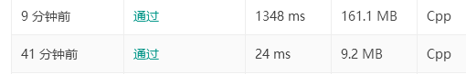

> 原文链接: https://leetcode-cn.com/problems/find-the-kth-smallest-sum-of-a-matrix-with-sorted-rows


## 英文原文
<div><p>You are given an&nbsp;<code>m&nbsp;* n</code>&nbsp;matrix,&nbsp;<code>mat</code>, and an integer <code>k</code>,&nbsp;which&nbsp;has its rows sorted in non-decreasing&nbsp;order.</p>

<p>You are allowed to choose exactly 1 element from each row to form an array.&nbsp;Return the Kth <strong>smallest</strong> array sum among all possible arrays.</p>

<p>&nbsp;</p>
<p><strong>Example 1:</strong></p>

<pre>
<strong>Input:</strong> mat = [[1,3,11],[2,4,6]], k = 5
<strong>Output:</strong> 7
<strong>Explanation: </strong>Choosing one element from each row, the first k smallest sum are:
[1,2], [1,4], [3,2], [3,4], [1,6]. Where the 5th sum is 7.  </pre>

<p><strong>Example 2:</strong></p>

<pre>
<strong>Input:</strong> mat = [[1,3,11],[2,4,6]], k = 9
<strong>Output:</strong> 17
</pre>

<p><strong>Example 3:</strong></p>

<pre>
<strong>Input:</strong> mat = [[1,10,10],[1,4,5],[2,3,6]], k = 7
<strong>Output:</strong> 9
<strong>Explanation:</strong> Choosing one element from each row, the first k smallest sum are:
[1,1,2], [1,1,3], [1,4,2], [1,4,3], [1,1,6], [1,5,2], [1,5,3]. Where the 7th sum is 9.  
</pre>

<p><strong>Example 4:</strong></p>

<pre>
<strong>Input:</strong> mat = [[1,1,10],[2,2,9]], k = 7
<strong>Output:</strong> 12
</pre>

<p>&nbsp;</p>
<p><strong>Constraints:</strong></p>

<ul>
	<li><code>m == mat.length</code></li>
	<li><code>n == mat.length[i]</code></li>
	<li><code>1 &lt;= m, n &lt;= 40</code></li>
	<li><code>1 &lt;= k &lt;= min(200, n ^&nbsp;m)</code></li>
	<li><code>1 &lt;= mat[i][j] &lt;= 5000</code></li>
	<li><code>mat[i]</code> is a non decreasing array.</li>
</ul>
</div>

## 中文题目
<div><p>给你一个 <code>m&nbsp;* n</code> 的矩阵 <code>mat</code>，以及一个整数 <code>k</code> ，矩阵中的每一行都以非递减的顺序排列。</p>

<p>你可以从每一行中选出 1 个元素形成一个数组。返回所有可能数组中的第 k 个 <strong>最小</strong> 数组和。</p>

<p>&nbsp;</p>

<p><strong>示例 1：</strong></p>

<pre><strong>输入：</strong>mat = [[1,3,11],[2,4,6]], k = 5
<strong>输出：</strong>7
<strong>解释：</strong>从每一行中选出一个元素，前 k 个和最小的数组分别是：
[1,2], [1,4], [3,2], [3,4], [1,6]。其中第 5 个的和是 7 。  </pre>

<p><strong>示例 2：</strong></p>

<pre><strong>输入：</strong>mat = [[1,3,11],[2,4,6]], k = 9
<strong>输出：</strong>17
</pre>

<p><strong>示例 3：</strong></p>

<pre><strong>输入：</strong>mat = [[1,10,10],[1,4,5],[2,3,6]], k = 7
<strong>输出：</strong>9
<strong>解释：</strong>从每一行中选出一个元素，前 k 个和最小的数组分别是：
[1,1,2], [1,1,3], [1,4,2], [1,4,3], [1,1,6], [1,5,2], [1,5,3]。其中第 7 个的和是 9 。 
</pre>

<p><strong>示例 4：</strong></p>

<pre><strong>输入：</strong>mat = [[1,1,10],[2,2,9]], k = 7
<strong>输出：</strong>12
</pre>

<p>&nbsp;</p>

<p><strong>提示：</strong></p>

<ul>
	<li><code>m == mat.length</code></li>
	<li><code>n == mat.length[i]</code></li>
	<li><code>1 &lt;= m, n &lt;= 40</code></li>
	<li><code>1 &lt;= k &lt;= min(200, n ^&nbsp;m)</code></li>
	<li><code>1 &lt;= mat[i][j] &lt;= 5000</code></li>
	<li><code>mat[i]</code> 是一个非递减数组</li>
</ul>
</div>

## 通过代码
<RecoDemo>
</RecoDemo>


## 高赞题解
很容易想到二分，但是比赛的时候傻了，少加了个判断条件导致tle了一次。
就是先确定左右边界，即最小和与最大和，然后二分得到mid，每次判断和小于mid的数组有多少个，如果大于等于k那么更新r，否则更新l。
```
class Solution {
public:
    vector<vector<int>>temp;
    int m,n;
    int kthSmallest(vector<vector<int>>& mat, int k) {
        temp=mat;
        m=mat.size(),n=mat[0].size();
        int left=0,right=0;
        for(int i=0;i<m;i++) left+=mat[i][0],right+=mat[i].back();
        int init=left;
        while(left<right){
            int mid=(left+right)>>1;
            int num=1;
            dfs(mid,0,init,num,k);
            if(num>=k) right=mid;
            else left=mid+1;
        }
        return left;
    }
    void dfs(int mid,int index,int sum,int& num,int k){
        if(sum>mid||index==m||num>k) return;
        dfs(mid,index+1,sum,num,k);
        for(int i=1;i<n;i++){
            if(sum+temp[index][i]-temp[index][0]<=mid){
                num++;
                dfs(mid,index+1,sum+temp[index][i]-temp[index][0],num,k);
            }else{
                break;
            }
        }
    }
};
```
二分的时间复杂度是O(klogN),这个N是最大的和，最大为40*5000，每次查找mid最多只需要找k次。
这是暴力的代码，也能过
```
class Solution {
public:
    int kthSmallest(vector<vector<int>>& mat, int k) {
        int m=mat.size(),n=mat[0].size();
        multiset<int>s(mat[0].begin(),mat[0].end());
        for(int i=1;i<m;i++){
            multiset<int>temp;
            for(int x : s){
                for(int y : mat[i]){
                    temp.insert(x+y);
                }
            }
            s.clear();
            auto it=temp.begin();
            for(int j=0;j<min(k,(int)temp.size());j++,it++){
                s.insert(*it);
            }
        }
        return *s.rbegin();
    }
};
```

这是暴力和二分的运行截图，暴力还是效率低很多



## 统计信息
| 通过次数 | 提交次数 | AC比率 |
| :------: | :------: | :------: |
|    3980    |    7027    |   56.6%   |

## 提交历史
| 提交时间 | 提交结果 | 执行时间 |  内存消耗  | 语言 |
| :------: | :------: | :------: | :--------: | :--------: |
