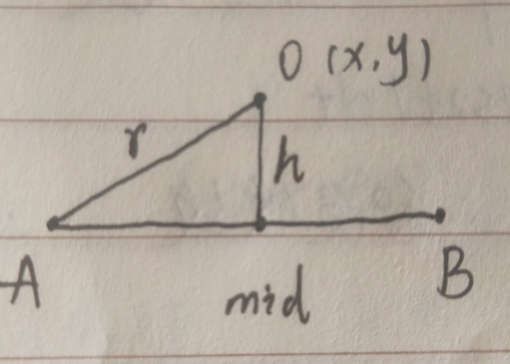
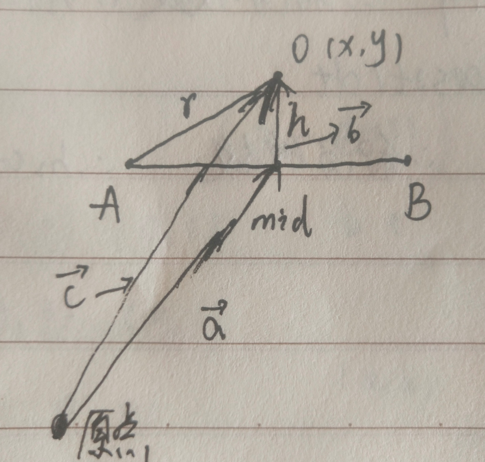

> 原文链接: https://leetcode-cn.com/problems/maximum-number-of-darts-inside-of-a-circular-dartboard


## 英文原文
<div><p>You have a very large square wall and a circular dartboard placed on the wall.&nbsp;You have been challenged to throw darts into the board blindfolded.&nbsp;Darts thrown at the wall are represented as an array of&nbsp;<code>points</code> on a 2D plane.&nbsp;</p>

<p>Return&nbsp;the maximum number of points that are within or&nbsp;lie&nbsp;on&nbsp;<strong>any</strong> circular dartboard of radius&nbsp;<code>r</code>.</p>

<p>&nbsp;</p>
<p><strong>Example 1:</strong></p>

<p></p>

<pre>
<strong>Input:</strong> points = [[-2,0],[2,0],[0,2],[0,-2]], r = 2
<strong>Output:</strong> 4
<strong>Explanation:</strong> Circle dartboard with center in (0,0) and radius = 2 contain all points.
</pre>

<p><strong>Example 2:</strong></p>

<p><strong></strong></p>

<pre>
<strong>Input:</strong> points = [[-3,0],[3,0],[2,6],[5,4],[0,9],[7,8]], r = 5
<strong>Output:</strong> 5
<strong>Explanation:</strong> Circle dartboard with center in (0,4) and radius = 5 contain all points except the point (7,8).
</pre>

<p><strong>Example 3:</strong></p>

<pre>
<strong>Input:</strong> points = [[-2,0],[2,0],[0,2],[0,-2]], r = 1
<strong>Output:</strong> 1
</pre>

<p><strong>Example 4:</strong></p>

<pre>
<strong>Input:</strong> points = [[1,2],[3,5],[1,-1],[2,3],[4,1],[1,3]], r = 2
<strong>Output:</strong> 4
</pre>

<p>&nbsp;</p>
<p><strong>Constraints:</strong></p>

<ul>
	<li><code>1 &lt;= points.length &lt;= 100</code></li>
	<li><code>points[i].length == 2</code></li>
	<li><code>-10^4 &lt;= points[i][0], points[i][1] &lt;= 10^4</code></li>
	<li><code>1 &lt;= r &lt;= 5000</code></li>
</ul></div>

## 中文题目
<div><p>墙壁上挂着一个圆形的飞镖靶。现在请你蒙着眼睛向靶上投掷飞镖。</p>

<p>投掷到墙上的飞镖用二维平面上的点坐标数组表示。飞镖靶的半径为 <code>r</code> 。</p>

<p>请返回能够落在 <strong>任意</strong> 半径为 <code>r</code> 的圆形靶内或靶上的最大飞镖数。</p>

<p>&nbsp;</p>

<p><strong>示例 1：</strong></p>

<p></p>

<pre><strong>输入：</strong>points = [[-2,0],[2,0],[0,2],[0,-2]], r = 2
<strong>输出：</strong>4
<strong>解释：</strong>如果圆形的飞镖靶的圆心为 (0,0) ，半径为 2 ，所有的飞镖都落在靶上，此时落在靶上的飞镖数最大，值为 4 。
</pre>

<p><strong>示例 2：</strong></p>

<p><strong></strong></p>

<pre><strong>输入：</strong>points = [[-3,0],[3,0],[2,6],[5,4],[0,9],[7,8]], r = 5
<strong>输出：</strong>5
<strong>解释：</strong>如果圆形的飞镖靶的圆心为 (0,4) ，半径为 5 ，则除了 (7,8) 之外的飞镖都落在靶上，此时落在靶上的飞镖数最大，值为 5 。</pre>

<p><strong>示例 3：</strong></p>

<pre><strong>输入：</strong>points = [[-2,0],[2,0],[0,2],[0,-2]], r = 1
<strong>输出：</strong>1
</pre>

<p><strong>示例 4：</strong></p>

<pre><strong>输入：</strong>points = [[1,2],[3,5],[1,-1],[2,3],[4,1],[1,3]], r = 2
<strong>输出：</strong>4
</pre>

<p>&nbsp;</p>

<p><strong>提示：</strong></p>

<ul>
	<li><code>1 &lt;= points.length &lt;= 100</code></li>
	<li><code>points[i].length == 2</code></li>
	<li><code>-10^4 &lt;= points[i][0], points[i][1] &lt;= 10^4</code></li>
	<li><code>1 &lt;= r &lt;= 5000</code></li>
</ul>
</div>

## 通过代码
<RecoDemo>
</RecoDemo>


## 高赞题解
## 题意
本题就是要计算给定半径，圆心不定，然后算圆内的点数最多是多少  
我们可以通过两点确定一个圆心，穷举所有的圆心即可。  

## 计算圆心
先给一张图：  


给定A(x1,y1) B(x2,y2) 以及圆心r  
首先就可以直接计算出垂线长度h和mid坐标(AB中点)以及AB长度d:   

    d=sqrt((x2-x1)*(x2-x1)+(y2-y1)*(y2-y1));
    h=sqrt(r*r-(d/2.0)*(d/2.0))
    mid=((x1+x2)/2.0,(y1+y2)/2.0)

然后我们的目的是求O(x,y)  

我们使用向量。  
看这个图：


向量a+向量b=向量c   
毫无疑问  
向量a就是mid坐标，向量b就是AB垂线的单位方向向量乘以高度h，向量c就是O坐标  

所以现在唯一的问题就在于如何计算AB垂线的方向向量  
向量AB=(x3,y3) 垂线的向量即为(-y3,x3)和(y3,-x3)  
点积为0

特殊情况，AB长度大于2*r (d>2r) ，此时不存在圆心  

还不明白的可以看一下代码，就会了：  

## 代码
经@灵茶山艾府 指正，因为我穷举a b后还会穷举b a,所以每组只用计算一个圆心即可。  
另一个方向的圆心会在第二次枚举的时候被计算出来。  

```
struct point{
    double x,y;
    point(double i,double j):x(i),y(j){}
};

//算两点距离
double dist(double x1,double y1,double x2,double y2){
    return sqrt((x1-x2)*(x1-x2)+(y1-y2)*(y1-y2));
}

//计算圆心
point f(point& a,point& b,int r){
    //算中点
    point mid((a.x+b.x)/2.0,(a.y+b.y)/2.0);
    //AB距离的一半
    double d=dist(a.x,a.y,mid.x,mid.y);
    //计算h
    double h=sqrt(r*r-d*d);
    //计算垂线
    point ba(b.x-a.x,b.y-a.y);
    point hd(-ba.y,ba.x);
    double len=sqrt(hd.x*hd.x+hd.y*hd.y);
    hd.x/=len,hd.y/=len;
    hd.x*=h,hd.y*=h;
    return point(hd.x+mid.x,hd.y+mid.y);
}

class Solution {
public:
    int numPoints(vector<vector<int>>& points, int r) {
        int n=points.size();
        int ans=0;
        for(int i=0;i<n;i++){
            for(int j=0;j<n;j++){
                if(i==j){//一个点
                    int cnt=0;
                    for(int k=0;k<n;k++){
                        double tmp=dist(points[i][0],points[i][1],points[k][0],points[k][1]);
                        if(tmp<=r) cnt++;
                    }
                    ans=max(cnt,ans);
                }else{//两个点
                    //通过长度判断有没有圆心
                    double d=dist(points[i][0],points[i][1],points[j][0],points[j][1]);
                    if(d/2>r) continue;

                    point a(points[i][0],points[i][1]),b(points[j][0],points[j][1]);
                    point res=f(a,b,r);
                    int cnt=0;
                    for(int k=0;k<n;k++){
                        double tmp=dist(res.x,res.y,points[k][0],points[k][1]);
                        if(tmp<=r) cnt++;
                    }
                    ans=max(cnt,ans);
                }
            }
        }
        return ans;
    }
};
```

# 总结
计算圆心也是有别的方法的，在此仅分享这一种
求个赞

## 统计信息
| 通过次数 | 提交次数 | AC比率 |
| :------: | :------: | :------: |
|    1695    |    4596    |   36.9%   |

## 提交历史
| 提交时间 | 提交结果 | 执行时间 |  内存消耗  | 语言 |
| :------: | :------: | :------: | :--------: | :--------: |
