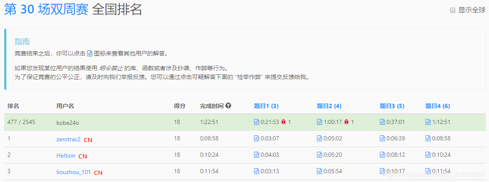
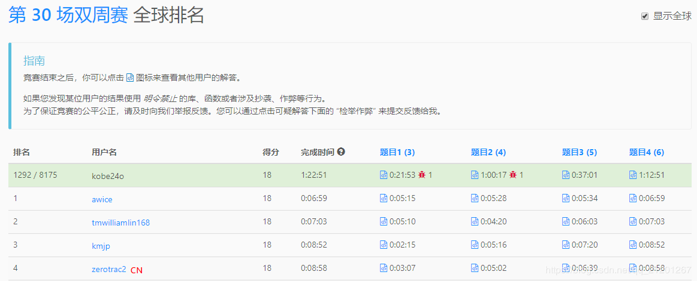

> 原文链接: https://leetcode-cn.com/problems/stone-game-iv


## 英文原文
<div><p>Alice and Bob take turns playing a game, with Alice starting first.</p>

<p>Initially, there are <code>n</code> stones in a pile.&nbsp; On each player&#39;s turn, that player makes a&nbsp;<em>move</em>&nbsp;consisting of removing <strong>any</strong> non-zero <strong>square number</strong> of stones in the pile.</p>

<p>Also, if a player cannot make a move, he/she loses the game.</p>

<p>Given a positive&nbsp;integer <code>n</code>.&nbsp;Return&nbsp;<code>True</code>&nbsp;if and only if Alice wins the game otherwise return <code>False</code>, assuming both players play optimally.</p>

<p>&nbsp;</p>
<p><strong>Example 1:</strong></p>

<pre>
<strong>Input:</strong> n = 1
<strong>Output:</strong> true
<strong>Explanation: </strong>Alice can remove 1 stone winning the game because Bob doesn&#39;t have any moves.</pre>

<p><strong>Example 2:</strong></p>

<pre>
<strong>Input:</strong> n = 2
<strong>Output:</strong> false
<strong>Explanation: </strong>Alice can only remove 1 stone, after that Bob removes the last one winning the game (2 -&gt; 1 -&gt; 0).</pre>

<p><strong>Example 3:</strong></p>

<pre>
<strong>Input:</strong> n = 4
<strong>Output:</strong> true
<strong>Explanation:</strong> n is already a perfect square, Alice can win with one move, removing 4 stones (4 -&gt; 0).
</pre>

<p><strong>Example 4:</strong></p>

<pre>
<strong>Input:</strong> n = 7
<strong>Output:</strong> false
<strong>Explanation: </strong>Alice can&#39;t win the game if Bob plays optimally.
If Alice starts removing 4 stones, Bob will remove 1 stone then Alice should remove only 1 stone and finally Bob removes the last one (7 -&gt; 3 -&gt; 2 -&gt; 1 -&gt; 0). 
If Alice starts removing 1 stone, Bob will remove 4 stones then Alice only can remove 1 stone and finally Bob removes the last one (7 -&gt; 6 -&gt; 2 -&gt; 1 -&gt; 0).</pre>

<p><strong>Example 5:</strong></p>

<pre>
<strong>Input:</strong> n = 17
<strong>Output:</strong> false
<strong>Explanation: </strong>Alice can&#39;t win the game if Bob plays optimally.
</pre>

<p>&nbsp;</p>
<p><strong>Constraints:</strong></p>

<ul>
	<li><code>1 &lt;= n &lt;= 10^5</code></li>
</ul>
</div>

## 中文题目
<div><p>Alice 和 Bob 两个人轮流玩一个游戏，Alice 先手。</p>

<p>一开始，有 <code>n</code>&nbsp;个石子堆在一起。每个人轮流操作，正在操作的玩家可以从石子堆里拿走 <strong>任意</strong>&nbsp;非零 <strong>平方数</strong>&nbsp;个石子。</p>

<p>如果石子堆里没有石子了，则无法操作的玩家输掉游戏。</p>

<p>给你正整数&nbsp;<code>n</code>&nbsp;，且已知两个人都采取最优策略。如果 Alice 会赢得比赛，那么返回&nbsp;<code>True</code>&nbsp;，否则返回&nbsp;<code>False</code>&nbsp;。</p>

<p>&nbsp;</p>

<p><strong>示例 1：</strong></p>

<pre>
<strong>输入：</strong>n = 1
<strong>输出：</strong>true
<strong>解释：</strong>Alice 拿走 1 个石子并赢得胜利，因为 Bob 无法进行任何操作。</pre>

<p><strong>示例 2：</strong></p>

<pre>
<strong>输入：</strong>n = 2
<strong>输出：</strong>false
<strong>解释：</strong>Alice 只能拿走 1 个石子，然后 Bob 拿走最后一个石子并赢得胜利（2 -&gt; 1 -&gt; 0）。</pre>

<p><strong>示例 3：</strong></p>

<pre>
<strong>输入：</strong>n = 4
<strong>输出：</strong>true
<strong>解释：</strong>n 已经是一个平方数，Alice 可以一次全拿掉 4 个石子并赢得胜利（4 -&gt; 0）。
</pre>

<p><strong>示例 4：</strong></p>

<pre>
<strong>输入：</strong>n = 7
<strong>输出：</strong>false
<strong>解释：</strong>当 Bob 采取最优策略时，Alice 无法赢得比赛。
如果 Alice 一开始拿走 4 个石子， Bob 会拿走 1 个石子，然后 Alice 只能拿走 1 个石子，Bob 拿走最后一个石子并赢得胜利（7 -&gt; 3 -&gt; 2 -&gt; 1 -&gt; 0）。
如果 Alice 一开始拿走 1 个石子， Bob 会拿走 4 个石子，然后 Alice 只能拿走 1 个石子，Bob 拿走最后一个石子并赢得胜利（7 -&gt; 6 -&gt; 2 -&gt; 1 -&gt; 0）。</pre>

<p><strong>示例 5：</strong></p>

<pre>
<strong>输入：</strong>n = 17
<strong>输出：</strong>false
<strong>解释：</strong>如果 Bob 采取最优策略，Alice 无法赢得胜利。
</pre>

<p>&nbsp;</p>

<p><strong>提示：</strong></p>

<ul>
	<li><code>1 &lt;= n &lt;= 10^5</code></li>
</ul>
</div>

## 通过代码
<RecoDemo>
</RecoDemo>


## 高赞题解

## 1. 比赛结果

[第二次全部做出来了，可能题目简单点！第一题没有补零，错误一发，第二题，不必排序，错误一发，继续加油！](https://leetcode-cn.com/contest/biweekly-contest-30/ranking/)


全国排名： 477 / 2545，18.7%；全球排名： 1292 / 8175，15.8%




## 2. 题目

### 1. LeetCode 5177. 转变日期格式 easy

[题目链接](https://leetcode-cn.com/problems/reformat-date/)

给你一个字符串 date ，它的格式为 `Day Month Year` ，其中：

- Day 是集合 `{"1st", "2nd", "3rd", "4th", ..., "30th", "31st"}` 中的一个元素。
- Month 是集合 `{"Jan", "Feb", "Mar", "Apr", "May", "Jun", "Jul", "Aug", "Sep", "Oct", "Nov", "Dec"}` 中的一个元素。
- Year 的范围在 ​[1900, 2100] 之间。

请你将字符串转变为 `YYYY-MM-DD` 的格式，其中：

YYYY 表示 4 位的年份。
MM 表示 2 位的月份。
DD 表示 2 位的天数。
 

```python
示例 1：
输入：date = "20th Oct 2052"
输出："2052-10-20"

示例 2：
输入：date = "6th Jun 1933"
输出："1933-06-06"

示例 3：
输入：date = "26th May 1960"
输出："1960-05-26"
 
提示：
给定日期保证是合法的，所以不需要处理异常输入。
```

---

解题：
- 注意不足2位的，要补0

```cpp
class Solution {
public:
    string reformatDate(string date) {
        unordered_map<string,string> m;
        m["Jan"]="01";
        m["Feb"]="02";
        m["Mar"]="03";
        m["Apr"]="04";
        m["May"]="05";
        m["Jun"]="06";
        m["Jul"]="07";
        m["Aug"]="08";
        m["Sep"]="09";
        m["Oct"]="10";
        m["Nov"]="11";
        m["Dec"]="12";
        int day = 0, month = -1, year = 0, i = 0;
        string t;
        while(isdigit(date[i]))
            day = day*10+date[i++]-'0';//天数
        while(date[i] != ' ')
            i++;
        i++;
        while(isalpha(date[i]))
            t += date[i++];//月份的字符串
        i++;
        while(i < date.size())
            year = year*10+date[i++]-'0';//年
        return to_string(year)+"-"+m[t]+"-"+(day>=10 ? to_string(day):("0"+to_string(day)));
    }   
};
```


### 2. LeetCode 5445. 子数组和排序后的区间和 medium

[题目链接](https://leetcode-cn.com/problems/range-sum-of-sorted-subarray-sums/)
给你一个数组 nums ，它包含 n 个正整数。你需要计算所有**非空连续**子数组的和，并将它们按**升序**排序，得到一个新的包含 n * (n + 1) / 2 个数字的数组。

请你返回在新数组中下标为 left 到 right （下标从 1 开始）的所有数字和（包括左右端点）。由于答案可能很大，请你将它对 10^9 + 7 取模后返回。

 

```cpp
示例 1：
输入：nums = [1,2,3,4], n = 4, left = 1, right = 5
输出：13 
解释：所有的子数组和为 1, 3, 6, 10, 2, 5, 9, 3, 7, 4 。
将它们升序排序后，我们得到新的数组 [1, 2, 3, 3, 4, 5, 6, 7, 9, 10] 。
下标从 le = 1 到 ri = 5 的和为 1 + 2 + 3 + 3 + 4 = 13 。

示例 2：
输入：nums = [1,2,3,4], n = 4, left = 3, right = 4
输出：6
解释：给定数组与示例 1 一样，
所以新数组为 [1, 2, 3, 3, 4, 5, 6, 7, 9, 10] 。
下标从 le = 3 到 ri = 4 的和为 3 + 3 = 6 。

示例 3：
输入：nums = [1,2,3,4], n = 4, left = 1, right = 10
输出：50
 
提示：
1 <= nums.length <= 10^3
nums.length == n
1 <= nums[i] <= 100
1 <= left <= right <= n * (n + 1) / 2
```


---

解题：
- 计算以每个数字 `nums[i]` 为开始的子数组前缀和，插入multiset
- 最后取出对应区间的即可
```cpp
class Solution {
public:
    int rangeSum(vector<int>& nums, int n, int left, int right) {
        // sort(nums.begin(),nums.end()); 错误一发，在这里。。。
        multiset<int> s;
        int presum;
        for(int i = 0, j; i < nums.size(); ++i)
        {
            presum = 0;
            for(j = i; j < nums.size(); ++j)
            {
                presum += nums[j];
                s.insert(presum);
            }
        }
        auto it = s.begin();
        int k = left-1;
        while(k--)
            it++;
        k = right-left+1;
        int sum = 0;
        while(k--)
        {
            sum += *it;
            it++;
        }
        return sum;
    }
};
```


### 3. LeetCode 5446. 三次操作后最大值与最小值的最小差 medium

[题目链接](https://leetcode-cn.com/problems/minimum-difference-between-largest-and-smallest-value-in-three-moves/)

给你一个数组 nums ，每次操作你可以选择 nums 中的**任意**一个数字并将它改成任意值。

请你返回**三次**操作后， nums 中最大值与最小值的差的最小值。

```cpp
示例 1：
输入：nums = [5,3,2,4]
输出：0
解释：将数组 [5,3,2,4] 变成 [2,2,2,2].
最大值与最小值的差为 2-2 = 0 。

示例 2：
输入：nums = [1,5,0,10,14]
输出：1
解释：将数组 [1,5,0,10,14] 变成 [1,1,0,1,1] 。
最大值与最小值的差为 1-0 = 1 。

示例 3：
输入：nums = [6,6,0,1,1,4,6]
输出：2

示例 4：
输入：nums = [1,5,6,14,15]
输出：1
 
提示：
1 <= nums.length <= 10^5
-10^9 <= nums[i] <= 10^9
```


---

解题：
- 排序后，前后总共去掉3个，4种情况取最小

```cpp
class Solution {
public:
    int minDifference(vector<int>& nums) {
        if(nums.size() <= 4)
            return 0;
        sort(nums.begin(),nums.end());
        int n = nums.size();
        return min(nums[n-4]-nums[0],min(nums[n-3]-nums[1],min(nums[n-2]-nums[2], nums[n-1]-nums[3])));
    }
};
```

### 4. LeetCode 5447. 石子游戏 IV hard

[题目链接](https://leetcode-cn.com/problems/stone-game-iv/)

Alice 和 Bob 两个人轮流玩一个游戏，**Alice 先手**。

一开始，有 n 个石子堆在一起。每个人轮流操作，正在操作的玩家可以从石子堆里拿走 任意 **非零 平方数** 个石子。

如果石子堆里没有石子了，则无法操作的玩家输掉游戏。

给你正整数 n ，且已知两个人都采取最优策略。
如果 Alice 会赢得比赛，那么返回 True ，否则返回 False 。

 

```cpp
示例 1：
输入：n = 1
输出：true
解释：Alice 拿走 1 个石子并赢得胜利，因为 Bob 无法进行任何操作。

示例 2：
输入：n = 2
输出：false
解释：Alice 只能拿走 1 个石子，
然后 Bob 拿走最后一个石子并赢得胜利（2 -> 1 -> 0）。

示例 3：
输入：n = 4
输出：true
解释：n 已经是一个平方数，
Alice 可以一次全拿掉 4 个石子并赢得胜利（4 -> 0）。

示例 4：
输入：n = 7
输出：false
解释：当 Bob 采取最优策略时，Alice 无法赢得比赛。
如果 Alice 一开始拿走 4 个石子， 
Bob 会拿走 1 个石子，
然后 Alice 只能拿走 1 个石子，
Bob 拿走最后一个石子并赢得胜利（7 -> 3 -> 2 -> 1 -> 0）。

如果 Alice 一开始拿走 1 个石子， 
Bob 会拿走 4 个石子，
然后 Alice 只能拿走 1 个石子，
Bob 拿走最后一个石子并赢得胜利（7 -> 6 -> 2 -> 1 -> 0）。

示例 5：
输入：n = 17
输出：false
解释：如果 Bob 采取最优策略，Alice 无法赢得胜利。
 
提示：
1 <= n <= 10^5
```


---

解题：

```cpp
class Solution {
public:
    bool winnerSquareGame(int n) {
        vector<bool> dp(n+1, false);
        int i, j;
        for(i = 0; i <= n; ++i)//遍历石子的样本维度
        {
            for(j = 1; j*j+i <= n; ++j)
            {	//拿走 j^2 个石子
                if(!dp[i])//如果只有 i 个石头的时候输
                    dp[j*j+i] = true;//那么有j*j+i个石头时，就赢了
            }
        }
        return dp[n];
    }
};
```


---

我的CSDN[博客地址 https://michael.blog.csdn.net/](https://michael.blog.csdn.net/)

长按或扫码关注我的公众号（Michael阿明），一起加油、一起学习进步！


## 统计信息
| 通过次数 | 提交次数 | AC比率 |
| :------: | :------: | :------: |
|    5301    |    9143    |   58.0%   |

## 提交历史
| 提交时间 | 提交结果 | 执行时间 |  内存消耗  | 语言 |
| :------: | :------: | :------: | :--------: | :--------: |
