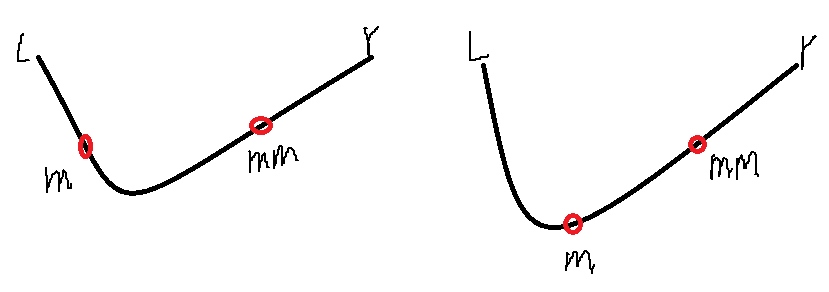

> 原文链接: https://leetcode-cn.com/problems/best-position-for-a-service-centre


## 英文原文
<div><p>A delivery company wants to build a new service centre in a new city. The company knows the positions of all the customers in this city on a 2D-Map and wants to build the new centre in a position such that <strong>the sum of the euclidean distances to all customers is minimum</strong>.</p>

<p>Given an array <code>positions</code> where <code>positions[i] = [x<sub>i</sub>, y<sub>i</sub>]</code> is the position of the <code>ith</code> customer on the map, return <em>the minimum sum of the euclidean distances</em> to all customers.</p>

<p>In other words, you need to choose the position of the service centre <code>[x<sub>centre</sub>, y<sub>centre</sub>]</code> such that the following formula is minimized:</p>

<p>Answers within&nbsp;<code>10^-5</code>&nbsp;of the actual value will be accepted.</p>

<p>&nbsp;</p>
<p><strong>Example 1:</strong></p>

<pre>
<strong>Input:</strong> positions = [[0,1],[1,0],[1,2],[2,1]]
<strong>Output:</strong> 4.00000
<strong>Explanation:</strong> As shown, you can see that choosing [x<sub>centre</sub>, y<sub>centre</sub>] = [1, 1] will make the distance to each customer = 1, the sum of all distances is 4 which is the minimum possible we can achieve.
</pre>

<p><strong>Example 2:</strong></p>

<pre>
<strong>Input:</strong> positions = [[1,1],[3,3]]
<strong>Output:</strong> 2.82843
<strong>Explanation:</strong> The minimum possible sum of distances = sqrt(2) + sqrt(2) = 2.82843
</pre>

<p><strong>Example 3:</strong></p>

<pre>
<strong>Input:</strong> positions = [[1,1]]
<strong>Output:</strong> 0.00000
</pre>

<p><strong>Example 4:</strong></p>

<pre>
<strong>Input:</strong> positions = [[1,1],[0,0],[2,0]]
<strong>Output:</strong> 2.73205
<strong>Explanation:</strong> At the first glance, you may think that locating the centre at [1, 0] will achieve the minimum sum, but locating it at [1, 0] will make the sum of distances = 3.
Try to locate the centre at [1.0, 0.5773502711] you will see that the sum of distances is 2.73205.
Be careful with the precision!
</pre>

<p><strong>Example 5:</strong></p>

<pre>
<strong>Input:</strong> positions = [[0,1],[3,2],[4,5],[7,6],[8,9],[11,1],[2,12]]
<strong>Output:</strong> 32.94036
<strong>Explanation:</strong> You can use [4.3460852395, 4.9813795505] as the position of the centre.
</pre>

<p>&nbsp;</p>
<p><strong>Constraints:</strong></p>

<ul>
	<li><code>1 &lt;=&nbsp;positions.length &lt;= 50</code></li>
	<li><code>positions[i].length == 2</code></li>
	<li><code>0 &lt;=&nbsp;positions[i][0],&nbsp;positions[i][1] &lt;= 100</code></li>
</ul>
</div>

## 中文题目
<div><p>一家快递公司希望在新城市建立新的服务中心。公司统计了该城市所有客户在二维地图上的坐标，并希望能够以此为依据为新的服务中心选址：使服务中心 <strong>到所有客户的欧几里得距离的总和最小</strong> 。</p>

<p>给你一个数组 <code>positions</code> ，其中 <code>positions[i] = [x<sub>i</sub>, y<sub>i</sub>]</code> 表示第 <code>i</code> 个客户在二维地图上的位置，返回到所有客户的 <strong>欧几里得距离的最小总和 。</strong></p>

<p>换句话说，请你为服务中心选址，该位置的坐标 <code>[x<sub>centre</sub>, y<sub>centre</sub>]</code> 需要使下面的公式取到最小值：</p>

<p></p>

<p>与真实值误差在 <code>10^-5</code> 之内的答案将被视作正确答案。</p>

<p>&nbsp;</p>

<p><strong>示例 1：</strong></p>

<p></p>

<pre><strong>输入：</strong>positions = [[0,1],[1,0],[1,2],[2,1]]
<strong>输出：</strong>4.00000
<strong>解释：</strong>如图所示，你可以选 [x<sub>centre</sub>, y<sub>centre</sub>] = [1, 1] 作为新中心的位置，这样一来到每个客户的距离就都是 1，所有距离之和为 4 ，这也是可以找到的最小值。
</pre>

<p><strong>示例 2：</strong></p>

<p></p>

<pre><strong>输入：</strong>positions = [[1,1],[3,3]]
<strong>输出：</strong>2.82843
<strong>解释：</strong>欧几里得距离可能的最小总和为 sqrt(2) + sqrt(2) = 2.82843
</pre>

<p><strong>示例 3：</strong></p>

<pre><strong>输入：</strong>positions = [[1,1]]
<strong>输出：</strong>0.00000
</pre>

<p><strong>示例 4：</strong></p>

<pre><strong>输入：</strong>positions = [[1,1],[0,0],[2,0]]
<strong>输出：</strong>2.73205
<strong>解释：</strong>乍一看，你可能会将中心定在 [1, 0] 并期待能够得到最小总和，但是如果选址在 [1, 0] 距离总和为 3
如果将位置选在 [1.0, 0.5773502711] ，距离总和将会变为 2.73205
当心精度问题！
</pre>

<p><strong>示例 5：</strong></p>

<pre><strong>输入：</strong>positions = [[0,1],[3,2],[4,5],[7,6],[8,9],[11,1],[2,12]]
<strong>输出：</strong>32.94036
<strong>解释：</strong>你可以用 [4.3460852395, 4.9813795505] 作为新中心的位置
</pre>

<p>&nbsp;</p>

<p><strong>提示：</strong></p>

<ul>
	<li><code>1 &lt;=&nbsp;positions.length &lt;= 50</code></li>
	<li><code>positions[i].length == 2</code></li>
	<li><code>0 &lt;=&nbsp;positions[i][0],&nbsp;positions[i][1] &lt;= 100</code></li>
</ul>
</div>

## 通过代码
<RecoDemo>
</RecoDemo>


## 高赞题解
### 解题思路
先想到如果确定了x，y对应的到各点距离和应该是凸函数；各x对应的最小距离和也是凸函数。在凸函数上查最值点可以用三分查找，这题也就是三分套三分。
三分查找形式如下：

在[l,r]上求f(x)的最小值，每次把范围三等分为[l,m),[m,mm],(mm,r]。不妨设f(m)<f(mm)，必有最小值点x<mm，不可能在(mm,r]上，因为若x>mm，则m、mm、x三点是一个上凸，所以令r=mm删去这一段。

三分是逼近取值，需要确定精度，结果要求保证误差在1e-5以内，计算点时精度要更高一点，就精确到1e-6。

时间复杂度:点取值范围是[0,100]，计算精确到1e-6，三分每次变成2/3，一层三分需要k次迭代满足(100-0)*(2/3)^k<1e-6，解k约为46。计算距离是n。总体时间复杂度O(kkn)。

### 代码

```python3
class Solution:
    def getMinDistSum(self, positions: List[List[int]]) -> float:
        # 到各点距离之和
        def dis(x, y):
            return sum([((px - x) ** 2 + (py - y) ** 2) ** 0.5 for px, py in positions])

        # 三分找最小
        def three_divide(l, r, f, eps=1e-6):
            while r - l > eps:
                m = l + (r - l) / 3
                mm = r - (r - l) / 3
                if f(m) < f(mm):
                    r = mm
                else:
                    l = m
            return f((l + r) / 2)

        # 左右边界
        lmin, rmax = 0, 100

        # 外层查x,x=mx时最小距离
        def xf(mx):
            # 内层查y,x=mx且y=my的距离
            def yf(my): return dis(mx, my)
            return three_divide(lmin, rmax, yf)

        return three_divide(lmin, rmax, xf)
```

## 统计信息
| 通过次数 | 提交次数 | AC比率 |
| :------: | :------: | :------: |
|    3274    |    9513    |   34.4%   |

## 提交历史
| 提交时间 | 提交结果 | 执行时间 |  内存消耗  | 语言 |
| :------: | :------: | :------: | :--------: | :--------: |
