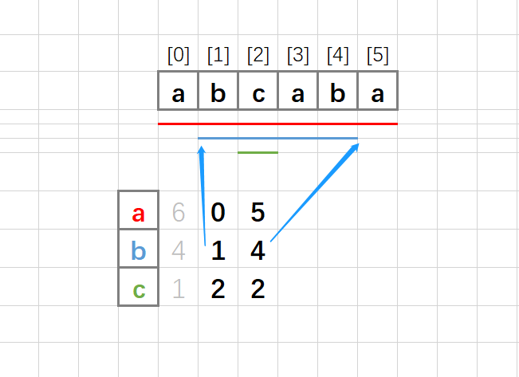
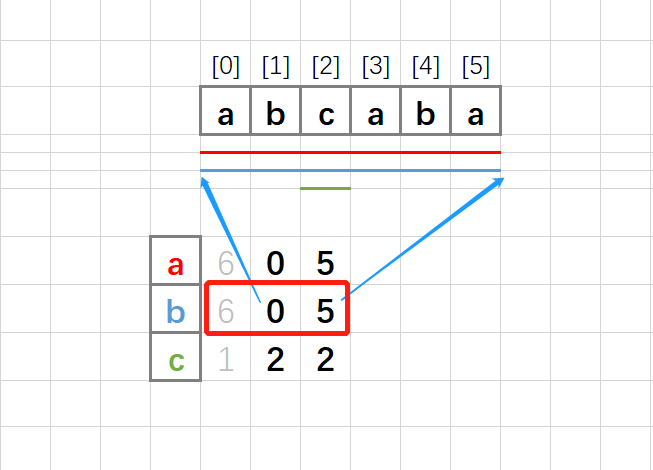
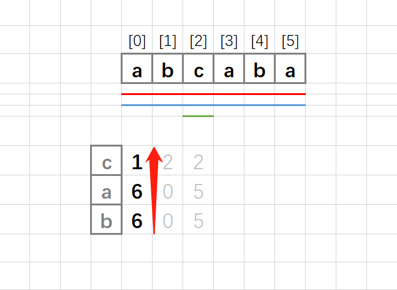

> 原文链接: https://leetcode-cn.com/problems/maximum-number-of-non-overlapping-substrings


## 英文原文
<div><p>Given a string <code>s</code>&nbsp;of lowercase letters, you need to find the maximum number of <strong>non-empty</strong> substrings of&nbsp;<code>s</code>&nbsp;that meet the following conditions:</p>

<ol>
	<li>The substrings do not overlap, that is for any two substrings <code>s[i..j]</code> and <code>s[k..l]</code>, either <code>j &lt; k</code> or <code>i &gt; l</code>&nbsp;is true.</li>
	<li>A substring that contains a certain character&nbsp;<code>c</code>&nbsp;must also contain all occurrences of <code>c</code>.</li>
</ol>

<p>Find <em>the maximum number of substrings that meet the above conditions</em>. If there are multiple solutions with the same number of substrings, <em>return the one with minimum total length.&nbsp;</em>It can be shown that there exists a unique solution of minimum total length.</p>

<p>Notice that you can return the substrings in <strong>any</strong> order.</p>

<p>&nbsp;</p>
<p><strong>Example 1:</strong></p>

<pre>
<strong>Input:</strong> s = &quot;adefaddaccc&quot;
<strong>Output:</strong> [&quot;e&quot;,&quot;f&quot;,&quot;ccc&quot;]
<b>Explanation:</b>&nbsp;The following are all the possible substrings that meet the conditions:
[
&nbsp; &quot;adefaddaccc&quot;
&nbsp; &quot;adefadda&quot;,
&nbsp; &quot;ef&quot;,
&nbsp; &quot;e&quot;,
  &quot;f&quot;,
&nbsp; &quot;ccc&quot;,
]
If we choose the first string, we cannot choose anything else and we&#39;d get only 1. If we choose &quot;adefadda&quot;, we are left with &quot;ccc&quot; which is the only one that doesn&#39;t overlap, thus obtaining 2 substrings. Notice also, that it&#39;s not optimal to choose &quot;ef&quot; since it can be split into two. Therefore, the optimal way is to choose [&quot;e&quot;,&quot;f&quot;,&quot;ccc&quot;] which gives us 3 substrings. No other solution of the same number of substrings exist.
</pre>

<p><strong>Example 2:</strong></p>

<pre>
<strong>Input:</strong> s = &quot;abbaccd&quot;
<strong>Output:</strong> [&quot;d&quot;,&quot;bb&quot;,&quot;cc&quot;]
<b>Explanation: </b>Notice that while the set of substrings [&quot;d&quot;,&quot;abba&quot;,&quot;cc&quot;] also has length 3, it&#39;s considered incorrect since it has larger total length.
</pre>

<p>&nbsp;</p>
<p><strong>Constraints:</strong></p>

<ul>
	<li><code>1 &lt;= s.length &lt;= 10^5</code></li>
	<li><code>s</code>&nbsp;contains only lowercase English letters.</li>
</ul>
</div>

## 中文题目
<div><p>给你一个只包含小写字母的字符串&nbsp;<code>s</code>&nbsp;，你需要找到 <code>s</code>&nbsp;中最多数目的非空子字符串，满足如下条件：</p>

<ol>
	<li>这些字符串之间互不重叠，也就是说对于任意两个子字符串&nbsp;<code>s[i..j]</code> 和&nbsp;<code>s[k..l]</code>&nbsp;，要么&nbsp;<code>j &lt; k</code>&nbsp;要么&nbsp;<code>i &gt; l</code>&nbsp;。</li>
	<li>如果一个子字符串包含字符&nbsp;<code>char</code> ，那么&nbsp;<code>s</code>&nbsp;中所有&nbsp;<code>char</code> 字符都应该在这个子字符串中。</li>
</ol>

<p>请你找到满足上述条件的最多子字符串数目。如果有多个解法有相同的子字符串数目，请返回这些子字符串总长度最小的一个解。可以证明最小总长度解是唯一的。</p>

<p>请注意，你可以以 <strong>任意</strong>&nbsp;顺序返回最优解的子字符串。</p>

<p>&nbsp;</p>

<p><strong>示例 1：</strong></p>

<pre><strong>输入：</strong>s = &quot;adefaddaccc&quot;
<strong>输出：</strong>[&quot;e&quot;,&quot;f&quot;,&quot;ccc&quot;]
<strong>解释：</strong>下面为所有满足第二个条件的子字符串：
[
&nbsp; &quot;adefaddaccc&quot;
&nbsp; &quot;adefadda&quot;,
&nbsp; &quot;ef&quot;,
&nbsp; &quot;e&quot;,
  &quot;f&quot;,
&nbsp; &quot;ccc&quot;,
]
如果我们选择第一个字符串，那么我们无法再选择其他任何字符串，所以答案为 1 。如果我们选择 &quot;adefadda&quot; ，剩下子字符串中我们只可以选择 &quot;ccc&quot; ，它是唯一不重叠的子字符串，所以答案为 2 。同时我们可以发现，选择 &quot;ef&quot; 不是最优的，因为它可以被拆分成 2 个子字符串。所以最优解是选择 [&quot;e&quot;,&quot;f&quot;,&quot;ccc&quot;] ，答案为 3 。不存在别的相同数目子字符串解。
</pre>

<p><strong>示例 2：</strong></p>

<pre><strong>输入：</strong>s = &quot;abbaccd&quot;
<strong>输出：</strong>[&quot;d&quot;,&quot;bb&quot;,&quot;cc&quot;]
<strong>解释：</strong>注意到解 [&quot;d&quot;,&quot;abba&quot;,&quot;cc&quot;] 答案也为 3 ，但它不是最优解，因为它的总长度更长。
</pre>

<p>&nbsp;</p>

<p><strong>提示：</strong></p>

<ul>
	<li><code>1 &lt;= s.length &lt;= 10^5</code></li>
	<li><code>s</code>&nbsp;只包含小写英文字母。</li>
</ul>
</div>

## 通过代码
<RecoDemo>
</RecoDemo>


## 高赞题解
### 思路
1. 因为条件 2 ，**如果一个子字符串包含字符 `c` ，那么 `s` 中所有 `c` 字符都应该在这个子字符串中**。

2. 可以先把每个字母找一遍，包含这个字母的子串最少应该是从第一次出现到最后一次出现

3. 使用 `vector<vector<int>> subs(26);`， 找出每个字母的代表子串的范围
    1. 使用 `subs[0]` 表示字母 `a` 的子串信息， `subs[1]` 表示字母 `b` 的
    2. `subs[i][0]` 存子串长度
    3. `subs[i][1]` 存范围开始
    4. `subs[i][2]` 存范围结束



4. 然后再对这些子串检查一下，将其中包含其他字母的区间也都覆盖到



5. 按照子串长度贪心，根据子串的长度排序
    1. 这时候已经不关心到底是哪个字母的代表子串了
    2. 所有这些子串都是满足条件 2 的子串
    3. 中间可能会有因为扩展过而变得范围一样的子串和空子串，后面也会过滤掉



6. 根据条件 1 ，需要子串之间不重叠

7. 使用 `vector<bool> vi(s.size(), false);` 记录

8. 将符合条件 1 的子串加入答案


### 答题
```c++ []
class Solution {
public:
    vector<string> maxNumOfSubstrings(string s) {
        vector<vector<int>> subs(26);
        for (int i = 0; i < subs.size(); i++) {
            subs[i].push_back(INT_MAX);
            char c = 'a' + i;
            if (s.find(c) == string::npos) continue;
            subs[i].push_back(s.find_first_of(c));
            subs[i].push_back(s.find_last_of(c));
            subs[i][0] = subs[i][2] - subs[i][1] + 1;
        }
        
        for (int i = 0; i < subs.size(); i++) {
            if (subs[i].size() == 1) continue;
            subs[i] = getFullSub(subs, s, subs[i][1], subs[i][2]);
        }
        
        sort(subs.begin(), subs.end());

        vector<string> ans;
        vector<bool> vi(s.size(), false);
        for (auto sub : subs) {
            if (sub.size() == 1) break;

            bool check = true;
            for (int j = sub[1]; j <= sub[2] && check; j++) {
                check = !vi[j];
            }
            if (!check) continue;

            for (int j = sub[1]; j <= sub[2]; j++) {
                vi[j] = true;
            }
            ans.push_back(s.substr(sub[1], sub[0]));
        }
        return ans;
    }

    vector<int> getFullSub(vector<vector<int>>& subs, string& s, int left, int right) {
        for (int j = left + 1; j < right; j++) {
            int n = s[j] - 'a';
            if (left <= subs[n][1] && right >= subs[n][2]) continue;
            left = min(left, subs[n][1]);
            right = max(right, subs[n][2]);
            j = left;
        }
        return { right - left + 1, left, right };
    }
};
```


### 致谢

感谢您的观看，希望对您有帮助，欢迎热烈的交流！  

**如果感觉还不错就点个赞吧~**

这是 [我的leetcode](https://github.com/AhJo53589/leetcode-cn) ，帮助我收集整理题目，可以方便的 `visual studio` 调试，欢迎关注，star


## 统计信息
| 通过次数 | 提交次数 | AC比率 |
| :------: | :------: | :------: |
|    2567    |    7667    |   33.5%   |

## 提交历史
| 提交时间 | 提交结果 | 执行时间 |  内存消耗  | 语言 |
| :------: | :------: | :------: | :--------: | :--------: |
