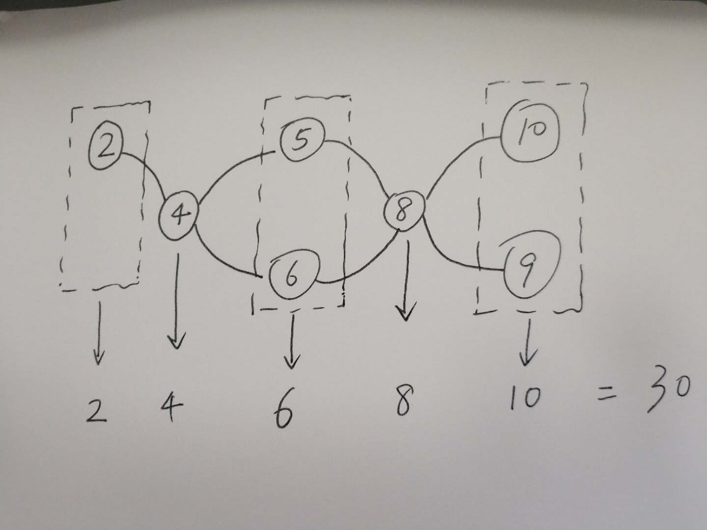

> 原文链接: https://leetcode-cn.com/problems/get-the-maximum-score


## 英文原文
<div><p>You are given two <strong>sorted</strong> arrays of distinct integers <code>nums1</code> and <code>nums2.</code></p>

<p>A <strong>valid<strong><em> </em></strong>path</strong> is defined as follows:</p>

<ul>
	<li>Choose array <code>nums1</code> or <code>nums2</code> to traverse (from index-0).</li>
	<li>Traverse the current array from left to right.</li>
	<li>If you are reading any value that is present in <code>nums1</code> and <code>nums2</code> you are allowed to change your path to the other array. (Only one repeated value is considered in the valid path).</li>
</ul>

<p>The <strong>score</strong> is defined as the sum of uniques values in a valid path.</p>

<p>Return <em>the maximum score you can obtain of all possible <strong>valid paths</strong></em>. Since the answer may be too large, return it modulo <code>10<sup>9</sup> + 7</code>.</p>

<p>&nbsp;</p>
<p><strong>Example 1:</strong></p>

<p><strong></strong></p>

<pre>
<strong>Input:</strong> nums1 = [2,4,5,8,10], nums2 = [4,6,8,9]
<strong>Output:</strong> 30
<strong>Explanation:</strong>&nbsp;Valid paths:
[2,4,5,8,10], [2,4,5,8,9], [2,4,6,8,9], [2,4,6,8,10],  (starting from nums1)
[4,6,8,9], [4,5,8,10], [4,5,8,9], [4,6,8,10]    (starting from nums2)
The maximum is obtained with the path in green <strong>[2,4,6,8,10]</strong>.
</pre>

<p><strong>Example 2:</strong></p>

<pre>
<strong>Input:</strong> nums1 = [1,3,5,7,9], nums2 = [3,5,100]
<strong>Output:</strong> 109
<strong>Explanation:</strong>&nbsp;Maximum sum is obtained with the path <strong>[1,3,5,100]</strong>.
</pre>

<p><strong>Example 3:</strong></p>

<pre>
<strong>Input:</strong> nums1 = [1,2,3,4,5], nums2 = [6,7,8,9,10]
<strong>Output:</strong> 40
<strong>Explanation:</strong>&nbsp;There are no common elements between nums1 and nums2.
Maximum sum is obtained with the path [6,7,8,9,10].
</pre>

<p><strong>Example 4:</strong></p>

<pre>
<strong>Input:</strong> nums1 = [1,4,5,8,9,11,19], nums2 = [2,3,4,11,12]
<strong>Output:</strong> 61
</pre>

<p>&nbsp;</p>
<p><strong>Constraints:</strong></p>

<ul>
	<li><code>1 &lt;= nums1.length, nums2.length &lt;= 10<sup>5</sup></code></li>
	<li><code>1 &lt;= nums1[i], nums2[i] &lt;= 10<sup>7</sup></code></li>
	<li><code>nums1</code> and <code>nums2</code> are strictly increasing.</li>
</ul>
</div>

## 中文题目
<div><p>你有两个 <strong>有序</strong>&nbsp;且数组内元素互不相同的数组&nbsp;<code>nums1</code> 和&nbsp;<code>nums2</code>&nbsp;。</p>

<p>一条&nbsp;<strong>合法路径</strong>&nbsp;定义如下：</p>

<ul>
	<li>选择数组 nums1 或者 nums2 开始遍历（从下标 0 处开始）。</li>
	<li>从左到右遍历当前数组。</li>
	<li>如果你遇到了 <code>nums1</code>&nbsp;和 <code>nums2</code>&nbsp;中都存在的值，那么你可以切换路径到另一个数组对应数字处继续遍历（但在合法路径中重复数字只会被统计一次）。</li>
</ul>

<p>得分定义为合法路径中不同数字的和。</p>

<p>请你返回所有可能合法路径中的最大得分。</p>

<p>由于答案可能很大，请你将它对 10^9 + 7 取余后返回。</p>

<p>&nbsp;</p>

<p><strong>示例 1：</strong></p>

<p><strong></strong></p>

<pre><strong>输入：</strong>nums1 = [2,4,5,8,10], nums2 = [4,6,8,9]
<strong>输出：</strong>30
<strong>解释：</strong>合法路径包括：
[2,4,5,8,10], [2,4,5,8,9], [2,4,6,8,9], [2,4,6,8,10],（从 nums1 开始遍历）
[4,6,8,9], [4,5,8,10], [4,5,8,9], [4,6,8,10]  （从 nums2 开始遍历）
最大得分为上图中的绿色路径 <strong>[2,4,6,8,10]</strong>&nbsp;。
</pre>

<p><strong>示例 2：</strong></p>

<pre><strong>输入：</strong>nums1 = [1,3,5,7,9], nums2 = [3,5,100]
<strong>输出：</strong>109
<strong>解释：</strong>最大得分由路径 <strong>[1,3,5,100]</strong> 得到。
</pre>

<p><strong>示例 3：</strong></p>

<pre><strong>输入：</strong>nums1 = [1,2,3,4,5], nums2 = [6,7,8,9,10]
<strong>输出：</strong>40
<strong>解释：</strong>nums1 和 nums2 之间无相同数字。
最大得分由路径 <strong>[6,7,8,9,10]</strong> 得到。
</pre>

<p><strong>示例 4：</strong></p>

<pre><strong>输入：</strong>nums1 = [1,4,5,8,9,11,19], nums2 = [2,3,4,11,12]
<strong>输出：</strong>61
</pre>

<p>&nbsp;</p>

<p><strong>提示：</strong></p>

<ul>
	<li><code>1 &lt;= nums1.length &lt;= 10^5</code></li>
	<li><code>1 &lt;= nums2.length &lt;= 10^5</code></li>
	<li><code>1 &lt;= nums1[i], nums2[i] &lt;= 10^7</code></li>
	<li><code>nums1</code> 和&nbsp;<code>nums2</code>&nbsp;都是严格递增的数组。</li>
</ul>
</div>

## 通过代码
<RecoDemo>
</RecoDemo>


## 高赞题解
  相交点可以将2个数组都分成(K + 1)段，统计每段的和，并取较大值计入结果，可以用双指针快速实现。
  如下图所示：


代码如下：
```
int maxSum(vector<int>& nums1, vector<int>& nums2) {
        long sum1 = 0, sum2 = 0;
        long res = 0;
        int i = 0, j = 0;
        while(i < nums1.size() && j < nums2.size()){
            if(nums1[i] == nums2[j]){
                res += (max(sum1, sum2) + nums1[i]);
                sum1 = 0;
                sum2 = 0;
                i++;
                j++;
            }
            else if(nums1[i] < nums2[j]){
                sum1 += nums1[i];
                i++;                
            }
            else{
                sum2 += nums2[j];
                j++;
            }            
        }
        while(i < nums1.size()){
            sum1 += nums1[i];
            i++;
        }
        while(j < nums2.size()){
            sum2 += nums2[j];
            j++;
        }
        res += max(sum1, sum2);
        return res % ((int)pow(10, 9) + 7 );
```




## 统计信息
| 通过次数 | 提交次数 | AC比率 |
| :------: | :------: | :------: |
|    4594    |    12511    |   36.7%   |

## 提交历史
| 提交时间 | 提交结果 | 执行时间 |  内存消耗  | 语言 |
| :------: | :------: | :------: | :--------: | :--------: |
