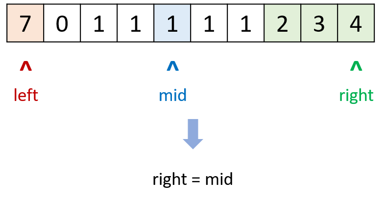
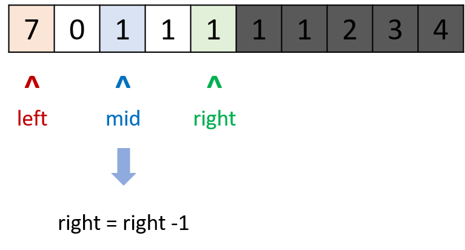
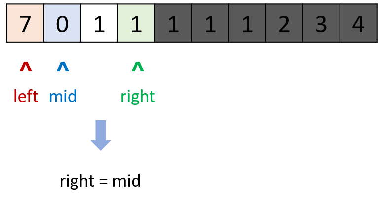
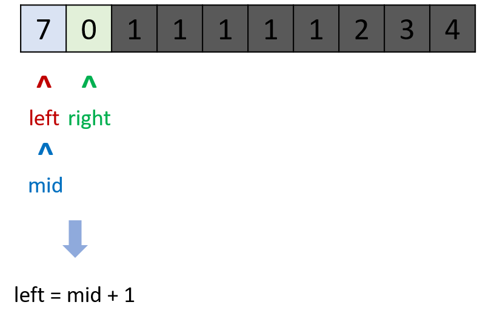
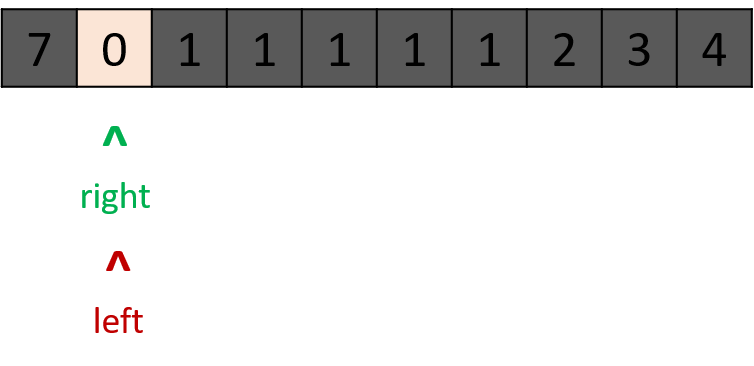

> 原文链接: https://leetcode-cn.com/problems/find-minimum-in-rotated-sorted-array-ii


## 英文原文
<div><p>Suppose an array of length <code>n</code> sorted in ascending order is <strong>rotated</strong> between <code>1</code> and <code>n</code> times. For example, the array <code>nums = [0,1,4,4,5,6,7]</code> might become:</p>

<ul>
	<li><code>[4,5,6,7,0,1,4]</code> if it was rotated <code>4</code> times.</li>
	<li><code>[0,1,4,4,5,6,7]</code> if it was rotated <code>7</code> times.</li>
</ul>

<p>Notice that <strong>rotating</strong> an array <code>[a[0], a[1], a[2], ..., a[n-1]]</code> 1 time results in the array <code>[a[n-1], a[0], a[1], a[2], ..., a[n-2]]</code>.</p>

<p>Given the sorted rotated array <code>nums</code> that may contain <strong>duplicates</strong>, return <em>the minimum element of this array</em>.</p>

<p>You must decrease the overall operation steps as much as possible.</p>

<p>&nbsp;</p>
<p><strong>Example 1:</strong></p>
<pre><strong>Input:</strong> nums = [1,3,5]
<strong>Output:</strong> 1
</pre><p><strong>Example 2:</strong></p>
<pre><strong>Input:</strong> nums = [2,2,2,0,1]
<strong>Output:</strong> 0
</pre>
<p>&nbsp;</p>
<p><strong>Constraints:</strong></p>

<ul>
	<li><code>n == nums.length</code></li>
	<li><code>1 &lt;= n &lt;= 5000</code></li>
	<li><code>-5000 &lt;= nums[i] &lt;= 5000</code></li>
	<li><code>nums</code> is sorted and rotated between <code>1</code> and <code>n</code> times.</li>
</ul>

<p>&nbsp;</p>
<p><strong>Follow up:</strong> This problem is similar to&nbsp;<a href="https://leetcode.com/problems/find-minimum-in-rotated-sorted-array/description/" target="_blank">Find Minimum in Rotated Sorted Array</a>, but&nbsp;<code>nums</code> may contain <strong>duplicates</strong>. Would this affect the runtime complexity? How and why?</p>

<p>&nbsp;</p>
</div>

## 中文题目
<div>已知一个长度为 <code>n</code> 的数组，预先按照升序排列，经由 <code>1</code> 到 <code>n</code> 次 <strong>旋转</strong> 后，得到输入数组。例如，原数组 <code>nums = [0,1,4,4,5,6,7]</code> 在变化后可能得到：
<ul>
	<li>若旋转 <code>4</code> 次，则可以得到 <code>[4,5,6,7,0,1,4]</code></li>
	<li>若旋转 <code>7</code> 次，则可以得到 <code>[0,1,4,4,5,6,7]</code></li>
</ul>

<p>注意，数组 <code>[a[0], a[1], a[2], ..., a[n-1]]</code> <strong>旋转一次</strong> 的结果为数组 <code>[a[n-1], a[0], a[1], a[2], ..., a[n-2]]</code> 。</p>

<p>给你一个可能存在 <strong>重复</strong> 元素值的数组 <code>nums</code> ，它原来是一个升序排列的数组，并按上述情形进行了多次旋转。请你找出并返回数组中的 <strong>最小元素</strong> 。</p>

<p> </p>

<p><strong>示例 1：</strong></p>

<pre>
<strong>输入：</strong>nums = [1,3,5]
<strong>输出：</strong>1
</pre>

<p><strong>示例 2：</strong></p>

<pre>
<strong>输入：</strong>nums = [2,2,2,0,1]
<strong>输出：</strong>0
</pre>

<p> </p>

<p><strong>提示：</strong></p>

<ul>
	<li><code>n == nums.length</code></li>
	<li><code>1 <= n <= 5000</code></li>
	<li><code>-5000 <= nums[i] <= 5000</code></li>
	<li><code>nums</code> 原来是一个升序排序的数组，并进行了 <code>1</code> 至 <code>n</code> 次旋转</li>
</ul>

<p> </p>

<p><strong>进阶：</strong></p>

<ul>
	<li>这道题是 <a href="https://leetcode-cn.com/problems/find-minimum-in-rotated-sorted-array/description/">寻找旋转排序数组中的最小值</a> 的延伸题目。</li>
	<li>允许重复会影响算法的时间复杂度吗？会如何影响，为什么？</li>
</ul>
</div>

## 通过代码
<RecoDemo>
</RecoDemo>


## 高赞题解
#### 思路：

- 旋转排序数组 $nums$ 可以被拆分为 2 个排序数组 $nums1$ , $nums2$ ，并且 `nums1任一元素 >= nums2任一元素`；因此，考虑二分法寻找此两数组的分界点 $nums[i]$ (即第 2 个数组的首个元素)。
- 设置 $left$, $right$ 指针在 $nums$ 数组两端，$mid$ 为每次二分的中点：
  - 当 `nums[mid] > nums[right]`时，$mid$ 一定在第 1 个排序数组中，$i$ 一定满足 `mid < i <= right`，因此执行 `left = mid + 1`；
  - 当 `nums[mid] < nums[right]` 时，$mid$ 一定在第 2 个排序数组中，$i$ 一定满足 `left < i <= mid`，因此执行 `right = mid`；
  - 当 `nums[mid] == nums[right]` 时，是此题对比 **[153题](https://leetcode-cn.com/problems/find-minimum-in-rotated-sorted-array/solution/find-minimum-in-rotated-sorted-array-er-fen-fa-by-/)** 的难点（原因是此题中数组的元素**可重复**，难以判断分界点 $i$ 指针区间）；
    - 例如 $[1, 0, 1, 1, 1]$ 和 $[1, 1, 1, 0, 1]$ ，在 `left = 0`, `right = 4`, `mid = 2` 时，无法判断 $mid$ 在哪个排序数组中。
    - 我们采用 `right = right - 1` 解决此问题，证明：
        1. 此操作*不会使数组越界*：因为迭代条件保证了 `right > left >= 0`；
        2. 此操作*不会使最小值丢失*：假设 $nums[right]$ 是最小值，有两种情况：
            - 若 $nums[right]$ 是唯一最小值：那就不可能满足判断条件 `nums[mid] == nums[right]`，因为 `mid < right`（`left != right` 且 `mid = (left + right) // 2` 向下取整）；
            - 若 $nums[right]$ 不是唯一最小值，由于 `mid < right` 而 `nums[mid] == nums[right]`，即还有最小值存在于 $[left, right - 1]$ 区间，因此不会丢失最小值。
- 以上是理论分析，可以代入以下数组辅助思考：
  - $[1, 2, 3]$
  - $[1, 1, 0, 1]$
  - $[1, 0, 1, 1, 1]$
  - $[1, 1, 1, 1]$
- 时间复杂度 $O(logN)$，在特例情况下会退化到 $O(N)$（例如 $[1, 1, 1, 1]$）。

#### 图解：

<,,,,>


#### 代码：

```Python []
class Solution:
    def findMin(self, nums: List[int]) -> int:
        left, right = 0, len(nums) - 1
        while left < right:
            mid = (left + right) // 2
            if nums[mid] > nums[right]: left = mid + 1
            elif nums[mid] < nums[right]: right = mid
            else: right = right - 1 # key
        return nums[left]
```
```Java []
class Solution {
    public int findMin(int[] nums) {
        int left = 0, right = nums.length - 1;
        while (left < right) {
            int mid = (left + right) / 2;
            if (nums[mid] > nums[right]) left = mid + 1;
            else if (nums[mid] < nums[right]) right = mid;
            else right = right - 1;
        }
        return nums[left];
    }
}
```

## 统计信息
| 通过次数 | 提交次数 | AC比率 |
| :------: | :------: | :------: |
|    119352    |    224638    |   53.1%   |

## 提交历史
| 提交时间 | 提交结果 | 执行时间 |  内存消耗  | 语言 |
| :------: | :------: | :------: | :--------: | :--------: |


## 相似题目
|                             题目                             | 难度 |
| :----------------------------------------------------------: | :---------: |
| [寻找旋转排序数组中的最小值](https://leetcode-cn.com/problems/find-minimum-in-rotated-sorted-array/) | 中等|
