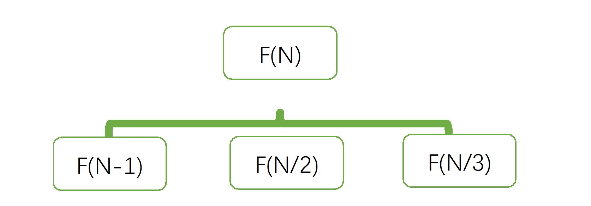
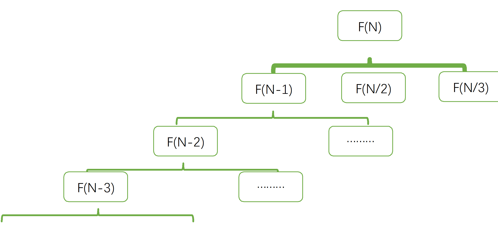
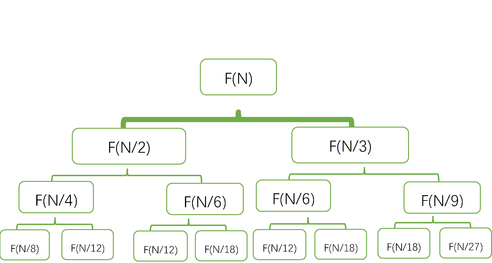
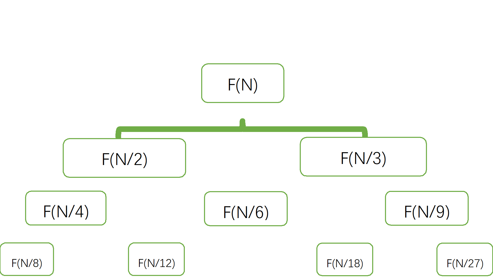

> 原文链接: https://leetcode-cn.com/problems/minimum-number-of-days-to-eat-n-oranges


## 英文原文
<div><p>There are <code>n</code> oranges in the kitchen and you decided to eat some of these oranges every day as follows:</p>

<ul>
	<li>Eat one orange.</li>
	<li>If the number of remaining oranges n&nbsp;is divisible by <code>2</code> then you can eat <code>n / 2</code> oranges.</li>
	<li>If the number of remaining oranges n&nbsp;is divisible by <code>3</code> then you can eat <code>2 * (n / 3)</code> oranges.</li>
</ul>

<p>You can only choose one of the actions per day.</p>

<p>Return the minimum number of days to eat <code>n</code> oranges.</p>

<p>&nbsp;</p>
<p><strong>Example 1:</strong></p>

<pre>
<strong>Input:</strong> n = 10
<strong>Output:</strong> 4
<strong>Explanation:</strong> You have 10 oranges.
Day 1: Eat 1 orange,  10 - 1 = 9.  
Day 2: Eat 6 oranges, 9 - 2*(9/3) = 9 - 6 = 3. (Since 9 is divisible by 3)
Day 3: Eat 2 oranges, 3 - 2*(3/3) = 3 - 2 = 1. 
Day 4: Eat the last orange  1 - 1  = 0.
You need at least 4 days to eat the 10 oranges.
</pre>

<p><strong>Example 2:</strong></p>

<pre>
<strong>Input:</strong> n = 6
<strong>Output:</strong> 3
<strong>Explanation:</strong> You have 6 oranges.
Day 1: Eat 3 oranges, 6 - 6/2 = 6 - 3 = 3. (Since 6 is divisible by 2).
Day 2: Eat 2 oranges, 3 - 2*(3/3) = 3 - 2 = 1. (Since 3 is divisible by 3)
Day 3: Eat the last orange  1 - 1  = 0.
You need at least 3 days to eat the 6 oranges.
</pre>

<p><strong>Example 3:</strong></p>

<pre>
<strong>Input:</strong> n = 1
<strong>Output:</strong> 1
</pre>

<p><strong>Example 4:</strong></p>

<pre>
<strong>Input:</strong> n = 56
<strong>Output:</strong> 6
</pre>

<p>&nbsp;</p>
<p><strong>Constraints:</strong></p>

<ul>
	<li><code>1 &lt;= n &lt;= 2 * 10<sup>9</sup></code></li>
</ul>
</div>

## 中文题目
<div><p>厨房里总共有 <code>n</code>&nbsp;个橘子，你决定每一天选择如下方式之一吃这些橘子：</p>

<ul>
	<li>吃掉一个橘子。</li>
	<li>如果剩余橘子数 <code>n</code>&nbsp;能被 2 整除，那么你可以吃掉 <code>n/2</code> 个橘子。</li>
	<li>如果剩余橘子数&nbsp;<code>n</code>&nbsp;能被 3 整除，那么你可以吃掉 <code>2*(n/3)</code> 个橘子。</li>
</ul>

<p>每天你只能从以上 3 种方案中选择一种方案。</p>

<p>请你返回吃掉所有 <code>n</code>&nbsp;个橘子的最少天数。</p>

<p>&nbsp;</p>

<p><strong>示例 1：</strong></p>

<pre><strong>输入：</strong>n = 10
<strong>输出：</strong>4
<strong>解释：</strong>你总共有 10 个橘子。
第 1 天：吃 1 个橘子，剩余橘子数 10 - 1 = 9。
第 2 天：吃 6 个橘子，剩余橘子数 9 - 2*(9/3) = 9 - 6 = 3。（9 可以被 3 整除）
第 3 天：吃 2 个橘子，剩余橘子数 3 - 2*(3/3) = 3 - 2 = 1。
第 4 天：吃掉最后 1 个橘子，剩余橘子数 1 - 1 = 0。
你需要至少 4 天吃掉 10 个橘子。
</pre>

<p><strong>示例 2：</strong></p>

<pre><strong>输入：</strong>n = 6
<strong>输出：</strong>3
<strong>解释：</strong>你总共有 6 个橘子。
第 1 天：吃 3 个橘子，剩余橘子数 6 - 6/2 = 6 - 3 = 3。（6 可以被 2 整除）
第 2 天：吃 2 个橘子，剩余橘子数 3 - 2*(3/3) = 3 - 2 = 1。（3 可以被 3 整除）
第 3 天：吃掉剩余 1 个橘子，剩余橘子数 1 - 1 = 0。
你至少需要 3 天吃掉 6 个橘子。
</pre>

<p><strong>示例 3：</strong></p>

<pre><strong>输入：</strong>n = 1
<strong>输出：</strong>1
</pre>

<p><strong>示例 4：</strong></p>

<pre><strong>输入：</strong>n = 56
<strong>输出：</strong>6
</pre>

<p>&nbsp;</p>

<p><strong>提示：</strong></p>

<ul>
	<li><code>1 &lt;= n &lt;= 2*10^9</code></li>
</ul>
</div>

## 通过代码
<RecoDemo>
</RecoDemo>


## 高赞题解
#### 代码：

```Python3 []
class Solution:
    @lru_cache(None)
    def minDays(self, n: int) -> int:
        if n==0:
            return 0
        if n==1:
            return 1
        return 1+min(self.minDays(n//2)+n%2, self.minDays(n//3)+n%3)
```

#### 深度优先搜索（DFS）：

按照题意，很容易写出一个简单且直观的深度优先搜索（DFS）的解法，
```Python3 []
class Solution:
    def minDays(self, n: int) -> int:
        if n==0:
            return 0
        res = self.minDays(n-1)+1
        if not n%2:
            res = min(res, self.minDays(n//2)+1)
        if not n%3:
            res = min(res, self.minDays(n//3)+1)
        return res
```
很简洁，但必然会面临 TLE。


因为你的设想是这样的：

{:width=400}
{:align=center}


而实际上是这样的：

{:width=500}
{:align=center}

遍历了所有小于 `N` 的节点（其中绝大多数都是无效的），是这个算法其低效的主要原因。
其时间复杂度：$O(3^n)$，记忆化搜索最多优化到 $O(n)$

#### 剪枝：
剪枝可以以跳过无效的 `F(N-k)`。
```Python3 []
class Solution:
    def minDays(self, n: int) -> int:
        if n==0:
            return 0
        if n==1:
            return 1
        return 1+min(self.minDays(n//2)+n%2, self.minDays(n//3)+n%3)
```
这个算法的时间复杂度大概是 $O(n^0.79)$。比 DFS 进步了不少，在极端情况下甚至有 AC 的可能，但还不够。
观察我们遍历的节点：

{:width=400}

可以发现，大量节点被重复遍历，随着深度增加，重复遍历的节点会越来越多。

#### 记忆化
而记忆化搜索就可以解决重复遍历的问题：
```Python3 []
class Solution:
    @lru_cache(None) # 多一行懒人装饰符
    def minDays(self, n: int) -> int:
        if n==0:
            return 0
        if n==1:
            return 1
        return 1+min(self.minDays(n//2)+n%2, self.minDays(n//3)+n%3)
```
如图，这样我们遍历的全部节点刚好组成了一个最大深度为 $log2(N)$的三角形：

{:width=400}

任何能够遍历到的节点，一定会出现在图示三角形的某一层。

由此，我们总共会遍历大约 $log2(N)*log3(N)/2$ 个节点(但实测值略小，因为最底层节点都很接近1，有重合的可能)。由此可得时间复杂度为 $O(log(N)²)$。


## 统计信息
| 通过次数 | 提交次数 | AC比率 |
| :------: | :------: | :------: |
|    7947    |    26771    |   29.7%   |

## 提交历史
| 提交时间 | 提交结果 | 执行时间 |  内存消耗  | 语言 |
| :------: | :------: | :------: | :--------: | :--------: |
