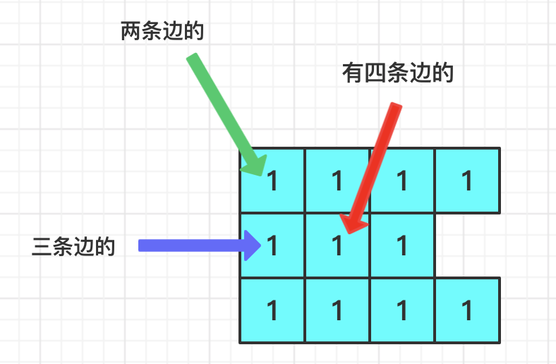

> 原文链接: https://leetcode-cn.com/problems/minimum-number-of-days-to-disconnect-island


## 英文原文
<div><p>Given a 2D&nbsp;<code>grid</code> consisting&nbsp;of <code>1</code>s (land)&nbsp;and <code>0</code>s (water).&nbsp; An <em>island</em> is a maximal 4-directionally (horizontal or vertical) connected group of <code>1</code>s.</p>

<p>The grid is said to be <strong>connected</strong> if we have <strong>exactly one&nbsp;island</strong>, otherwise is said <strong>disconnected</strong>.</p>

<p>In one day, we are allowed to change <strong>any </strong>single land cell <code>(1)</code> into a water cell <code>(0)</code>.</p>

<p>Return <em>the minimum number of days</em> to disconnect the grid.</p>

<p>&nbsp;</p>
<p><strong>Example 1:</strong></p>

<p><strong></strong></p>

<pre>
<strong>Input:</strong> grid = [[0,1,1,0],[0,1,1,0],[0,0,0,0]]
<strong>Output:</strong> 2
<strong>Explanation:</strong> We need at least 2 days to get a disconnected grid.
Change land grid[1][1] and grid[0][2] to water and get 2 disconnected island.
</pre>

<p><strong>Example 2:</strong></p>

<pre>
<strong>Input:</strong> grid = [[1,1]]
<strong>Output:</strong> 2
<strong>Explanation: </strong>Grid of full water is also disconnected ([[1,1]] -&gt; [[0,0]]), 0 islands.
</pre>

<p><strong>Example 3:</strong></p>

<pre>
<strong>Input:</strong> grid = [[1,0,1,0]]
<strong>Output:</strong> 0
</pre>

<p><strong>Example 4:</strong></p>

<pre>
<strong>Input:</strong> grid = [[1,1,0,1,1],
&nbsp;              [1,1,1,1,1],
&nbsp;              [1,1,0,1,1],
&nbsp;              [1,1,0,1,1]]
<strong>Output:</strong> 1
</pre>

<p><strong>Example 5:</strong></p>

<pre>
<strong>Input:</strong> grid = [[1,1,0,1,1],
&nbsp;              [1,1,1,1,1],
&nbsp;              [1,1,0,1,1],
&nbsp;              [1,1,1,1,1]]
<strong>Output:</strong> 2
</pre>

<p>&nbsp;</p>
<p><strong>Constraints:</strong></p>

<ul>
	<li><code>1 &lt;= grid.length, grid[i].length &lt;= 30</code></li>
	<li><code>grid[i][j]</code>&nbsp;is <code>0</code> or <code>1</code>.</li>
</ul>
</div>

## 中文题目
<div><p>给你一个由若干 <code>0</code> 和 <code>1</code> 组成的二维网格 <code>grid</code> ，其中 <code>0</code> 表示水，而 <code>1</code> 表示陆地。岛屿由水平方向或竖直方向上相邻的 <code>1</code> （陆地）连接形成。</p>

<p>如果 <strong>恰好只有一座岛屿 </strong>，则认为陆地是 <strong>连通的</strong> ；否则，陆地就是 <strong>分离的</strong> 。</p>

<p>一天内，可以将任何单个陆地单元（<code>1</code>）更改为水单元（<code>0</code>）。</p>

<p>返回使陆地分离的最少天数。</p>

<p>&nbsp;</p>

<p><strong>示例 1：</strong></p>

<p><strong></strong></p>

<pre><strong>输入：</strong>grid = [[0,1,1,0],[0,1,1,0],[0,0,0,0]]
<strong>输出：</strong>2
<strong>解释：</strong>至少需要 2 天才能得到分离的陆地。
将陆地 grid[1][1] 和 grid[0][2] 更改为水，得到两个分离的岛屿。
</pre>

<p><strong>示例 2：</strong></p>

<pre><strong>输入：</strong>grid = [[1,1]]
<strong>输出：</strong>2
<strong>解释：</strong>如果网格中都是水，也认为是分离的 ([[1,1]] -&gt; [[0,0]])，0 岛屿。
</pre>

<p><strong>示例 3：</strong></p>

<pre><strong>输入：</strong>grid = [[1,0,1,0]]
<strong>输出：</strong>0
</pre>

<p><strong>示例 4：</strong></p>

<pre><strong>输入：</strong>grid = [[1,1,0,1,1],
&nbsp;            [1,1,1,1,1],
&nbsp;            [1,1,0,1,1],
&nbsp;            [1,1,0,1,1]]
<strong>输出：</strong>1
</pre>

<p><strong>示例 5：</strong></p>

<pre><strong>输入：</strong>grid = [[1,1,0,1,1],
&nbsp;            [1,1,1,1,1],
&nbsp;            [1,1,0,1,1],
&nbsp;            [1,1,1,1,1]]
<strong>输出：</strong>2
</pre>

<p>&nbsp;</p>

<p><strong>提示：</strong></p>

<ul>
	<li><code>1 &lt;= grid.length, grid[i].length &lt;= 30</code></li>
	<li><code>grid[i][j]</code> 为 <code>0</code> 或 <code>1</code></li>
</ul>
</div>

## 通过代码
<RecoDemo>
</RecoDemo>


## 高赞题解
### 5501. 使陆地分离的最少天数
**知识点：BFS，思维题**

有个比较`搞喜`的地方：`最多删除两次`必可使陆地分离。

每个格子`最多会有四条边`和其他格子相连。在边上的格子`最多有三条边`。在角上的`最多有两条边`。无论岛屿长成什么样子，肯定是会有角的，所以最多只需删除两次。




首先，判断输入本身就是分离的。
其次，暴力枚举删除输入中的一个 1，然后判断是否分离。
再其次，直接返回 2 就 ok 啦~

```cpp
class Solution {
 public:
  bool check(const vector<vector<int>>& grid) {
    int x = 0, y = 0;
    int cnt = 0;
    for(int i = 0; i < grid.size(); i++) {
      for(int j = 0; j < grid[i].size(); j++) {
        if(grid[i][j] == 0) continue;
        cnt++;
        x = i;
        y = j;
      }
    }
    if(cnt == 0) {
      return true;
    }
    queue<pair<int, int>> q;
    bool mark[30][30] = {0};
    q.push(make_pair(x, y));
    mark[x][y] = true;
    cnt--;
    while(q.empty() == false) {
      auto f = q.front();
      q.pop();
      int dx[] = {-1,  1, 0, 0};
      int dy[] = { 0, 0, -1, 1};
      for(int i = 0; i < 4; i++) {
        int nx = dx[i] + f.first;
        int ny = dy[i] + f.second;
        if(0 <= nx && nx < grid.size() && 0 <= ny && ny < grid[0].size() && grid[nx][ny] == 1) {
          auto p = make_pair(nx, ny);
          if(mark[nx][ny]) { continue; }
          mark[nx][ny] = true;
          q.push(p);
          cnt--;
        }
      }
    }
    return cnt != 0;
  }
  int minDays(vector<vector<int>>& grid) {
    if(check(grid)) {
      return 0;
    }
    for(int i = 0; i < grid.size(); i++) {
      for(int j = 0; j < grid[0].size(); j++) {
        if(grid[i][j] == 0) {
          continue;
        }
        grid[i][j] = 0;
        if(check(grid)) {
          return 1;
        }
        grid[i][j] = 1;
      }
    }
    return 2;
  }
};
```


## 如果感觉有点意思，那就关注一下【[我的公众号](https://blog.csdn.net/Time_Limit/article/details/108179387)】吧~


## 统计信息
| 通过次数 | 提交次数 | AC比率 |
| :------: | :------: | :------: |
|    2692    |    5868    |   45.9%   |

## 提交历史
| 提交时间 | 提交结果 | 执行时间 |  内存消耗  | 语言 |
| :------: | :------: | :------: | :--------: | :--------: |
