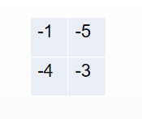
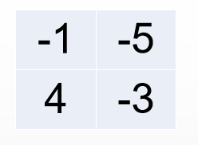
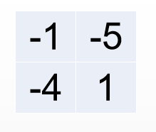
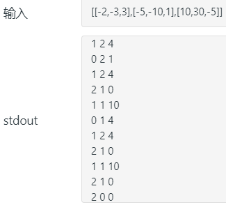

> 原文链接: https://leetcode-cn.com/problems/dungeon-game


## 英文原文
<div><p>The demons had captured the princess and imprisoned her in <strong>the bottom-right corner</strong> of a <code>dungeon</code>. The <code>dungeon</code> consists of <code>m x n</code> rooms laid out in a 2D grid. Our valiant knight was initially positioned in <strong>the top-left room</strong> and must fight his way through <code>dungeon</code> to rescue the princess.</p>

<p>The knight has an initial health point represented by a positive integer. If at any point his health point drops to <code>0</code> or below, he dies immediately.</p>

<p>Some of the rooms are guarded by demons (represented by negative integers), so the knight loses health upon entering these rooms; other rooms are either empty (represented as 0) or contain magic orbs that increase the knight&#39;s health (represented by positive integers).</p>

<p>To reach the princess as quickly as possible, the knight decides to move only <strong>rightward</strong> or <strong>downward</strong> in each step.</p>

<p>Return <em>the knight&#39;s minimum initial health so that he can rescue the princess</em>.</p>

<p><strong>Note</strong> that any room can contain threats or power-ups, even the first room the knight enters and the bottom-right room where the princess is imprisoned.</p>

<p>&nbsp;</p>
<p><strong>Example 1:</strong></p>

<pre>
<strong>Input:</strong> dungeon = [[-2,-3,3],[-5,-10,1],[10,30,-5]]
<strong>Output:</strong> 7
<strong>Explanation:</strong> The initial health of the knight must be at least 7 if he follows the optimal path: RIGHT-&gt; RIGHT -&gt; DOWN -&gt; DOWN.
</pre>

<p><strong>Example 2:</strong></p>

<pre>
<strong>Input:</strong> dungeon = [[0]]
<strong>Output:</strong> 1
</pre>

<p>&nbsp;</p>
<p><strong>Constraints:</strong></p>

<ul>
	<li><code>m == dungeon.length</code></li>
	<li><code>n == dungeon[i].length</code></li>
	<li><code>1 &lt;= m, n &lt;= 200</code></li>
	<li><code>-1000 &lt;= dungeon[i][j] &lt;= 1000</code></li>
</ul>
</div>

## 中文题目
<div><style>

table.dungeon, .dungeon th, .dungeon td {

  border:3px solid black;

}


 .dungeon th, .dungeon td {

    text-align: center;

    height: 70px;

    width: 70px;

}

</style>


<p>一些恶魔抓住了公主（<strong>P</strong>）并将她关在了地下城的右下角。地下城是由&nbsp;M x N 个房间组成的二维网格。我们英勇的骑士（<strong>K</strong>）最初被安置在左上角的房间里，他必须穿过地下城并通过对抗恶魔来拯救公主。</p>


<p>骑士的初始健康点数为一个正整数。如果他的健康点数在某一时刻降至 0 或以下，他会立即死亡。</p>


<p>有些房间由恶魔守卫，因此骑士在进入这些房间时会失去健康点数（若房间里的值为<em>负整数</em>，则表示骑士将损失健康点数）；其他房间要么是空的（房间里的值为 <em>0</em>），要么包含增加骑士健康点数的魔法球（若房间里的值为<em>正整数</em>，则表示骑士将增加健康点数）。</p>


<p>为了尽快到达公主，骑士决定每次只向右或向下移动一步。</p>


<p>&nbsp;</p>


<p><strong>编写一个函数来计算确保骑士能够拯救到公主所需的最低初始健康点数。</strong></p>


<p>例如，考虑到如下布局的地下城，如果骑士遵循最佳路径 <code>右 -&gt; 右 -&gt; 下 -&gt; 下</code>，则骑士的初始健康点数至少为 <strong>7</strong>。</p>


<table class="dungeon">

<tr> 

<td>-2 (K)</td> 

<td>-3</td> 

<td>3</td> 

</tr> 

<tr> 

<td>-5</td> 

<td>-10</td> 

<td>1</td> 

</tr> 

<tr> 

<td>10</td> 

<td>30</td> 

<td>-5 (P)</td> 

</tr> 

</table>

<!---2K   -3  3

-5   -10   1

10 30   5P-->


<p>&nbsp;</p>


<p><strong>说明:</strong></p>


<ul>

	<li>

	<p>骑士的健康点数没有上限。</p>

	</li>

	<li>任何房间都可能对骑士的健康点数造成威胁，也可能增加骑士的健康点数，包括骑士进入的左上角房间以及公主被监禁的右下角房间。</li>

</ul></div>

## 通过代码
<RecoDemo>
</RecoDemo>


## 高赞题解
#### 解题思路：

其实这题一看就晓得要用动态规划了，但是动态规划最难就是想出最优子结构，一旦有了最优子结构一切都好办，但是如果你硬想，那么估计如何都想不出来的。

那么一切都要从 **暴力法** 开始。

**动态规划问题** 都可以被转化为 **回溯问题** 来解决，也可以称之为暴力法但是毫无疑问会时间超时，但是这不影响我们把它作为突破口，因为回溯只要你能够理解题意，写出正确的递归条件和跳出条件，那么一切都好解决了。


#### 回溯（暴力）

首先我们假设问题只有四个格子。



全是负的对吧，那么这个要算出 **最小耗费的生命值** 就简单了。

先定义一下，最小耗费的生命值 **表示骑士救完公主刚刚好死了所需要用的生命值**。

走 `-1, -4, -3` 这个路线的，骑士最小耗费生命值就是 `8`，走 `-1, -5, -3` 这个路线的，骑士最小耗费生命值就是 `9`，所以骑士最小耗费生命值就是 `8`。

那么我们因为`-1` 只能去 `-5 `或者 `-4`，最后一个格子都是一样的 `-3`,那么也就是说，如果我们要得到起始点的最小的耗费的生命值：

>（壹）就是从其实起始点的**右边**、起始点的**下边**，两者之中选择一个耗费生命较小的，也就是二者之中的最优选择，然后算上本身这个格子所需要的血量，就是最小的耗费生命值了。（壹）


在格子的 **右边** 和 **下边** 选出一个耗费生命较小的，首先要分别计算 **右边** 的格子和 **下边** 的格子的最优解。

而 **右边的格子** 的的最优值就是：以右边的格子为起始点，继续执行（壹）的步骤。

而 **下边的格子** 的的最优值就是：以下边的格子为起始点，继续执行（壹）的步骤。

从以上，你大概可以想到一个模糊的递归的样子了。当然，还不够全面，因为这里明显只有递归条件，没有退出条件。


**当然了，要确保骑士活着，要在最小耗费生命值之上加上1，才是骑士的最低血量。**


那么我们假设有一个函数 $f(i, j)$，这个函数可以算出骑士需要耗费的最小的生命值，`i` 和 `j` 分别是坐标；

那么起始点的公式要咋个表达？因为格子中的数字是负的，所以我们可以直接进行相加即可。

$f(0, 0) + dungeon[0][0] = min(f(0+1, 0), f(0, 0+1))$

==> $f(0, 0) + dungeon[0][0] = min(f(1,0), f(0,1))$

把 `i` 和 `j` 带入一下子，就可以得到我们的一个递归的条件了：

>$f(i,j) + dungeon[i][j] = min(f(i+1, j), f(i, j+1))$


有了这个还不够，你需要知道退出条件，因为上面的四个格子足够简单，那么我们继续用它举例：


$f(1, 0)+dungeon[1][0] = f(1, 1)$

$f(0, 1)+dungeon[0][1] = f(1, 1)$


`dungeon[1][0]` 是已经确定了的，那么 $f(1, 1)$ 是多少？

我们知道最后一个格子是 `-3`，那么最小耗费的生命值就是 `3` 了, `f(1, 1) = 3`，其实这个就是 **退出条件** 了。当我们到了最后一个格子的时候，就是代表着我们已经到了终点了，就可以退出了，

so ...

$f(1, 0)= f(1, 1) - dungeon[1][0] = 7$

$f(0, 1)= f(1, 1) - dungeon[0][1] = 8$

$f(0, 0)= min(f(1,0),f(0,1)) - dungeon[0][0] = 8$

所以起始点的最小耗费生命值为8。


--- 

其实问题到了这里已经解决一大半了额，如果每个格子只有扣血的设定，没有加血的设定，基本上已经够了，但是题目中每个格子即可以扣血，也可以加血，那么这样就导致答案要复杂一些了。我们再举个例子：



这里依然是四个格子，但是，坐标 `（1, 0）` 是 `4`，也就说，如果用上面的公式带入：

$f(1, 0)= f(1, 1) - dungeon[1][0] = -1$，也就是会耗费生命值为负值的情况，但是如果骑士的最低的耗费的生命值为负的，那肯定不符合定义的，因为如果是负的，骑士就死了，所以最低的都要为 `0`。

其实也很好理解，如果魔法值给你加血了 `4`，而且最后的一个格子为耗血量为 `3`，就表示，骑 **士只要活着进入 `4` 这个格子**，他就一定可以进入到达最后一个格子，**所以其实在 `（1, 0）` 这个格子最低消耗的生命为 0。**

那么如果最后一个格子的是给你加血不是扣血呢？那么最后一个格子的退出条件会不会改变呢？比如下图：



这样一来，最后一个格子的退出条件就就变了 `0`，也就说是只要骑士进入最后一个格子里面只要活着就可以，所以最低的耗血量为 `0`；

根据以上条件，就可以写出代码了，我们来看看回溯思想的代码：

```Java []

public int calculateMinimumHP(int[][] dungeon) {

	if (dungeon == null || dungeon.length == 0 || dungeon[0].length == 0) {

		return 0;

	}

	int rowLen = dungeon.length;

	int colLen = dungeon[0].length;

	// 最低的耗血量为 + 1；就是骑士的救公主的最低血量。

	return dfs(0, 0, rowLen, colLen, dungeon) + 1;

}


public int dfs (int rowIndex, int colIndex, int rowSize, int colSize, int[][] dungeon) {

	//

	if (rowIndex >= rowSize || colIndex >= colSize) {

		return Integer.MAX_VALUE;

	}

	// 退出条件

	if (rowIndex == rowSize - 1 && colIndex == colSize - 1) {

		if (dungeon[rowIndex][colIndex] >= 0) {

			// 如果最后一个大于等于0，就返还0。

			return 0;

		} else {

			//如果最后一个小于零，就返回负的值。

			return -dungeon[rowIndex][colIndex];

		}

	}

//  右边格子的最优解，也就是最低的耗血量

	int rightMin = dfs(rowIndex, colIndex + 1, rowSize, colSize, dungeon);

//  下边格子的最优解

	int downMin = dfs(rowIndex + 1, colIndex, rowSize, colSize, dungeon);

	// f(i,j) = min(f(i+1, j), f(i, j+1)) - dungeon[i][j]

	int needMin = Math.min(rightMin, downMin) - dungeon[rowIndex][colIndex];

	int res = 0;

	if (needMin < 0) {

		res =  0;

	} else {

		res = needMin;

	}

	System.out.println(rowIndex+ " "+colIndex + " "  + res);

	return res;

}

```

以上的代码在是正确了，但是有个问题，时间会超时的，所以，我们需要优化。


#### 递归优化：记忆化搜索

我在上个程序里面放了个输出函数，如果想要懂得这个输出干啥子用的，就要 **放到题目中执行一下**，你就明白作用了。

执行一下就会发现一个下面这个截图：




完全的输出就是：

```bash

1 2 4

0 2 1

1 2 4 （重复）

2 1 0 

1 1 10 

0 1 4 

1 2 4 （重复）

2 1 0 （重复）

1 1 10 （重复）

2 1 0 （重复）

2 0 0

1 0 5

0 0 6

```

根据上面的输出，我们发现，这个递归函数经历了很多次重复计算，所以我们可以通过吧这个结果记录下来，直接采用，这样就不会有重复计算了。（其实到了这一步，我们已经离最优解，动态规划解题很近了）。

我们构造一个 memory 数组，用来存放已经计算过的结果。每次递归函数进入，我们就确认一下，是否已经计算过了，如果计算过了，就直接返回结果。


```Java []

private int rowSize = 0;

private int colSize = 0;

private int[][] globalDun = null;

public int calculateMinimumHP(int[][] dungeon) {

    if (dungeon == null || dungeon.length == 0 || dungeon[0].length == 0) {

        return 0;

    }

    rowSize = dungeon.length;

    colSize = dungeon[0].length;

    globalDun = dungeon;

    int[][] memory = new int[rowSize][colSize];

	// 初始化为-1，便于区别是否计算过结果了。

    for (int i = 0; i < rowSize; ++i) {

        for (int j = 0; j < colSize; ++j) {

            memory[i][j] = -1;

        }

    }

    return dfs(0, 0, memory) + 1;

}


public int dfs (int rowIndex, int colIndex,  int[][] memory) {

    if (rowIndex >= rowSize || colIndex  >=  colSize) {

        return Integer.MAX_VALUE;

    }

	// 不为-1就是计算过了，直接返回结果。

    if (memory[rowIndex][colIndex] != -1) {

        return memory[rowIndex][colIndex];

    }

    if (rowIndex == rowSize - 1 && colIndex == colSize - 1) {

        if (globalDun[rowIndex][colIndex] >= 0) {

            return 0;

        } else {

            return -globalDun[rowIndex][colIndex];

        }

    }

    int right = dfs(rowIndex, colIndex + 1, memory);

    int down = dfs(rowIndex + 1, colIndex, memory);

    int needMin = Math.min(right, down) - globalDun[rowIndex][colIndex];

    int res = 0;

    if (needMin < 0) {

        res =  0;

    } else {

        res =  needMin;

    }

    memory[rowIndex][colIndex] = res;

    System.out.println(rowIndex+ " "+colIndex + " "  + res);

    return res;

}

```

以上的代码可以通过的。


#### 动态规划

如果你能看到这里，相信你已经有点感觉了，其实记忆化搜索的那个 memory 已经就是动态规划的思想了，这次我们的动态规划是从最后一个开始走的，每走一步，出来就记录一下，然后不断复用。

其实核心的公式我们已经知道了，也就是最优子结构：


`needMin + globalDun[i][j] = Math.min(dp[i + 1][j], dp[i][j + 1])`

其实这段代码：

```java

if (needMin < 0) {

	res =  0;

} else {

	res =  needMin;

}

```

可以等价于下面这段：

`dp[i][j] = Math.max(0, needMin);`

所以我们可以来看下这个代码：

```Java []

public int calculateMinimumHPBest(int[][] dungeon) {

    if (dungeon == null || dungeon.length == 0 || dungeon[0].length == 0) {

        return 0;

    }

    int rowSize = dungeon.length;

    int colSize = dungeon[0].length;

    int[][] dp = new int[rowSize][colSize];

    // 设置最后一个值。

  	dp[rowSize - 1][colSize -1] = Math.max(0, -dungeon[rowSize - 1][colSize - 1]);


    // 设置最后一列的值

  	for (int i = rowSize - 2; i >= 0; --i) {

        int needMin = dp[i + 1][colSize - 1] - dungeon[i][colSize - 1];

        dp[i][colSize -1] = Math.max(0, needMin);

    }


    // 设置最后一行的值

  	for (int i = colSize - 2; i >= 0; --i) {

        int needMin = dp[rowSize - 1][i + 1] - dungeon[rowSize - 1][i];

        dp[rowSize - 1][i] = Math.max(0, needMin);

    }


    for (int i = rowSize - 2; i >= 0; --i) {

        for (int j = colSize - 2; j >= 0; --j) {

			// 从右边和下边选择一个最小值，然后减去当前的 dungeon 值

            int needMin = Math.min(dp[i + 1][j], dp[i][j + 1]) - dungeon[i][j];

            dp[i][j] = Math.max(0, needMin);

        }

    }

    return dp[0][0] + 1;

}

```

时间复杂度$O(N)$,空间复杂度$O(N)$。


如果看完这篇题解，你还不理解这题，那么就请来打我吧。哈哈哈

## 统计信息
| 通过次数 | 提交次数 | AC比率 |
| :------: | :------: | :------: |
|    39990    |    83240    |   48.0%   |

## 提交历史
| 提交时间 | 提交结果 | 执行时间 |  内存消耗  | 语言 |
| :------: | :------: | :------: | :--------: | :--------: |


## 相似题目
|                             题目                             | 难度 |
| :----------------------------------------------------------: | :---------: |
| [不同路径](https://leetcode-cn.com/problems/unique-paths/) | 中等|
| [最小路径和](https://leetcode-cn.com/problems/minimum-path-sum/) | 中等|
| [摘樱桃](https://leetcode-cn.com/problems/cherry-pickup/) | 困难|
