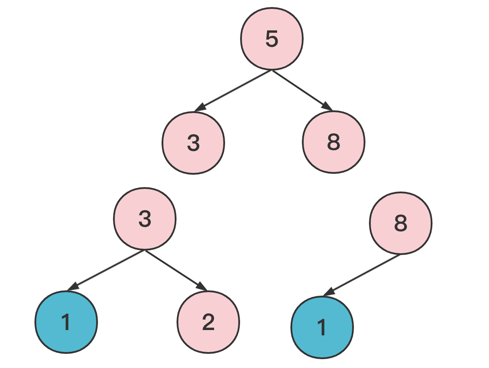
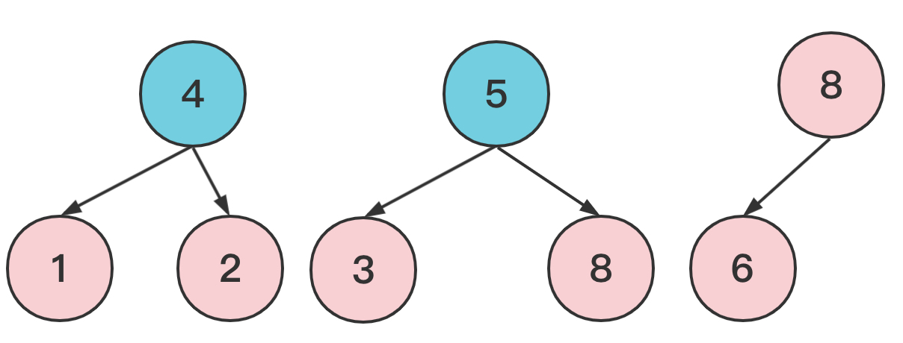
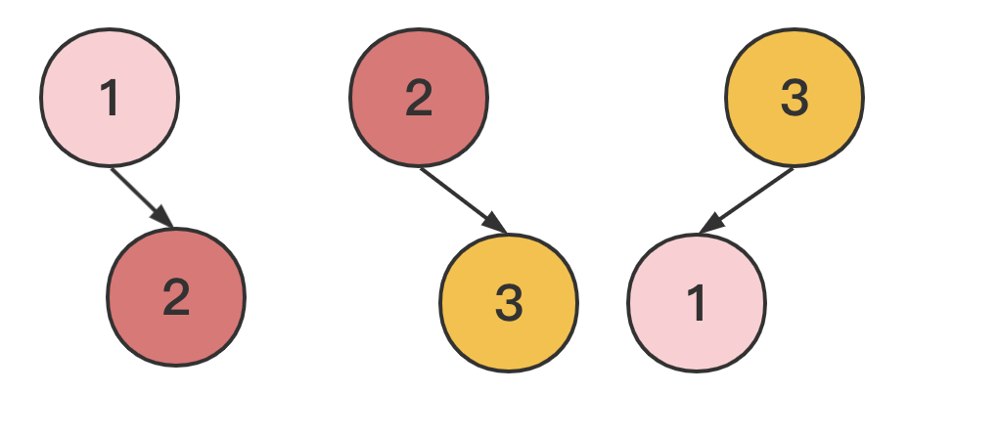
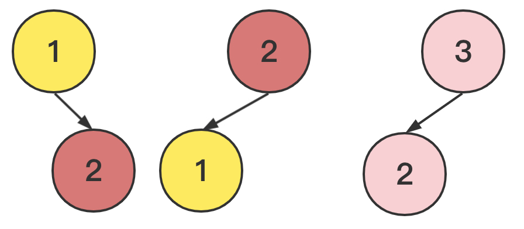
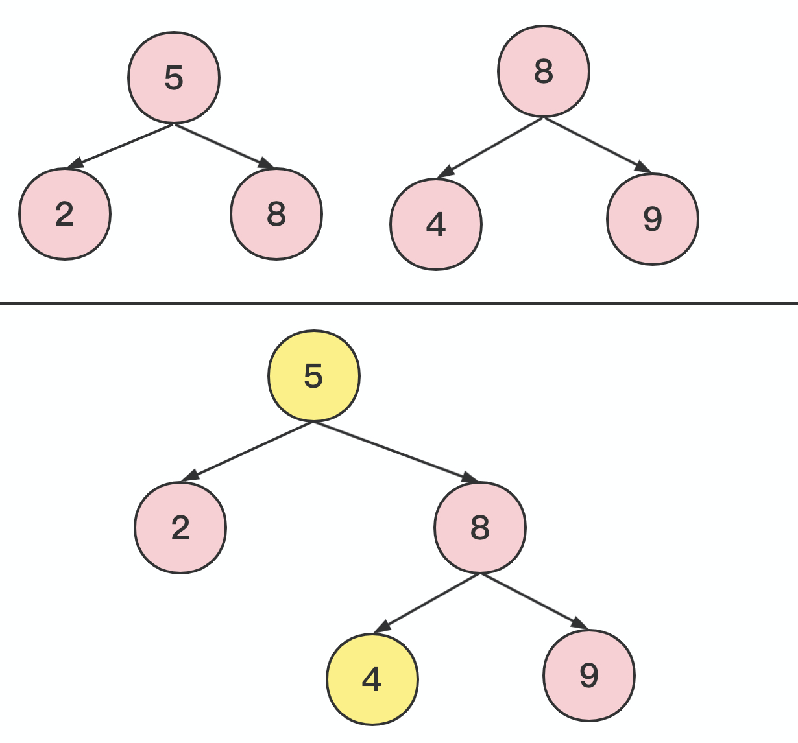

> 原文链接: https://leetcode-cn.com/problems/merge-bsts-to-create-single-bst


## 英文原文
<div><p>You are given <code>n</code> <strong>BST (binary search tree) root nodes</strong> for <code>n</code> separate BSTs stored in an array <code>trees</code> (<strong>0-indexed</strong>). Each BST in <code>trees</code> has <strong>at most 3 nodes</strong>, and no two roots have the same value. In one operation, you can:</p>

<ul>
	<li>Select two <strong>distinct</strong> indices <code>i</code> and <code>j</code> such that the value stored at one of the <strong>leaves </strong>of <code>trees[i]</code> is equal to the <strong>root value</strong> of <code>trees[j]</code>.</li>
	<li>Replace the leaf node in <code>trees[i]</code> with <code>trees[j]</code>.</li>
	<li>Remove <code>trees[j]</code> from <code>trees</code>.</li>
</ul>

<p>Return<em> the <strong>root</strong> of the resulting BST if it is possible to form a valid BST after performing </em><code>n - 1</code><em> operations, or</em><em> </em><code>null</code> <i>if it is impossible to create a valid BST</i>.</p>

<p>A BST (binary search tree) is a binary tree where each node satisfies the following property:</p>

<ul>
	<li>Every node in the node&#39;s left subtree has a value&nbsp;<strong>strictly less</strong>&nbsp;than the node&#39;s value.</li>
	<li>Every node in the node&#39;s right subtree has a value&nbsp;<strong>strictly greater</strong>&nbsp;than the node&#39;s value.</li>
</ul>

<p>A leaf is a node that has no children.</p>

<p>&nbsp;</p>
<p><strong>Example 1:</strong></p>

<pre>
<strong>Input:</strong> trees = [[2,1],[3,2,5],[5,4]]
<strong>Output:</strong> [3,2,5,1,null,4]
<strong>Explanation:</strong>
In the first operation, pick i=1 and j=0, and merge trees[0] into trees[1].
Delete trees[0], so trees = [[3,2,5,1],[5,4]].

In the second operation, pick i=0 and j=1, and merge trees[1] into trees[0].
Delete trees[1], so trees = [[3,2,5,1,null,4]].

The resulting tree, shown above, is a valid BST, so return its root.</pre>

<p><strong>Example 2:</strong></p>

<pre>
<strong>Input:</strong> trees = [[5,3,8],[3,2,6]]
<strong>Output:</strong> []
<strong>Explanation:</strong>
Pick i=0 and j=1 and merge trees[1] into trees[0].
Delete trees[1], so trees = [[5,3,8,2,6]].

The resulting tree is shown above. This is the only valid operation that can be performed, but the resulting tree is not a valid BST, so return null.
</pre>

<p><strong>Example 3:</strong></p>

<pre>
<strong>Input:</strong> trees = [[5,4],[3]]
<strong>Output:</strong> []
<strong>Explanation:</strong> It is impossible to perform any operations.
</pre>

<p><strong>Example 4:</strong></p>

<pre>
<strong>Input:</strong> trees = [[2,1,3]]
<strong>Output:</strong> [2,1,3]
<strong>Explanation:</strong> There is only one tree, and it is already a valid BST, so return its root.
</pre>

<p>&nbsp;</p>
<p><strong>Constraints:</strong></p>

<ul>
	<li><code>n == trees.length</code></li>
	<li><code>1 &lt;= n &lt;= 5 * 10<sup>4</sup></code></li>
	<li>The number of nodes in each tree is in the range <code>[1, 3]</code>.</li>
	<li>Each node in the input may have children but no grandchildren.</li>
	<li>No two roots of <code>trees</code> have the same value.</li>
	<li>All the trees in the input are <strong>valid BSTs</strong>.</li>
	<li><code>1 &lt;= TreeNode.val &lt;= 5 * 10<sup>4</sup></code>.</li>
</ul>
</div>

## 中文题目
<div><p>给你 <code>n</code> 个 <strong>二叉搜索树的根节点</strong> ，存储在数组 <code>trees</code> 中（<strong>下标从 0 开始</strong>），对应 <code>n</code> 棵不同的二叉搜索树。<code>trees</code> 中的每棵二叉搜索树 <strong>最多有 3 个节点</strong> ，且不存在值相同的两个根节点。在一步操作中，将会完成下述步骤：</p>

<ul>
	<li>选择两个 <strong>不同的</strong> 下标 <code>i</code> 和 <code>j</code> ，要求满足在 <code>trees[i]</code> 中的某个 <strong>叶节点</strong> 的值等于 <code>trees[j]</code> 的 <strong>根节点的值</strong> 。</li>
	<li>用 <code>trees[j]</code> 替换 <code>trees[i]</code> 中的那个叶节点。</li>
	<li>从 <code>trees</code> 中移除 <code>trees[j]</code> 。</li>
</ul>

<p>如果在执行 <code>n - 1</code> 次操作后，能形成一棵有效的二叉搜索树，则返回结果二叉树的 <strong>根节点</strong> ；如果无法构造一棵有效的二叉搜索树<em>，</em>返回<em> </em><code>null</code> 。</p>

<p>二叉搜索树是一种二叉树，且树中每个节点均满足下述属性：</p>

<ul>
	<li>任意节点的左子树中的值都 <strong>严格小于</strong> 此节点的值。</li>
	<li>任意节点的右子树中的值都 <strong>严格大于</strong> 此节点的值。</li>
</ul>

<p>叶节点是不含子节点的节点。</p>

<p> </p>

<p><strong>示例 1：</strong></p>

<pre>
<strong>输入：</strong>trees = [[2,1],[3,2,5],[5,4]]
<strong>输出：</strong>[3,2,5,1,null,4]
<strong>解释：</strong>
第一步操作中，选出 i=1 和 j=0 ，并将 trees[0] 合并到 trees[1] 中。
删除 trees[0] ，trees = [[3,2,5,1],[5,4]] 。

在第二步操作中，选出 i=0 和 j=1 ，将 trees[1] 合并到 trees[0] 中。
删除 trees[1] ，trees = [[3,2,5,1,null,4]] 。

结果树如上图所示，为一棵有效的二叉搜索树，所以返回该树的根节点。</pre>

<p><strong>示例 2：</strong></p>

<pre>
<strong>输入：</strong>trees = [[5,3,8],[3,2,6]]
<strong>输出：</strong>[]
<strong>解释：</strong>
选出 i=0 和 j=1 ，然后将 trees[1] 合并到 trees[0] 中。
删除 trees[1] ，trees = [[5,3,8,2,6]] 。

结果树如上图所示。仅能执行一次有效的操作，但结果树不是一棵有效的二叉搜索树，所以返回 null 。
</pre>

<p><strong>示例 3：</strong></p>

<pre>
<strong>输入：</strong>trees = [[5,4],[3]]
<strong>输出：</strong>[]
<strong>解释：</strong>无法执行任何操作。
</pre>

<p><strong>示例 4：</strong></p>

<pre>
<strong>输入：</strong>trees = [[2,1,3]]
<strong>输出：</strong>[2,1,3]
<strong>解释：</strong>trees 中只有一棵树，且这棵树已经是一棵有效的二叉搜索树，所以返回该树的根节点。
</pre>

<p> </p>

<p><strong>提示：</strong></p>

<ul>
	<li><code>n == trees.length</code></li>
	<li><code>1 <= n <= 5 * 10<sup>4</sup></code></li>
	<li>每棵树中节点数目在范围 <code>[1, 3]</code> 内。</li>
	<li>输入数据的每个节点可能有子节点但不存在子节点的子节点</li>
	<li><code>trees</code> 中不存在两棵树根节点值相同的情况。</li>
	<li>输入中的所有树都是 <strong>有效的二叉树搜索树</strong> 。</li>
	<li><code>1 <= TreeNode.val <= 5 * 10<sup>4</sup></code>.</li>
</ul>
</div>

## 通过代码
<RecoDemo>
</RecoDemo>


## 高赞题解
# 5810. 合并多棵二叉搜索树

*知识点*：二叉树遍历，哈希

*时间复杂度*：O(n)

## 合成一棵树的前提条件

**条件一：叶子节点的值不能重复。**

不难发现，合并操作只会删掉根节点，无法删除其他位置的节点。

因此如果叶子节点有重复，必然无法构造出二叉搜索树。

{:style="width:400px"}


**条件二：设 S 为叶子节点的值的集合，则有且仅有一个根节点的值不在 S 内。**

当有多个根节点的值不在 $S$ 内时，意味着有多棵树无法合并到其他树的叶子节点，则必然无法合成一棵树。

{:style="width:400px"}


当所有根节点的值都在 $S$ 内时，意味着有出现了合并的回路，类似于下图：

{:style="width:400px"}


## 开始合并

假设输入数据符合上述条件，不妨设**值不在 $S$ 中的根节点**为 $final\_root$。

为了方便实现合并操作，维护一个**根节点的值**到**根节点**的映射关系：
```cpp
unordered_map<int, TreeNode*> dict;
for (auto t : trees) {
  // 因为是给合并操作使用的，无需将 final_root 放入。
  // 放入 final_root 反而会使处理变麻烦。详见完整代码。
  if (t != final_root) {
    dict[t->val] = t; 
  }
}
```

接下来，开始遍历 $final\_root$ 代表的树:

* 每遇到一个叶子节点 $leaf$，就从 $dict$ 中取出对应的根节点 $root$
* 并将 $root$ 合并到 $leaf$，并从 $dict$ 中删除 $root$
* 继续遍历 $leaf$ 的左右子节点

从 $dict$ 中删除 $root$ 是为了避免局面合并回路导致死循环，比如：
{:style="width:400px"}

如果不删除，则遍历会陷入 `3->2->1->2->1->...` 的死循环。

合并完成后，一定会得到一棵树，但一定是二叉搜索树吗？不一定的，比如：

{:style="width:400px"}

因此，需要再做一次中序遍历，如果中序遍历是升序，则为二叉搜索树，否则不是。

## 代码
```cpp
/**
 * Definition for a binary tree node.
 * struct TreeNode {
 *     int val;
 *     TreeNode *left;
 *     TreeNode *right;
 *     TreeNode() : val(0), left(nullptr), right(nullptr) {}
 *     TreeNode(int x) : val(x), left(nullptr), right(nullptr) {}
 *     TreeNode(int x, TreeNode *left, TreeNode *right) : val(x), left(left), right(right) {}
 * };
 */
class Solution {
public:
    unordered_map<int, TreeNode*> root;
    void dfs(TreeNode *node) {
        if (node == nullptr) {
            return;
        }
        if (node->left == nullptr && node->right == nullptr) {
            auto it = root.find(node->val);
            if (it != root.end()) {
                node->left = it->second->left;
                node->right = it->second->right;
                root.erase(it);
            }
        }
        dfs(node->left);
        dfs(node->right);
    }
    void dfs(TreeNode *node, vector<int> &seq) {
        if (node == nullptr) {
            return;
        }
        dfs(node->left, seq);
        seq.emplace_back(node->val);
        dfs(node->right, seq);
    }
    TreeNode* canMerge(vector<TreeNode*>& trees) {
        // 检查条件一
        unordered_set<int> leaf_value;
        for (auto t : trees) {
            if (t->left) { 
                if(leaf_value.insert(t->left->val).second == false){
                    return nullptr;
                }
            }
            if (t->right) {
                if (leaf_value.insert(t->right->val).second == false) {
                    return nullptr;
                }
            }
        }
        // 检查条件二
        int include = 0;
        TreeNode *final_root = nullptr;
        for (auto t : trees) {
            if (leaf_value.count(t->val)) {
                include++;
            } else {
                final_root = t;
            }
        }
        if (include+1 != trees.size()) {
            return nullptr;
        }
        // 检查完成

        // 构造 node->val 到 node 的映射
        for (auto t : trees) {
            if (t != final_root) {
                root[t->val] = t; 
            }
        }
        // 开始合并
        dfs(final_root);
        if (!root.empty()) {
            return nullptr;
        }
        // 中序遍历检查
        vector<int> seq;
        dfs(final_root, seq);
        for (int i = 1; i < seq.size(); i++) {
            if (seq[i-1] >= seq[i]) {
                return nullptr;
            }
        }
        return final_root;
    }
};
```


## 统计信息
| 通过次数 | 提交次数 | AC比率 |
| :------: | :------: | :------: |
|    1195    |    3615    |   33.1%   |

## 提交历史
| 提交时间 | 提交结果 | 执行时间 |  内存消耗  | 语言 |
| :------: | :------: | :------: | :--------: | :--------: |
