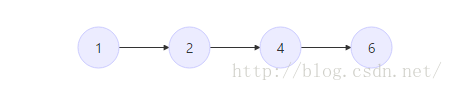
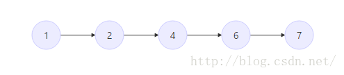
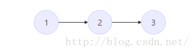

> 原文链接: https://leetcode-cn.com/problems/number-of-visible-people-in-a-queue


## 英文原文
<div><p>There are <code>n</code> people standing in a queue, and they numbered from <code>0</code> to <code>n - 1</code> in <strong>left to right</strong> order. You are given an array <code>heights</code> of <strong>distinct</strong> integers where <code>heights[i]</code> represents the height of the <code>i<sup>th</sup></code> person.</p>

<p>A person can <strong>see</strong> another person to their right in the queue if everybody in between is <strong>shorter</strong> than both of them. More formally, the <code>i<sup>th</sup></code> person can see the <code>j<sup>th</sup></code> person if <code>i &lt; j</code> and <code>min(heights[i], heights[j]) &gt; max(heights[i+1], heights[i+2], ..., heights[j-1])</code>.</p>

<p>Return <em>an array </em><code>answer</code><em> of length </em><code>n</code><em> where </em><code>answer[i]</code><em> is the <strong>number of people</strong> the </em><code>i<sup>th</sup></code><em> person can <strong>see</strong> to their right in the queue</em>.</p>

<p>&nbsp;</p>
<p><strong>Example 1:</strong></p>

<p></p>

<pre>
<strong>Input:</strong> heights = [10,6,8,5,11,9]
<strong>Output:</strong> [3,1,2,1,1,0]
<strong>Explanation:</strong>
Person 0 can see person 1, 2, and 4.
Person 1 can see person 2.
Person 2 can see person 3 and 4.
Person 3 can see person 4.
Person 4 can see person 5.
Person 5 can see no one since nobody is to the right of them.
</pre>

<p><strong>Example 2:</strong></p>

<pre>
<strong>Input:</strong> heights = [5,1,2,3,10]
<strong>Output:</strong> [4,1,1,1,0]
</pre>

<p>&nbsp;</p>
<p><strong>Constraints:</strong></p>

<ul>
	<li><code>n == heights.length</code></li>
	<li><code>1 &lt;= n &lt;= 10<sup>5</sup></code></li>
	<li><code>1 &lt;= heights[i] &lt;= 10<sup>5</sup></code></li>
	<li>All the values of <code>heights</code> are <strong>unique</strong>.</li>
</ul>
</div>

## 中文题目
<div><p>有&nbsp;<code>n</code>&nbsp;个人排成一个队列，<strong>从左到右</strong>&nbsp;编号为&nbsp;<code>0</code>&nbsp;到&nbsp;<code>n - 1</code>&nbsp;。给你以一个整数数组&nbsp;<code>heights</code>&nbsp;，每个整数 <strong>互不相同</strong>，<code>heights[i]</code>&nbsp;表示第&nbsp;<code>i</code>&nbsp;个人的高度。</p>

<p>一个人能 <strong>看到</strong> 他右边另一个人的条件是这两人之间的所有人都比他们两人 <strong>矮</strong>&nbsp;。更正式的，第&nbsp;<code>i</code>&nbsp;个人能看到第&nbsp;<code>j</code>&nbsp;个人的条件是&nbsp;<code>i &lt; j</code>&nbsp;且&nbsp;<code>min(heights[i], heights[j]) &gt; max(heights[i+1], heights[i+2], ..., heights[j-1])</code>&nbsp;。</p>

<p>请你返回一个长度为 <code>n</code>&nbsp;的数组<em>&nbsp;</em><code>answer</code><em>&nbsp;</em>，其中<em>&nbsp;</em><code>answer[i]</code><em>&nbsp;</em>是第&nbsp;<code>i</code>&nbsp;个人在他右侧队列中能&nbsp;<strong>看到</strong>&nbsp;的&nbsp;<strong>人数</strong>&nbsp;。</p>

<p>&nbsp;</p>

<p><strong>示例 1：</strong></p>

<p></p>

<pre>
<b>输入：</b>heights = [10,6,8,5,11,9]
<b>输出：</b>[3,1,2,1,1,0]
<strong>解释：</strong>
第 0 个人能看到编号为 1 ，2 和 4 的人。
第 1 个人能看到编号为 2 的人。
第 2 个人能看到编号为 3 和 4 的人。
第 3 个人能看到编号为 4 的人。
第 4 个人能看到编号为 5 的人。
第 5 个人谁也看不到因为他右边没人。
</pre>

<p><strong>示例 2：</strong></p>

<pre>
<b>输入：</b>heights = [5,1,2,3,10]
<b>输出：</b>[4,1,1,1,0]
</pre>

<p>&nbsp;</p>

<p><strong>提示：</strong></p>

<ul>
	<li><code>n == heights.length</code></li>
	<li><code>1 &lt;= n &lt;= 10<sup>5</sup></code></li>
	<li><code>1 &lt;= heights[i] &lt;= 10<sup>5</sup></code></li>
	<li><code>heights</code>&nbsp;中所有数 <strong>互不相同</strong>&nbsp;。</li>
</ul>
</div>

## 通过代码
<RecoDemo>
</RecoDemo>


## 高赞题解
# 力扣双周赛-第五十七场

## [5196. 队列中可以看到的人数](https://leetcode-cn.com/problems/number-of-visible-people-in-a-queue/)

​		第四道题，看到困难标签就已经自觉爬走了（不是

`	题目给了咱一条队列的人，每个人有自己的身高，身高矮的人会被身高高的人遮住视线，要咱判断这个队列里的每个人能看到右边有多少人。

​		第一感觉是单调栈（之前做过一个很像的题目）。

​		单调栈，顾名思义，一个维持单调的栈。打个比方，我有一个stack如图：




​	很明显这是一个单调递增的栈，当我们要插入一个元素7时，因为7并不影响递增性质（7 > top)，我们可以把它直接放在栈顶。



​	那如果时小于6的数字呢？我们假设这个数字是3， 那我们就要通过pop出比这个数字大的数字来保持递增





​     	 众所周知，**利用单调栈可以找出从左/右遍历第一个比它小/大的元素的位置** 

​		根据这道题，我们需要一个**递减栈，从栈底到栈顶递减**，用来找出从左往右遍历第一个比它大的位置。


````c++
class Solution {
public:
    vector<int> canSeePersonsCount(vector<int>& heights) {
        const int length = heights.size();
        stack<int> myStack;    //用于存放每个人的身高
        vector<int> ans(length);  //预先申明好空间
        for(int i = length - 1; i >= 0; --i){  //从后往前遍历
            while(!myStack.empty() && myStack.top() < heights[i]){ //如果没有遇到比他高的人
                ans[i]++;   //比这他低的他都能看到
                myStack.pop();    //删掉这些比他低的人（在后续的遍历里，这些人会被这个人遮住）
            }
            ans[i] += !myStack.empty();   //如果非空，他还能看见一个人（即最后一个把别人遮住的人）
            myStack.push(heights[i]);   //把这个人给存到栈里
        }
        return ans;
    }
};
````


## 统计信息
| 通过次数 | 提交次数 | AC比率 |
| :------: | :------: | :------: |
|    2211    |    3817    |   57.9%   |

## 提交历史
| 提交时间 | 提交结果 | 执行时间 |  内存消耗  | 语言 |
| :------: | :------: | :------: | :--------: | :--------: |
